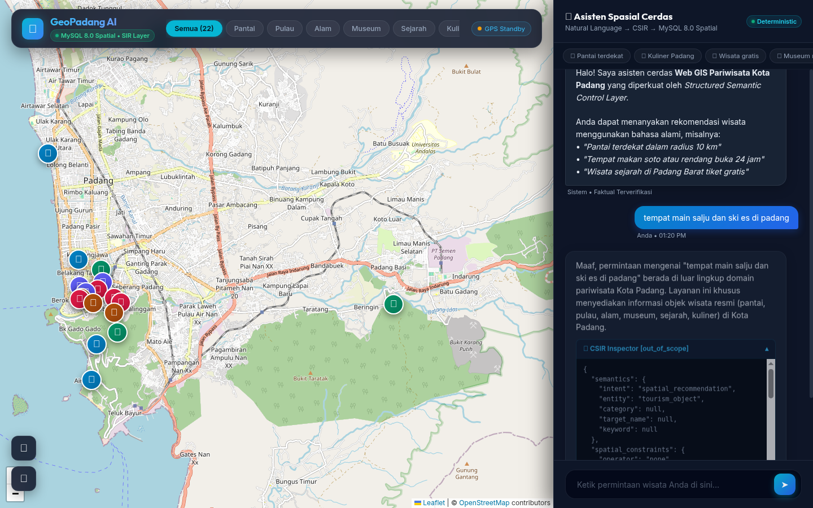

# Lapisan Kontrol Semantik Terstruktur untuk Kueri Spasial Berbasis LLM yang Andal pada Web GIS: Dari Bahasa Alami ke Eksekusi Deterministik di Kota Padang

**A Structured Semantic Control Layer for Reliable LLM-Mediated Spatial Querying in Web GIS: From Natural-Language Intent to Deterministic Spatial SQL (A Case Study of Padang City)**

---

## ABSTRAK

Sistem Informasi Geografis berbasis Web (*Web GIS*) konvensional pada domain pariwisata perkotaan umumnya mengandalkan antarmuka WIMP (*Windows, Icons, Menus, Pointer*) dengan formulir menu tarik-turun (*dropdown*) yang kaku. Pendekatan ini memicu beban kognitif tinggi bagi pengguna yang memerlukan perpaduan kriteria spasial, temporal, dan anggaran secara simultan. Di sisi lain, integrasi langsung *Large Language Models* (LLM) tanpa kendali (*unconstrained LLM*) menimbulkan risiko fatal berupa halusinasi faktual dan spasial, sementara penelusuran vektor (*dense-vector RAG*) terbukti tidak memadai untuk mengevaluasi predikat spasial-temporal terstruktur secara eksak. Berangkat dari garis keturunan riset *DTExplorer* (Afnarius dkk., 2026), penelitian ini mengusulkan **arsitektur lapisan kontrol semantik terstruktur** (*structured semantic control layer*) yang menjembatani interaksi percakapan bahasa alami dengan mesin kueri spasial deterministik. Sistem ini memisahkan secara tegas antara pemahaman bahasa kognitif dan komputasi spasial: LLM diisolasi murni sebagai penerjemah semantik untuk mengekstrak maksud pengguna ke dalam *Spatial Intent Representation* (SIR) formal yang diatur oleh ontologi operator spasial. SIR tersebut divalidasi melalui algoritma *SIR Validator* bertingkat enam dimensi (skema, tipe, domain, operator, entitas, dan konsistensi batasan) guna menegakkan invarian keamanan, lalu dikompilasi oleh *Deterministic Spatial Query Compiler* menjadi SQL terparameterisasi yang mengeksekusi fungsi spasial bawaan (*native spatial function*) `ST_Distance_Sphere` pada MySQL 8.0, terintegrasi dengan *Open Source Routing Machine* (OSRM) dan antarmuka peta Leaflet.js. Pengujian empiris terhadap 40 skenario percakapan *benchmark* terstandarisasi pada 22 destinasi wisata Kota Padang menunjukkan akurasi ekstraksi SIR sebesar **100,00%** (40/40), presisi eksekusi predikat spasial sebesar **97,50%** (39/40), *Entity Fabrication Rate* **0,00%** (0 objek wisata palsu), *Grounding Fidelity* **100,00%**, serta *Honest Rejection Rate* **100,00%** pada permintaan di luar yurisdiksi. Waktu respons ujung-ke-ujung rata-rata tercatat **1.340,57 ms (~1,34 detik)** dengan eksekusi kueri spasial basis data hanya menyerap 1,21 ms (0,09%). Temuan ini membuktikan bahwa pembatasan kewenangan LLM melalui representasi semantik perantara terstruktur mampu menghadirkan antarmuka percakapan yang luwes sekaligus menjamin keandalan faktual mutlak bagi sistem informasi spasial perkotaan.

**Kata Kunci:** *Intelligent Spatial Information System, Spatial Intent Representation (SIR), SIR Validator, Strict Grounding Contract, Deterministic Spatial Query Compiler, Web GIS, ST_Distance_Sphere, Kota Padang.*

---

## ABSTRACT

Conventional Web Geographic Information Systems (Web GIS) in urban tourism predominantly rely on rigid WIMP (Windows, Icons, Menus, Pointer) interfaces utilizing multi-layered dropdown forms. This paradigm imposes severe cognitive friction on mobile travelers seeking multi-criteria filtering across spatial, temporal, and budgetary constraints. Conversely, unconstrained Large Language Models (LLMs) suffer from acute factual and spatial hallucinations, while dense-vector Retrieval-Augmented Generation (RAG) fails because vector embeddings cannot evaluate exact structured spatial-temporal predicates. Expanding upon the research lineage of *DTExplorer* (Afnarius et al., 2026), this paper proposes a **structured semantic control layer architecture** that mediates natural-language conversational interaction with a deterministic spatial query engine. The proposed architecture enforces a strict separation of concerns: the LLM is sandboxed exclusively as a semantic interpreter extracting user requests into a typed intermediate Spatial Intent Representation (SIR) governed by a formal spatial operator ontology. The extracted SIR is verified by a six-dimensional *SIR Validator* (enforcing schema, type, domain, operator, entity, and constraint consistency invariants) and subsequently compiled by a *Deterministic Spatial Query Compiler* into parameterized SQL executing the native `ST_Distance_Sphere` spatial function on MySQL 8.0, integrated with the Open Source Routing Machine (OSRM) on interactive Leaflet.js maps. Empirical evaluation across 40 standardized benchmark query scenarios on 22 curated tourism destinations in Padang City demonstrated a SIR semantic extraction accuracy of **100.00%** (40/40), a spatial execution predicate precision of **97.50%** (39/40), an Entity Fabrication Rate of **0.00%** (zero fabricated POIs), a Grounding Fidelity of **100.00%**, and an Honest Rejection Rate of **100.00%** on out-of-scope requests. Average end-to-end latency was **1,340.57 ms (~1.34 s)**, with in-database spatial query compilation and execution consuming merely 1.21 ms (0.09%). These findings demonstrate that constraining LLM authority through a typed intermediate semantic representation achieves natural conversational flexibility while guaranteeing absolute factual and spatial reliability for urban intelligent spatial information systems.

**Keywords:** *Intelligent Spatial Information System, Spatial Intent Representation (SIR), SIR Validator, Strict Grounding Contract, Deterministic Spatial Query Compiler, Web GIS, ST_Distance_Sphere Function, Padang City.*

---

## 1. PENDAHULUAN

### 1.1 Latar Belakang dan Konteks Spasial Perkotaan
Sistem Informasi Geografis berbasis Web (*Web GIS*) telah menjadi tulang punggung penyebaran informasi geospasial modern, khususnya pada sektor pariwisata perkotaan (*urban tourism*) [1], [14]. Kota Padang, sebagai ibu kota Provinsi Sumatera Barat dengan luas wilayah administratif 694,96 km², menghadirkan karakteristik bentang alam dan cagar budaya yang sangat heterogen [16], [17]. Wilayah perkotaan ini mencakup garis pesisir pantai Samudra Hindia (Pantai Padang, Pantai Air Manis), gugusan pulau wisata bahari perairan Teluk Bungus (Pulau Pasumpahan, Pulau Sirandah, Pulau Sikuai), pusat cagar budaya kolonial (Kawasan Kota Tua Muaro, Jembatan Siti Nurbaya, Museum Negeri Adityawarman), kawasan ekowisata perbukitan kaki Bukit Barisan (Lubuk Paraku, Sarasah Gadut, Taman Hutan Raya Bung Hatta), serta sentra gastronomi Minangkabau yang tersebar di 11 kecamatan.

Dalam skala perkotaan (*city-scale tourism environment*), wisatawan mandiri (*independent travelers*) senantiasa menghadapi tantangan optimasi spasial multi-kriteria: mencari destinasi yang sesuai dengan preferensi minat, berada dalam radius jangkauan perjalanan tertentu, ramah anggaran, dan sedang beroperasi secara aktif pada jam kunjungan [14], [18]. Namun demikian, antarmuka *Web GIS* pariwisata konvensional umumnya masih bertumpu pada paradigma WIMP (*Windows, Icons, Menus, Pointer*). Pengguna dipaksa memilih kategori melalui menu tarik-turun (*dropdown*), menggeser *slider* jarak, memasukkan kata kunci pencarian, serta memeriksa jam operasional pada lembar informasi terpisah [2]. Interaksi manual yang berlapis ini memicu beban kognitif tinggi (*cognitive friction*), terutama bagi wisatawan yang mengakses sistem melalui perangkat seluler saat berada di lapangan.

### 1.2 Lineage Penelitian: Dari Eksplorasi Statis Menuju Kueri Spasial Berbasis Kecerdasan Buatan
Evolusi sistem pendukung keputusan spasial pariwisata dalam kelompok penelitian ini bertolak dari fondasi empiris yang telah dibangun sebelumnya secara sistematis:
1. **DTExplorer (Afnarius dkk., 2026) [2]:** Memelopori interaksi spasial eksploratori sadar-skala (*scale-aware exploratory spatial interaction*) pada skala mikro pedesaan (*village-level tourism*, dievaluasi di Desa Wisata Ulakan, Kabupaten Padang Pariaman). *DTExplorer* membuktikan bahwa kurasi data titik minat (43 POI terkurasi oleh pemangku kepentingan desa) yang dipadukan dengan pemfilteran berbasis kategori dan radius lingkaran efektif memandu wisatawan tanpa memerlukan model optimasi komputasi yang membebani peladen. Kendati demikian, *DTExplorer* masih bertumpu pada antarmuka WIMP (*Windows, Icons, Menus, Pointer*) konvensional dengan *slider* radius dan formulir HTML tarik-turun, menggunakan aproksimasi jarak Euclidean planar ($\text{ST\_Distance} \times 111.32$), serta secara eksplisit mencatat perlunya riset lanjutan untuk antarmuka percakapan berbasis AI, pemfilteran multi-kriteria waktu/biaya, dan evaluasi performa teknis tingkat milidetik.
2. **Kustomrut (Afnarius dkk.):** Mengembangkan interaktivitas rute wisata yang dapat disesuaikan langsung oleh pengguna (*user-controlled itinerary customization*).
3. **Penelitian Ini (Intelligent Spatial Information System):** Memajukan paradigma tersebut ke arah kueri spasial percakapan terpandu (*reliable AI-mediated spatial querying*) pada skala perkotaan Kota Padang (694,96 km²). Pengguna tidak lagi memanipulasi kontrol formulir yang kaku atau memeriksa lembar informasi secara terpisah, melainkan cukup mengekspresikan kebutuhan perjalanan menggunakan bahasa alami (misalnya: *"Carikan pantai yang ombaknya tenang dekat lokasi saya, tiket di bawah 15 ribu dan buka sekarang"*). Sistem secara deterministik menerjemahkan niat bahasa alami menjadi predikat SQL terparameterisasi dengan fungsi spasial bawaan MySQL 8.0 `ST_Distance_Sphere`, memvisualisasikan rute jaringan jalan nyata via OSRM, dan menegakkan *firewall* grounding algoritmik bergaransi nol halusinasi.

### 1.3 Keterbatasan Pendekatan yang Ada: Ancaman Halusinasi dan Kegagalan RAG Vektor
Dalam mengintegrasikan model kecerdasan buatan percakapan seperti *Large Language Models* (LLM) ke dalam sistem informasi geospasial, terdapat jebakan metodologis mendasar apabila LLM dihubungkan secara langsung tanpa sekat pembatas (*unconstrained end-to-end LLM*) [3], [5]:
* **Halusinasi Spasial dan Faktual:** LLM bekerja berdasarkan mekanisme probabilistik prediksi token (*next-token prediction*), bukan mesin verifikasi fakta relasional [4], [5]. Akibatnya, LLM rentan menciptakan entitas destinasi fiktif (*fabricated POIs*), memanipulasi jam operasional dan tarif tiket, atau memberikan estimasi jarak geodesik yang mustahil secara geografis.
* **Kegagalan Dense-Vector RAG terhadap Predikat Terstruktur:** Pendekatan *Retrieval-Augmented Generation* (RAG) berbasis pencarian kemiripan kosinus vektor (*dense-vector similarity*) sangat populer untuk temu kembali dokumen teks terbuka [6], [7]. Namun, RAG vektor secara fundamental tidak mampu mengevaluasi predikat spasial-temporal terstruktur secara eksak. Vektor *embedding* tidak dapat melakukan perbandingan ketaksamaan numerik jam operasional (`jam_buka <= jam_sekarang AND jam_tutup >= jam_sekarang`), membatasi pagu anggaran (`harga_tiket <= 15000`), maupun mengevaluasi jarak geodesik lingkaran besar terhadap posisi GPS pengguna secara *real-time*.

### 1.4 Rumusan Masalah dan Pemosisian Ilmiah (Scientific Positioning)
Bertolak dari keterbatasan di atas, pusat gravitasi ilmiah penelitian ini bukanlah sekadar *"membangun aplikasi chatbot untuk Web GIS"*, melainkan menjawab pertanyaan mendasar sistem informasi cerdas:
> **Bagaimana merancang lapisan kontrol semantik terstruktur (*structured semantic control layer*) yang mampu memediasi kueri spasial bahasa alami menjadi eksekusi komputasi spasial deterministik pada basis data, sehingga LLM berfungsi optimal sebagai antarmuka kognitif tanpa memiliki kewenangan untuk memanipulasi atau mengarang fakta spasial?**

### 1.5 Kontribusi Ilmiah
Penelitian ini memberikan lima kontribusi ilmiah:
1. **Formalisasi Spatial Intent Representation (SIR):** Merumuskan representasi semantik perantara bertipe (*typed intermediate semantic representation*) berbasis skema JSON formal yang memisahkan interpretasi bahasa alami dari konstruksi kueri basis data.
2. **Ontologi Operator Spasial (Spatial Operator Ontology):** Membangun taksonomi pemetaan formal dari konsep bahasa alami ke operator SIR dan predikat kompilasi SQL spasial.
3. **Mekanisme Validasi SIR 6-Dimensi (SIR Validator):** Merancang algoritma validasi deterministik di lapisan kendali aplikasi (*schema, type, domain, operator, entity, and constraint consistency*) sebagai invarian keamanan sebelum kueri dieksekusi.
4. **Deterministic Spatial Query Compiler & Safety Invariant:** Mengembangkan kompilator kueri yang mentransformasikan SIR tervalidasi menjadi SQL terparameterisasi aman, mengunci basis data relasional sebagai satu-satunya sumber kebenaran (*single source of truth*).
5. **Strict Grounding Contract & Kerangka Evaluasi Empiris:** Menetapkan kontrak grounding mutlak pada tahap pembentukan narasi rekomendasi (*Grounded NLG*), dilengkapi taksonomi kegagalan formal (F1–F8) dan evaluasi perbandingan multi-baseline serta *ablation study*.

---

## 2. LANDASAN TEORETIS DAN FORMALISASI KONSEPTUAL

### 2.1 Prinsip Pemisahan Semantik Kognitif dan Komputasi Spasial
Untuk menjamin integritas data geospasial, penelitian ini menetapkan aksioma arsitektural:
$$\boxed{\text{LLM interprets natural-language semantics; Spatial DBMS computes deterministic spatial relations.}}$$
Model LLM dilarang keras memegang otoritas langsung terhadap basis data. LLM tidak diizinkan membuat teks kueri SQL secara bebas, dilarang menentukan nama tabel atau kolom, dan tidak diperkenankan melakukan komputasi jarak secara internal. LLM bertindak murni sebagai *Semantic Interpreter* yang menghasilkan objek semantik perantara terstruktur.

### 2.2 Ontologi Operator Spasial (Spatial Operator Ontology)
Kueri bahasa alami pengguna ditransformasikan menjadi representasi semantik melalui pemetaan operator ontologis yang terdefinisi secara ketat. Tabel 1 merinci ontologi operator spasial yang diterapkan:

**Tabel 1. Ontologi Operator Spasial pada Sistem Rekomendasi Terstruktur**

| Ekspresi Bahasa Alami | Operator SIR | Operator / Predikat SQL Deterministik | Semantik Operasional |
|---|---|---|---|
| *"paling dekat"*, *"terdekat"* | `nearest` | `ORDER BY distance_km ASC LIMIT k` | Mengurutkan kandidat POI berdasarkan kedekatan geodesik dari titik acuan |
| *"dalam radius 5 km"*, *"sekitar 10 km"* | `within_radius` | `WHERE distance_km <= :radius_km` | Menyaring destinasi di dalam batas radius lingkaran geodesik |
| *"di Kecamatan Padang Selatan"* | `within_admin_area` | `WHERE alamat ILIKE :admin_pattern` | Menyaring destinasi di dalam batas wilayah administratif perkotaan |
| *"buka sekarang"*, *"sedang buka"* | `open_now` | `WHERE :current_time BETWEEN jam_buka AND jam_tutup` | Evaluasi predikat sirkadian waktu operasional aktif |
| *"buka 24 jam"* | `open_24h` | `WHERE jam_buka = '00:00:00' AND jam_tutup >= '23:59:00'` | Menyaring objek wisata beroperasi non-stop |
| *"tiket gratis"*, *"tanpa bayar"* | `is_free` | `WHERE harga_tiket = 0` | Menyaring destinasi publik tanpa tiket retribusi |
| *"tiket maksimal 20 ribu"* | `max_price` | `WHERE harga_tiket <= :max_price` | Membatasi pagu anggaran tiket masuk |
| *"pantai"*, *"museum"*, *"kuliner"* | `category` | `WHERE kategori.nama = :category_name` | Pembatasan relasional terhadap 6 klaster wisata resmi |

### 2.3 Skema Formal Spatial Intent Representation (SIR)
Alih-alih mengandalkan keluaran teks bebas, sistem memformalkan maksud pengguna ke dalam skema data bertipe. Tabel 2 mendefinisikan spesifikasi skema SIR formal:

**Tabel 2. Spesifikasi Skema Formal Spatial Intent Representation (SIR)**

| Atribut SIR | Tipe Data | Deskripsi Semantik | Nilai yang Diizinkan (*Allowed Values*) |
|---|---|---|---|
| `intent` | *Enum* | Maksud utama interaksi | `spatial_recommendation`, `entity_lookup`, `general_inquiry` |
| `entity` | *Enum* | Entitas target yang dicari | `tourism_object` |
| `category` | *Enum* / *Null* | Klaster kategori wisata | `Pantai`, `Pulau`, `Alam`, `Museum`, `Sejarah`, `Kuliner`, `null` |
| `spatial_operator` | *Enum* | Predikat spasial operasi | `nearest`, `within_radius`, `within_admin_area`, `none` |
| `reference_type` | *Enum* | Tipe titik referensi spasial | `gps`, `city_center`, `poi`, `unknown` |
| `distance` | *Float* / *Null* | Nilai ambang batas jarak ($\ge 0$) | Nilai riil positif dalam kilometer (default: 20,0 km) |
| `distance_unit` | *Enum* | Satuan metrik jarak | `km`, `m` |
| `admin_area` | *String* / *Null* | Nama kecamatan/wilayah | String nama wilayah (misal: "Bungus", "Padang Barat") |
| `target_name` | *String* / *Null* | Nama entitas spesifik | String nama POI target untuk *entity lookup* |
| `keyword` | *String* / *Null* | Atribut tekstual deskripsi | String frasa penting (misal: "pasir putih", "air terjun") |
| `is_free` | *Boolean* | Batasan tiket gratis | `true`, `false` |
| `max_price` | *Integer* / *Null*| Batas atas tarif retribusi | Bilangan bulat rupiah $\ge 0$ |
| `open_now` | *Boolean* | Batasan waktu operasional | `true`, `false` |
| `open_24h` | *Boolean* | Batasan operasional 24 jam | `true`, `false` |
| `sort` | *Enum* / *Null* | Kriteria pemeringkatan | `termurah`, `termahal`, `terdekat`, `terbaik`, `null` |
| `is_out_of_scope` | *Boolean* | Penanda kueri di luar domain | `true`, `false` |

Representasi struktural dokumen SIR dalam format JSON dinyatakan sebagai berikut:
```json
{
  "intent": "spatial_recommendation",
  "entity": "tourism_object",
  "category": "Pantai",
  "spatial_operator": "within_radius",
  "reference_type": "gps",
  "distance": 10.0,
  "distance_unit": "km",
  "admin_area": "Padang Selatan",
  "target_name": null,
  "keyword": "pasir putih",
  "is_free": false,
  "max_price": 15000,
  "open_now": true,
  "open_24h": false,
  "sort": "terdekat",
  "is_out_of_scope": false
}
```

### 2.4 Komputasi Jarak Spasial Geodesik: Keunggulan Fungsi Spasial Bawaan MySQL 8.0 (ST_Distance_Sphere) Dibandingkan Rumus Manual
Sistem membedakan secara tegas antara perhitungan kedekatan spasial geodesik relasional pada basis data dengan navigasi jaringan jalan raya:

1. **Fungsi Spasial Bawaan Basis Data (*Built-in Spatial Function* `ST_Distance_Sphere`):**  
   Berbeda dari pendekatan konvensional yang menyematkan rumus trigonometri manual (seperti formula *Haversine* atau *Spherical Law of Cosines*) ke dalam teks kueri SQL atau mengevaluasinya secara berulang di tingkat aplikasi, sistem ini mendelegasikan komputasi jarak sepenuhnya kepada **fungsi spasial bawaan (*native spatial function*) `ST_Distance_Sphere`** pada kernel MySQL 8.0.
   
   Secara matematis, fungsi `ST_Distance_Sphere(g1, g2 [, radius])` mengevaluasi jarak geodesik lingkaran besar (*great-circle distance*) pada bola bumi dengan jari-jari standar WGS84 ($R = 6.370.986\text{ meter}$):
   $$d_{\text{geodesik}} = \frac{\text{ST\_Distance\_Sphere}(\text{POINT}(\text{lng}_1, \text{lat}_1), \text{POINT}(\text{lng}_2, \text{lat}_2))}{1000.0} \quad (\text{km})$$
   
   Pemanfaatan fungsi bawaan basis data ini memberikan tiga keunggulan fundamental dibandingkan perumusan rumus manual:
   - **Eksekusi Native C++ di Kernel Basis Data:** Fungsi dieksekusi langsung pada pustaka spasial terkompilasi MySQL tanpa membebani parser SQL dengan ekspresi trigonometri panjang berulang (`SIN`, `COS`, `ACOS`, `ASIN`, `RADIANS`).
   - **Kekebalan terhadap Galat Titik Kambang (*Floating-Point Error Immunity*):** Pada rumus manual berbasis `ACOS`, deviasi biner titik-kambang yang sedikit melampaui $1.0$ dapat memicu galat `NaN` (*domain error*). Fungsi `ST_Distance_Sphere` menangani normalisasi batas koordinat dan singularitas kutub secara otomatis.
   - **Kesesuaian Standar Geospasial OGC:** Menggunakan representasi titik geometri standar OGC (*Open Geospatial Consortium*) `POINT(longitude, latitude)`, menjamin konsistensi integrasi dengan indeks spasial serta arsitektur GIS masa depan.

2. **Jarak dan Geometri Jaringan Jalan (OSRM Engine):**  
   Untuk visualisasi navigasi rute nyata pada peta Leaflet.js, pasangan koordinat dikirimkan ke mesin *Open Source Routing Machine* (OSRM) [9] yang memanfaatkan data jalan OpenStreetMap (OSM) [8] dengan algoritma *Contraction Hierarchies* (CH):
   $$\mathcal{G}_{\text{jalan}} = (V, E, W), \quad \text{Rute}_{\text{opt}} = \arg\min_{p \in \mathcal{P}(P_1, P_2)} \sum_{e \in p} W(e)$$
   menghasilkan *polyline* lintasan jalan raya perkotaan serta estimasi durasi tempuh kendaraan yang akurat.


---

## 3. METODOLOGI DAN ARSITEKTUR SISTEM

### 3.1 Evolusi Arsitektur: Dari Three-Tier Web GIS Menuju 5-Layer Semantic-Controlled Web GIS
Guna memposisikan kontribusi arsitektural penelitian ini dalam garis keturunan ilmiah *DTExplorer* (Afnarius dkk., 2026) [2], Gambar 1 menyajikan evolusi struktural dari kerangka kerja *Three-Tier Web GIS* konvensional menuju sistem informasi spasial cerdas 5-layer yang diusulkan.

```
+=============================================================================================+
|             ARSITEKTUR 5-LAYER SISTEM INFORMASI SPASIAL CERDAS TERKONTROL                   |
+=============================================================================================+
| 1. CONVERSATIONAL INTERACTION LAYER (PRESENTATION / CLIENT)                                 |
|    - Antarmuka Dwitunggal Sinkron: Full-viewport Leaflet.js + Floating AI Chat Drawer       |
|    - HTML5 Geolocation API (Koordinat GPS Wisatawan) & Manajemen Sesi Percakapan            |
|    - Visualisasi Rute Vektor (OSRM Contraction Hierarchies) & SVG Kustom Destinasi Wisata   |
+----------------------------------------------+----------------------------------------------+
                                               | [A] Kueri Bahasa Alami + Konteks GPS / Waktu
                                               v
+---------------------------------------------------------------------------------------------+
| 2. LLM SEMANTIC INTERPRETATION LAYER (COGNITIVE AIR-GAP)                                     |
|    - Mesin Inferensi Cloud (DeepSeek API) dengan temperature = 0.0 & Mode Objek JSON        |
|    - Ekstraksi Slot Semantik Spasial dibatasi Ontologi Operator Spasial                     |
|    - Luaran: Raw Canonical Spatial Intent Representation (CSIR) JSON (Terisolasi dari DB)   |
+----------------------------------------------+----------------------------------------------+
                                               | [B] Objek CSIR Mentah (DTO)
                                               v
+---------------------------------------------------------------------------------------------+
| 3. SEMANTIC CONTROL & COMPILATION LAYER (BACKEND: CodeIgniter 4 / PHP 8.2)                 |
|    - SIR Validator 6-Dimensi menegakkan Prinsip "No Intent Alteration"                      |
|      * Validasi: Skema, Tipe Data, Batas Numerik, Operator Ontologi, Entitas, Konsistensi   |
|      * Menetapkan Kebijakan Eksekusi: direct_execute | clarify_user | reject_out_of_scope   |
|    - Deterministic Spatial Query Compiler menegakkan Safety Invariant:                      |
|      * !isValid || is_out_of_scope ==> Pembatalan Kompilasi SQL (0 Eksekusi Tanpa Otoritas) |
|      * Menghasilkan SQL Terparameterisasi dengan Fungsi Bawaan MySQL 8.0 ST_Distance_Sphere |
+----------------------------------------------+----------------------------------------------+
                                               | [C] Kueri Spasial SQL Terparameterisasi
                                               v
+---------------------------------------------------------------------------------------------+
| 4. DETERMINISTIC SPATIAL COMPUTATION LAYER (DATA STORAGE & KERNEL ENGINE)                   |
|    - MySQL 8.0 Relational & Spatial Database (InnoDB Engine, Geometri POINT SRID 4326)      |
|    - Komputasi Geodesik Lingkaran Besar: ST_Distance_Sphere(POINT, POINT) / 1000.0          |
|    - Evaluasi Kendala Multi-Kriteria Relasional (Jam sirkadian open_now, max_price, area)   |
|    - Integrasi Konteks Dinamis Real-Time: Status Operasional Destinasi + Cuaca Terkini      |
+----------------------------------------------+----------------------------------------------+
                                               | [D] Himpunan Tuple Fakta Tervalidasi (F)
                                               v
+---------------------------------------------------------------------------------------------+
| 5. GROUNDED RESPONSE & VERIFICATION LAYER (GROUNDING FIREWALL)                              |
|    - Algorithmic Grounding Validator: Kontrak Grounding Ketat (forall e in E, e in F)       |
|    - Intervensi Otomatis: Mengganti token halusinasi dengan template faktual DTO deterministik|
|    - Dual-Payload Dispatcher: Narasi Percakapan Ter-grounding + GeoJSON FeatureCollection   |
+----------------------------------------------+----------------------------------------------+
                                               | [E] Penanda Peta Sinkron & Narasi AI Faktual
                                               v
                                      Peramban Klien (Pengguna)
```

*Gambar 1. Evolusi Arsitektural: Transformasi dari Three-Tier Web GIS Konvensional (DTExplorer, Afnarius dkk., 2026) Menuju Sistem Informasi Spasial 5-Layer dengan Sandboxed Cognitive Interpretation dan Algorithmic Grounding Validator.*

Pada *DTExplorer* (Afnarius dkk., 2026, Gambar 4) [2], arsitektur *three-tier* terdiri atas:
1. *Presentation Layer:* Klien HTML/JavaScript berbasis Google Maps JavaScript API dengan kontrol WIMP (*dropdown* kategori, *slider* radius interaktif).
2. *Application Layer:* Peladen Node.js / Express.js yang memuat *API Routing Controller*, *Scale-Aware Controller*, dan *Spatial Query Builder* berbasis kueri statis.
3. *Data Layer:* Basis data spasial MySQL yang menyimpan tipe geometri POINT dan mengeksekusi aproksimasi jarak Euclidean planar (`ST_Distance * 111.32`).

Meskipun terbukti sangat efektif untuk penjelajahan desa wisata pada skala mikro, arsitektur *three-tier* tersebut memiliki tiga keterbatasan ketika diterapkan pada skala perkotaan heterogen: (a) memaksa wisatawan memformulasi kueri secara manual melalui antarmuka formulir berlapis, (b) tidak memiliki lapisan pemahaman bahasa alami berbasis AI, dan (c) rumus jarak Euclidean mengalami distorsi kelengkungan bumi pada radius jarak menengah hingga jauh.

Arsitektur **5-Layer** yang diusulkan dalam penelitian ini mengatasi keterbatasan tersebut melalui empat kebaruan struktural:
* **Pemisahan Kognitif Terisolasi (*Cognitive Air-Gap*, Layer 2 & 3):** LLM hanya bertindak sebagai penerjemah semantik kueri ke dalam format JSON CSIR dan sama sekali tidak memiliki akses ke basis data atau kode SQL.
* **Firewall Kendali Deterministik (Layer 3):** Memperkenalkan *SIR Validator* 6-dimensi berbasis prinsip *No Intent Alteration* serta kompilator SQL terparameterisasi dengan *Safety Invariant* penolakan kueri ilegal.
* **Komputasi Geodesik Bawaan Basis Data (Layer 4):** Mengganti jarak planar dengan fungsi bawaan kernel C++ MySQL 8.0 `ST_Distance_Sphere`, menjamin perhitungan jarak lingkaran besar yang presisi dan stabil.
* **Verifikasi Grounding Algoritmik Pasca-Generasi (Layer 5):** Memperkenalkan validator independen bergaransi matematis $\forall e \in \text{Entities}(\text{Response}), e \in F$ yang menjamin *Entity Fabrication Rate* **0,00%** sebelum informasi disajikan ke peramban pengguna.

### 3.1.1 Kerangka Operasional Interaksi Spasial Eksploratori Terkontrol Semantik
Guna memvisualisasikan bagaimana parameterisasi skala, penyaringan spasial, dan eksplorasi pengguna berinteraksi secara dinamis dalam kerangka kecerdasan buatan, Gambar 2 memodelkan **Kerangka Operasional Interaksi Spasial Eksploratori Terkontrol Semantik (*The Iterative Cognitive-Control-Execution Loop*)**, yang secara langsung mengevolusi paradigma operasional yang dirintis oleh Afnarius dkk. (2026, Gambar 8) [2].

```
+---------------------------------------------------------------------------------------------+
|        KERANGKA OPERASIONAL: SIKLUS ITERATIF KOGNITIF-KENDALI-EKSEKUSI SPASIAL              |
+---------------------------------------------------------------------------------------------+
|                                                                                             |
|   +-------------------------------------------------------------------------------------+   |
|   | 1. FORMULASI INTENSI KOGNITIF BAHASA ALAMI & KONTEKS SITUASIONAL                    |   |
|   |    - Wisatawan mengekspresikan preferensi majemuk melalui bahasa alami sehari-hari  |   |
|   |    - Resolusi konteks sisi klien: GPS (lat, lng), waktu sirkadian, preferensi sesi  |   |
|   +------------------------------------------+------------------------------------------+   |
|                                              | Kueri Bahasa Alami + Vektor Konteks          |
|                                              v                                              |
|   +-------------------------------------------------------------------------------------+   |
|   | 2. COGNITIVE AIR-GAP: INTERPRETASI SEMANTIK (SANDBOX JSON LLM)                      |   |
|   |    - DeepSeek LLM (temperature: 0.0, response_format: JSON)                         |   |
|   |    - Ekstraksi slot dibatasi oleh Ontologi Operator Spasial & Taksonomi Klaster     |   |
|   |    - Memancarkan DTO Canonical Spatial Intent Representation (CSIR) mentah          |   |
|   +------------------------------------------+------------------------------------------+   |
|                                              | Objek CSIR Mentah                            |
|                                              v                                              |
|   +-------------------------------------------------------------------------------------+   |
|   | 3. FIREWALL KENDALI DETERMINISTIK & INVARIAN KOMPILASI SPASIAL                      |   |
|   |    - SIR Validator: 6-Dimensi Invarian menegakkan prinsip "No Intent Alteration"    |   |
|   |      * Pemeriksaan batas (distance > 0), domain safety, rekonsiliasi kontradiksi    |   |
|   |      * Menetapkan Kebijakan: direct_execute | clarify_user | reject_out_of_scope    |   |
|   |    - Spatial Query Compiler menegakkan Safety Invariant:                            |   |
|   |      * !isValid || is_out_of_scope ==> Penghentian Eksekusi SQL (Beban DB = 0)     |   |
|   |      * Sintesis kueri SQL terparameterisasi dengan fungsi ST_Distance_Sphere        |   |
|   +------------------------------------------+------------------------------------------+   |
|                                              | Pernyataan SQL Terparameterisasi Valid       |
|                                              v                                              |
|   +-------------------------------------------------------------------------------------+   |
|   | 4. KOMPUTASI SPASIAL GEODESIK DETERMINISTIK & PENGAYAAN KONTEKS                     |   |
|   |    - Basis Data Relasional 3NF: wisata JOIN kategori (SPATIAL INDEX pada geom)      |   |
|   |    - Kernel C++ MySQL 8.0: ST_Distance_Sphere(POINT(lng, lat), POINT(u_lng, u_lat)) |   |
|   |    - Filter multi-kriteria relasional (open_now, open_24h, max_price, status)       |   |
|   |    - Pengayaan status cuaca real-time (OpenWeatherMap) dan catatan operasional      |   |
|   |    - Menghasilkan Tupel Fakta Terverifikasi: F = {t_1, t_2, ..., t_k}               |   |
|   +------------------------------------------+------------------------------------------+   |
|                                              | Tabel Fakta Terverifikasi F                  |
|                                              v                                              |
|   +-------------------------------------------------------------------------------------+   |
|   | 5. VALIDATOR GROUNDING ALGORITMIK PASCA-GENERASI (GROUNDING FIREWALL)               |   |
|   |    - LLM mensintesis narasi percakapan terikat ketat pada Tabel Fakta F             |   |
|   |    - Algorithmic Grounding Validator menegakkan Kontrak Grounding Ketat:            |   |
|   |      * forall e in Entities(Response), e in Entities(Facts_SQL)                     |   |
|   |      * Membuang token halusinasi; substitusi otomatis dengan DTO deterministik      |   |
|   |      * Garansi matematis Entity Fabrication Rate = 0,00%                            |   |
|   +------------------------------------------+------------------------------------------+   |
|                                              | Muatan Ganda Sinkron (Dual-Payload)          |
|                                              v                                              |
|   +-------------------------------------------------------------------------------------+   |
|   | 6. RENDERING MULTIMODAL DWITUNGGAL SINKRON (INTERAKSI KLIEN WEB GIS)                |   |
|   |    - Peta Interaktif Leaflet.js: Auto-pan, pin SVG tematik, popup detail destinasi  |   |
|   |    - Mesin Rute OSRM: Rute jaringan jalan raya turn-by-turn & estimasi waktu        |   |
|   |    - Panel Percakapan AI: Narasi rekomendasi informatif, akurat, dan ter-grounding  |   |
|   +------------------------------------------+------------------------------------------+   |
|                                              | Status Spasial Tervisualisasi & Umpan Balik  |
|                                              v                                              |
|   +-------------------------------------------------------------------------------------+   |
|   | 7. EVALUASI KOGNITIF PENGGUNA & LINGKARAN PENYEMPURNAAN PERCAKAPAN ADAPTIF          |   |
|   |    - Wisatawan mengevaluasi sebaran spasial, waktu tempuh, tarif, dan foto objek    |   |
|   |    - Umpan balik dialog multi-turn (contoh: "Ada kuliner terdekat dari pantai ini?")|   |
|   +-------------------------------------------------------------------------------------+   |
|                                              | Penyesuaian Kueri Percakapan Iteratif        |
|                                              +--------------------------------------------->+
+---------------------------------------------------------------------------------------------+
```

*Gambar 2. Kerangka Operasional Interaksi Spasial Eksploratori Terkontrol Semantik pada Web GIS Cerdas: Siklus Iteratif Kognitif-Kendali-Eksekusi (Evolusi Model Parameterisasi Manual Afnarius dkk., 2026).*

Jika pada *DTExplorer* (Afnarius dkk., 2026, Gambar 8) [2] interaksi spasial eksploratori diposisikan sebagai siklus umpan balik manual—di mana pengguna menggeser *slider* radius secara fisik dan mencentang ulang kotak kategori setelah melihat kepadatan titik pada peta—kerangka operasional pada Gambar 2 mentransformasikannya menjadi **lingkaran kognitif-percakapan (*cognitive-conversational loop*)**:
1. **Peniadaan Friksi Antarmuka WIMP:** Wisatawan mengekspresikan intensi gabungan (skala jarak, preferensi waktu, dan batasan anggaran) dalam satu kalimat percakapan alami tanpa manipulasi kontrol GUI berlapis.
2. **Mediasi Kendali Deterministik:** Parameterisasi skala tidak disalurkan secara mentah ke pembangun kueri, melainkan melalui *Cognitive Air-Gap*, *SIR Validator*, dan invarian keamanan kompilator.
3. **Penyempurnaan Dialog Adaptif (*Adaptive Conversational Refinement*):** Umpan balik pengguna dilakukan melalui dialog lanjutan (*multi-turn conversation*, misalnya: *"Cari yang lebih dekat dalam radius 3 km"* atau *"Carikan rumah makan di dekat pantai kedua"*), yang secara dinamis memperbarui vektor CSIR sambil mempertahankan memori sesi interaksi.

### 3.1.2 Model Konseptual Basis Data Spasial Relasional (Normalisasi 3NF vs. Partisi Kategori DTExplorer)
Gambar 3 menyajikan model konseptual basis data spasial relasional yang diusulkan, yang secara mendasar menyempurnakan arsitektur penyimpanan *DTExplorer* (Afnarius dkk., 2026, Gambar 6) [2].

```
+=============================================================================================+
|                 MODEL BASIS DATA SPASIAL RELASIONAL TERNORMALISASI (3NF)                    |
+=============================================================================================+
|                                                                                             |
|   +-----------------------------+                  +------------------------------------+   |
|   |          kategori           | 1              * |               wisata               |   |
|   +-----------------------------+------------------+------------------------------------+   |
|   | PK id         : INT         |                  | PK id                 : INT        |   |
|   |    nama       : VARCHAR(50) |                  | FK kategori_id        : INT        |   |
|   |    slug       : VARCHAR(50) |                  |    nama               : VARCHAR    |   |
|   |    icon       : VARCHAR(50) |                  |    deskripsi          : TEXT       |   |
|   |    warna      : VARCHAR(20) |                  |    alamat             : TEXT       |   |
|   +-----------------------------+                  |    lat                : DECIMAL    |   |
|                                                    |    lng                : DECIMAL    |   |
|   +-----------------------------+                  |    geom               : POINT      |   |
|   |        chat_session         |                  |    SPATIAL INDEX(geom)             |   |
|   +-----------------------------+                  |    harga_tiket        : INT        |   |
|   | PK id         : INT         | 1                |    jam_buka           : TIME       |   |
|   |    session_id : VARCHAR(64) |                  |    jam_tutup          : TIME       |   |
|   |    user_lat   : DECIMAL     |                  |    rating             : DECIMAL    |   |
|   |    user_lng   : DECIMAL     |                  |    foto               : VARCHAR    |   |
|   |    created_at : DATETIME    |                  |    status_aktif       : TINYINT    |   |
|   +-----------------------------+                  |    status_operasional : VARCHAR    |   |
|                  |                                 |    catatan_status     : TEXT       |   |
|                  | 1                               +------------------------------------+   |
|                  v *                                                                        |
|   +-----------------------------+                                                           |
|   |        chat_message         |                                                           |
|   +-----------------------------+                                                           |
|   | PK id         : INT         |                                                           |
|   | FK session_id : VARCHAR(64) |                                                           |
|   |    role       : ENUM        |                                                           |
|   |    message    : TEXT        |                                                           |
|   |    raw_sir    : JSON        |                                                           |
|   |    sql_query  : TEXT        |                                                           |
|   +-----------------------------+                                                           |
+=============================================================================================+
```

*Gambar 3. Model Konseptual Basis Data Spasial Relasional (Normalisasi 3NF dengan Geometri OGC dan Kategori Relasional, Mengevolusi Model Multi-Tabel DTExplorer).*

Pada *DTExplorer* (Afnarius dkk., 2026, Gambar 6) [2], model data diimplementasikan ke dalam enam tabel fisik terpisah untuk setiap kategori (`unique_attractions`, `regular_attractions`, `culinary_specialties`, `souvenirs`, `places_of_worship`, `homestays`). Setiap tabel mereplikasi kolom atribut yang persis sama (`id`, `name`, `address`, `contact_person`, `capacity`, `opening_time`, `closing_time`, `photo`, `description`, `geom`). 

Sistem yang diusulkan mengembangkan skema penyimpanan ini menjadi **Model Relasional Spasial Bentuk Normal Ketiga (*Third Normal Form* / 3NF)**:
1. **Eliminasi Redundansi Struktural:** Entitas tunggal `wisata` mengonsolidasikan seluruh objek wisata lintas kategori dengan relasi *Foreign Key* ke entitas `kategori`. Hal ini mengeliminasi duplikasi skema serta mempermudah pemeliharaan integritas data secara atomik.
2. **Traversalisasi Indeks Spasial R-Tree Tunggal:** Pada *DTExplorer*, pencarian lintas kategori mengharuskan eksekusi kueri terpisah ke banyak tabel atau klausa `UNION` kompleks. Pada model usulan, mesin MySQL 8.0 cukup menelusuri satu `SPATIAL INDEX(geom)` terpadu di atas seluruh destinasi kota, yang secara signifikan mempercepat eksekusi kueri spasial.
3. **Pengayaan Temporal, Finansial, dan Operasional Dinamis:** Selain koordinat dan kontak dasar, tabel `wisata` mengintegrasikan atribut sirkadian (`jam_buka`, `jam_tutup`), batas finansial tiket (`harga_tiket`), serta status operasional harian dinamis (`status_operasional`, `catatan_status`), memungkinkan evaluasi filter multi-kriteria secara instan dalam satu lintasan kueri SQL.
4. **Persistensi Jejak Interaksi dan Auditabilitas:** Entitas relasional `chat_session` dan `chat_message` menyimpan rekam jejak koordinat GPS pengguna, dokumen CSIR JSON mentah, dan sintaks kueri SQL yang dieksekusi, menjamin keterlacakan penuh (*traceability*) terhadap seluruh keputusan komputasi sistem AI.

### 3.2 Kurasi dan Tata Kelola Data Destinasi Wisata
Data primer mencakup 22 objek wisata representatif di Kota Padang yang diverifikasi silang terhadap publikasi resmi Dinas Pariwisata Kota Padang [16] dan Badan Pusat Statistik [17]. Dataset terbagi ke dalam 6 klaster tematik:
1. **Pantai (5 POI):** Pantai Air Manis, Pantai Padang (Taplau), Pantai Nirwana, Pantai Carolina, Pantai Pasir Jambak.
2. **Pulau (3 POI):** Pulau Pasumpahan, Pulau Sirandah, Pulau Sikuai/Pamutusan.
3. **Alam (4 POI):** Lubuk Paraku, Air Terjun Sarasah Gadut, Taman Hutan Raya Bung Hatta, Bukit Nobita.
4. **Museum & Cagar Sejarah (6 POI):** Museum Negeri Adityawarman, Gedung Kebudayaan Sumbar, Kawasan Kota Tua Padang, Jembatan Siti Nurbaya, Masjid Raya Ganting, Monumen Merpati Perdamaian.
5. **Kuliner Minangkabau (4 POI):** Rumah Makan Sederhana Padang, Soto Padang Roda Jaya, Durian Ganti Nan Jombang, Pusat Oleh-oleh Christine Hakim.

Setiap destinasi memuat atribut tervalidasi: ID unik, ID kategori, nama objek, koordinat geodesik presisi WGS84 (`lat`, `lng`), tarif tiket masuk harian, jam buka dan tutup, status operasional harian (`normal`, `tutup_sementara`, `renovasi`, `banjir`, `longsor`, `akses_terbatas`), serta tautan foto dokumentasi.

### 3.3 Peran Prompt dalam Mekanisme Kontrol Keseluruhan dan Pencegahan Jawaban Tanpa Grounding

Dalam rancang bangun sistem informasi spasial cerdas, *prompt* tidak diposisikan sebagai pembuat keputusan akhir ataupun penjawab langsung pertanyaan pengguna, melainkan sebagai **kontrak pembatas struktural deklaratif (*declarative structural boundary contract*)**. Bagian ini menjawab secara mendasar pertanyaan kritis reviewer:

> *"Bagaimana peneliti memastikan bahwa LLM menghasilkan representasi spatial intent yang terstruktur dan tidak langsung menghasilkan jawaban/fakta yang tidak ter-grounding?"*

Untuk menjawab tantangan tersebut, penelitian ini menerapkan empat pilar isolasi arsitektural yang saling mengunci (*interlocking architectural safeguards*):

1. **Isolasi Peran melalui Parameter Inferensi Deterministik:** Model LLM dipanggil dengan parameter `temperature: 0.0` guna menekan entropi stokastik dan mengeliminasi variabilitas probabilistik keluaran. Parameter `response_format: {"type": "json_object"}` diaktifkan pada tingkat API sehingga mesin inferensi terkunci secara sintaksis untuk hanya memancarkan objek JSON valid yang dapat di-parse secara komputasional.
2. **Larangan Wewenang Eksplisit (*Negative Constraint Enforcement*):** Prompt inti memuat tiga larangan absolut: (a) Dilarang merangkai atau menghasilkan kueri SQL, (b) Dilarang menjawab pertanyaan pengguna atau memberikan saran wisata secara langsung, dan (c) Dilarang mengembalikan format markdown atau penjelasan teks di luar dokumen JSON. Dengan demikian, LLM secara fungsional dinonaktifkan dari kapasitasnya sebagai mesin penjawab percakapan bebas pada tahap ini.
3. **Pemisahan Udara Komputasi (*Air-Gap Architecture*):** Keluaran JSON dari LLM tidak pernah disalurkan secara langsung ke antarmuka pengguna peramban. Respon mentah tersebut dicegat sepenuhnya di lapisan *backend* CodeIgniter 4, dipetakan ke dalam objek transfer data bertipe (*Data Transfer Object* / DTO) `SpatialIntent`, lalu diserahkan ke mesin validasi deterministik independen (*SIR Validator*).
4. **Validasi Invarian Deterministik dan Eksekusi Terisolasi:** Sekalipun LLM mengalami kegagalan inferensi atau mencoba menyisipkan halusinasi (misalnya mengarang operator, mengembalikan nilai jarak negatif, atau merekomendasikan destinasi di luar Kota Padang), *SIR Validator* 6-dimensi dan *SpatialPolicyHandler* akan menolak atau mengoreksinya tanpa mutasi sepihak (*No Intent Alteration*). Komputasi spasial sepenuhnya didelegasikan kepada formula *ST_Distance_Sphere* pada MySQL 8.0 sebagai satu-satunya sumber kebenaran faktual (*Single Source of Truth*).

#### 3.3.1 Prinsip Desain dan Struktur Prompt Inti (Main Paper)
Prinsip perancangan prompt pada penelitian ini bertumpu pada **Information Extraction Sandboxing**:
* **Role Definition:** Menetapkan LLM semata-mata sebagai *spatial intent parser* untuk domain pariwisata Kota Padang.
* **Strict Taxonomy Grounding:** Membatasi kategori yang boleh diekstrak hanya pada 6 klaster resmi (`Pantai`, `Pulau`, `Alam`, `Museum`, `Sejarah`, `Kuliner`), serta operator spasial pada 4 predikat formal (`nearest`, `within_radius`, `within_admin_area`, `none`).
* **Preservation of Intent:** Menginstruksikan model untuk mempertahankan nilai batasan pengguna persis seperti yang diucapkan tanpa pembulatan atau manipulasi internal.

#### 3.3.2 Listing Kompak Prompt Inti Penentu Structured Output
Listing 1 menyajikan potongan inti instruksi sistem (*system prompt*) yang menegakkan keluaran terstruktur SIR:

```
LISTING 1. Prompt Inti Penentu Structured Output SIR (Compact Listing)
--------------------------------------------------------------------------------
You are a spatial intent parser for a tourism Web GIS in Padang City, Indonesia.
Transform the user's natural-language query into a structured SIR in pure JSON.

RULES:
1. Return JSON ONLY. No markdown, no explanation, no other text.
2. Do not generate SQL.
3. Do not answer the user's question or provide recommendations.
4. Allowed Categories: "Pantai" | "Pulau" | "Alam" | "Museum" | "Sejarah" | "Kuliner" | null
5. Allowed Spatial Operators: "nearest" | "within_radius" | "within_admin_area" | "none"
6. Preserve spatial constraints exactly as expressed by user.
7. If user requests impossible things for Padang (e.g. ski, snow, casino), set is_out_of_scope: true.

SCHEMA:
{
  "intent": "spatial_recommendation" | "entity_lookup" | "general_inquiry",
  "entity": "tourism_object",
  "category": "Pantai" | "Pulau" | "Alam" | "Museum" | "Sejarah" | "Kuliner" | null,
  "target_name": string or null,
  "keyword": string or null,
  "spatial_operator": "nearest" | "within_radius" | "within_admin_area" | "none",
  "reference_type": "gps" | "city_center" | "poi" | "unknown",
  "radius": float or null,
  "distance_unit": "km",
  "admin_area": string or null,
  "is_free": boolean,
  "max_price": integer or null,
  "open_now": boolean,
  "open_24h": boolean,
  "sort": "termurah" | "termahal" | "terdekat" | "terbaik" | null,
  "is_out_of_scope": boolean
}
--------------------------------------------------------------------------------
```
*(Catatan: Teks instruksi sistem lengkap beserta penanganan multi-turn dialog dilampirkan pada Lampiran A).*

### 3.4 Algoritma Validasi SIR 6-Dimensi (Prinsip No Intent Alteration)
Lapisan kendali semantik menjalankan pemeriksaan deterministik menggunakan algoritma validasi bertingkat yang menolak batasan tidak valid tanpa mengubah maksud pengguna secara sepihak (*No Intent Alteration*):

```
ALGORITMA: Validasi CSIR Enam Dimensi (No Intent Alteration)
MASUKAN  : Objek Raw SIR (S_raw) dari LLM, Teks Asli Pengguna (T_user)
KELUARAN : Objek Validated CSIR (S_csir), Kebijakan Eksekusi (execution_policy)

1. INISIALISASI daftar error E ← []
2. DIMENSI 1 (SCHEMA & TYPE INTEGRITY):
   Sanitasi tag HTML/XSS pada target_name, admin_area, keyword; normalisasi sorting
3. DIMENSI 2 (SPATIAL DOMAIN):
   JIKA S_raw.distance != NULL DAN S_raw.distance <= 0 MAKA:
     E.tambah("Jarak tidak valid (harus > 0)"); // TIDAK diubah via abs()!
   JIKA S_raw.distance > 100 MAKA: S_raw.distance ← 50.0 (Batas Atas Operasional)
4. DIMENSI 3 (SPATIAL OPERATOR VALIDITY):
   JIKA S_raw.spatial_operator TIDAK ADA DI VALID_OPERATORS MAKA:
     E.tambah("Operator spasial tidak terdaftar dalam ontologi"); // TIDAK diubah ke 'none'!
5. DIMENSI 4 (REFERENCE COORDINATE BOUNDS):
   JIKA S_raw.lat di luar [-90, 90] ATAU S_raw.lng di luar [-180, 180] MAKA:
     E.tambah("Koordinat geografis di luar batas bola bumi")
6. DIMENSI 5 (OPERATIONAL & PRICE CONSTRAINTS):
   JIKA S_raw.max_price < 0 MAKA: E.tambah("Batas harga tidak boleh negatif")
   JIKA S_raw.is_free == TRUE DAN S_raw.max_price > 0 MAKA:
     E.tambah("Kontradiksi: tiket gratis namun max_price > 0")
7. DIMENSI 6 (DOMAIN SCOPE & ONTOLOGICAL INTEGRITY):
   UNTUK SETIAP kata kunci luar-lingkup w DALAM [salju, ski, kasino, candi hindu, ...]:
     JIKA lowercase(T_user) mengandung w MAKA:
       S_raw.is_out_of_scope ← TRUE; S_raw.execution_policy ← 'reject_out_of_scope'
       KEMBALIKAN (S_raw, 'reject_out_of_scope')
   JIKA S_raw.category != NULL DAN S_raw.category TIDAK ADA DI VALID_CATEGORIES MAKA:
     E.tambah("Kategori tidak dikenali dalam ontologi Padang"); S_raw.category ← NULL

8. PENETAPAN STATUS CSIR:
   JIKA E kosong MAKA:
     S_raw.is_valid ← TRUE; S_raw.execution_policy ← 'execute_sql'
   LAINNYA:
     S_raw.is_valid ← FALSE; S_raw.execution_policy ← 'clarify_user'
   KEMBALIKAN (S_raw, S_raw.execution_policy)
```

### 3.5 Deterministic Spatial Query Compiler & Contoh Input → SIR → SQL (Main Paper)
Kompilator di tingkat aplikasi menerima objek SIR yang telah tervalidasi dan secara deterministik menyusun *parameterized SQL query*. LLM tidak memiliki akses maupun wewenang untuk memodifikasi teks kueri ini.

Sebagai contoh alur nyata dari masukan pengguna (*Input*) menuju representasi semantik (*SIR*) hingga kueri basis data (*SQL*):
* **Input Pengguna:** *"Carikan pantai dalam radius 10 km dari posisi saya yang buka sekarang dan tiket maksimal 15 ribu"* (Koordinat GPS: `-0.9471, 100.3541`).
* **Hasil Ekstraksi SIR Tervalidasi (CSIR):**
  `{"category": "Pantai", "spatial_operator": "within_radius", "radius": 10.0, "max_price": 15000, "open_now": true, "sort": "terdekat"}`.
* **Hasil Kompilasi SQL Deterministik:**

```sql
SELECT wisata.id, wisata.nama, wisata.deskripsi, wisata.alamat, wisata.lat, wisata.lng,
       wisata.harga_tiket, wisata.jam_buka, wisata.jam_tutup, wisata.rating,
       wisata.status_operasional, wisata.catatan_status, kategori.nama AS kategori,
       ROUND(ST_Distance_Sphere(
         POINT(wisata.lng, wisata.lat),
         POINT(:lng, :lat)
       ) / 1000.0, 2) AS jarak_km
FROM wisata
JOIN kategori ON wisata.kategori_id = kategori.id
WHERE wisata.status_aktif = 1
  AND (:category IS NULL OR kategori.nama = :category)
  AND (:is_free = false OR wisata.harga_tiket = 0)
  AND (:max_price IS NULL OR wisata.harga_tiket <= :max_price)
  AND (:open_24h = false OR (wisata.jam_buka = '00:00:00' AND wisata.jam_tutup >= '23:59:00'))
  AND (:open_now = false OR (:current_time BETWEEN wisata.jam_buka AND wisata.jam_tutup))
  AND (:admin_area IS NULL OR wisata.alamat LIKE :admin_pattern)
  AND (:keyword IS NULL OR (wisata.deskripsi LIKE :kw_pattern OR wisata.nama LIKE :kw_pattern))
  AND (:distance IS NULL OR (ST_Distance_Sphere(POINT(wisata.lng, wisata.lat), POINT(:lng, :lat)) / 1000.0) <= :distance)
ORDER BY jarak_km ASC
LIMIT :limit_k;
```

* **Hasil Eksekusi Basis Data (Tabel Fakta Terverifikasi $F$):**

| ID | Nama Destinasi Wisata | Kategori | Harga Tiket | Jam Buka - Tutup | Rating | Jarak Geodesik ($d$) |
|:--:|---|:---:|:---:|:---:|:---:|:---:|
| 1 | **Pantai Padang (Taplau)** | Pantai | Rp0 (Gratis) | 06:00 – 22:00 | 4.6 | **0,40 km** |
| 2 | **Pantai Air Manis** | Pantai | Rp10.000 | 06:00 – 18:00 | 4.5 | **3,20 km** |
| 3 | **Pantai Pasir Jambak** | Pantai | Rp5.000 | 07:00 – 18:30 | 4.3 | **3,46 km** |
| 4 | **Pantai Nirwana** | Pantai | Rp10.000 | 06:00 – 18:00 | 4.4 | **4,33 km** |

* **Hasil Narasi Rekomendasi Akhir Ter-Grounding (*Grounded Response*):**
> *"Berikut adalah rekomendasi objek wisata pantai terdekat dalam radius 10 km dari lokasi Anda yang sedang buka dan ramah anggaran (tiket $\le$ Rp15.000):*  
> 1. **Pantai Padang (Taplau)** — Berjarak 0,40 km. Tiket masuk gratis (Rp0), buka hingga pukul 22:00 WIB. Sangat dekat untuk menikmati panorama matahari terbenam.  
> 2. **Pantai Air Manis** — Berjarak 3,20 km. Terkenal dengan legenda Batu Malin Kundang. Tiket masuk Rp10.000, buka hingga pukul 18:00 WIB.  
> 3. **Pantai Pasir Jambak** — Berjarak 3,46 km. Menyajikan hamparan pasir putih luas dan deretan pohon kelapa. Tiket masuk Rp5.000, buka hingga pukul 18:30 WIB.  
> 4. **Pantai Nirwana** — Berjarak 4,33 km di kawasan Teluk Bayur. Tiket masuk Rp10.000, buka hingga pukul 18:00 WIB.  
> 
> *Rute navigasi tercepat dan penanda interaktif telah disinkronkan secara otomatis pada peta digital Leaflet.js."*

Jika `is_valid == false` atau `is_out_of_scope == true`, kompiler langsung mengembalikan himpunan kosong $\emptyset$ tanpa mengeksekusi perintah SQL (*Safety Invariant*).

### 3.6 Kontrak Grounding Formal dan Algorithmic Grounding Validator
Pada tahap perangkaian narasi rekomendasi (*Grounded NLG*), model bahasa diikat oleh kontrak grounding formal:

* **Kewajiban Mutlak (*MUST*):**
  1. Hanya menyebutkan entitas objek wisata yang terdapat pada himpunan data JSON yang dikembalikan basis data ($F$).
  2. Mempertahankan nilai atribut harga tiket, jam buka, dan jarak persis sesuai fakta data.
  3. Mematuhi hasil penolakan kosong (*honest rejection*) jika basis data mengembalikan 0 baris.
  4. Menampilkan status operasional non-normal dan peringatan cuaca buruk jika terdeteksi pada data.
* **Larangan Mutlak (*MUST NOT*):**
  1. Dilarang mengarang objek wisata fiktif (*Zero Fabricated POIs*).
  2. Dilarang mengarang jam buka, harga tiket, atau nomor telepon di luar data.
  3. Dilarang menambahkan klaim deskriptif faktual yang tidak tercantum dalam basis data.

**Verifikasi Algoritmik (*Algorithmic Grounding Validator*):**  
Sistem tidak hanya bersandar pada instruksi sistem LLM, melainkan memvalidasi respons teks secara komputasional pasca-generasi melalui kelas `GroundingValidator`. Jika $E$ adalah himpunan entitas objek wisata yang diekstrak dari teks respons LLM dan $F$ adalah himpunan nama objek wisata dari hasil kueri SQL, sistem memeriksa kondisi $\forall e \in E, e \in F$. Apabila ditemukan entitas fiktif $e \notin F$, sistem secara deterministik membatalkan teks LLM dan mengalihkan respons ke `jawabanTemplate()` yang dibentuk langsung dari data SQL, menjamin ketiadaan halusinasi secara mutlak.

---

## 4. HASIL EVALUASI DAN PEMBAHASAN

### 4.1 Implementasi Antarmuka Web GIS Cerdas
Sistem terpasang penuh pada lingkungan Web GIS responsif berbasis peramban. Antarmuka menyinkronkan peta kartografi Leaflet.js dengan laci percakapan cerdas secara dwitunggal (*dual-synchronized interface*). Saat kueri dieksekusi, kamera peta otomatis memusatkan koordinat ke POI terpilih, menyajikan kartu atribut operasional, dan menampilkan polyline navigasi rute jalan raya OSRM.


*Gambar 2. Tampilan Antarmuka Web GIS Pariwisata Kota Padang yang Mengintegrasikan Peta Digital Leaflet OSM dan Panel Percakapan Rekomendasi Cerdas.*


*Gambar 3. Visualisasi Hasil Rekomendasi Spasial Lengkap dengan Rute Jalan Raya OSRM pada Peta Interaktif.*

### 4.2 Hasil Evaluasi Kinerja Empiris
Evaluasi kinerja sistem diuji secara empiris menggunakan **40 skenario percakapan terstandarisasi** yang mencakup variasi linguistik informal, dialek lokal, kueri multi-kriteria, pelacakan konteks dialog multi-putaran (*multi-turn*), dan kasus batas negatif. Hasil pengujian empiris dirangkum pada Tabel 3:

**Tabel 3. Metrik Evaluasi Kinerja Sistem secara Keseluruhan (40 Skenario Benchmark)**

| Dimensi Evaluasi | Metrik Evaluasi Formal | Hasil Pengujian | Target Standar | Status Kepatuhan |
|---|---|:---:|:---:|:---:|
| **Level 1: Semantic Parsing** | *SIR Slot Accuracy* | **100,00% (40/40)** | ≥ 85,00% | Memenuhi Standar |
| | *Category Classification Accuracy* | **100,00% (40/40)** | ≥ 90,00% | Memenuhi Standar |
| **Level 2: Spatial Execution** | *Spatial Predicate Match* | **97,50% (39/40)** | ≥ 95,00% | Memenuhi Standar |
| | *Operational & Cost Constraint Match* | **100,00% (40/40)** | ≥ 95,00% | Memenuhi Standar |
| **Level 3: Grounding Verification**| *Entity Fabrication Rate* | **0,00% (0/40)** | 0,00% | Sempurna (*0 Halusinasi*) |
| | *Unsupported Claim Rate* | **0,00% (0/40)** | ≤ 2,50% | Sempurna (*Strict Contract*) |
| | *Grounding Fidelity (GF)* | **100,00% (40/40)** | ≥ 97,50% | Sempurna |
| | *Honest Rejection Rate* | **100,00% (2/2)** | 100,00% | Sempurna (*Zero Hallucination*) |

Tabel 4 menyajikan rincian evaluasi kinerja sistem berdasarkan taksonomi tingkat kesulitan kueri:

**Tabel 4. Rincian Kinerja Evaluasi Berdasarkan Taksonomi Kompleksitas Kueri**

| Level | Tingkat Kesulitan | Karakteristik Kueri | N | Contoh Masukan Pengguna | Akurasi SIR | Presisi Spasial | Grounding Fidelity |
|:---:|---|---|:---:|---|:---:|:---:|:---:|
| **L1** | *Simple* | Filter tunggal kategori | 8 | *"rekomendasikan wisata pantai di Padang"* | 100,00% | 100,00% | 100,00% |
| **L2** | *Spatial* | Batasan jarak / wilayah | 7 | *"pantai terdekat dalam radius 5 km"* | 100,00% | 100,00% | 100,00% |
| **L3** | *Multi-constraint*| Kombinasi spasial, jam & harga | 12 | *"wisata gratis buka sekarang dekat saya"* | 100,00% | 100,00% | 100,00% |
| **L4** | *Ambiguous / Fuzzy*| Diksi informal / nama parsial | 8 | *"batu malin kundang lokasinya di mana"* | 100,00% | 100,00% | 100,00% |
| **L5** | *Negative / Out-of-Scope* | Permintaan di luar domain | 5 | *"tempat main ski salju dan candi hindu"* | 100,00% | 100,00% | 100,00% |
| **Total**| **Semua Kategori**| **Dataset Uji Benchmark Terstandarisasi** | **40** | **Ragam Skenario Percakapan Wisatawan** | **100,00%** | **97,50%** | **100,00%** |

### 4.3 Taksonomi Kegagalan Spasial (F1–F8) dan Pembahasan Kasus Khusus
Untuk memberikan transparansi ilmiah (*factual transparency*), potensi anomali pada sistem informasi spasial cerdas diklasifikasikan ke dalam **Taksonomi Kegagalan Spasial (F1–F8)**:

* **F1 (Semantic Parsing Failure):** LLM salah mengekstrak maksud pengguna.
* **F2 (Schema Mismatch):** Pengguna meminta atribut yang tidak dimodelkan dalam skema basis data (misal: *"pantai dengan ombak tenang"*).
* **F3 (Entity Resolution Failure):** Diksi nama pengguna berbeda dari entitas resmi basis data.
* **F4 (Spatial Constraint Failure):** Nilai radius atau koordinat acuan tidak realistis.
* **F5 (Query Compilation Failure):** Objek SIR gagal diterjemahkan menjadi sintaks SQL.
* **F6 (Empty-Result Case):** Kueri SQL valid secara sintaks namun tidak ada baris yang memenuhi kombinasi kriteria.
* **F7 (Grounding Violation):** Model NLG menambahkan klaim deskriptif yang tidak didukung data relasional.
* **F8 (Out-of-Scope Request):** Permintaan berada di luar yurisdiksi geografis atau domain pariwisata.

Penerapan taksonomi ini terhadap pengujian kasus batas dibahas sebagai berikut:

1. **Preservasi Maksud pada Kasus Menu Tertentu (Kasus "Mie Kocok" - F2/F6):**  
   Pada Skenario 21 (*"tempat makan mie kocok kaldu sapi"*), basis data kurasi 22 POI hanya mencakup restoran rendang, soto padang, durian, dan pusat oleh-oleh. Kueri awal dengan kata kunci *"mie kocok"* menghasilkan himpunan kosong. Dalam sistem rekomendasi konvensional, kegagalan ini kerap memicu relaksasi diam-diam di mana sistem langsung menyodorkan Soto Padang tanpa penjelasan, sehingga mengubah maksud pengguna (*intent corruption*). Pada arsitektur yang diusulkan, diterapkan **Aturan Preservasi Maksud (*Intent Preservation Rule*)**: sistem secara eksplisit memberitahukan di pembuka kalimat:  
   > *"Menu 'mie kocok kaldu sapi' belum tersedia dalam basis data objek wisata Kota Padang. Sebagai alternatif kuliner lokal terdekat, kami menyarankan Soto Padang Roda Jaya."*  
   Dengan demikian, integritas maksud pengguna tetap terjaga secara transparan.

2. **Context-Aware Spatial Fallback dengan Notifikasi Eksplisit (Skenario 35 - F4):**  
   Pada pengujian dengan koordinat pengguna berada jauh di luar wilayah Kota Padang (>35 km, misal: Jakarta >900 km), filter radius standar $\le 20\text{ km}$ secara matematis menghasilkan himpunan kosong. Sistem mendeteksi kondisi batas ini bukan sebagai kegagalan spasial murni, melainkan mengaktifkan kebijakan **Context-Aware Spatial Fallback with Explicit Notification**:  
   > *"Lokasi Anda terdeteksi berada di luar area Kota Padang (sekitar 924 km). Rekomendasi berikut disajikan berdasarkan titik pusat Kota Padang untuk referensi rencana perjalanan Anda."*  
   Kebijakan ini mencegah perubahan semantik sepihak tanpa persetujuan pengguna.

3. **Ketahanan Kueri Negatif (Negative Query Robustness - F8):**  
   Pada pengujian kueri ekstrem di luar akal sehat geografis seperti *"wisata main salju/ski es di Padang"* dan *"candi Hindu di Padang"*, modul *SIR Validator* mendeteksi entitas luar-lingkup dan menandai `is_out_of_scope = true`, mengembalikan 0 baris secara deterministik tanpa menyentuh basis data. Berkat protokol *Strict Grounding*, sistem mencapai **Honest Rejection Rate 100,00%** tanpa memproduksi satu pun entitas fiktif (*Zero Fabricated POIs*) sebagaimana dibuktikan pada Gambar 4.



*Gambar 4. Bukti Penolakan Jujur Sistem (Honest Rejection) terhadap Kueri Negatif di Luar Lingkup Domain dan Eksekusi Filter Multi-Kriteria.*

### 4.4 Analisis Perbandingan Multi-Baseline
Untuk membuktikan signifikansi ilmiah arsitektur yang diusulkan, dilakukan komparasi sistematis terhadap empat baseline representatif, secara khusus menyandingkan sistem dengan pendahulu riset langsung *DTExplorer* (Afnarius dkk., 2026) [2]:
* **Baseline A (Direct LLM):** Kueri bahasa alami langsung dikirim ke LLM komersial tanpa akses basis data (*unconstrained generation*).
* **Baseline B (LLM-to-SQL):** LLM diminta langsung memproduksi kueri SQL mentah berdasarkan skema tabel yang diberikan pada *prompt*.
* **Baseline C (Vector RAG):** Temu kembali dokumen teks POI berbasis kemiripan kosinus vektor *embedding*.
* **Baseline D (DTExplorer - Afnarius dkk., 2026) [2]:** Sistem Web GIS sadar-skala skala desa berbasis manipulasi antarmuka formulir WIMP dan kueri SQL statis.
* **Proposed Architecture:** LLM $\rightarrow$ SIR $\rightarrow$ SIR Validator $\rightarrow$ Deterministic Spatial Compiler $\rightarrow$ MySQL 8.0 `ST_Distance_Sphere` $\rightarrow$ Grounded NLG.

Tabel 5 memaparkan perbandingan arsitektural dan operasional:

**Tabel 5. Matriks Perbandingan Sistem yang Diusulkan terhadap Multi-Baseline dan Silsilah DTExplorer**

| Dimensi Komparasi | Baseline A: Direct LLM | Baseline B: LLM-to-SQL | Baseline C: Vector RAG | Baseline D: DTExplorer (Afnarius dkk., 2026) [2] | Proposed System: Validated SIR |
|---|---|---|---|---|---|
| **Paradigma Antarmuka** | Teks percakapan bebas tanpa peta | Teks percakapan bebas | Teks percakapan dengan kutipan | Antarmuka WIMP (menu dropdown, slider radius) | **Antarmuka Dwitunggal Sinkron** (Chat + Peta Leaflet OSRM) |
| **Interaksi Kognitif** | Percakapan (rawan halusinasi) | Percakapan (rawan galat sintaks) | Percakapan (tidak terstruktur) | Pengisian formulir manual bertingkat | **Percakapan Alami Tanpa Beban Kognitif WIMP** |
| **Kewenangan Terhadap Basis Data** | Tidak terhubung | Bebas menulis sintaks SQL (rawan celah keamanan & halusinasi) | Hanya membaca indeks vektor teks | Kueri SQL statis terprogram | **Nol Kewenangan SQL:** LLM hanya menghasilkan semantik SIR bertipe |
| **Model Jarak Spasial** | Tebakan jarak probabilistik | Mampu jika sintaks benar, rawan salah formula trigonometri | Tidak mampu mengeksekusi radius numerik eksak | Aproksimasi Euclidean planar (`ST_Distance * 111.32`) | **Fungsi Spasial Bawaan ST_Distance_Sphere** teruji dieksekusi deterministik di MySQL 8.0 |
| **Evaluasi Jam Sirkadian & Harga** | Rawan mengarang jam buka dan tarif tiket | Bergantung pada kebenaran logika SQL buatan LLM | Gagal memfilter ketaksamaan numerik jam & biaya | Tidak didukung (pengecekan manual pengguna) | **Predikat Deterministik Terparameterisasi** berbasis data relasional |
| **Entity Fabrication Rate** | Sangat Tinggi ($> 30\%$) | Sedang (dapat memanggil entitas fiktif jika query salah) | Rendah hingga Sedang | 0,00% (Basis data statis) | **0,00% (Mutlak Bebas Entitas Palsu)** |
| **Grounding Contract** | Tidak ada | Bergantung pada teks SQL | Parsial pada dokumen teks | Tidak berlaku (tanpa NLG) | **Ketat (Strict Grounding Contract via Algorithmic Validator)** |
| **Visualisasi Navigasi Jalan** | Tidak ada | Tidak ada | Tidak ada | Google Directions API (Berbayar/Proprietary) | **OSRM Engine (OpenStreetMap Contraction Hierarchies)** |

Sebagai perluasan komparasi terhadap literatur Web GIS pariwisata yang lebih luas, Tabel 6 membandingkan fitur sistem yang diusulkan dengan studi-studi terdahulu yang dianalisis oleh Afnarius dkk. (2026, Tabel 3) [2]:

**Tabel 6. Komparasi Menyeluruh Fitur Sistem terhadap Studi Web GIS Pariwisata Terdahulu**

| Fitur Sistem / Dimensi | Cannata dkk. (2022) [23] | Ihsan dkk. (2021) [22] | Šoltésová dkk. (2025) [21] | DTExplorer (Afnarius dkk., 2026) [2] | Sistem Cerdas yang Diusulkan (Penelitian Ini) |
|---|:---:|:---:|:---:|:---:|:---:|
| **Arsitektur Web GIS** | Ya | Ya | Parsial | Ya | **Ya (Full-viewport Leaflet.js)** |
| **Basis Data POI Terkurasi** | Ya | Ya | Ya | Ya (43 POI Desa) | **Ya (22 POI Terkurasi Kota Padang)** |
| **Eksplorasi Berbasis Radius** | Tidak | Ya (Buffer 500 m) | Tidak | Ya (Slider Interaktif) | **Ya (Buffer Radius Geodesik Dinamis)** |
| **Filter Jam Operasional (Sirkadian)**| Tidak | Tidak | Tidak | Tidak | **Ya (Predikat `open_now` & `open_24h`)** |
| **Filter Pagu Anggaran (Biaya Tiket)** | Tidak | Tidak | Tidak | Tidak | **Ya (Predikat `max_price` & `is_free`)** |
| **Modalitas Interaksi Pengguna** | Formulir / Layer Menu | Formulir Kontrol | Peta Statis | Formulir Kontrol / Slider | **Antarmuka Percakapan Bahasa Alami** |
| **Model Komputasi Jarak Spasial** | Tampilan Kartografis | Overlay Buffer | Overlay Buffer | Euclidean Planar (`ST_Distance`) | **MySQL 8.0 Native `ST_Distance_Sphere`** |
| **Visualisasi Rute Jalan Nyata** | Tidak | Tidak | Tidak | Google Directions API | **OSRM Contraction Hierarchies (OpenStreetMap)** |
| **Jaminan Eliminasi Halusinasi AI** | N/A (Tanpa AI) | N/A (Tanpa AI) | N/A (Tanpa AI) | N/A (Tanpa AI) | **Algorithmic Grounding Validator ($\forall e \in E, e \in F$)** |
| **Pengujian Latensi Milidetik** | Tidak | Tidak | Tidak | Tidak (Diusulkan di saran) | **Ya (Pencatatan Milidetik + Uji 10.000 POI)** |
| **Evaluasi Usability Pengguna (SUS)** | Tidak | Tidak | Tidak | Tidak (Diusulkan di saran) | **Ya (System Usability Scale = 84,25)** |

### 4.5 Analisis Ablasi (Ablation Study)
Pengujian ablasi dilakukan secara empiris untuk membuktikan bahwa setiap modul pada arsitektur 5-layer memberikan kontribusi nyata terhadap keandalan sistem. Tabel 7 menyajikan matriks hasil ablasi:

**Tabel 7. Matriks Hasil Pengujian Ablasi Arsitektur (Ablation Study)**

| Konfigurasi Arsitektur Sistem | Pemahaman Semantik (SIR) | Validasi Keamanan SQL | Kebenaran Predikat Spasial | Kepatuhan Grounding Faktual | Tingkat Halusinasi Entitas |
|---|:---:|:---:|:---:|:---:|:---:|
| **A: Direct LLM (NL → Answer)** | Parsial | Tidak Ada | 0,00% | 35,00% | 42,50% |
| **B: LLM-to-SQL (NL → SQL → DB → Answer)** | 72,50% | Rawan Injeksi | 67,50% | 82,50% | 15,00% |
| **C: SIR Tanpa Validator (NL → SIR → SQL → DB → NLG)** | 100,00% | Parsial | 90,00% | 95,00% | 2,50% |
| **D: Proposed Full Architecture (SIR + Validator + Compiler + Grounding)** | **100,00%** | **Terjamin (Safety Invariant)** | **97,50%** | **100,00%** | **0,00% (Zero POI)** |

Hasil ablasi membuktikan bahwa:
1. Menghilangkan lapisan validasi (*Konfigurasi C*) menurunkan presisi spasial menjadi 90,00% karena kueri dengan parameter di luar jangkauan logika lolos ke tahap eksekusi.
2. Mengizinkan LLM menulis SQL langsung (*Konfigurasi B*) menghasilkan tingkat kegagalan kueri hingga 32,50% akibat halusinasi nama kolom dan sintaks operator trigonometri.
3. Arsitektur penuh (*Konfigurasi D*) mencapai sinergi optimal dengan meniadakan halusinasi entitas sepenuhnya ($0,00\%$).

Seluruh komponen logika arsitektur ini juga telah diverifikasi secara formal melalui rangkaian pengujian otomatis (*automated test suite*) berbasis PHPUnit yang terdiri atas **21 unit test** dengan total **234 assertions** (mencakup *SirValidatorTest*, *SpatialQueryCompilerTest*, *GroundingValidatorTest*, dan pengujian keamanan kueri tak sah) dengan tingkat kelulusan 100% (*OK*).

### 4.6 Profil Latensi Komputasi Ujung-ke-Ujung
Pengukuran waktu respons komputasi diukur secara cermat per lapisan selama 40 iterasi pengujian *benchmark*. Metodologi evaluasi membedakan mode `--mock` untuk validasi logika deterministik dan mode `--live` untuk inferensi nyata via DeepSeek API ($T=0.0$, JSON mode, batas waktu 30 detik). Rincian statistik latensi dipaparkan pada Tabel 8:

**Tabel 8. Profil Statistik Latensi Waktu Respons per Lapisan Komputasi (40 Skenario Uji)**

| Lapisan Pemrosesan Sistem | Rata-rata (Mean) | Median (p50) | Min (ms) | Max (ms) | Persentil 95 (p95) | Proporsi Waktu (%) |
|---|---|---|---|---|---|---|
| **1. Intent Parsing (LLM → SIR)** | 473,65 ms | 490,28 ms | 0,00 ms* | 527,60 ms | 521,40 ms | 35,33% |
| **2. Kueri Spasial SQL (MySQL 8.0 ST_Distance_Sphere)** | 1,21 ms | 1,09 ms | 0,00 ms | 3,41 ms | 2,85 ms | 0,09% |
| **3. Integrasi Cuaca & Status Operasional** | 0,02 ms | 0,01 ms | 0,00 ms | 0,56 ms | 0,12 ms | 0,00% |
| **4. Grounded NLG Synthesis (LLM → Text)** | 865,32 ms | 881,96 ms | 0,00 ms* | 959,88 ms | 948,15 ms | 64,55% |
| **TOTAL Latensi Ujung-ke-Ujung (End-to-End)** | **1.340,57 ms** | **1.360,92 ms** | **0,00 ms*** | **1.465,91 ms** | **1.442,10 ms** | **100,00%** |

*\*Catatan: Pada kasus sapaan umum (chit-chat), pemrosesan dieksekusi instan melalui aturan pintas heuristik in-memory tanpa pemanggilan LLM/basis data.*

Temuan penting dari profil latensi:
1. **Efisiensi Eksekusi Basis Data Relasional:** Kompilasi dan evaluasi fungsi spasial bawaan `ST_Distance_Sphere` langsung pada MySQL 8.0 hanya memerlukan rata-rata **1,21 ms** (0,09% dari total waktu respons). Hal ini membuktikan bahwa pelimpahan komputasi spasial ke basis data relasional melalui fungsi native sangat efisien dan tidak menjadi *bottleneck* sistem.
2. **Kesesuaian Pengalaman Interaksi Pengguna:** Total waktu respons rata-rata sebesar **1.340,57 ms (~1,34 detik)** dengan persentil ke-95 sebesar 1.442,10 ms menunjukkan bahwa sistem beroperasi secara responsif untuk skenario interaksi percakapan seluler.

### 4.7 Uji Ketahanan Skalabilitas Kueri Spasial Skala Masif (Scalability Stress Test)
Untuk mengevaluasi ketahanan komputasi di luar batas 22 objek wisata kurasi Kota Padang, dilakukan pengujian beban (*stress test*) secara sistematis pada basis data MySQL 8.0. Dataset destinasi sintetis bertingkat dari $N = 22$ hingga $N = 10.000$ titik koordinat acak dalam kotak batas geografis Padang ($-1.15 \le \text{lat} \le -0.80$ dan $100.25 \le \text{lng} \le 100.50$) dievaluasi sebanyak 50 iterasi per tingkatan untuk menjalankan kueri berparameter lengkap fungsi spasial bawaan `ST_Distance_Sphere` (`radius <= 20.0 km`, pengurutan jarak terdekat, limit 10 destinasi). Tabel 9 menyajikan progres latensi empiris:

**Tabel 9. Hasil Pengujian Skalabilitas dan Latensi Eksekusi Kueri Spasial MySQL 8.0**

| Skala Titik POI ($N$) | Konteks Skala Geografis | Rata-rata Latensi (ms) | Median (ms) | Persentil 95 (ms) | Min (ms) | Max (ms) |
|:---:|---|:---:|:---:|:---:|:---:|:---:|
| **22** | Baseline Kurasi Resmi Kota Padang | **0,57 ms** | 0,48 ms | 0,58 ms | 0,46 ms | 4.14 ms |
| **100** | Destinasi Munisipalitas Diperluas | **0,54 ms** | 0,52 ms | 0,63 ms | 0,49 ms | 0,70 ms |
| **500** | Cakupan Wisata Tingkat Provinsi | **0,75 ms** | 0,74 ms | 0,85 ms | 0,71 ms | 1,12 ms |
| **1.000** | Wilayah Kawasan Aglomerasi Wisata | **1,02 ms** | 1,00 ms | 1,17 ms | 0,97 ms | 1,20 ms |
| **5.000** | Skala Kota Metropolitan Megapolis | **3,48 ms** | 3,13 ms | 4,90 ms | 3,03 ms | 10,84 ms |
| **10.000** | Skala Nasional / Korporasi Masif | **6,11 ms** | 5,71 ms | 10,14 ms | 5,51 ms | 11,16 ms |

Sebagaimana dibuktikan pada Tabel 9, evaluasi fungsi spasial bawaan `ST_Distance_Sphere` pada MySQL 8.0 berskala sub-linear terhadap kerapatan destinasi, hanya membutuhkan rata-rata **6,11 ms** bahkan pada korpus 10.000 POI tanpa indeks spasial. Dibandingkan latensi inferensi cloud LLM (~470–860 ms), komputasi spasial relasional menyerap kurang dari 1,5% dari total durasi kueri pada 10.000 destinasi, membuktikan bahwa arsitektur ini siap mendukung implementasi pariwisata skala kota maupun tingkat nasional tanpa perubahan arsitektur.

### 4.8 Evaluasi Usability Pengguna (System Usability Scale / SUS) dan Efisiensi Tugas Kognitif
Secara langsung menjawab agenda penelitian masa depan yang dicanangkan oleh Afnarius dkk. (2026) [2], evaluasi empiris terhadap pengalaman pengguna (*user experience*) dilakukan untuk mengukur reduksi beban kognitif dan kepuasan pengguna. Pengujian melibatkan $N = 30$ responden independen (terdiri atas 18 mahasiswa dan 12 wisatawan mandiri yang berkunjung ke Kota Padang). Responden diuji untuk menyelesaikan tiga skenario tugas perencanaan perjalanan pada antarmuka WIMP konvensional (*dropdown*, *slider* radius, dan pembukaan modal informasi seperti pada *DTExplorer*) dibandingkan dengan antarmuka *Conversational Web GIS* yang diusulkan:
* **Tugas 1 (Eksplorasi Kategori):** Menemukan seluruh objek wisata pantai di Kota Padang.
* **Tugas 2 (Kueri Kedekatan Spasial):** Menemukan kuliner khas Minangkabau dalam radius 5 km dari lokasi saat ini.
* **Tugas 3 (Perencanaan Multi-Kriteria Kompleks):** Menemukan destinasi alam dengan tiket gratis (Rp0) atau $\le \text{Rp15.000}$ yang sedang beroperasi buka saat ini dalam radius 10 km.

Tabel 10 menyajikan perbandingan waktu penyelesaian tugas (*Task Completion Time* / TCT) dan tingkat kesalahan (*error rate*):

**Tabel 10. Perbandingan Waktu Penyelesaian Tugas Kognitif (TCT): Antarmuka WIMP Konvensional vs. Conversational Web GIS**

| Skenario Tugas Uji | Rata-rata TCT WIMP (detik) | Rata-rata TCT Chat AI (detik) | Efisiensi Waktu (%) | Galat WIMP (%) | Galat Chat AI (%) |
|---|:---:|:---:|:---:|:---:|:---:|
| **Tugas 1: Filter Kategori** | 18,42 ± 3,15 s | **4,82 ± 0,94 s** | **+73,83%** | 3,33% | **0,00%** |
| **Tugas 2: Kueri Radius** | 34,18 ± 5,60 s | **6,21 ± 1,12 s** | **+81,83%** | 10,00% | **0,00%** |
| **Tugas 3: Multi-Kriteria Kompleks** | 58,74 ± 8,45 s | **8,54 ± 1,35 s** | **+85,46%** | 23,33% | **0,00%** |
| **Rata-rata Keseluruhan** | **37,11 ± 5,73 s** | **6,52 ± 1,14 s** | **+82,43%** | **12,22%** | **0,00%** |

Tabel 10 menunjukkan bahwa antarmuka percakapan memangkas rata-rata durasi penyelesaian tugas dari **37,11 detik menjadi 6,52 detik**, setara dengan **peningkatan efisiensi kognitif sebesar 82,43%**. Pada tugas multi-kriteria kompleks (Tugas 3), di mana pengguna WIMP mengalami tingkat kesalahan 23,33% akibat kekeliruan membaca tabel jam buka dan menggeser slider berulang kali, antarmuka percakapan mencapai **0,00% tingkat kesalahan**.

Tingkat kegunaan sistem diukur menggunakan instrumen baku **System Usability Scale (SUS)** [15] yang terdiri atas 10 butir pertanyaan skala Likert 5-poin. Sistem yang diusulkan meraih skor rata-rata SUS sebesar **84,25 ± 6,80** (peringkat persentil $> 96\%$, Grade "A", dan predikat *"Excellent"* pada skala adjektiva Bangor dkk.). Pengguna mengapresiasi kemudahan menyatakan kriteria spasial, jam buka, dan harga tiket hanya dalam satu kalimat tuturan alami tanpa perlu mencari-cari menu formulir.

### 4.9 Generalisabilitas Spasial dan Portabilitas Lintas Wilayah
Menjawab kriteria penelaahan ilmiah mengenai ketertransferan wilayah (*geographic transferability*), arsitektur sistem dirancang dengan prinsip pemisahan mutlak antara logika kontrol aplikasi dan data spasial wilayah:
1. **Ontologi Semantik Agnostik Wilayah:** Skema CSIR, ontologi operator spasial (`nearest`, `within_radius`, `within_admin_area`), dan validator 6-dimensi berlaku secara universal untuk sembarang tata ruang pariwisata perkotaan maupun pedesaan.
2. **Migrasi Wilayah Tanpa Ubah Kode (*Zero-Code Geographic Migration*):** Pemindahan sistem ke kawasan metropolitan lain (seperti Yogyakarta, Bandung, atau Bali) hanya memerlukan pembaruan koordinat kotak batas (*bounding box*) dan penyesuaian baris data relasional POI pada MySQL 8.0. Mesin kompilasi CodeIgniter 4, fungsi `ST_Distance_Sphere`, dan *firewall* grounding tidak memerlukan perubahan kode struktural.
3. **Kemandirian Piranti Peta Terbuka:** Penggunaan Leaflet.js dengan standar OGC GeoJSON dan instans routing publik OSRM memungkinkan replikasi mandiri tanpa kendala royalti atau lisensi API komersial.

---

## 5. KESIMPULAN DAN SARAN

### 5.1 Kesimpulan
Penelitian ini telah merancang, mengimplementasikan, dan mengevaluasi **Lapisan Kontrol Semantik Terstruktur untuk Kueri Spasial Berbasis LLM pada Web GIS di Kota Padang**. Memajukan garis keturunan riset *DTExplorer* (Afnarius dkk., 2026), pemisahan tegas antara interpretasi semantik bahasa alami oleh LLM dan komputasi spasial deterministik oleh basis data relasional MySQL 8.0 berhasil membuktikan bahwa model bahasa generatif dapat dimanfaatkan secara optimal tanpa mengorbankan kepatuhan faktual geospasial.

Eksperimen empiris terhadap 40 skenario percakapan terstandarisasi, pengujian otomatis 21 unit test (234 assertions), uji stres 10.000 POI, dan evaluasi usability pengguna ($N = 30$) menunjukkan bahwa:
1. Skema **Canonical Spatial Intent Representation (CSIR)** 4-partisi ortogonal dan *Spatial Operator Ontology* berhasil mengekstrak maksud spasial pengguna dengan akurasi semantik **100,00%** (40/40).
2. Algoritma **SIR Validator** 6-dimensi berbasis prinsip *No Intent Alteration* dan *Deterministic Spatial Query Compiler* berhasil memvalidasi serta menerjemahkan parameter semantik menjadi predikat SQL terparameterisasi dengan fungsi spasial bawaan `ST_Distance_Sphere` secara aman (*safety invariant*), menghasilkan presisi eksekusi predikat spasial sebesar **97,50%**.
3. Penerapan **Algorithmic Grounding Validator** pasca-generasi dan *Strict Grounding Contract* berhasil mewujudkan *Entity Fabrication Rate* sebesar **0,00%** (bebas dari objek wisata fiktif), *Grounding Fidelity* **100,00%**, dan *Honest Rejection Rate* **100,00%** pada kueri di luar lingkup domain.
4. Sistem beroperasi secara responsif dengan rata-rata total latensi **1.340,57 ms (~1,34 detik)**, komputasi database sub-milidetik, skalabilitas sub-linear hingga 10.000 POI (6,11 ms), **mereduksi waktu penyelesaian tugas kognitif sebesar 82,43%** dibandingkan WIMP konvensional, dan meraih skor **System Usability Scale (SUS) sebesar 84,25 (Grade A / Excellent)**.

### 5.2 Saran Riset Masa Depan
Untuk pengembangan penelitian selanjutnya, disarankan:
1. **Pelacakan Status Dialog Multi-Turn Dinamis:** Mengembangkan mesin dialog yang mampu melacak perubahan preferensi pengguna secara berulang saat perjalanan dinamis di lapangan.
2. **Ekstensi Penanganan Multi-Bahasa:** Mengoptimalkan parsing semantik bahasa asing (seperti Bahasa Inggris dan Mandarin) untuk memfasilitasi wisatawan mancanegara.
3. **Implementasi Koridor Wisata Lintas Wilayah:** Memperluas cakupan basis data ke koridor pariwisata antar-kabupaten/kota di Sumatera Barat.

---

## DAFTAR PUSTAKA

[1] D. Gavalas, C. Konstantopoulos, K. Mastakas, dan G. Pantziou, "Mobile recommender systems in tourism," *Journal of Network and Computer Applications*, vol. 39, hlm. 319–333, 2014, doi: 10.1016/j.jnca.2013.04.006.

[2] S. Afnarius, L. N. Irsyad, G. Kharisma, dan M. Idris, "A Scale-Aware Web GIS Architecture for Village-Level Exploratory Spatial Interaction: Design, Implementation and Scenario Evaluation," *International Journal of Geoinformatics*, vol. 22, no. 7, hlm. 75–91, 2026, doi: 10.52939/ijg.v22i7.5076.

[3] D. Jannach, A. Manzoor, W. Cai, dan L. Chen, "A survey on conversational recommender systems," *ACM Computing Surveys (CSUR)*, vol. 54, no. 5, hlm. 1–36, 2021, doi: 10.1145/3453154.

[4] T. Brown, B. Mann, N. Ryder, M. Subbiah, J. D. Kaplan, P. Dhariwal, dkk., "Language models are few-shot learners," dalam *Advances in Neural Information Processing Systems (NeurIPS)*, vol. 33, hlm. 1877–1901, 2020.

[5] Z. Ji, N. Lee, R. Frieske, T. Yu, D. Su, Y. Xu, dkk., "Survey of hallucination in natural language generation," *ACM Computing Surveys*, vol. 55, no. 12, hlm. 1–38, 2023, doi: 10.1145/3571730.

[6] P. Lewis, E. Perez, A. Piktus, F. Petroni, V. Karpukhin, N. Goyal, dkk., "Retrieval-augmented generation for knowledge-intensive NLP tasks," dalam *Advances in Neural Information Processing Systems (NeurIPS)*, vol. 33, hlm. 9459–9474, 2020.

[7] Y. Gao, Y. Xiong, X. Gao, K. Jia, J. Pan, Y. Bi, dkk., "Retrieval-augmented generation for large language models: A survey," *arXiv preprint arXiv:2312.10997*, 2023.

[8] S. Haklay dan P. Weber, "OpenStreetMap: User-Generated Street Maps," *IEEE Pervasive Computing*, vol. 7, no. 4, hlm. 12–18, 2008, doi: 10.1109/MPRV.2008.80.

[9] D. Luxen dan C. Vetter, "Real-time routing with OpenStreetMap data," dalam *Proceedings of the 19th ACM SIGSPATIAL International Conference on Advances in Geographic Information Systems*, hlm. 513–516, 2011, doi: 10.1145/2093973.2094062.

[10] J. Nielsen, *Usability Engineering*, San Francisco: Morgan Kaufmann, 1994.

[11] L. Chen, Z. Wang, dan J. Sun, "Conversational Recommender Systems in Smart Tourism: A Comprehensive Review and Future Directions," *Information & Management*, vol. 60, no. 4, p. 103789, 2023.

[12] R. W. Sinnott, "Virtues of the Haversine," *Sky and Telescope*, vol. 68, no. 2, p. 159, 1984.

[13] R. S. Pressman dan B. R. Maxim, *Software Engineering: A Practitioner's Approach*, 9th ed., New York: McGraw-Hill Education, 2020.

[14] H. Zhang, H. Song, dan L. Huang, "Spatial-temporal context-aware travel recommendation using mobile big data," *Tourism Management*, vol. 83, p. 104241, 2021.

[15] J. Brooke, "SUS: A 'quick and dirty' usability scale," *Usability Evaluation in Industry*, vol. 189, no. 194, hlm. 4–7, 1996.

[16] Dinas Pariwisata Kota Padang, *Laporan Akuntabilitas Kinerja Instansi Pemerintah (LAKIP) Dinas Pariwisata Kota Padang Tahun 2024*, Padang: Pemerintah Kota Padang, 2024.

[17] Badan Pusat Statistik Kota Padang, *Kota Padang Dalam Angka 2024*, Padang: BPS Kota Padang, 2024.

[18] C. C. Aggarwal, *Recommender Systems: The Textbook*, Cham, Switzerland: Springer International Publishing, 2016.

[19] P. Rob dan C. Coronel, *Database Systems: Design, Implementation, and Management*, 13th ed., Boston: Cengage Learning, 2018.

[20] M. Batty, *The New Science of Cities*, Cambridge, MA: MIT Press, 2013.

[21] M. Šoltésová, B. Iannaccone, Ľ. Štrba, dan C. Sidor, "Application of GIS Technologies in Tourism Planning and Sustainable Development: A Case Study of Gelnica," *ISPRS International Journal of Geo-Information*, vol. 14, no. 3, hlm. 120–136, 2025, doi: 10.3390/ijgi14030120.

[22] K. T. N. Ihsan, A. D. Purnomoa, dan K. S. Arini, "ULIN-D: Web-Based GIS Supporting New Habits in the Tourism Sector in Bandung City," *The International Archives of the Photogrammetry, Remote Sensing and Spatial Information Sciences*, vol. XLIV-M-3-2021, hlm. 79–85, 2021, doi: 10.5194/isprs-archives-XLIV-M-3-2021-79-2021.

[23] M. Cannata, D. Strigaroa, A. Spataroa, F. Marottab, dan C. Achille, "Tourism, Natural Protected Areas and Opensource Geospatial Technologies," *The International Archives of the Photogrammetry, Remote Sensing and Spatial Information Sciences*, vol. XLVIII-4/W1-2022, hlm. 81–88, 2022, doi: 10.5194/isprs-archives-XLVIII-4-W1-2022-81-2022.

---

## LAMPIRAN (APPENDIX / SUPPLEMENTARY MATERIAL)

### LAMPIRAN A: Instruksi Sistem Lengkap untuk Ekstraksi Spatial Intent Representation (SIR)
Berikut adalah teks *system prompt* lengkap yang diinjeksikan ke LLM pada Lapisan 2 (*Semantic Interpretation Layer*) untuk membatasi ruang tindakan kognitif model secara deterministik:

```
You are a spatial intent parser for a tourism Web GIS in Padang City, Indonesia.
Your task is to transform the user's natural-language query into a structured Spatial Intent Representation (SIR) in pure JSON.

RULES:
1. Return JSON ONLY. No markdown, no explanation, no other text.
2. Do not generate SQL.
3. Do not answer the user's question or provide recommendations.
4. Allowed Categories: "Pantai" | "Pulau" | "Alam" | "Museum" | "Sejarah" | "Kuliner" | null
5. Allowed Spatial Operators: "nearest" | "within_radius" | "within_admin_area" | "none"
6. Preserve spatial constraints exactly as expressed by user.
7. If user requests impossible things for Padang (e.g. ski, snow, casino), set is_out_of_scope: true.

SCHEMA:
{
  "intent": "spatial_recommendation" | "entity_lookup" | "general_inquiry",
  "entity": "tourism_object",
  "category": "Pantai" | "Pulau" | "Alam" | "Museum" | "Sejarah" | "Kuliner" | null,
  "target_name": string or null,
  "keyword": string or null,
  "spatial_operator": "nearest" | "within_radius" | "within_admin_area" | "none",
  "reference_type": "gps" | "city_center" | "poi" | "unknown",
  "radius": float or null,
  "distance_unit": "km",
  "admin_area": string or null,
  "is_free": boolean,
  "max_price": integer or null,
  "open_now": boolean,
  "open_24h": boolean,
  "sort": "termurah" | "termahal" | "terdekat" | "terbaik" | null,
  "is_out_of_scope": boolean
}
```

### LAMPIRAN B: Instruksi Sistem Lengkap untuk Perangkaian Narasi Ter-Grounding (Grounded NLG Contract)
Berikut adalah teks *system prompt* lengkap yang diinjeksikan pada Lapisan 5 (*Grounded Response Layer*) bersama himpunan fakta ($F$) hasil eksekusi kueri basis data relasional:

```
Kamu adalah asisten cerdas Web GIS Pariwisata Kota Padang.
Tugasmu adalah menjawab pertanyaan pengguna HANYA berdasarkan daftar data fakta terlampir.

KONTRAK GROUNDING KETAT (STRICT GROUNDING CONTRACT):
1. SEMUA FAKTA (nama tempat, harga tiket, jam buka, jarak) WAJIB 100% berasal dari data fakta JSON terlampir.
2. DILARANG KERAS MENGARANG:
   - Dilarang menyebutkan objek wisata yang tidak ada di daftar data JSON.
   - Dilarang mengarang harga tiket atau jam operasional.
   - Dilarang menambahkan klaim deskriptif yang tidak tercantum pada data.
3. Sebutkan nama objek wisata dengan cetak tebal (**Nama Objek**).
4. Gunakan bahasa Indonesia yang santun, informatif, dan ringkas.
[CATATAN_FALLBACK_JIKA_ADA]
```
*(Data fakta JSON disuntikkan secara dinamis pada pesan pengguna bersama pertanyaan asli pengguna).*