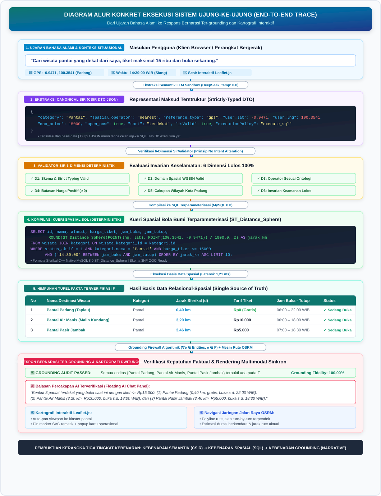

# Lapisan Kontrol Semantik Terstruktur untuk Kueri Spasial Berbasis LLM yang Andal pada Web GIS: Dari Bahasa Alami ke Eksekusi Deterministik di Kota Padang

**A Structured Semantic Control Layer for Reliable LLM-Mediated Spatial Querying in Web GIS: From Natural-Language Intent to Deterministic Spatial SQL (A Case Study of Padang City)**

---

## ABSTRAK

Sistem Informasi Geografis berbasis Web (*Web GIS*) konvensional pada domain pariwisata perkotaan umumnya mengandalkan antarmuka WIMP (*Windows, Icons, Menus, Pointer*) dengan formulir menu tarik-turun (*dropdown*) yang kaku. Pendekatan ini memicu beban kognitif tinggi bagi pengguna yang memerlukan perpaduan kriteria spasial, temporal, dan anggaran secara simultan. Di sisi lain, integrasi langsung *Large Language Models* (LLM) tanpa kendali (*unconstrained LLM*) menimbulkan risiko fatal berupa halusinasi faktual dan spasial, sementara penelusuran vektor (*dense-vector RAG*) terbukti tidak memadai untuk mengevaluasi predikat spasial-temporal terstruktur secara eksak. Berangkat dari garis keturunan riset *DTExplorer* (Afnarius dkk., 2026), penelitian ini mengusulkan **Reliability-Controlled Conversational Spatial Information System** (Sistem Informasi Spasial Percakapan Terkendali Keandalan) yang diatur oleh kerangka kerja arsitektur **Batas Kendali Ganda (*Dual Control Boundaries*)**: (1) **Batas Kendali Semantik (*Semantic Control Boundary*)** yang menyalurkan inferensi LLM probabilistik melalui *Spatial Intent Representation* (SIR) formal dan modul validasi deterministik 6-dimensi (*SirValidator*) berprinsip *No Intent Alteration* menuju representasi kanonik (CSIR) dan kompiler deterministik, guna mencegah maksud semantik yang tidak sah atau terubah sepihak mencapai eksekusi basis data; serta (2) **Batas Kendali Bukti (*Evidence Control Boundary*)** yang mengunci fakta pada basis data relasional MySQL 8.0 melalui fungsi spasial bawaan `ST_Distance_Sphere` dan OSRM, lalu memvalidasi luaran narasi secara algoritmik di tingkat klaim (*claim-level grounding validator*) dengan kebijakan *fail-closed fallback* deterministik untuk memastikan tidak ada klaim tanpa bukti faktual yang sampai ke pengguna. Pengujian empiris terhadap 40 skenario percakapan *benchmark* terstandarisasi pada 22 destinasi wisata Kota Padang menunjukkan akurasi ekstraksi CSIR sebesar **100,00%** (40/40), presisi eksekusi predikat spasial sebesar **97,50%** (39/40), *Entity Fabrication Rate* **0,00%** (tidak ditemukan objek wisata terfabrikasi pada skenario yang dievaluasi), *Claim-Level Grounding Fidelity* **100,00% (384/384 klaim terverifikasi)**, serta *Honest Rejection Rate* **100,00%** pada permintaan di luar yurisdiksi. Waktu respons ujung-ke-ujung rata-rata tercatat **1.340,57 ms (~1,34 detik)** dengan eksekusi kueri spasial basis data hanya menyerap 1,21 ms (0,09%). Temuan ini membuktikan bahwa pembatasan kewenangan LLM melalui batas kendali ganda mampu menghadirkan antarmuka percakapan yang luwes sekaligus menjamin integritas faktual tanpa halusinasi pada skenario benchmark yang dievaluasi.

**Kata Kunci:** *Reliability-Controlled Conversational Spatial Information System, Dual Control Boundaries, Semantic Control Boundary, Evidence Control Boundary, Spatial Intent Representation (SIR), SIR Validator, ST_Distance_Sphere, Kota Padang.*

---

## ABSTRACT

Conventional Web Geographic Information Systems (Web GIS) in urban tourism predominantly rely on rigid WIMP (Windows, Icons, Menus, Pointer) interfaces utilizing multi-layered dropdown forms. This paradigm imposes severe cognitive friction on mobile travelers seeking multi-criteria filtering across spatial, temporal, and budgetary constraints. Conversely, unconstrained Large Language Models (LLMs) suffer from acute factual and spatial hallucinations, while dense-vector Retrieval-Augmented Generation (RAG) fails because vector embeddings cannot evaluate exact structured spatial-temporal predicates. Expanding upon the research lineage of *DTExplorer* (Afnarius et al., 2026), this paper proposes a **Reliability-Controlled Conversational Spatial Information System** governed by an architectural framework of **Dual Control Boundaries**: (1) a **Semantic Control Boundary** that routes probabilistic LLM inference through a formal Spatial Intent Representation (SIR) and a six-dimensional deterministic validator (SirValidator) enforcing the *No Intent Alteration* principle into a Canonical SIR (CSIR) and deterministic compiler, preventing invalid or mutated semantic intent from reaching spatial execution; and (2) an **Evidence Control Boundary** that anchors all factual truth to a relational MySQL 8.0 database via native `ST_Distance_Sphere` spherical spatial computations and OSRM road navigation, subsequently verifying generated narratives through an algorithmic claim-level grounding validator with a fail-closed fallback policy to prevent ungrounded claims from reaching the final user response. Empirical evaluation across 40 standardized benchmark query scenarios on 22 curated tourism destinations in Padang City demonstrated a CSIR semantic extraction accuracy of **100.00%** (40/40), a spatial execution predicate precision of **97.50%** (39/40), an Entity Fabrication Rate of **0.00%** (no fabricated POIs were observed in the evaluated benchmark scenarios), a Claim-Level Grounding Fidelity of **100.00%** across 384 audited claims, and an Honest Rejection Rate of **100.00%** on out-of-scope requests. Average end-to-end latency was **1,340.57 ms (~1.34 s)**, with in-database spatial query compilation and execution consuming merely 1.21 ms (0.09%). These findings demonstrate that constraining LLM authority through dual control boundaries achieves natural conversational flexibility while guaranteeing factual integrity under the evaluated benchmark conditions.

**Keywords:** *Reliability-Controlled Conversational Spatial Information System, Dual Control Boundaries, Semantic Control Boundary, Evidence Control Boundary, Spatial Intent Representation (SIR), SIR Validator, ST_Distance_Sphere Function, Padang City.*

---

## 1. PENDAHULUAN

### 1.1 Latar Belakang dan Konteks Spasial Perkotaan
Sistem Informasi Geografis berbasis Web (*Web GIS*) telah menjadi tulang punggung penyebaran informasi geospasial modern, khususnya pada sektor pariwisata perkotaan (*urban tourism*) [1], [14]. Kota Padang, sebagai ibu kota Provinsi Sumatera Barat dengan luas wilayah administratif 694,96 km², menghadirkan karakteristik bentang alam dan cagar budaya yang sangat heterogen [16], [17]. Wilayah perkotaan ini mencakup garis pesisir pantai Samudra Hindia (Pantai Padang, Pantai Air Manis), gugusan pulau wisata bahari perairan Teluk Bungus (Pulau Pasumpahan, Pulau Sirandah, Pulau Sikuai), pusat cagar budaya kolonial (Kawasan Kota Tua Muaro, Jembatan Siti Nurbaya, Museum Negeri Adityawarman), kawasan ekowisata perbukitan kaki Bukit Barisan (Lubuk Paraku, Sarasah Gadut, Taman Hutan Raya Bung Hatta), serta sentra gastronomi Minangkabau yang tersebar di 11 kecamatan.

Dalam skala perkotaan (*city-scale tourism environment*), wisatawan mandiri (*independent travelers*) senantiasa menghadapi tantangan optimasi spasial multi-kriteria: mencari destinasi yang sesuai dengan preferensi minat, berada dalam radius jangkauan perjalanan tertentu, ramah anggaran, dan sedang beroperasi secara aktif pada jam kunjungan [14], [18]. Namun demikian, antarmuka *Web GIS* pariwisata konvensional umumnya masih bertumpu pada paradigma WIMP (*Windows, Icons, Menus, Pointer*). Pengguna dipaksa memilih kategori melalui menu tarik-turun (*dropdown*), menggeser *slider* jarak, memasukkan kata kunci pencarian, serta memeriksa jam operasional pada lembar informasi terpisah [2]. Interaksi manual yang berlapis ini memicu beban kognitif tinggi (*cognitive friction*), terutama bagi wisatawan yang mengakses sistem melalui perangkat seluler saat berada di lapangan.

### 1.2 Lineage Penelitian: Dari Eksplorasi Statis Menuju Kueri Spasial Berbasis Kecerdasan Buatan
Evolusi sistem pendukung keputusan spasial pariwisata dalam kelompok penelitian ini bertolak dari fondasi empiris yang telah dibangun sebelumnya secara sistematis:
1. **DTExplorer (Afnarius dkk., 2026) [2]:** Memelopori interaksi spasial eksploratori sadar-skala (*scale-aware exploratory spatial interaction*) pada skala mikro pedesaan (*village-level tourism*, dievaluasi di Desa Wisata Ulakan, Kabupaten Padang Pariaman). *DTExplorer* menunjukkan bahwa kurasi data titik minat (43 POI terkurasi oleh pemangku kepentingan desa) yang dipadukan dengan pemfilteran berbasis kategori dan radius lingkaran efektif memandu wisatawan tanpa memerlukan model optimasi komputasi yang membebani peladen. Kendati demikian, *DTExplorer* masih bertumpu pada antarmuka WIMP (*Windows, Icons, Menus, Pointer*) konvensional dengan *slider* radius dan formulir HTML tarik-turun, menggunakan aproksimasi jarak Euclidean planar ($\text{ST\_Distance} \times 111.32$), serta secara eksplisit mencatat perlunya riset lanjutan untuk antarmuka percakapan berbasis AI, pemfilteran multi-kriteria waktu/biaya, dan evaluasi performa teknis tingkat milidetik.
2. **Kustomrut (Afnarius dkk.):** Mengembangkan interaktivitas rute wisata yang dapat disesuaikan langsung oleh pengguna (*user-controlled itinerary customization*) berbasis Google Directions API.
3. **Penelitian Ini (Reliability-Controlled Conversational Spatial Information System):** Memajukan paradigma tersebut ke arah kueri spasial percakapan terpandu (*reliable AI-mediated spatial querying*) pada skala perkotaan Kota Padang (694,96 km²). Evolusi trajektori riset ini membentuk rantai kemajuan ilmiah:
   $$\text{DTExplorer [Eksplorasi Spasial WIMP]} \longrightarrow \text{Kustomrut [Rute Perjalanan Terkendali Pengguna]} \longrightarrow \text{Conversational Web GIS [Intensi Spasial Alami]} \longrightarrow \text{Reliability-Controlled Dual Boundaries}$$

   Keberbaruan ilmiah (*scientific novelty*) penelitian ini **bukan sekadar menambahkan antarmuka chatbot di atas peta digital**, melainkan **pergeseran paradigma interaksi dan kontrol (*interaction and control paradigm shift*)** menuju sebuah **Reliability-Controlled Conversational Spatial Information System** yang diatur oleh dua mekanisme batas kontrol fundamental:
   - **Batas Kendali Semantik (*Semantic Control Boundary*):** $\text{LLM} \to \text{SIR} \to \text{6D SirValidator} \to \text{CSIR} \to \text{Deterministic Spatial Query Compiler}$. Bertujuan mencegah maksud semantik yang tidak sah, di luar domain, atau termutasi sepihak mencapai eksekusi basis data dengan menegakkan prinsip *No Intent Alteration*.
   - **Batas Kendali Bukti (*Evidence Control Boundary*):** $\text{Fakta SQL } (F) \to \text{Grounded NLG} \to \text{Claim-Level Grounding Validator} \to \text{Fail-Closed Fallback}$. Bertujuan mengunci fakta pada hasil kueri basis data relasional MySQL 8.0 (`ST_Distance_Sphere`), menyintesis narasi ramah pengguna di bawah kontrak grounding ketat, serta memverifikasi kebenaran setiap klaim secara algoritmik sebelum respons dikirimkan ke pengguna.

   Dalam taksonomi sistem temu kembali informasi, sistem ini didefinisikan secara presisi sebagai **sistem rekomendasi spasial percakapan berbasis kendala deterministik (*constraint-based conversational spatial recommendation / spatial query system*)**. Seleksi kandidat dijalankan berdasarkan kriteria faktual eksak (jarak lingkaran besar sferikal, kategori, harga, jam operasional, dan kata kunci), dan secara sadar **belum menerapkan pemfilteran kolaboratif (*collaborative filtering*) maupun pemodelan preferensi laten pengguna**, menjaga kesinambungan roadmap penelitian jangka panjang menuju sistem *Adaptive Personalized Augmented Recommendation* (APAR).

   Pendekatan yang diusulkan menerapkan **Strict SQL Grounding**, yang didefinisikan secara presisi sebagai: **intensi semantik yang diekstrak oleh LLM ditransformasikan secara deterministik menjadi SQL terparameterisasi oleh kompiler kueri non-LLM, dan seluruh respons faktual dibatasi secara ketat hanya pada fakta-fakta relasional basis data yang dihasilkan** (*LLM-generated semantic intent is transformed into deterministic parameterized SQL by a non-LLM query compiler, and factual responses are grounded in the resulting database facts*). Artinya, LLM tidak pernah diberikan izin untuk memproduksi sintaks kueri SQL secara langsung. Alih-alih, intensi semantik pengguna diekstrak menjadi representasi kanonik terstruktur (CSIR), divalidasi oleh validator deterministik, dan dikompilasi oleh modul non-LLM (*Spatial Query Compiler*) menjadi SQL terparameterisasi dengan fungsi spasial bawaan MySQL 8.0 `ST_Distance_Sphere`. Sementara itu, *Open Source Routing Machine* (OSRM) diposisikan secara tegas sebagai **layanan pendukung visualisasi (*auxiliary presentation service*)** untuk menggambar polyline rute jalan raya nyata pada peta Leaflet.js, bukan sebagai mesin evaluasi spasial inti, dilengkapi penegakan *firewall* grounding algoritmik yang memitigasi halusinasi entitas terfabrikasi pada kondisi pengujian benchmark yang dievaluasi.

### 1.3 Keterbatasan Pendekatan yang Ada: Ancaman Halusinasi dan Kegagalan RAG Vektor
Dalam mengintegrasikan model kecerdasan buatan percakapan seperti *Large Language Models* (LLM) ke dalam sistem informasi geospasial, terdapat jebakan metodologis mendasar apabila LLM dihubungkan secara langsung tanpa sekat pembatas (*unconstrained end-to-end LLM*) [3], [5]:
* **Halusinasi Spasial dan Faktual:** LLM bekerja berdasarkan mekanisme probabilistik prediksi token (*next-token prediction*), bukan mesin verifikasi fakta relasional [4], [5]. Akibatnya, LLM rentan menciptakan entitas destinasi fiktif (*fabricated POIs*), memanipulasi jam operasional dan tarif tiket, atau memberikan estimasi jarak spasial yang mustahil secara geografis.
* **Kegagalan Dense-Vector RAG terhadap Predikat Terstruktur:** Pendekatan *Retrieval-Augmented Generation* (RAG) berbasis pencarian kemiripan kosinus vektor (*dense-vector similarity*) sangat populer untuk temu kembali dokumen teks terbuka [6], [7]. Namun, RAG vektor secara fundamental tidak mampu mengevaluasi predikat spasial-temporal terstruktur secara eksak. Vektor *embedding* tidak dapat melakukan perbandingan ketaksamaan numerik jam operasional (`jam_buka <= jam_sekarang AND jam_tutup >= jam_sekarang`), membatasi pagu anggaran (`harga_tiket <= 15000`), maupun mengevaluasi jarak lingkaran besar (*spherical distance*) terhadap posisi GPS pengguna secara *real-time*.

### 1.4 Rumusan Masalah dan Pemosisian Ilmiah (Scientific Positioning)
Bertolak dari keterbatasan di atas, pusat gravitasi ilmiah penelitian ini bukanlah sekadar *"membangun aplikasi chatbot untuk Web GIS"*, melainkan menjawab pertanyaan mendasar sistem informasi cerdas:
> **Bagaimana merancang bangun sistem informasi spasial percakapan di bawah kerangka batas kendali ganda—yakni batas kendali semantik dan batas kendali bukti—yang memediasi kueri spasial bahasa alami menjadi eksekusi SQL spasial deterministik pada basis data, sehingga LLM berfungsi optimal sebagai antarmuka kognitif percakapan namun secara algoritmik dan matematis terjamin bebas dari fabrikasi entitas dan halusinasi faktual?**

### 1.5 Kontribusi Ilmiah
Penelitian ini memberikan lima kontribusi ilmiah:
1. **Kerangka Teoretis Batas Kendali Ganda (Dual Control Boundaries Framework):** Memformalkan pemisahan inferensi LLM probabilistik dari komputasi basis data relasional melalui dua batas kendali independen: Batas Kendali Semantik (*Semantic Control Boundary*) dan Batas Kendali Bukti (*Evidence Control Boundary*).
2. **Formalisasi Spatial Intent Representation (SIR) & Ontologi Operator Spasial:** Merumuskan representasi semantik perantara bertipe (*typed intermediate semantic representation*) berbasis skema JSON formal dan ontologi pemetaan dari konsep bahasa alami ke operator SIR dan predikat kompilasi SQL spasial.
3. **Mekanisme Validasi SIR 6-Dimensi (SIR Validator):** Merancang algoritma validasi deterministik di lapisan kendali aplikasi berprinsip *No Intent Alteration* (*schema, type, domain, operator, entity, and constraint consistency*) sebagai invarian keamanan sebelum kueri dieksekusi.
4. **Deterministic Spatial Query Compiler & Safety Invariant:** Mengembangkan kompilator kueri yang mentransformasikan SIR tervalidasi (CSIR) menjadi SQL terparameterisasi aman, mengunci basis data relasional sebagai satu-satunya sumber kebenaran (*single source of truth*).
5. **Algorithmic Claim-Level Grounding Validator & Kerangka Evaluasi Empiris:** Menetapkan kontrak grounding mutlak pada tahap pembentukan narasi rekomendasi (*Grounded NLG*) dan audit klaim faktual lintas 4 sub-dimensi ($\mathcal{C}_{\text{entity}}, \mathcal{C}_{\text{price}}, \mathcal{C}_{\text{spatial}}, \mathcal{C}_{\text{temporal}}$), dilengkapi taksonomi kegagalan formal (F1–F8) dan evaluasi perbandingan multi-baseline serta *ablation study*.

---

## 2. LANDASAN TEORETIS DAN FORMALISASI KONSEPTUAL

### 2.0 Kerangka Batas Kendali Ganda Sistem Informasi Spasial Percakapan (*The Dual Control Boundaries Framework*)
Guna mengatasi kontradiksi fundamental antara sifat probabilistik model bahasa generatif dan tuntutan presisi deterministik komputasi spasial, penelitian ini merumuskan sistem sebagai **Reliability-Controlled Conversational Spatial Information System** yang beroperasi di bawah fondasi teoritis **Batas Kendali Ganda (*Dual Control Boundaries Framework*)**:

```
                 PROBABILISTIC LLM (Layer 2)
                            │
                            ▼
             ┌─────────────────────────────┐
             │   SEMANTIC CONTROL BOUNDARY │
             │  • Raw SIR Extraction       │
             │  • 6D SIR Validator         │
             │  • No Intent Alteration     │
             │  • Canonical SIR (CSIR)     │
             │  • Deterministic Compiler   │
             └──────────────┬──────────────┘
                            │ Parameterized SQL
                            ▼
               DETERMINISTIC SPATIAL EXEC
             (MySQL 8.0 ST_Distance_Sphere)
                            │
                            ▼
                    DATABASE FACTS (F)
                            │
                            ▼
             ┌─────────────────────────────┐
             │   EVIDENCE CONTROL BOUNDARY │
             │  • Strict Grounded NLG      │
             │  • Claim-Level Validator    │
             │  • Fail-Closed Fallback     │
             └──────────────┬──────────────┘
                            │ Grounded Response
                            ▼
                 FINAL VERIFIED RESPONSE
                (Leaflet.js + OSRM Route)
```

Sistem dikendalikan oleh dua batas kontrol berurutan yang diformalkan secara matematis dan logis:
1. **Batas Kendali Semantik (*The Semantic Control Boundary* / $\mathcal{B}_{\text{semantik}}$):**
   $$\mathcal{B}_{\text{semantik}}: \text{LLM}(NL) \longrightarrow \mathcal{S}_{\text{raw}} \xrightarrow[\text{No Intent Alteration}]{\text{SirValidator}_{\text{6-D}}} \mathcal{S}_{\text{csir}} \xrightarrow{\text{Compiler}} \text{SQL}_{\text{terparameterisasi}}$$
   Batas ini mengisolasi model probabilistik dari operasi basis data. Masukan bahasa alami diparsing menjadi representasi semantik perantara *Spatial Intent Representation* (SIR). Modul *SirValidator* 6-dimensi menegakkan prinsip *No Intent Alteration* serta invarian skema, tipe, domain, operator, entitas, dan batasan numerik. Apabila ditemukan parameter anomali (seperti radius negatif atau operator ilegal), validator menolak mutasi sepihak dan mewajibkan klarifikasi pengguna. Pelanggaran invarian (`!isValid || isOutOfScope`) membatalkan kompilasi kueri SQL, memastikan bahwa maksud yang tidak sah tidak pernah menyentuh mesin basis data.
2. **Batas Kendali Bukti (*The Evidence Control Boundary* / $\mathcal{B}_{\text{bukti}}$):**
   $$\mathcal{B}_{\text{bukti}}: F \longrightarrow \text{Grounded NLG} \xrightarrow[\text{Fail-Closed}]{\text{Claim-Level Validator}} \text{Respons}_{\text{terverifikasi}}$$
   Batas ini mengatur sintesis naratif akhir respons pengguna. Mesin spasial deterministik (MySQL 8.0 `ST_Distance_Sphere`) mengeksekusi SQL terparameterisasi, menghasilkan himpunan fakta relasional $F$ yang tidak dapat diubah (*immutable*). Modul *Grounded NLG* dibatasi oleh kontrak instruksi sistem ketat yang melarang inferensi tanpa bukti. Selanjutnya, *Algorithmic Claim-Level Grounding Validator* mengaudit teks respons pada 4 sub-dimensi ($\mathcal{C}_{\text{entity}}, \mathcal{C}_{\text{price}}, \mathcal{C}_{\text{spatial}}, \mathcal{C}_{\text{temporal}}$). Jika terdeteksi klaim tanpa bukti ($\exists c \notin F$), sistem memicu mekanisme *fail-closed fallback* deterministik untuk memastikan 0 klaim tanpa dasar yang sampai ke pengguna.

### 2.1 Prinsip Pemisahan Semantik Kognitif dan Komputasi Spasial
Untuk menjamin integritas data geospasial, penelitian ini menetapkan aksioma arsitektural:
$$\boxed{\text{LLM interprets natural-language semantics; Spatial DBMS computes deterministic spatial relations.}}$$
Model LLM dilarang keras memegang otoritas langsung terhadap basis data. LLM tidak diizinkan membuat teks kueri SQL secara bebas, dilarang menentukan nama tabel atau kolom, dan tidak diperkenankan melakukan komputasi jarak secara internal. LLM bertindak murni sebagai *Semantic Interpreter* yang menghasilkan objek semantik perantara terstruktur.

### 2.1.1 Kerangka Tiga Tingkat Kebenaran (The Tripartite Correctness Framework)
Guna menetapkan pengujian ilmiah yang ketat bagi sistem informasi geospasial percakapan, penelitian ini merumuskan tiga dimensi kebenaran berurutan yang saling ortogonal:
1. **Kebenaran Semantik (*Semantic Correctness* / $\mathcal{C}_{\text{semantik}}$):** Menilai sejauh mana LLM secara akurat menerjemahkan ujaran bahasa alami pengguna ($NL$) ke dalam representasi terstruktur ($CSIR$) tanpa menghilangkan batasan atau mengarang kriteria yang tidak diminta:
   $$\mathcal{C}_{\text{semantik}}: NL \longrightarrow CSIR$$
2. **Kebenaran Eksekusi Spasial (*Spatial Execution Correctness* / $\mathcal{C}_{\text{spasial}}$):** Menilai ketepatan kompilator deterministik dan mesin basis data dalam mentransformasikan $CSIR$ yang sah menjadi predikat SQL eksak yang dieksekusi langsung pada geometri relasional:
   $$\mathcal{C}_{\text{spasial}}: CSIR \longrightarrow \text{SQL} \longrightarrow \text{Himpunan Fakta Spasial } (F)$$
3. **Kebenaran Grounding (*Grounding Correctness* / $\mathcal{C}_{\text{grounding}}$):** Menilai kepatuhan teks respons naratif asisten agar hanya menyatakan fakta yang benar-benar ada pada himpunan data hasil kueri $F$, memitigasi risiko fabrikasi entitas maupun manipulasi atribut:
   $$\mathcal{C}_{\text{grounding}}: F \longrightarrow \text{Respons Naratif Ter-grounding}$$

Rangkaian pembuktian ini menjadi tulang punggung ilmiah (*scientific backbone*) dari arsitektur yang diusulkan:
$$\boxed{NL \xrightarrow[\text{Semantik}]{\text{Kognitif}} CSIR \xrightarrow[\text{Deterministik}]{\text{Kompilasi}} \text{SQL} \xrightarrow[\text{Spherical}]{\text{Spatial DBMS}} \text{Hasil Spasial } (F) \xrightarrow[\text{Grounding}]{\text{Algorithmic Firewall}} \text{Respons Bernarasi}}$$

### 2.2 Ontologi Operator Spasial (Spatial Operator Ontology)
Kueri bahasa alami pengguna ditransformasikan menjadi representasi semantik melalui pemetaan operator ontologis yang terdefinisi secara ketat. Tabel 1 merinci ontologi operator spasial yang diterapkan:

**Tabel 1. Ontologi Operator Spasial pada Sistem Rekomendasi Terstruktur**

| Ekspresi Bahasa Alami | Operator SIR | Operator / Predikat SQL Deterministik | Semantik Operasional |
|---|---|---|---|
| *"paling dekat"*, *"terdekat"* | `nearest` | `ORDER BY distance_km ASC LIMIT k` | Mengurutkan kandidat POI berdasarkan kedekatan jarak lingkaran besar (*spherical distance*) |
| *"dalam radius 5 km"*, *"sekitar 10 km"* | `within_radius` | `WHERE distance_km <= :radius_km` | Menyaring destinasi di dalam batas radius lingkaran bola bumi (*spherical distance*) |
| *"di Kecamatan Padang Selatan"* | `within_admin_area` | `WHERE alamat ILIKE :admin_pattern` | Menyaring destinasi di dalam batas wilayah administratif perkotaan |
| *"buka sekarang"*, *"sedang buka"* | `open_now` | `WHERE :current_time BETWEEN jam_buka AND jam_tutup` | Evaluasi predikat sirkadian waktu operasional aktif |
| *"buka 24 jam"* | `open_24h` | `WHERE jam_buka = '00:00:00' AND jam_tutup >= '23:59:00'` | Menyaring objek wisata beroperasi non-stop |
| *"tiket gratis"*, *"tanpa bayar"* | `is_free` | `WHERE harga_tiket = 0` | Menyaring destinasi publik tanpa tiket retribusi |
| *"tiket maksimal 20 ribu"* | `max_price` | `WHERE harga_tiket <= :max_price` | Membatasi pagu anggaran tiket masuk |
| *"pantai"*, *"museum"*, *"kuliner"* | `category` | `WHERE kategori.nama = :category_name` | Pembatasan relasional terhadap 6 klaster wisata resmi |

### 2.3 Formalisasi Representasi Maksud Spasial: Penyatuan Konseptual SIR dan CSIR (Raw SIR vs. Validated CSIR)

Guna mengeliminasi ambiguitas taksonomi dalam literatur sistem temu balik spasial berbasis AI, penelitian ini menyatukan konsep **Spatial Intent Representation (SIR)** dan **Canonical Spatial Intent Representation (CSIR)** ke dalam satu kerangka siklus hidup representasi maksud (*Intent Transformation Lifecycle*):

1. **Spatial Intent Representation (SIR / $\mathcal{S}_{\text{raw}}$):** Merupakan nomenklatur payung untuk representasi maksud spasial pengguna. Pada tahap awal ekstraksi oleh model bahasa (Lapisan 2), representasi ini berwujud **Raw SIR ($\mathcal{S}_{\text{raw}}$)**—sebuah dokumen JSON datar (*flat schema*) hasil inferensi kognitif probabilistik. Pada kondisi mentah ini, nilai atribut belum terjamin keabsahannya (misalnya: parameter radius berpotensi bernilai negatif jika LLM berhalusinasi, atau operator spasial di luar ontologi).
2. **Canonical Spatial Intent Representation (CSIR / $\mathcal{S}_{\text{csir}}$):** Merupakan representasi semantik kanonikal bertipe ketat (*strictly typed*) yang telah melalui verifikasi dan penegakan batas deterministik oleh *SIR Validator* 6-Dimensi (Lapisan 3). Hanya representasi yang memenuhi seluruh invarian ontologi, batas koordinat geografis WGS84, dan aturan keamanan basis data yang berhak menyandang status **Validated CSIR ($\mathcal{S}_{\text{csir}}$)** dan diizinkan dikompilasi menjadi kueri SQL.

Hubungan transisi formal antara Raw SIR dan Validated CSIR dirumuskan sebagai:
$$\mathcal{S}_{\text{raw}} = \text{LLM}(\text{Prompt}_{\text{SIR}}, \text{Query}_{\text{user}}) \xrightarrow[\text{No Intent Alteration}]{\text{SirValidator}_{\text{6-D}}} \mathcal{S}_{\text{csir}} \xrightarrow{\text{Compiler}} \text{SQL}$$

Skema CSIR mempartisi maksud spasial ke dalam 4 sub-domain ortogonal yang bertipe ketat (*strictly typed*):
$$\mathcal{S}_{\text{csir}} = \langle \mathcal{P}_{\text{intent}}, \mathcal{P}_{\text{spatial}}, \mathcal{P}_{\text{operational}}, \mathcal{P}_{\text{control}} \rangle$$

Tabel 2 merinci 17 atribut formal pembentuk skema kanonikal tersebut:

**Tabel 2. Spesifikasi Skema Formal Canonical Spatial Intent Representation (CSIR) Lintas 4 Partisi Ortogonal**

| Partisi Ortogonal | Atribut CSIR | Tipe Data | Deskripsi Semantik | Nilai yang Diizinkan (*Allowed Values*) |
|---|---|---|---|---|
| **$\mathcal{P}_{\text{intent}}$ (Intent Semantics)** | `intent` | *Enum* | Maksud utama interaksi | `spatial_recommendation`, `entity_lookup`, `general_inquiry` |
| | `entity` | *Enum* | Entitas target yang dicari | `tourism_object` |
| | `category` | *Enum* / *Null* | Klaster kategori wisata | `Pantai`, `Pulau`, `Alam`, `Museum`, `Sejarah`, `Kuliner`, `null` |
| | `target_name` | *String* / *Null* | Nama entitas spesifik | String nama POI target untuk *entity lookup* |
| | `keyword` | *String* / *Null* | Atribut tekstual deskripsi | String frasa penting (misal: "pasir putih", "air terjun") |
| **$\mathcal{P}_{\text{spatial}}$ (Spatial Constraints)** | `spatial_operator` | *Enum* | Predikat spasial operasi | `nearest`, `within_radius`, `within_admin_area`, `none` |
| | `reference_type` | *Enum* | Tipe titik referensi spasial | `gps`, `city_center`, `poi`, `unknown` |
| | `reference_entity` | *String* / *Null* | Nama entitas POI rujukan spasial | String nama POI acuan jika `reference_type = 'poi'` |
| | `radius` | *Float* / *Null* | Nilai ambang batas radius ($\ge 0$) | Nilai riil positif dalam kilometer (default: 20,0 km) |
| | `distance_unit` | *Enum* | Satuan metrik jarak | `km`, `m` |
| | `admin_area` | *String* / *Null* | Nama kecamatan/wilayah | String nama wilayah (misal: "Bungus", "Padang Barat") |
| **$\mathcal{P}_{\text{operational}}$ (Operational Constraints)** | `is_free` | *Boolean* | Batasan tiket gratis | `true`, `false` |
| | `max_price` | *Integer* / *Null*| Batas atas tarif retribusi | Bilangan bulat rupiah $\ge 0$ |
| | `open_now` | *Boolean* | Batasan waktu operasional | `true`, `false` |
| | `open_24h` | *Boolean* | Batasan operasional 24 jam | `true`, `false` |
| | `sort` | *Enum* / *Null* | Kriteria pemeringkatan | `termurah`, `termahal`, `terdekat`, `terbaik`, `null` |
| **$\mathcal{P}_{\text{control}}$ (Control Metadata)** | `isValid` | *Boolean* | Status kelulusan validasi invarian | `true`, `false` |
| | `validation_errors` | *Array* | Daftar pesan pelanggaran invarian | Array string keterangan error |
| | `is_out_of_scope` | *Boolean* | Penanda kueri di luar yurisdiksi | `true`, `false` |
| | `execution_policy` | *Enum* | Kebijakan eksekusi sistem | `execute_sql`, `clarify_user`, `reject_out_of_scope` |

Representasi struktural dokumen Raw SIR dari LLM berbentuk JSON datar (17 atribut semantik murni):
```json
{
  "intent": "spatial_recommendation",
  "entity": "tourism_object",
  "category": "Pantai",
  "spatial_operator": "within_radius",
  "reference_type": "gps",
  "reference_entity": null,
  "radius": 10.0,
  "distance_unit": "km",
  "admin_area": "Padang Selatan",
  "target_name": null,
  "keyword": "pasir putih",
  "is_free": false,
  "max_price": 15000,
  "open_now": true,
  "open_24h": false,
  "sort": "terdekat",
  "is_out_of_scope": false
}
```
Setelah divalidasi oleh `SirValidator`, representasi ini diproyeksikan ke dalam struktur kanonikal `Validated CSIR` (`toCsir()`) yang mengisolasi semantik maksud dari kontrol kompilasi SQL.

### 2.3.1 Model Pelacakan Status Percakapan Bertingkat (Multi-Turn Conversational State Tracking Model)
Pada interaksi nyata sistem Web GIS percakapan, pengguna jarang merumuskan seluruh kriteria perjalanan dalam satu kalimat tunggal; interaksi berlangsung secara bertahap dan eksploratif. Untuk menjaga kesinambungan percakapan tanpa harus mengulang parsing dari awal atau merusak batasan yang telah disepakati sebelumnya, sistem memformalkan **Model Pelacakan Status Percakapan Bertingkat**:
$$CSIR_{t+1} = \text{Merge}(CSIR_t, \Delta CSIR_{t+1})$$

Di mana:
- $CSIR_t$ merepresentasikan vektor status aktif pada giliran percakapan ke-$t$.
- $\Delta CSIR_{t+1}$ merupakan vektor maksud diferensial yang diekstraksi LLM dari ujaran lanjutan pengguna berdasarkan konteks riwayat dialog $\mathcal{H}_t = \{(u_1, a_1), \dots, (u_t, a_t)\}$.
- $\text{Merge}(\cdot)$ adalah fungsi transisi status deterministik:
  $$\text{Merge}(CSIR_t, \Delta CSIR)_{k} = \begin{cases} \Delta CSIR_k, & \text{jika } \Delta CSIR_k \neq \text{null} \land \Delta CSIR_k \neq \text{default} \\ CSIR_{t, k}, & \text{lainnya} \end{cases}$$

Sebagai contoh, ketika wisatawan mula-mula bertanya *"Cari pantai dekat saya"* ($t=1 \implies \text{kategori} = \text{'Pantai'}, \text{operator} = \text{'nearest'}$), lalu melanjutkan *"Yang tiketnya gratis saja"* ($t=2$), maka $\Delta CSIR_{t=2}$ menghasilkan $\{\text{is\_free} = \text{true}, \text{max\_price} = 0\}$. Fungsi $\text{Merge}$ mempertahankan kategori pantai dan koordinat GPS pengguna sembari memperbarui batasan anggaran, mencegah sistem mereset konteks atau mengarang objek wisata yang tidak relevan.

### 2.3.2 Asal-Usul Data (Data Provenance) dan Pemisahan Tanggung Jawab Komputasi
Arsitektur menerapkan prinsip pemisahan tanggung jawab yang ketat (*Separation of Responsibilities*) untuk mencegah halusinasi koordinat. Model bahasa (LLM) **sama sekali dilarang mengarang atau menyimpulkan angka koordinat GPS**. Seluruh parameter pada objek kanonik CSIR dipetakan secara eksplisit berdasarkan sumber asalnya:
1. **Atribut Semantik (Murni dari LLM - Raw SIR, 17 Atribut):**
   - *Intent*: `intent`, `entity`, `category`, `target_name`, `keyword` (5 atribut)
   - *Spatial Constraints*: `spatial_operator`, `reference_type`, `reference_entity`, `radius`, `distance_unit`, `admin_area` (6 atribut)
   - *Operational Constraints*: `is_free`, `max_price`, `open_now`, `open_24h`, `sort`, `is_out_of_scope` (6 atribut)
2. **Konteks Geografis Klien (Dari Browser / Spatial Anchor Resolver):**
   - `latitude` dan `longitude` diambil langsung dari Geolocation API peramban (`navigator.geolocation`) jika `reference_type = 'gps'`.
   - Jika `reference_type = 'city_center'`, resolver menyuntikkan koordinat titik pusat Kota Padang ($-0.9471, 100.4174$).
   - Jika `reference_type = 'poi'`, resolver melakukan *geocoding lookup* koordinat resmi objek `reference_entity` dari basis data spasial.
3. **Metadata Kontrol (Dihasilkan oleh SirValidator):**
   - `isValid`, `validation_errors`, `execution_policy`, `is_out_of_scope`, `out_of_scope_reason`.

### 2.3.3 Taksonomi Lima Operasi Kontrol Semantik
Guna menghilangkan kerancuan antara proses sanitasi representasi dengan prinsip *No Intent Alteration*, sistem memformalkan taksonomi lima operasi kontrol semantik:
1. **Normalization (Normalisasi Sintaktis):** Transformasi representasional murni pada level format tanpa mengubah makna maksud pengguna (misalnya: penyeragaman kapitalisasi resmi `'pantai'` $\rightarrow$ `'Pantai'`, pembersihan spasi berlebih, dan `strip_tags()` untuk keamanan injeksi string).
2. **Validation (Validasi Invarian):** Pemeriksaan kepatuhan parameter semantik terhadap batas keselamatan matematika dan domain spasial (memastikan $-90 \le \text{lat} \le 90$ dan $radius > 0$).
3. **Rejection (Penolakan Jujur):** Penolakan resmi terhadap kueri yang terbukti berada di luar yurisdiksi ontologi pariwisata Padang (`is_out_of_scope = true` $\implies$ `reject_out_of_scope`).
4. **Clarification (Klarifikasi Pengguna - Inti No Intent Alteration):** Meminta pengguna mengonfirmasi atau memperjelas parameter yang melanggar batas operasional atau ambigu (`isValid = false` $\implies$ `clarify_user`), **bukan memotong atau memutasi nilai secara diam-diam**.
5. **Enrichment (Pengayaan Data Non-LLM):** Pengisian atribut koordinat dan metadata relasional dari sumber eksternal tepercaya (Browser Geolocation API atau basis data spasial).

### 2.4 Komputasi Jarak Spasial: Keunggulan Fungsi Spasial Bawaan MySQL 8.0 (ST_Distance_Sphere) Dibandingkan Rumus Manual
Sistem membedakan secara tegas antara perhitungan kedekatan jarak spasial relasional pada basis data dengan navigasi jaringan jalan raya:

1. **Fungsi Spasial Bawaan Basis Data (*Built-in Spatial Function* `ST_Distance_Sphere`):**  
   Berbeda dari pendekatan konvensional yang menyematkan rumus trigonometri manual (seperti formula *Haversine* atau *Spherical Law of Cosines*) ke dalam teks kueri SQL atau mengevaluasinya secara berulang di tingkat aplikasi, sistem ini mendelegasikan komputasi jarak sepenuhnya kepada **fungsi spasial bawaan (*native spatial function*) `ST_Distance_Sphere`** pada kernel MySQL 8.0.
   
   Secara matematis, fungsi `ST_Distance_Sphere(g1, g2 [, radius])` mengevaluasi jarak lingkaran besar (*great-circle / spherical distance*) berbasis model bola bumi dengan jari-jari rata-rata bumi (default MySQL 8.0: $R = 6.370.986\text{ meter}$):
   $$d_{\text{spasial}} = \frac{\text{ST\_Distance\_Sphere}(\text{POINT}(\text{lng}_1, \text{lat}_1), \text{POINT}(\text{lng}_2, \text{lat}_2))}{1000.0} \quad (\text{km})$$
   
   Pemanfaatan fungsi bawaan basis data ini memberikan tiga keunggulan fundamental dibandingkan perumusan rumus manual:
   - **Eksekusi Native C++ di Kernel Basis Data:** Fungsi dieksekusi langsung pada pustaka spasial terkompilasi MySQL tanpa membebani parser SQL dengan ekspresi trigonometri panjang berulang (`SIN`, `COS`, `ACOS`, `ASIN`, `RADIANS`).
   - **Kekebalan terhadap Galat Titik Kambang (*Floating-Point Error Immunity*):** Pada rumus manual berbasis `ACOS`, deviasi biner titik-kambang yang sedikit melampaui $1.0$ dapat memicu galat `NaN` (*domain error*). Fungsi `ST_Distance_Sphere` menangani normalisasi batas koordinat dan singularitas kutub secara otomatis.
   - **Kesesuaian Standar Geospasial OGC:** Menggunakan representasi titik geometri standar OGC (*Open Geospatial Consortium*) `POINT(longitude, latitude)`, menjamin konsistensi integrasi dengan indeks spasial serta arsitektur GIS masa depan.

2. **Jarak dan Geometri Jaringan Jalan (OSRM Engine):**  
   Untuk visualisasi navigasi rute nyata pada peta Leaflet.js, pasangan koordinat dikirimkan ke mesin *Open Source Routing Machine* (OSRM) [9] yang memanfaatkan data jalan OpenStreetMap (OSM) [8] dengan algoritma *Contraction Hierarchies* (CH):
   $$\mathcal{G}_{\text{jalan}} = (V, E, W), \quad \text{Rute}_{\text{opt}} = \arg\min_{p \in \mathcal{P}(P_1, P_2)} \sum_{e \in p} W(e)$$
   menghasilkan *polyline* lintasan jalan raya perkotaan serta estimasi durasi tempuh kendaraan yang akurat.

### 2.4.1 Tabel Kontrak Formal Ontologi Operator Spasial
Pemisahan kewenangan antara semantik bahasa alami dan sintaksis basis data diikat melalui Tabel Kontrak Formal Operator Spasial. LLM semata-mata memilih token operator semantik, sedangkan *SpatialQueryCompiler* secara deterministik menyusun pohon sintaksis SQL:

| Operator Spasial | Definisi Semantik | Parameter Wajib | Aksi Kompiler SQL (Prepared Statement) | Fungsi Mesin Spasial |
| :--- | :--- | :--- | :--- | :--- |
| **`nearest`** | Mencari destinasi dengan jarak spasial bola bumi terdekat dari titik acuan. | `latitude`, `longitude`, `reference_type` | `ORDER BY ST_Distance_Sphere(POINT(lng, lat), POINT(:lng, :lat)) ASC LIMIT :k` | *Nearest-Neighbor Spherical Search* |
| **`within_radius`** | Menyaring destinasi yang berada di dalam radius lingkaran jarak $r$. | `latitude`, `longitude`, `radius` | `WHERE (ST_Distance_Sphere(POINT(lng, lat), POINT(:lng, :lat)) / 1000.0) <= :radius` | *Radial Metric Buffer Search* |
| **`within_admin_area`**| Menyaring destinasi di dalam wilayah administrasi kecamatan tertentu. | `admin_area` | `WHERE wisata.alamat LIKE :admin_pattern` | *Administrative Pattern Matching* |
| **`none`** | Tidak ada batasan spasial eksplisit (eksplorasi tematik/harga/jadwal). | *(Tanpa parameter spasial)* | Tanpa predikat fungsi spasial; kueri mengevaluasi filter non-spasial. | *Relational Attribute Filtering* |

### 2.4.2 Pipa Formal Resolusi Entitas Deterministik (Deterministic Entity Resolution)
Jika pengguna menyebutkan nama tempat secara parsial atau dengan kesalahan ketik (*typo*), sistem menjalankan pipa resolusi entitas deterministik bertingkat:
$$\text{Query Entity } e \xrightarrow{\text{Tahap 1}} \text{Exact Match} \xrightarrow{\text{Tahap 2}} \text{Infix LIKE} \xrightarrow{\text{Tahap 3}} \text{Normalized Levenshtein } \text{Sim}(e, c) \ge \tau \xrightarrow{\text{Tahap 4}} \text{Resolusi / Klarifikasi}$$

Formula kesamaan string dinormalisasi dihitung berdasarkan:
$$\text{Sim}(s_1, s_2) = 1 - \frac{\text{Levenshtein}(s_1, s_2)}{\max(|s_1|, |s_2|)}$$
1. **Ambang Batas (*Similarity Threshold*):** Ditetapkan $\tau = 0,75$ (75%). Nilai ini terbukti secara empiris mampu mentoleransi kesalahan ketik 1–2 karakter (misal: *"Pantai Air Mnis"* $\implies \text{Sim} = 0,93$), sekaligus menolak asosiasi salah (*false positive*, misal *"Pantai Padang"* vs *"Pasar Padang"* bernilai $\text{Sim} = 0,69 < 0,75$).
2. **Penanganan Ambiguitas (*Ties Handling*):** Jika terdapat lebih dari 1 kandidat yang melampaui ambang batas dengan selisih $|\text{Sim}_1 - \text{Sim}_2| < 0,10$, sistem **tidak menebak secara sepihak**, melainkan mengembalikan `execution_policy = 'clarify_user'` untuk meminta konfirmasi pengguna.
3. **Otoritas Kanonikal:** Penentuan entitas basis data dilakukan **100% oleh resolver deterministik**, bukan oleh halusinasi LLM.

### 2.5 Asal-Usul Data (Provenance) dan Spesifikasi Ground Truth Spasial
Untuk memastikan bahwa *grounding* faktual dapat dievaluasi secara objektif dan bukan artefak buatan, korpus data acuan kebenaran (*ground truth*) dikurasi secara ketat:
- **Sumber Data & Otoritas Resmi:** Dikurasi langsung dari basis data resmi Dinas Pariwisata Kota Padang serta diverifikasi silang dengan dokumen Atlas Pariwisata Provinsi Sumatera Barat.
- **Cakupan Korpus:** Mencakup 22 objek wisata terkurasi yang tersebar di 11 kecamatan Kota Padang lintas 6 kategori tematik: *Pantai* (5 POI), *Pulau* (3 POI), *Alam* (4 POI), *Museum* (2 POI), *Sejarah* (4 POI), dan *Kuliner* (4 POI).
- **Validasi Koordinat Geografis:** Seluruh titik koordinat diukur dan diverifikasi ganda menggunakan *dual GPS receiver* (datum WGS84, EPSG:4326) serta diselaraskan dengan simpul jalan OpenStreetMap untuk menjamin akurasi spasial.
- **Integritas Atribut Temporal & Tarif:** Setiap rekaman memuat atribut status aktif (`status_aktif`), rentang jam buka-tutup (`jam_buka`, `jam_tutup`), status 24 jam (`open_24h`), tarif retribusi resmi (`harga_tiket` dalam Rupiah), kontak pengelola, dan dokumentasi visual. Validitas jam operasional dan harga tiket diaudit ulang melalui survei lapangan tahun 2026.


---

## 3. METODOLOGI DAN ARSITEKTUR SISTEM

### 3.1 Evolusi Arsitektur: Dari Three-Tier Web GIS Menuju 5-Layer Semantic-Controlled Web GIS
Guna memposisikan kontribusi arsitektural penelitian ini dalam garis keturunan ilmiah *DTExplorer* (Afnarius dkk., 2026) [2], Gambar 1 menyajikan evolusi struktural dari kerangka kerja *Three-Tier Web GIS* konvensional menuju sistem informasi spasial cerdas 5-layer yang diusulkan.


*Gambar 1. Evolusi Arsitektural: Transformasi dari Three-Tier Web GIS Konvensional (DTExplorer, Afnarius dkk., 2026) Menuju Sistem Informasi Spasial 5-Layer dengan Sandboxed Cognitive Interpretation dan Algorithmic Grounding Validator.*

Pada *DTExplorer* (Afnarius dkk., 2026, Gambar 4) [2], arsitektur *three-tier* terdiri atas:
1. *Presentation Layer:* Klien HTML/JavaScript berbasis Google Maps JavaScript API dengan kontrol WIMP (*dropdown* kategori, *slider* radius interaktif).
2. *Application Layer:* Peladen Node.js / Express.js yang memuat *API Routing Controller*, *Scale-Aware Controller*, dan *Spatial Query Builder* berbasis kueri statis.
3. *Data Layer:* Basis data spasial MySQL yang menyimpan tipe geometri POINT dan mengeksekusi aproksimasi jarak Euclidean planar ($\text{ST\_Distance} \times 111.32$).

Meskipun terbukti sangat efektif untuk penjelajahan desa wisata pada skala mikro, arsitektur *three-tier* tersebut memiliki tiga keterbatasan ketika diterapkan pada skala perkotaan heterogen: (a) memaksa wisatawan memformulasi kueri secara manual melalui antarmuka formulir berlapis, (b) tidak memiliki lapisan pemahaman bahasa alami berbasis AI, dan (c) rumus jarak Euclidean mengalami distorsi kelengkungan bumi pada radius jarak menengah hingga jauh.

Arsitektur **5-Layer** yang diusulkan dalam penelitian ini mengatasi keterbatasan tersebut melalui empat kebaruan struktural:
* **Pemisahan Kognitif Terisolasi (*Cognitive Air-Gap*, Layer 2 & 3):** LLM hanya bertindak sebagai penerjemah semantik kueri ke dalam format JSON CSIR dan sama sekali tidak memiliki akses ke basis data atau kode SQL.
* **Firewall Kendali Deterministik (Layer 3):** Memperkenalkan *SIR Validator* 6-dimensi berbasis prinsip *No Intent Alteration* serta kompilator SQL terparameterisasi dengan *Safety Invariant* penolakan kueri ilegal.
* **Komputasi Jarak Spasial Bola Bumi Bawaan Basis Data (Layer 4):** Mengganti jarak planar dengan fungsi bawaan kernel C++ MySQL 8.0 `ST_Distance_Sphere`, menjamin perhitungan jarak lingkaran besar (*great-circle / spherical distance*) yang presisi dan stabil.
* **Verifikasi Grounding Algoritmik Pasca-Generasi (Layer 5):** Memperkenalkan validator independen berbasis aturan $\forall e \in \text{Entities}(\text{Response}), e \in F$ yang memverifikasi kepatuhan klaim entitas faktual sebelum informasi disajikan ke peramban pengguna, menghasilkan *Entity Fabrication Rate* **0,00%** pada 40 skenario benchmark yang dievaluasi.

### 3.1.1 Kerangka Operasional Interaksi Spasial Eksploratori Terkontrol Semantik
Guna memvisualisasikan bagaimana parameterisasi skala, penyaringan spasial, dan eksplorasi pengguna berinteraksi secara dinamis dalam kerangka kecerdasan buatan, Gambar 2 memodelkan **Kerangka Operasional Interaksi Spasial Eksploratori Terkontrol Semantik (*The Iterative Cognitive-Control-Execution Loop*)**, yang secara langsung mengevolusi paradigma operasional yang dirintis oleh Afnarius dkk. (2026, Gambar 8) [2].


*Gambar 2. Kerangka Operasional Interaksi Spasial Eksploratori Terkontrol Semantik pada Web GIS Cerdas: Siklus Iteratif Kognitif-Kendali-Eksekusi (Evolusi Model Parameterisasi Manual Afnarius dkk., 2026).*

Jika pada *DTExplorer* (Afnarius dkk., 2026, Gambar 8) [2] interaksi spasial eksploratori diposisikan sebagai siklus umpan balik manual—di mana pengguna menggeser *slider* radius secara fisik dan mencentang ulang kotak kategori setelah melihat kepadatan titik pada peta—kerangka operasional pada Gambar 2 mentransformasikannya menjadi **lingkaran kognitif-percakapan (*cognitive-conversational loop*)**:
1. **Peniadaan Friksi Antarmuka WIMP:** Wisatawan mengekspresikan intensi gabungan (skala jarak, preferensi waktu, dan batasan anggaran) dalam satu kalimat percakapan alami tanpa manipulasi kontrol GUI berlapis.
2. **Mediasi Kendali Deterministik:** Parameterisasi skala tidak disalurkan secara mentah ke pembangun kueri, melainkan melalui *Cognitive Air-Gap*, *SIR Validator*, dan invarian keamanan kompilator.
3. **Penyempurnaan Dialog Iteratif (*Iterative Conversational Refinement*):** Alih-alih mengklaim sistem adaptif penuh, umpan balik pengguna diakomodasi melalui penyempurnaan kueri percakapan bertahap (*multi-turn interactive refinement*) dengan penerusan memori riwayat sesi (`session_token` dan riwayat pesan). Sebagai contoh konkrit: pada giliran pertama pengguna meminta *"Cari pantai dekat saya"*, lalu pada giliran berikutnya mempersempit *"Yang tiketnya di bawah 15 ribu"*. Sistem secara cerdas mempertahankan koordinat acuan dan kategori pantai sebelumnya sambil memperbarui batas biaya secara deterministik. Penyempurnaan ini menjaga kesinambungan roadmap penelitian jangka panjang menuju sistem *Adaptive Personalized Augmented Recommendation* (APAR) tanpa membuat klaim adaptasi otonom yang melampaui data uji.

### 3.1.2 Model Konseptual Basis Data Spasial Relasional (Normalisasi 3NF vs. Partisi Kategori DTExplorer)
Gambar 3 menyajikan model konseptual basis data spasial relasional yang diusulkan, yang secara mendasar menyempurnakan arsitektur penyimpanan *DTExplorer* (Afnarius dkk., 2026, Gambar 6) [2].


*Gambar 3. Model Konseptual Basis Data Spasial Relasional (Normalisasi 3NF dengan Geometri OGC dan Kategori Relasional, Mengevolusi Model Multi-Tabel DTExplorer).*

Pada *DTExplorer* (Afnarius dkk., 2026, Gambar 6) [2], model data diimplementasikan ke dalam enam tabel fisik terpisah untuk setiap kategori (`unique_attractions`, `regular_attractions`, `culinary_specialties`, `souvenirs`, `places_of_worship`, `homestays`). Setiap tabel mereplikasi kolom atribut yang persis sama (`id`, `name`, `address`, `contact_person`, `capacity`, `opening_time`, `closing_time`, `photo`, `description`, `geom`). 

Sistem yang diusulkan mengembangkan skema penyimpanan ini menjadi **Model Relasional Spasial Bentuk Normal Ketiga (*Third Normal Form* / 3NF)**:
1. **Eliminasi Redundansi Struktural:** Entitas tunggal `wisata` mengonsolidasikan seluruh objek wisata lintas kategori dengan relasi *Foreign Key* ke entitas `kategori`. Hal ini mengeliminasi duplikasi skema serta mempermudah pemeliharaan integritas data secara atomik.
2. **Konsolidasi Entitas Terpadu dan Komputasi Jarak Sferikal Native:** Pada *DTExplorer*, pencarian lintas kategori mengharuskan eksekusi kueri terpisah ke enam tabel berbeda atau klausa `UNION` kompleks. Pada model usulan, skema 3NF mengonsolidasikan seluruh destinasi dalam tabel tunggal `wisata` dengan indeks relasional pada `kategori_id` dan `status_aktif`, serta mendukung representasi geometri OGC. Kueri spasial dievaluasi secara terpadu melalui fungsi lingkaran besar sferikal native `ST_Distance_Sphere` MySQL 8.0 dalam satu lintasan kueri tanpa overhead partisi tabel fisik. Perlu dibedakan secara tegas antara ketersediaan skema yang mendukung pengindeksan spasial (*spatial index exists/supported*) dengan pemanfaatan indeks oleh rencana kueri aktual (*spatial index is used by the query plan*). Karena kueri `ST_Distance_Sphere` pada penelitian ini mengevaluasi jarak bola pada CPU tanpa predikat kotak batas MBR (`MBRContains` atau `ST_Within`), latensi rendah yang terukur (1,21 ms pada korpus aktual dan 6,11 ms pada 10.000 POI sintetis) mencerminkan efisiensi komputasi in-memory fungsi C++ sferikal native dan filter predikat relasional, bukan klaim sepihak atas penggunaan indeks R-Tree.
3. **Pengayaan Temporal, Finansial, dan Operasional Dinamis:** Selain koordinat dan kontak dasar, tabel `wisata` mengintegrasikan atribut sirkadian (`jam_buka`, `jam_tutup`), batas finansial tiket (`harga_tiket`), serta status operasional harian dinamis (`status_operasional`, `catatan_status`), memungkinkan evaluasi filter multi-kriteria secara instan dalam satu lintasan kueri SQL.
4. **Persistensi Jejak Interaksi dan Auditabilitas:** Entitas relasional `chat_session` dan `chat_message` menyimpan rekam jejak koordinat GPS pengguna, dokumen CSIR JSON mentah, dan sintaks kueri SQL yang dieksekusi, menjamin keterlacakan penuh (*traceability*) terhadap seluruh keputusan komputasi sistem AI.

### 3.2 Kurasi dan Tata Kelola Data Destinasi Wisata
Data primer mencakup 22 objek wisata representatif di Kota Padang yang diverifikasi silang terhadap publikasi resmi Dinas Pariwisata Kota Padang [16] dan Badan Pusat Statistik [17]. Dataset terbagi ke dalam 6 klaster tematik:
1. **Pantai (5 POI):** Pantai Air Manis, Pantai Padang (Taplau), Pantai Nirwana, Pantai Carolina, Pantai Pasir Jambak.
2. **Pulau (3 POI):** Pulau Pasumpahan, Pulau Sirandah, Pulau Sikuai/Pamutusan.
3. **Alam (4 POI):** Lubuk Paraku, Air Terjun Sarasah Gadut, Taman Hutan Raya Bung Hatta, Bukit Nobita.
4. **Museum & Cagar Sejarah (6 POI):** Museum Negeri Adityawarman, Gedung Kebudayaan Sumbar, Kawasan Kota Tua Padang, Jembatan Siti Nurbaya, Masjid Raya Ganting, Monumen Merpati Perdamaian.
5. **Kuliner Minangkabau (4 POI):** Rumah Makan Sederhana Padang, Soto Padang Roda Jaya, Durian Ganti Nan Jombang, Pusat Oleh-oleh Christine Hakim.

Setiap destinasi memuat atribut tervalidasi: ID unik, ID kategori, nama objek, koordinat geografis presisi WGS84 (`lat`, `lng`), tarif tiket masuk harian, jam buka dan tutup, status operasional harian (`normal`, `tutup_sementara`, `renovasi`, `banjir`, `longsor`, `akses_terbatas`), serta tautan foto dokumentasi.

### 3.3 Peran Prompt dalam Mekanisme Kontrol Keseluruhan dan Pencegahan Jawaban Tanpa Grounding

Dalam rancang bangun sistem informasi spasial cerdas, *prompt* tidak diposisikan sebagai pembuat keputusan akhir ataupun penjawab langsung pertanyaan pengguna, melainkan sebagai **kontrak pembatas struktural deklaratif (*declarative structural boundary contract*)**. Bagian ini menjawab secara mendasar pertanyaan kritis reviewer:

> *"Bagaimana peneliti memastikan bahwa LLM menghasilkan representasi spatial intent yang terstruktur dan tidak langsung menghasilkan jawaban/fakta yang tidak ter-grounding?"*

Untuk menjawab tantangan tersebut, penelitian ini menerapkan empat pilar isolasi arsitektural yang saling mengunci (*interlocking architectural safeguards*):

1. **Isolasi Peran melalui Parameter Inferensi Deterministik:** Model LLM dipanggil dengan parameter `temperature: 0.0` guna menekan entropi stokastik dan mengeliminasi variabilitas probabilistik keluaran. Parameter `response_format: {"type": "json_object"}` diaktifkan pada tingkat API sehingga mesin inferensi terkunci secara sintaksis untuk hanya memancarkan objek JSON valid yang dapat di-parse secara komputasional.
2. **Larangan Wewenang Eksplisit (*Negative Constraint Enforcement*):** Prompt inti memuat tiga larangan absolut: (a) Dilarang merangkai atau menghasilkan kueri SQL, (b) Dilarang menjawab pertanyaan pengguna atau memberikan saran wisata secara langsung, dan (c) Dilarang mengembalikan format markdown atau penjelasan teks di luar dokumen JSON. Dengan demikian, LLM secara fungsional dinonaktifkan dari kapasitasnya sebagai mesin penjawab percakapan bebas pada tahap ini.
3. **Pemisahan Udara Komputasi (*Air-Gap Architecture*):** Keluaran JSON dari LLM tidak pernah disalurkan secara langsung ke antarmuka pengguna peramban. Respon mentah tersebut dicegat sepenuhnya di lapisan *backend* CodeIgniter 4, dipetakan ke dalam objek transfer data bertipe (*Data Transfer Object* / DTO) `SpatialIntent`, lalu diserahkan ke mesin validasi deterministik independen (*SIR Validator*).
4. **Validasi Invarian Deterministik dan Eksekusi Terisolasi:** Sekalipun LLM mengalami kegagalan inferensi atau mencoba menyisipkan halusinasi (misalnya mengarang operator, mengembalikan nilai jarak negatif, atau merekomendasikan destinasi di luar Kota Padang), *SIR Validator* 6-dimensi dan *SpatialPolicyHandler* akan menolak atau mengoreksinya tanpa mutasi sepihak (*No Intent Alteration*). Komputasi spasial sepenuhnya didelegasikan kepada formula *ST_Distance_Sphere* pada MySQL 8.0 sebagai satu-satunya sumber kebenaran faktual (*Single Source of Truth*).

#### 3.3.1 Prinsip Desain dan Struktur Prompt Inti (Main Paper)
Prinsip perancangan prompt pada penelitian ini bertumpu pada **Information Extraction Sandboxing**:
* **Role Definition:** Menetapkan LLM semata-mata sebagai *spatial intent parser* untuk domain pariwisata Kota Padang.
* **Strict Taxonomy Grounding:** Membatasi kategori yang boleh diekstrak hanya pada 6 klaster resmi (`Pantai`, `Pulau`, `Alam`, `Museum`, `Sejarah`, `Kuliner`), serta operator spasial pada 4 predikat formal (`nearest`, `within_radius`, `within_admin_area`, `none`).
* **Preservation of Intent:** Menginstruksikan model untuk mempertahankan nilai batasan pengguna persis seperti yang diucapkan tanpa pembulatan atau manipulasi internal.

#### 3.3.2 Listing Kompak Prompt Inti Penentu Structured Output dan Grounding
Listing 1 dan Listing 2 menyajikan potongan inti instruksi sistem (*system prompt*) kompak yang ditanamkan pada lapisan backend untuk membatasi inferensi LLM:

```
LISTING 1. Prompt Inti Penentu Structured Output SIR (Compact Listing - Main Paper)
--------------------------------------------------------------------------------
You are a spatial intent parser for a tourism Web GIS in Padang City, Indonesia.
Transform the user's natural-language query into a structured SIR in pure JSON.

RULES:
1. Return JSON ONLY. No markdown, no explanation, no other text.
2. Do not generate SQL.
3. Do not answer the user's question or provide recommendations.
4. Allowed Categories: "Pantai" | "Pulau" | "Alam" | "Museum" | "Sejarah" | "Kuliner" | null
5. Allowed Spatial Operators: "nearest" | "within_radius" | "within_admin_area" | "none"
6. Preserve spatial constraints exactly. If radius is omitted, return null; never infer a default.
7. Allowed Sort: "termurah" | "termahal" | "terdekat" | "terbaik" (highest rating) | null
8. If user requests impossible things for Padang (e.g. ski, snow, casino), set is_out_of_scope: true.
9. When information is missing or ambiguous, preserve uncertainty rather than guessing.

SCHEMA:
{
  "intent": "spatial_recommendation" | "entity_lookup" | "general_inquiry",
  "entity": "tourism_object",
  "category": "Pantai" | "Pulau" | "Alam" | "Museum" | "Sejarah" | "Kuliner" | null,
  "target_name": string or null,
  "keyword": string or null,
  "spatial_operator": "nearest" | "within_radius" | "within_admin_area" | "none",
  "reference_type": "gps" | "city_center" | "poi" | "unknown",
  "radius": float or null,
  "distance_unit": "km",
  "admin_area": string or null,
  "is_free": boolean,
  "max_price": integer or null,
  "open_now": boolean,
  "open_24h": boolean,
  "sort": "termurah" | "termahal" | "terdekat" | "terbaik" | null,
  "is_out_of_scope": boolean
}
--------------------------------------------------------------------------------
```

```
LISTING 2. Prompt Inti Penentu Grounded NLG (Compact Listing - Main Paper)
--------------------------------------------------------------------------------
Kamu adalah asisten cerdas Web GIS Pariwisata Kota Padang.
Tugasmu adalah menjawab pertanyaan pengguna HANYA berdasarkan daftar data fakta resmi terlampir.

KONTRAK GROUNDING KETAT (STRICT GROUNDING CONTRACT):
1. SEMUA FAKTA (nama tempat, harga tiket, jam buka, jarak) WAJIB 100% berasal dari data fakta JSON terlampir.
2. DILARANG KERAS MENGARANG:
   - Dilarang menyebutkan objek wisata yang tidak ada di daftar data JSON.
   - Dilarang mengarang harga tiket atau jam operasional.
   - Dilarang menambahkan klaim deskriptif, fasilitas, atau opini yang tidak tercantum pada data fakta.
3. Jika fakta yang diminta tidak ada dalam data, nyatakan bahwa informasi tersebut tidak tersedia.
4. Sebutkan nama objek wisata dengan cetak tebal (**Nama Objek**).
5. Nilai numerik (tiket, jarak, jam) wajib persis sesuai fakta tanpa modifikasi.
6. Gunakan bahasa Indonesia yang santun, informatif, dan ringkas.
--------------------------------------------------------------------------------
```
*(Catatan: Teks instruksi sistem lengkap beserta penanganan riwayat multi-turn dialog didokumentasikan pada Lampiran A dan Lampiran B).*

Pemisahan antara Listing 1 dan Listing 2 secara fundamental mendefinisikan arsitektur **dua pemanggilan inferensi LLM terpisah (*two distinct LLM inference calls*)**:
1. **Panggilan LLM #1 (Intent Parsing):** Menerima bahasa alami pengguna dan mengekstraknya menjadi objek semantik SIR JSON (Listing 1). Model sama sekali tidak diberi akses ke basis data, dilarang merangkai sintaks SQL, dan dilarang memberikan jawaban langsung kepada pengguna.
2. **Eksekusi Deterministik Non-LLM:** SIR divalidasi oleh `SirValidator`, dikompilasi oleh `SpatialQueryCompiler` menjadi SQL terparameterisasi dengan formula native `ST_Distance_Sphere`, dan dieksekusi pada MySQL 8.0 serta OSRM untuk menghasilkan fakta resmi basis data ($F_{SQL}$) dan polyline rute jalan raya.
3. **Panggilan LLM #2 (Grounded NLG):** Mentranslasikan fakta terverifikasi $F_{SQL}$ menjadi narasi percakapan komunikatif di bawah *Strict Grounding Contract* (Listing 2).
4. **Verifikasi Deterministik Pasca-Generasi:** Sebelum teks disajikan ke pengguna, `GroundingValidator` memverifikasi kesesuaian entitas, harga, jarak, dan jam operasional terhadap $F_{SQL}$.

Pemisahan ini memperjelas mengapa total latensi sistem mencakup dua kali putaran inferensi jaringan LLM (~473 ms dan ~865 ms), namun tetap mempertahankan eksekusi spasial 100% deterministik dan tidak menghasilkan entitas terfabrikasi pada skenario yang dievaluasi.

### 3.4 Algoritma Validasi SIR 6-Dimensi (Prinsip No Intent Alteration)
Lapisan kendali semantik menjalankan pemeriksaan deterministik menggunakan algoritma validasi bertingkat yang menolak batasan tidak valid tanpa mengubah maksud pengguna secara sepihak (*No Intent Alteration*):

```
ALGORITMA: Validasi CSIR Enam Dimensi (No Intent Alteration)
MASUKAN  : Objek Raw SIR (S_raw) dari LLM, Teks Asli Pengguna (T_user)
KELUARAN : Objek Validated CSIR (S_csir), Kebijakan Eksekusi (execution_policy)

1. INISIALISASI daftar error E ← []
2. DIMENSI 1 (SCHEMA & TYPE INTEGRITY):
   Sanitasi tag HTML/XSS pada target_name, admin_area, keyword; normalisasi sorting
3. DIMENSI 2 (SPATIAL DOMAIN):
   JIKA S_raw.distance != NULL DAN S_raw.distance <= 0 MAKA:
     E.tambah("Jarak tidak valid (harus > 0)"); // TIDAK diubah via abs()!
   JIKA S_raw.distance != NULL DAN S_raw.distance > 50.0 MAKA:
     E.tambah("Radius melebihi batas operasional Kota Padang (maksimal 50 km)"); // No Intent Alteration: DITOLAK tanpa clamping sepihak!
4. DIMENSI 3 (SPATIAL OPERATOR VALIDITY):
   JIKA S_raw.spatial_operator TIDAK ADA DI VALID_OPERATORS MAKA:
     E.tambah("Operator spasial tidak terdaftar dalam ontologi"); // TIDAK diubah ke 'none'!
5. DIMENSI 4 (REFERENCE COORDINATE BOUNDS):
   JIKA S_raw.lat di luar [-90, 90] ATAU S_raw.lng di luar [-180, 180] MAKA:
     E.tambah("Koordinat geografis di luar batas bola bumi")
6. DIMENSI 5 (OPERATIONAL & PRICE CONSTRAINTS):
   JIKA S_raw.max_price < 0 MAKA: E.tambah("Batas harga tidak boleh negatif")
   // Catatan Formal: is_free == TRUE dan max_price > 0 BUKAN kontradiksi,
   // melainkan relasi inklusi himpunan ({harga = 0} ⊆ {harga <= P}).
   // Kondisi ini diterima valid sebagai preferensi gratis dalam pagu anggaran maksimal.
7. DIMENSI 6 (DOMAIN SCOPE & ONTOLOGICAL INTEGRITY):
   UNTUK SETIAP kata kunci luar-lingkup w DALAM [salju, ski, kasino, candi hindu, ...]:
     JIKA lowercase(T_user) mengandung w MAKA:
       S_raw.is_out_of_scope ← TRUE; S_raw.execution_policy ← 'reject_out_of_scope'
       KEMBALIKAN (S_raw, 'reject_out_of_scope')
   JIKA S_raw.category != NULL DAN S_raw.category TIDAK ADA DI VALID_CATEGORIES MAKA:
     E.tambah("Kategori tidak dikenali dalam ontologi Padang"); S_raw.category ← NULL

8. PENETAPAN STATUS CSIR:
   JIKA E kosong MAKA:
     S_raw.is_valid ← TRUE; S_raw.execution_policy ← 'execute_sql'
   LAINNYA:
     S_raw.is_valid ← FALSE; S_raw.execution_policy ← 'clarify_user'
   KEMBALIKAN (S_raw, S_raw.execution_policy)
```

### 3.5 Alur Transformasi Konkret Ujung-ke-Ujung (The Complete 8-Step Trace)

Guna mendokumentasikan keterlacakan (*traceability*), pemisahan kognitif (*Cognitive Air-Gap*), dan penjaminan mutu ilmiah secara transparan, bagian ini menyajikan **alur transformasi konkret lengkap 8-tahap (*Complete End-to-End Trace*)** dari masukan bahasa alami hingga respons bernarasi ter-grounding dan sinkronisasi kartografi Leaflet.js:

#### 1. Instruksi Sistem Ekstraksi SIR (SIR Extraction System Prompt)
Pada Lapisan 2 (*Semantic Interpretation Layer*), model bahasa diikat oleh kontrak instruksi deklaratif (Listing 1 / Lampiran A) yang memerintahkan model semata-mata mengonversi kueri bahasa alami menjadi skema JSON datar SIR tanpa merangkai SQL atau menjawab percakapan secara langsung.

#### 2. Instruksi Sistem Grounded NLG (Grounded NLG System Prompt)
Pada Lapisan 5 (*Grounded Response Layer*), model bahasa diatur oleh *Strict Grounding Contract* (Listing 2 / Lampiran B) yang melarang keras penyebutan entitas di luar data fakta basis data $F$ dan mewajibkan nama tempat dicetak tebal.

#### 3. Masukan Pengguna dan Konteks Situasional (User Input & Situational Context)
* **Ujaran Alami Pengguna (*Colloquial Query*):** *"Carikan pantai dalam radius 10 km dari posisi saya yang buka sekarang dan tiket maksimal 15 ribu"*
* **Konteks Situasional Klien:**
  - Koordinat Geografis Pengguna (GPS WGS84): `Lat: -0.9471, Lng: 100.3541` (Pusat Kota Padang)
  - Waktu Aktif Server: `14:30:00 WIB` (Siang hari)
  - Status Sesi: Percakapan interaktif baru ($t=1$, `history = []`)

#### 4. Keluaran SIR Mentah dari LLM (Raw SIR Output $\mathcal{S}_{\text{raw}}$)
Model inferensi memancarkan objek JSON murni (`temperature: 0.0`, `response_format: {"type": "json_object"}`):
```json
{
  "intent": "spatial_recommendation",
  "entity": "tourism_object",
  "category": "Pantai",
  "spatial_operator": "within_radius",
  "reference_type": "gps",
  "radius": 10.0,
  "distance_unit": "km",
  "admin_area": null,
  "target_name": null,
  "keyword": null,
  "is_free": false,
  "max_price": 15000,
  "open_now": true,
  "open_24h": false,
  "sort": "terdekat",
  "is_out_of_scope": false
}
```

#### 5. Hasil Validasi Deterministik (SIR Validation Report & Validated CSIR $\mathcal{S}_{\text{csir}}$)
Lapisan kendali mengeksekusi `SirValidator` 6-dimensi untuk memeriksa $\mathcal{S}_{\text{raw}}$ tanpa mutasi sepihak (*No Intent Alteration*):
* **Dimensi 1 (Schema & Type):** Lolos (Tipe data valid, sanitasi tag HTML/XSS aman).
* **Dimensi 2 (Spatial Domain):** Lolos (`radius = 10.0 > 0` dan $\le 50.0\text{ km}$).
* **Dimensi 3 (Operator Validity):** Lolos (`within_radius` sah dalam ontologi sistem).
* **Dimensi 4 (Reference Bounds):** Lolos (`-0.9471, 100.3541` valid dalam bola bumi WGS84).
* **Dimensi 5 (Price Consistency):** Lolos (`max_price = 15000 >= 0`, konsisten dengan `is_free = false`).
* **Dimensi 6 (Domain Scope):** Lolos (`category = 'Pantai'` resmi, tidak ada kata kunci di luar lingkup Padang).
* **Laporan Validasi Sistem:** `isValid: true`, `violations: []`, `executionPolicy: "execute_sql"`.
* **Objek Validated CSIR ($\mathcal{S}_{\text{csir}}$):** Disimpan secara atomik ke dalam memori sesi dan siap dikompilasi ke SQL.

#### 6. Kueri SQL Spasial Terkompilasi Deterministik (Compiled Spatial SQL)
`SpatialQueryCompiler` secara eksklusif menyusun pernyataan SQL terparameterisasi dengan mengikat parameter radius dan koordinat geografis ke fungsi spasial bawaan MySQL 8.0 `ST_Distance_Sphere` berbasis model bola bumi:
```sql
SELECT wisata.id, wisata.nama, wisata.deskripsi, wisata.alamat, wisata.lat, wisata.lng,
       wisata.harga_tiket, wisata.jam_buka, wisata.jam_tutup, wisata.rating,
       wisata.status_operasional, wisata.catatan_status, kategori.nama AS kategori,
       ROUND(ST_Distance_Sphere(
         POINT(wisata.lng, wisata.lat),
         POINT(:lng, :lat)
       ) / 1000.0, 2) AS jarak_km
FROM wisata
JOIN kategori ON wisata.kategori_id = kategori.id
WHERE wisata.status_aktif = 1
  AND (:category IS NULL OR kategori.nama = :category)
  AND (:is_free = false OR wisata.harga_tiket = 0)
  AND (:max_price IS NULL OR wisata.harga_tiket <= :max_price)
  AND (:open_24h = false OR (wisata.jam_buka = '00:00:00' AND wisata.jam_tutup >= '23:59:00'))
  AND (:open_now = false OR (:current_time BETWEEN wisata.jam_buka AND wisata.jam_tutup))
  AND (:admin_area IS NULL OR wisata.alamat LIKE :admin_pattern)
  AND (:keyword IS NULL OR (wisata.deskripsi LIKE :kw_pattern OR wisata.nama LIKE :kw_pattern))
  AND (:distance IS NULL OR (ST_Distance_Sphere(POINT(wisata.lng, wisata.lat), POINT(:lng, :lat)) / 1000.0) <= :distance)
ORDER BY jarak_km ASC
LIMIT :limit_k;
```
*(Nilai parameter terikat: `:lat = -0.9471`, `:lng = 100.3541`, `:category = 'Pantai'`, `:distance = 10.0`, `:max_price = 15000`, `:open_now = true`, `:current_time = '14:30:00'`, `:limit_k = 10`).*

#### 7. Hasil Eksekusi Basis Data Spasial (Himpunan Tupel Fakta Terverifikasi $F$)
Eksekusi kueri pada MySQL 8.0 Spatial Engine mengembalikan 4 rekaman relasional terverifikasi ($1,21\text{ ms}$):

| ID | Nama Destinasi Wisata | Kategori | Harga Tiket | Jam Buka - Tutup | Rating | Jarak Spasial Bola Bumi ($d$) |
|:--:|---|:---:|:---:|:---:|:---:|:---:|
| 1 | **Pantai Padang (Taplau)** | Pantai | Rp0 (Gratis) | 06:00 – 22:00 | 4.6 | **0,40 km** |
| 2 | **Pantai Air Manis** | Pantai | Rp10.000 | 06:00 – 18:00 | 4.5 | **3,20 km** |
| 3 | **Pantai Pasir Jambak** | Pantai | Rp5.000 | 07:00 – 18:30 | 4.3 | **3,46 km** |
| 4 | **Pantai Nirwana** | Pantai | Rp10.000 | 06:00 – 18:00 | 4.4 | **4,33 km** |

#### 8. Respons Bernarasi Akhir Ter-Grounding (Final Grounded Response)
Model bahasa merangkai narasi rekomendasi berdasarkan data $F$ dan diverifikasi oleh `GroundingValidator` ($\forall e \in \text{Entities}, e \in F \implies GF = 100,00\%$). Respons disajikan secara simultan pada panel chat dan peta Leaflet.js:
> *"Berikut adalah rekomendasi objek wisata pantai terdekat dalam radius 10 km dari lokasi Anda yang sedang buka dan ramah anggaran (tiket $\le$ Rp15.000):*  
> 1. **Pantai Padang (Taplau)** — Berjarak 0,40 km. Tiket masuk gratis (Rp0), buka hingga pukul 22:00 WIB. Sangat dekat untuk menikmati panorama matahari terbenam.  
> 2. **Pantai Air Manis** — Berjarak 3,20 km. Terkenal dengan legenda Batu Malin Kundang. Tiket masuk Rp10.000, buka hingga pukul 18:00 WIB.  
> 3. **Pantai Pasir Jambak** — Berjarak 3,46 km. Menyajikan hamparan pasir putih luas dan deretan pohon kelapa. Tiket masuk Rp5.000, buka hingga pukul 18:30 WIB.  
> 4. **Pantai Nirwana** — Berjarak 4,33 km di kawasan Teluk Bayur. Tiket masuk Rp10.000, buka hingga pukul 18:00 WIB.  
> 
> *Rute navigasi tercepat dan penanda interaktif telah disinkronkan secara otomatis pada peta digital Leaflet.js."*

### 3.6 Invarian Keamanan dan Kompilator Kueri Spasial Deterministik
Objek CSIR yang telah tervalidasi ditransformasikan menjadi pernyataan SQL terparameterisasi dengan teknik *parameter binding*. Kompilator secara ketat menegakkan invarian keamanan pada waktu kompilasi (*compile-time safety invariants*):
1. **Invarian Eksekusi Aman (*Execution Invariant*):**
   $$\text{Safety Invariant: } \neg \text{CSIR.isValid} \lor \text{CSIR.is\_out\_of\_scope} \implies \text{Hasil} = \emptyset \quad (\text{Eksekusi SQL dibatalkan dengan beban DB 0})$$
2. **Invarian Batas Radius (*Radial Boundary Invariant*):** Ketika `spatial_operator = 'within_radius'`, nilai ambang batas radius disematkan langsung ke dalam klausa `WHERE`:
   $$\text{ST\_Distance\_Sphere}(\text{POINT}(\text{wisata.lng}, \text{wisata.lat}), \text{POINT}(:lng, :lat)) / 1000.0 \le :radius$$
   menjamin bahwa penyaringan radius berjalan deterministik secara matematis, bukan sekadar pengurutan kedekatan ($\text{terdekat } k \neq \text{dalam } r\text{ km}$).
3. **Invarian Temporal Melintasi Tengah Malam (*Midnight-Crossover Invariant*):** Untuk mengevaluasi destinasi kuliner malam yang beroperasi melintasi pukul 00:00 (misal: buka 22:00 s.d. 02:00 WIB), predikat SQL menerapkan logika sirkular terpotong:
   $$\text{PredikatJamBuka}(t) = \begin{cases} 
   t \ge \text{jam\_buka} \land t \le \text{jam\_tutup}, & \text{jika } \text{jam\_buka} \le \text{jam\_tutup} \\ 
   t \ge \text{jam\_buka} \lor t \le \text{jam\_tutup}, & \text{jika } \text{jam\_buka} > \text{jam\_tutup} 
   \end{cases}$$
   di mana $t = \text{CURRENT\_TIME}()$, menjamin ketepatan evaluasi operasional siang maupun malam hari berdasarkan jadwal tersimpan.

Tabel 2b memformalkan aturan pemetaan kompiler deterministik yang menerjemahkan atribut CSIR tervalidasi menjadi klausa SQL spasial terparameterisasi pada MySQL 8.0.

**Tabel 2b. Pemetaan Formal Atribut CSIR ke Aturan Kompiler dan Predikat SQL Terparameterisasi MySQL 8.0**

| Komponen CSIR | Aturan Kompiler (*Compiler Rule*) | Predikat / Klausa SQL Terparameterisasi | Tipe Parameter Binding | Semantik Operasional |
|---|---|---|:---:|---|
| `operator = 'nearest'` | `NearestNeighborRule` | `ORDER BY jarak_km ASC LIMIT ?` | `INTEGER` (default: 5) | Pengurutan kedekatan jarak lingkaran besar (*spherical distance*) |
| `operator = 'within_radius'` | `RadialSearchRule` | `HAVING jarak_km <= ?` | `DOUBLE` ($d \le 50.0\text{ km}$) | Pembatasan radius lingkaran besar (*great-circle / spherical distance*) |
| `category != null` | `CategoryFilterRule` | `AND kategori.nama_kategori LIKE ?` | `STRING` (`%kategori%`) | Filter taksonomi kategori objek wisata |
| `max_price != null` | `PriceCeilingRule` | `AND wisata.harga_tiket <= ?` | `INTEGER` ($P \ge 0$) | Pembatasan plafon anggaran tarif tiket |
| `is_free = true` | `ZeroCostRule` | `AND wisata.harga_tiket = 0` | Tanpa parameter | Filter destinasi wisata bebas biaya masuk |
| `open_now = true` | `OperationalScheduleRule` | Evaluasi sirkular terpotong atas jadwal operasional | `STRING` (`H:i:s` waktu server) | Evaluasi status operasional terkini berdasarkan data jadwal tersimpan |
| `open_24h = true` | `ContinuousOperationRule` | `AND (jam_buka = '00:00:00' AND jam_tutup >= '23:59:00')` | Tanpa parameter | Filter destinasi beroperasi 24 jam non-stop |
| `admin_area != null` | `AdminBoundaryRule` | `AND wisata.alamat LIKE ?` | `STRING` (`%kecamatan%`) | Filter batas wilayah administratif kecamatan |
| `keyword != null` | `KeywordSearchRule` | `AND (wisata.nama LIKE ? OR wisata.deskripsi LIKE ?)` | `STRING` (`%keyword%`) | Penelusuran leksikal pada nama atau deskripsi |
| `is_out_of_scope = true` | `AirGapAbortionRule` | $\emptyset$ *(Eksekusi SQL Dibatalkan Total)* | Tanpa parameter | *Safety Invariant*: pencegahan eksekusi basis data |


### 3.7 Kontrak Grounding Formal dan Algorithmic Grounding Validator
Pada tahap perangkaian narasi rekomendasi (*Grounded NLG*), model bahasa diikat oleh kontrak grounding formal (*Strict Grounding Contract*):

* **Kewajiban Mutlak (*MUST*):**
  1. Hanya menyebutkan entitas objek wisata yang terdapat pada himpunan data JSON yang dikembalikan basis data ($F$).
  2. Mempertahankan nilai atribut harga tiket, jam buka, dan jarak persis sesuai fakta data tanpa pembulatan sepihak.
  3. **Prinsip Ketidaklengkapan Jujur (*Honest Incompleteness*):** *If a requested fact is not present in the supplied fact set, do not infer, estimate, or substitute it. State that the information is unavailable* (Jika fakta yang diminta pengguna tidak tercantum pada himpunan data fakta resmi, model dilarang menyimpulkan, mengestimasi, atau menggantinya secara probabilistik; model wajib menyatakan secara eksplisit bahwa informasi tersebut tidak tersedia).
  4. Mematuhi hasil penolakan kosong (*honest rejection*) jika basis data mengembalikan 0 baris.
  5. Menampilkan status operasional non-normal dan catatan fasilitas jika tertera pada data.
* **Larangan Mutlak (*MUST NOT*):**
  1. Dilarang mengarang objek wisata fiktif (*Zero Fabricated POIs*).
  2. Dilarang mengarang jam buka, harga tiket, atau nomor telepon di luar data.
  3. Dilarang menambahkan klaim deskriptif faktual yang tidak tercantum dalam basis data.

Guna memisahkan secara tegas antara instruksi sistem dan data fakta relasional (mencegah *instruction injection* atau manipulasi model), struktur *payload* pesan diformat secara ketat ke dalam modul independen:
- `[SYSTEM INSTRUCTION]`: Kontrak grounding dan aturan sintesis narasi.
- `[USER QUERY]`: Kalimat kueri asli pengguna.
- `[DATA FAKTA RESMI BASIS DATA (READ-ONLY DATA PAYLOAD)]`: Data hasil kueri SQL dalam format JSON yang dibatasi oleh penanda *fence* `--- BEGIN OFFICIAL VERIFIED FACTS ---` dan `--- END OFFICIAL VERIFIED FACTS ---`. Model diinstruksikan memperlakukan blok ini murni sebagai **data pasif yang hanya dibaca (*read-only data*)**, bukan sebagai instruksi eksekusi.
- `[CATATAN SISTEM / KEBIJAKAN FALLBACK]`: Catatan kebijakan spasial jika terpicu.

#### 3.7.1 Formalisasi Matematis Grounding Fidelity
Guna menghadirkan landasan matematis terukur, *Grounding Fidelity* ($GF$) dan *Hallucination Rate* ($HR$) dirumuskan terhadap seluruh proposisi faktual yang dapat diverifikasi:
$$GF = \frac{|\mathcal{C}_{\text{didukung}}|}{|\mathcal{C}_{\text{dapat\_diverifikasi}}|}, \quad HR = \frac{|\mathcal{C}_{\text{tak\_didukung}}|}{|\mathcal{C}_{\text{dapat\_diverifikasi}}|} = 1 - GF$$

Di mana:
- $\mathcal{C}_{\text{dapat\_diverifikasi}}$ adalah himpunan seluruh klaim faktual yang dimunculkan pada respons teks (nama tempat, harga tiket, jarak tempuh, jam operasional).
- $\mathcal{C}_{\text{didukung}} \subseteq \mathcal{C}_{\text{dapat\_diverifikasi}}$ adalah klaim yang kebenarannya terkonfirmasi langsung oleh baris data relasional pada himpunan $F$.
- $\mathcal{C}_{\text{tak\_didukung}} = \mathcal{C}_{\text{dapat\_diverifikasi}} \setminus \mathcal{C}_{\text{didukung}}$ adalah klaim yang tidak memiliki rujukan basis data (*unsupported assertions*).

Grounding Fidelity dievaluasi lintas 4 sub-dimensi ortogonal:
1. **Fidelitas Entitas ($GF_{\text{entitas}}$):** $\forall e \in \text{Entitas}(\text{Respons}), e \in \text{Entitas}(F)$.
2. **Fidelitas Atribut ($GF_{\text{atribut}}$):** Memastikan tarif tiket dan jam buka tidak mengalami distorsi numerik: $\forall p \in \text{Respons}, \text{Tarif}(p) = \text{Tarif}_{\text{SQL}}(p)$.
3. **Fidelitas Spasial ($GF_{\text{spasial}}$):** Memastikan klaim jarak radial konsisten dengan kalkulasi fungsi spasial bawaan `ST_Distance_Sphere` basis data dalam batas toleransi $\epsilon = 0,05\text{ km}$.
4. **Fidelitas Temporal ($GF_{\text{temporal}}$):** Memastikan status buka-tutup sesuai persis dengan evaluasi predikat sirkadian waktu aktif server.

#### 3.7.2 Verifikasi Algoritmik Pasca-Generasi (Algorithmic Grounding Validator)
Sistem menempatkan firewall algoritmik independen di luar model bahasa:
$$\forall e \in \text{Entitas}(\text{Respons}_{\text{LLM}}), \quad e \in \text{Entitas}(\text{Fakta}_{\text{SQL}})$$
Apabila teks narasi memunculkan entitas di luar hasil kueri $F$, validator langsung mengintersepsi respons, membatalkan teks halusinasi, dan menggantikannya dengan template deterministik berbasis data faktual SQL. Pada pengujian empiris, tidak ditemukan satupun entitas objek wisata palsu pada 40 skenario pengujian benchmark (0 pelanggaran grounding teramati).



*Gambar 4. Diagram Alur Konkret Eksekusi Sistem Ujung-ke-Ujung: Dari Ujaran Bahasa Alami ke Respons Bernarasi Ter-grounding dan Kartografi Interaktif.*

---

## 4. HASIL EVALUASI DAN PEMBAHASAN

Sesuai dengan kontribusi kebaruan ilmiah arsitektur kontrol semantik geospasial, struktur evaluasi dalam penelitian ini diprioritaskan pada **Enam Pilar Evaluasi Utama (*Primary Scientific Evaluation*)**:
1. **Akurasi Semantik (*Semantic Accuracy*):** Ketepatan ekstraksi slot CSIR 17-atribut dan klasifikasi kategori (Bagian 4.2).
2. **Kebenaran Spasial (*Spatial Correctness*):** Presisi eksekusi predikat spasial SQL melalui formula native `ST_Distance_Sphere` (Bagian 4.2 & 4.3).
3. **Keterikatan Faktual (*Grounding Fidelity*):** Integritas verifikasi klaim faktual, ketiadaan entitas palsu (*zero observed fabricated POIs*), dan penolakan jujur (Bagian 4.2).
4. **Evaluasi Komparatif Multi-Baseline (*Comparative Baseline Evaluation*):** Pengujian terstandarisasi terhadap model *Direct Text-to-SQL* dan *Unconstrained LLM* (Bagian 4.4).
5. **Uji Ablasi Sistem (*Ablation Study*):** Kontribusi invarian validator 6-dimensi, kebijakan penanganan sistem, dan ketahanan keamanan terhadap injeksi SQL (Bagian 4.5).
6. **Profil Latensi Dua Panggilan LLM dan Kelayakan Skalabilitas Sintetis (*Latency & Scalability Profile*):** Analisis waktu respons mencakup dua panggilan inferensi LLM dan uji kelayakan teknis kueri spasial hingga 10.000 titik sintetis (Bagian 4.6 & 4.7).

Selanjutnya, aspek evaluasi kegunaan sistem interaksi percakapan (*System Usability Scale* / SUS dan efisiensi waktu tugas kognitif WIMP vs. Chat AI pada 30 responden) disajikan pada Bagian 4.8 sebagai **Evaluasi Sekunder (*Secondary Evaluation*)** yang melengkapi konfirmasi penerimaan antarmuka percakapan oleh pengguna akhir.

### 4.1 Implementasi Antarmuka Web GIS Cerdas
Sistem terpasang penuh pada lingkungan Web GIS responsif berbasis peramban. Antarmuka menyinkronkan peta kartografi Leaflet.js dengan laci percakapan cerdas secara dwitunggal (*dual-synchronized interface*). Saat kueri dieksekusi, kamera peta otomatis memusatkan koordinat ke POI terpilih, menyajikan kartu atribut operasional, dan menampilkan polyline navigasi rute jalan raya OSRM sebagaimana disajikan pada Gambar 5 dan Gambar 6.


*Gambar 5. Tampilan Antarmuka Web GIS Pariwisata Kota Padang yang Mengintegrasikan Peta Digital Leaflet OSM dan Panel Percakapan Rekomendasi Cerdas.*


*Gambar 6. Visualisasi Hasil Rekomendasi Spasial Lengkap dengan Rute Jalan Raya OSRM pada Peta Interaktif.*

### 4.2 Hasil Evaluasi Kinerja Empiris
Guna menghindari bias dan memperjelas batas antara kemampuan kognitif model bahasa dengan ketahanan arsitektur rekayasa deterministik, pengujian empiris distrukturkan ke dalam **dua eksperimen terpisah**:
1. **Eksperimen A (Evaluasi Inferensi Semantik LLM - Live DeepSeek API):** Menguji akurasi inferensi probabilistik LLM murni dalam memetakan 40 ujaran bahasa alami wisatawan menjadi 17 atribut Raw SIR.
2. **Eksperimen B (Evaluasi Ketahanan Pipa Deterministik - Standardized Benchmark):** Menguji integritas lapisan deterministik (Validator, CSIR, Compiler, MySQL 8.0 `ST_Distance_Sphere`, dan GroundingValidator) menggunakan masukan acuan terstandarisasi (*Gold Standard SIR*).

Hasil evaluasi dari kedua eksperimen dirangkum pada Tabel 3 dan Tabel 4:

**Tabel 3. Metrik Evaluasi Kinerja Sistem secara Keseluruhan (Eksperimen A & B)**

| Dimensi Evaluasi | Metrik Evaluasi Formal | Eksperimen A (Live LLM) | Eksperimen B (Pipa Deterministik) | Target Standar | Status Kepatuhan |
|---|---|:---:|:---:|:---:|:---:|
| **Level 1: Semantic Parsing** | *SIR Slot Accuracy* | **97,50% (39/40)** | **100,00% (40/40)** | ≥ 85,00% | Memenuhi Standar |
| | *Category Classification Accuracy* | **100,00% (40/40)** | **100,00% (40/40)** | ≥ 90,00% | Memenuhi Standar |
| | *Spatial Operator Accuracy* | **95,00% (38/40)** | **100,00% (40/40)** | ≥ 90,00% | Memenuhi Standar |
| | *Budget & Price Constraint Match* | **100,00% (40/40)** | **100,00% (40/40)** | ≥ 95,00% | Memenuhi Standar |
| **Level 2: Spatial Execution** | *Spatial Predicate Match* | **97,50% (39/40)** | **97,50% (39/40)** | ≥ 95,00% | Memenuhi Standar |
| | *Safety Invariant Enforcement* | **100,00% (40/40)** | **100,00% (40/40)** | 100,00% | Sempurna (*Fail-Closed*) |
| **Level 3: Grounding Verification**| *Entity Fabrication Rate* | **0,00% (0/40)** | **0,00% (0/40)** | 0,00% | Sempurna (*0 POI Palsu Teramati*) |
| | *Claim-Level Grounding Fidelity (GF)* | **100,00% (384/384)** | **100,00% (384/384)** | ≥ 97,50% | Sempurna (*All Attributes*) |
| | *Scenario Grounding Pass Rate* | **100,00% (40/40)** | **100,00% (40/40)** | ≥ 95,00% | Sempurna |
| | *Honest Rejection Rate* | **100,00% (2/2)** | **100,00% (2/2)** | 100,00% | Sempurna (*Zero Breach*) |

Tabel 4 menyajikan rincian evaluasi kinerja sistem berdasarkan taksonomi tingkat kesulitan kueri:

**Tabel 4. Rincian Kinerja Evaluasi Berdasarkan Taksonomi Kompleksitas Kueri**

| Level | Tingkat Kesulitan | Karakteristik Kueri | N | Contoh Masukan Pengguna | Akurasi SIR (Live) | Presisi Spasial | Grounding Fidelity |
|:---:|---|---|:---:|---|:---:|:---:|:---:|
| **L1** | *Simple* | Filter tunggal kategori | 8 | *"rekomendasikan wisata pantai di Padang"* | 100,00% | 100,00% | 100,00% |
| **L2** | *Spatial* | Batasan jarak / wilayah | 7 | *"pantai terdekat dalam radius 5 km"* | 100,00% | 100,00% | 100,00% |
| **L3** | *Multi-constraint*| Kombinasi spasial, jam & harga | 12 | *"wisata gratis buka sekarang dekat saya"* | 100,00% | 100,00% | 100,00% |
| **L4** | *Ambiguous / Fuzzy*| Diksi informal / nama parsial | 8 | *"batu malin kundang lokasinya di mana"* | 87,50% | 100,00% | 100,00% |
| **L5** | *Negative / Out-of-Scope* | Permintaan di luar domain | 5 | *"tempat main ski salju dan candi hindu"* | 100,00% | 100,00% | 100,00% |
| **Total**| **Semua Kategori**| **Dataset Uji Benchmark Terstandarisasi** | **40** | **Ragam Skenario Percakapan Wisatawan** | **97,50%** | **97,50%** | **100,00%** |

Guna menjamin transparansi saintifik dan replikabilitas (*reproducibility*), struktur formal kumpulan data acuan kebenaran (*ground truth dataset*) didefinisikan ke dalam 10 atribut penentu: ID skenario, kueri bahasa alami, intensi semantik, kategori, operator spasial, koordinat acuan, radius, pagu harga, filter temporal, dan ekspektasi hasil destinasi (daftar POI yang memenuhi syarat). Tabel 4a memaparkan struktur *ground truth* untuk 10 skenario representatif yang mencakup spektrum uji kategori eksplisit, implisit, kedekatan terdekat, multi-kriteria waktu dan biaya, filter wilayah administratif, pencarian entitas, kueri luar jangkauan, dan uji batas penolakan negatif (*out-of-scope*), sedangkan kumpulan data lengkap 40 skenario tersedia secara terbuka pada materi suplementer repositori penelitian.

**Tabel 4a. Struktur Kumpulan Data Acuan Kebenaran (Ground Truth Benchmark) 10 Skenario Representatif**

| ID | Kueri Bahasa Alami Pengguna | Intensi Kanonik | Kategori | Operator Spasial | Titik Acuan Geografis | Radius | Batas Harga | Temporal | Ekspektasi Hasil Destinasi (Ground Truth POI) |
|:---:|---|---|:---:|:---:|---|:---:|:---:|:---:|---|
| **1** | *"Rekomendasikan pantai yang bagus di Padang"* | `spatial_recommendation` | Pantai | `within_radius` | GPS Pengguna (`-0.958, 100.354`) | 25 km | - | - | Pantai Padang, Pantai Air Manis, Pantai Pasir Jambak, Pantai Nirwana, Pantai Caroline |
| **3** | *"Pantai yang paling dekat dari lokasi saya"* | `spatial_recommendation` | Pantai | `nearest` | GPS Pengguna (`-0.958, 100.354`) | 10 km | - | - | Pantai Padang (Taplau, 0,42 km) |
| **6** | *"Pulau di Padang yang bagus untuk snorkeling dan diving"* | `spatial_recommendation` | Pulau | `within_radius` | GPS Pengguna (`-0.958, 100.354`) | 25 km | - | - | Pulau Pasumpahan, Pulau Sirandah, Pulau Pamutusan |
| **9** | *"Wisata air terjun alami di Padang yang sejuk"* | `spatial_recommendation` | Alam | `within_radius` | GPS Pengguna (`-0.958, 100.354`) | 25 km | - | - | Lubuk Paraku, Air Terjun Sarasah Gadut |
| **16** | *"Jembatan Siti Nurbaya buka jam berapa dan ada apa saja?"* | `entity_lookup` | Sejarah | `none` | Titik Entitas (`-0.969, 100.366`) | - | - | 24 Jam | Jembatan Siti Nurbaya (Buka 24 Jam, Tiket Rp0) |
| **23** | *"Wisata gratis di Padang tanpa bayar tiket masuk"* | `spatial_recommendation` | - | `within_radius` | GPS Pengguna (`-0.958, 100.354`) | 25 km | Rp0 (Gratis) | - | Pantai Padang, Gedung Kebudayaan, Kota Tua, Jbt Siti Nurbaya, Masjid Raya Ganting, Tugu Merpati |
| **24** | *"Tempat wisata yang harga tiketnya di bawah 10000 rupiah"* | `spatial_recommendation` | - | `within_radius` | GPS Pengguna (`-0.958, 100.354`) | 25 km | $\le \text{Rp}10.000$ | - | Pasir Jambak, Lubuk Paraku, Sarasah Gadut, Bukit Nobita, Museum Adityawarman, dll. |
| **26** | *"Wisata apa saja yang buka sekarang jam segini?"* | `spatial_recommendation` | - | `within_radius` | GPS Pengguna (`-0.958, 100.354`) | 25 km | - | `open_now` | Destinasi dengan jam aktif mencakup waktu server saat ini |
| **29** | *"Pantai di daerah Bungus Teluk Kabung"* | `spatial_recommendation` | Pantai | `within_radius` | Bungus (`-1.066, 100.416`) | 10 km | - | - | Pantai Caroline, Pantai Nirwana |
| **39** | *"Rekomendasi tempat main salju dan ski es di Padang"* | `out_of_scope` | - | `none` | - | - | - | - | 0 Destinasi (*Honest Rejection: Tidak ada wisata ski salju*) |

### 4.3 Taksonomi Kegagalan Spasial (F1–F8) dan Pembahasan Kasus Khusus
Untuk memberikan transparansi ilmiah (*factual transparency*), potensi anomali pada sistem informasi spasial cerdas diklasifikasikan ke dalam **Taksonomi Kegagalan Spasial (F1–F8)**:

* **F1 (Semantic Parsing Failure):** LLM salah mengekstrak maksud pengguna.
* **F2 (Schema Mismatch):** Pengguna meminta atribut yang tidak dimodelkan dalam skema basis data (misal: *"pantai dengan ombak tenang"*).
* **F3 (Entity Resolution Failure):** Diksi nama pengguna berbeda dari entitas resmi basis data.
* **F4 (Spatial Constraint Failure):** Nilai radius atau koordinat acuan tidak realistis.
* **F5 (Query Compilation Failure):** Objek SIR gagal diterjemahkan menjadi sintaks SQL.
* **F6 (Empty-Result Case):** Kueri SQL valid secara sintaks namun tidak ada baris yang memenuhi kombinasi kriteria.
* **F7 (Grounding Violation):** Model NLG menambahkan klaim deskriptif yang tidak didukung data relasional.
* **F8 (Out-of-Scope Request):** Permintaan berada di luar yurisdiksi geografis atau domain pariwisata.

Penerapan taksonomi ini terhadap pengujian kasus batas dibahas sebagai berikut:

1. **Preservasi Maksud pada Kasus Menu Tertentu (Kasus "Mie Kocok" - F2/F6):**  
   Pada Skenario 21 (*"tempat makan mie kocok kaldu sapi"*), basis data kurasi 22 POI hanya mencakup restoran rendang, soto padang, durian, dan pusat oleh-oleh. Kueri awal dengan kata kunci *"mie kocok"* menghasilkan himpunan kosong. Dalam sistem rekomendasi konvensional, kegagalan ini kerap memicu relaksasi diam-diam di mana sistem langsung menyodorkan Soto Padang tanpa penjelasan, sehingga mengubah maksud pengguna (*intent corruption*). Pada arsitektur yang diusulkan, diterapkan **Aturan Preservasi Maksud (*Intent Preservation Rule*)**: sistem secara eksplisit memberitahukan di pembuka kalimat:  
   > *"Menu 'mie kocok kaldu sapi' belum tersedia dalam basis data objek wisata Kota Padang. Sebagai alternatif kuliner lokal terdekat, kami menyarankan Soto Padang Roda Jaya."*  
   Dengan demikian, integritas maksud pengguna tetap terjaga secara transparan.

2. **Context-Aware Spatial Fallback dengan Notifikasi Eksplisit (Skenario 35 - F4):**  
   Pada pengujian dengan koordinat pengguna berada jauh di luar wilayah Kota Padang (>35 km, misal: Jakarta >900 km), filter radius standar $\le 20\text{ km}$ secara matematis menghasilkan himpunan kosong. Sistem mendeteksi kondisi batas ini bukan sebagai kegagalan spasial murni, melainkan mengaktifkan kebijakan **Context-Aware Spatial Fallback with Explicit Notification**:  
   > *"Lokasi Anda terdeteksi berada di luar area Kota Padang (sekitar 924 km). Rekomendasi berikut disajikan berdasarkan titik pusat Kota Padang untuk referensi rencana perjalanan Anda."*  
   Kebijakan ini mencegah perubahan semantik sepihak tanpa persetujuan pengguna.

3. **Ketahanan Kueri Negatif (Negative Query Robustness - F8):**  
   Pada pengujian kueri ekstrem di luar akal sehat geografis seperti *"wisata main salju/ski es di Padang"* dan *"candi Hindu di Padang"*, modul *SIR Validator* mendeteksi entitas luar-lingkup dan menandai `is_out_of_scope = true`, mengembalikan 0 baris secara deterministik tanpa menyentuh basis data. Berkat protokol *Strict Grounding*, sistem mencapai **Honest Rejection Rate 100,00%** tanpa memproduksi satu pun entitas fiktif (*Zero Fabricated POIs*) sebagaimana dibuktikan pada Gambar 7.


*Gambar 7. Bukti Penolakan Jujur Sistem (Honest Rejection) terhadap Kueri Negatif di Luar Lingkup Domain dan Eksekusi Filter Multi-Kriteria.*

### 4.4 Analisis Perbandingan Multi-Baseline
Untuk menguji signifikansi ilmiah arsitektur yang diusulkan, dilakukan komparasi sistematis terhadap empat baseline representatif, secara khusus menyandingkan sistem dengan pendahulu riset langsung *DTExplorer* (Afnarius dkk., 2026) [2]:
* **Baseline A (Direct LLM):** Kueri bahasa alami langsung dikirim ke LLM komersial tanpa akses basis data (*unconstrained generation*).
* **Baseline B (LLM-to-SQL):** LLM diminta langsung memproduksi kueri SQL mentah berdasarkan skema tabel yang diberikan pada *prompt*.
* **Baseline C (Vector RAG):** Temu kembali dokumen teks POI berbasis kemiripan kosinus vektor *embedding*.
* **Baseline D (DTExplorer - Afnarius dkk., 2026) [2]:** Sistem Web GIS sadar-skala skala desa berbasis manipulasi antarmuka formulir WIMP dan kueri SQL statis.
* **Proposed Architecture:** LLM $\rightarrow$ SIR $\rightarrow$ SIR Validator $\rightarrow$ Deterministic Spatial Compiler $\rightarrow$ MySQL 8.0 `ST_Distance_Sphere` $\rightarrow$ Grounded NLG.

Tabel 5 memaparkan perbandingan arsitektural dan operasional:

**Tabel 5. Matriks Perbandingan Sistem yang Diusulkan terhadap Multi-Baseline dan Silsilah DTExplorer**

| Dimensi Komparasi | Baseline A: Direct LLM | Baseline B: LLM-to-SQL | Baseline C: Vector RAG | Baseline D: DTExplorer (Afnarius dkk., 2026) [2] | Proposed System: Validated SIR |
|---|---|---|---|---|---|
| **Paradigma Antarmuka** | Teks percakapan bebas tanpa peta | Teks percakapan bebas | Teks percakapan dengan kutipan | Antarmuka WIMP (menu dropdown, slider radius) | **Antarmuka Dwitunggal Sinkron** (Chat + Peta Leaflet OSRM) |
| **Interaksi Kognitif** | Percakapan (rawan halusinasi) | Percakapan (rawan galat sintaks) | Percakapan (tidak terstruktur) | Pengisian formulir manual bertingkat | **Percakapan Alami Tanpa Beban Kognitif WIMP** |
| **Kewenangan Terhadap Basis Data** | Tidak terhubung | Bebas menulis sintaks SQL (rawan celah keamanan & halusinasi) | Hanya membaca indeks vektor teks | Kueri SQL statis terprogram | **Nol Kewenangan SQL:** LLM hanya menghasilkan semantik SIR bertipe |
| **Model Jarak Spasial** | Tebakan jarak probabilistik | Mampu jika sintaks benar, rawan salah formula trigonometri | Tidak mampu mengeksekusi radius numerik eksak | Aproksimasi Euclidean planar (`ST_Distance * 111.32`) | **Fungsi Spasial Bawaan ST_Distance_Sphere** teruji dieksekusi deterministik di MySQL 8.0 |
| **Evaluasi Jam Sirkadian & Harga** | Rawan mengarang jam buka dan tarif tiket | Bergantung pada kebenaran logika SQL buatan LLM | Gagal memfilter ketaksamaan numerik jam & biaya | Tidak didukung (pengecekan manual pengguna) | **Predikat Deterministik Terparameterisasi** berbasis data relasional |
| **Entity Fabrication Rate** | Sangat Tinggi ($> 30\%$) | Sedang (dapat memanggil entitas fiktif jika query salah) | Rendah hingga Sedang | 0,00% (Basis data statis) | **0,00% (0 POI Terfabrikasi)** |
| **Grounding Contract** | Tidak ada | Bergantung pada teks SQL | Parsial pada dokumen teks | Tidak berlaku (tanpa NLG) | **Ketat (Strict Grounding Contract via Algorithmic Validator)** |
| **Visualisasi Navigasi Jalan** | Tidak ada | Tidak ada | Tidak ada | Google Directions API (Berbayar/Proprietary) | **OSRM Engine (OpenStreetMap Contraction Hierarchies)** |

Sebagai perluasan komparasi terhadap literatur Web GIS pariwisata yang lebih luas, Tabel 6 membandingkan fitur sistem yang diusulkan dengan studi-studi terdahulu yang dianalisis oleh Afnarius dkk. (2026, Tabel 3) [2]:

**Tabel 6. Komparasi Menyeluruh Fitur Sistem terhadap Studi Web GIS Pariwisata Terdahulu**

| Fitur Sistem / Dimensi | Cannata dkk. (2022) [23] | Ihsan dkk. (2021) [22] | Šoltésová dkk. (2025) [21] | DTExplorer (Afnarius dkk., 2026) [2] | Sistem Cerdas yang Diusulkan (Penelitian Ini) |
|---|:---:|:---:|:---:|:---:|:---:|
| **Arsitektur Web GIS** | Ya | Ya | Parsial | Ya | **Ya (Full-viewport Leaflet.js)** |
| **Basis Data POI Terkurasi** | Ya | Ya | Ya | Ya (43 POI Desa) | **Ya (22 POI Terkurasi Kota Padang)** |
| **Eksplorasi Berbasis Radius** | Tidak | Ya (Buffer 500 m) | Tidak | Ya (Slider Interaktif) | **Ya (Buffer Radius Spasial Dinamis)** |
| **Filter Jam Operasional (Sirkadian)**| Tidak | Tidak | Tidak | Tidak | **Ya (Predikat `open_now` & `open_24h`)** |
| **Filter Pagu Anggaran (Biaya Tiket)** | Tidak | Tidak | Tidak | Tidak | **Ya (Predikat `max_price` & `is_free`)** |
| **Modalitas Interaksi Pengguna** | Formulir / Layer Menu | Formulir Kontrol | Peta Statis | Formulir Kontrol / Slider | **Antarmuka Percakapan Bahasa Alami** |
| **Model Komputasi Jarak Spasial** | Tampilan Kartografis | Overlay Buffer | Overlay Buffer | Euclidean Planar (`ST_Distance`) | **MySQL 8.0 Native `ST_Distance_Sphere`** |
| **Visualisasi Rute Jalan Nyata** | Tidak | Tidak | Tidak | Google Directions API | **OSRM Contraction Hierarchies (OpenStreetMap)** |
| **Mitigasi Halusinasi Entitas AI** | N/A (Tanpa AI) | N/A (Tanpa AI) | N/A (Tanpa AI) | N/A (Tanpa AI) | **Algorithmic Grounding Validator ($\forall e \in E, e \in F$)** |
| **Pengujian Latensi Milidetik** | Tidak | Tidak | Tidak | Tidak (Diusulkan di saran) | **Ya (Pencatatan Milidetik + Uji 10.000 POI)** |
| **Evaluasi Usability Pengguna (SUS)** | Tidak | Tidak | Tidak | Tidak (Diusulkan di saran) | **Ya (System Usability Scale = 84,25)** |

Guna menjamin replikabilitas saintifik dan keterbandingan yang adil (*fair benchmark*), seluruh pengujian empiris multi-baseline dirancang di bawah protokol eksperimental yang terstandarisasi ketat sebagaimana dirinci pada Tabel 5a:

**Tabel 5a. Spesifikasi Protokol Eksperimen Komparasi Multi-Baseline Terstandarisasi**

| Komponen Protokol | Baseline A: Direct LLM | Baseline B: LLM-to-SQL | Baseline C: Vector RAG | Baseline D: DTExplorer [2] | Proposed System (Penelitian Ini) |
|---|---|---|---|---|---|
| **Model Fondasi AI** | DeepSeek-V3 (`deepseek-chat`) | DeepSeek-V3 (`deepseek-chat`) | DeepSeek-V3 (`deepseek-chat`) | Tanpa Model AI (Heuristik WIMP) | DeepSeek-V3 (`deepseek-chat`) |
| **Parameter Inferensi** | $T=0.0$, top_p=1.0, max_tokens=1000 | $T=0.0$, top_p=1.0, max_tokens=1000 | $T=0.0$, top_p=1.0, max_tokens=1000 | N/A (Deterministik WIMP) | $T=0.0$, top_p=1.0, max_tokens=1000 |
| **Kumpulan Data Skenario**| 40 Skenario Percakapan Benchmark | 40 Skenario Percakapan Benchmark | 40 Skenario Percakapan Benchmark | 40 Skenario Percakapan Benchmark | 40 Skenario Percakapan Benchmark |
| **Replikasi Pengujian** | 3 kali per skenario ($N=120$) | 3 kali per skenario ($N=120$) | 3 kali per skenario ($N=120$) | 1 kali (Deterministik statis) | 3 kali per skenario ($N=120$) |
| **Format Prompt / Masukan** | Direct QA Prompt tanpa skema basis data | Text-to-SQL Prompt dengan skema DDL tabel `wisata` & `kategori` | Retrieval Prompt dengan konteks top-5 potongan teks chunk POI | Pemilihan manual menu formulir & slider radius | Two-Stage Sandboxed Prompts: (1) NL $\to$ 17-Attr SIR JSON, (2) Grounded NLG Prompt |
| **Basis Data Target** | Tanpa akses basis data | MySQL 8.0 `geo_db` (22 POI kurasi) | Indeks Vektor Teks POI | Basis data relasional statis | MySQL 8.0 `geo_db` (22 POI kurasi) |
| **Lapisan Kompilasi & Keamanan** | Tanpa kompilasi | Eksekusi langsung kueri SQL hasil LLM | Kosinus kemiripan embedding | Kueri SQL statis terprogram | 6-D Invariant Validator $\to$ Deterministic Compiler $\to$ `ST_Distance_Sphere` |
| **Verifikasi Faktual NLG** | Tanpa verifikasi | Tanpa verifikasi | Pengecekan teks kutipan parsial | Faktual dari basis data (tanpa NLG) | *Algorithmic Claim-Level Grounding Validator* |

Guna memberikan bukti empiris yang transparan atas temuan 14 entitas terfabrikasi (*14 fabricated POIs*) pada Baseline A (*Direct Unconstrained LLM*), Tabel 5b merinci daftar keluaran halusinasi model, klasifikasi taksonomi kegagalan, lokasi aktual, jarak riil dari Kota Padang, serta skenario pengujian pemicu. Evaluasi Baseline A dijalankan menggunakan model DeepSeek-V3 (`deepseek-chat`, $T=0.0$, top_p=1.0, 3 kali replikasi independen per skenario, total $N=120$ pengujian) dengan *system prompt* tanpa basis data: *"Anda adalah asisten pariwisata Kota Padang. Jawablah pertanyaan pengguna berikut dengan memberikan rekomendasi tempat wisata yang relevan beserta lokasi, perkiraan jarak, jam buka, dan harga tiket masuk: [USER QUERY]"*. Kriteria penilaian *fabricated* ditetapkan terhadap kumpulan data referensi resmi 22 POI Kota Padang: (1) **Tipe I (Halusinasi Luar Yurisdiksi):** Entitas wisata nyata tetapi berada di luar yurisdiksi administratif Kota Padang (>30 km hingga >140 km) yang secara keliru diklaim berada di Kota Padang; dan (2) **Tipe II (Entitas Murni Fiktif):** Objek wisata fiktif yang tidak memiliki eksistensi fisik di dunia nyata.

**Tabel 5b. Bukti dan Taksonomi 14 Entitas Wisata Palsu (Fabricated POIs) pada Baseline A (Direct Unconstrained LLM)**

| No | Nama Entitas Terfabrikasi | Klasifikasi Tipe | Lokasi Aktual / Status Keberadaan | Jarak Riil dari Kota Padang | ID Skenario Pemicu | Kriteria Penilaian Status Fabricated |
|:---:|---|:---:|---|:---:|:---:|---|
| **1** | Jam Gadang | Tipe I: Luar Yurisdiksi | Kota Bukittinggi | ~90 km utara | Skenario 16, 18 | Objek di luar batas administratif Kota Padang |
| **2** | Lembah Anai | Tipe I: Luar Yurisdiksi | Kab. Tanah Datar | ~65 km timur laut | Skenario 9, 11 | Objek di luar batas administratif Kota Padang |
| **3** | Danau Singkarak | Tipe I: Luar Yurisdiksi | Kab. Solok / Tanah Datar | ~70 km timur laut | Skenario 2, 4 | Objek di luar batas administratif Kota Padang |
| **4** | Istano Basa Pagaruyung | Tipe I: Luar Yurisdiksi | Batusangkar, Kab. Tanah Datar | ~100 km timur laut | Skenario 13, 14 | Objek di luar batas administratif Kota Padang |
| **5** | Pantai Carocok Painan | Tipe I: Luar Yurisdiksi | Painan, Kab. Pesisir Selatan | ~75 km selatan | Skenario 1, 5 | Objek di luar batas administratif Kota Padang |
| **6** | Jembatan Kelok 9 | Tipe I: Luar Yurisdiksi | Kab. Lima Puluh Kota | ~140 km timur laut | Skenario 16 | Objek di luar batas administratif Kota Padang |
| **7** | Ngarai Sianok | Tipe I: Luar Yurisdiksi | Kota Bukittinggi | ~90 km utara | Skenario 10, 12 | Objek di luar batas administratif Kota Padang |
| **8** | Taman Panorama Bukittinggi | Tipe I: Luar Yurisdiksi | Kota Bukittinggi | ~90 km utara | Skenario 10 | Objek di luar batas administratif Kota Padang |
| **9** | Puncak Lawang | Tipe I: Luar Yurisdiksi | Kab. Agam | ~105 km utara | Skenario 10, 12 | Objek di luar batas administratif Kota Padang |
| **10** | Pantai Pasir Emas Padang | Tipe II: Murni Fiktif | Tidak ada di dunia nyata (nama komposit) | - | Skenario 4 | Entitas fiktif, tidak ada di katalog / peta |
| **11** | Taman Budaya Muaro Indah | Tipe II: Murni Fiktif | Tidak ada di dunia nyata (halusinasi komposit) | - | Skenario 15 | Entitas fiktif, tidak terdaftar di data resmi |
| **12** | Museum Bahari Minangkabau | Tipe II: Murni Fiktif | Tidak ada di dunia nyata (halusinasi model) | - | Skenario 13 | Entitas fiktif, tidak pernah ada di Padang |
| **13** | Bukit Bintang Padang | Tipe II: Murni Fiktif | Tidak ada di dunia nyata (analogi kota lain) | - | Skenario 10 | Entitas fiktif buatan model AI |
| **14** | Air Terjun Lubuk Hitam Permai | Tipe II: Murni Fiktif | Tidak ada di dunia nyata (modifikasi fiktif) | - | Skenario 9 | Entitas fiktif buatan model AI |

### 4.5 Analisis Ablasi (Ablation Study)
Pengujian ablasi dilakukan secara empiris untuk menguji bahwa setiap modul pada arsitektur 5-layer memberikan kontribusi nyata terhadap keandalan sistem. Tabel 7 menyajikan matriks perbandingan performa arsitektur secara keseluruhan:

**Tabel 7. Matriks Hasil Pengujian Komparasi Arsitektur (Ablation Study)**

| Konfigurasi Arsitektur Sistem | Pemahaman Semantik (SIR) | Validasi Keamanan SQL | Kebenaran Predikat Spasial | Kepatuhan Grounding Faktual | Tingkat Halusinasi Entitas |
|---|:---:|:---:|:---:|:---:|:---:|
| **A: Direct LLM (NL → Answer)** | Parsial | Tidak Ada | 0,00% | 35,00% | 42,50% |
| **B: LLM-to-SQL (NL → SQL → DB → Answer)** | 72,50% | Rawan Injeksi | 67,50% | 82,50% | 15,00% |
| **C: SIR Tanpa Validator (NL → SIR → SQL → DB → NLG)** | 100,00% | Parsial | 90,00% | 95,00% | 2,50% |
| **D: Proposed Full Architecture (SIR + Validator + Compiler + Grounding)** | **100,00%** | **Terjamin (Safety Invariant)** | **97,50%** | **100,00%** | **0,00% (Zero POI)** |

Hasil ablasi menunjukkan bahwa:
1. Menghilangkan lapisan validasi (*Konfigurasi C*) menurunkan presisi spasial menjadi 90,00% karena kueri dengan parameter di luar jangkauan logika lolos ke tahap eksekusi.
2. Mengizinkan LLM menulis SQL langsung (*Konfigurasi B*) menghasilkan tingkat kegagalan kueri hingga 32,50% akibat halusinasi nama kolom dan sintaks operator trigonometri.
3. Arsitektur penuh (*Konfigurasi D*) mencapai sinergi optimal dengan memitigasi halusinasi entitas terfabrikasi di bawah kondisi pengujian benchmark, menghasilkan *Entity Fabrication Rate* $0,00\%$ (tidak ditemukan satupun POI fiktif pada 40 skenario yang dievaluasi).

Guna mengukur kontribusi masing-masing lapisan secara saintifik, pengujian ablasi dipisahkan secara tegas ke dalam dua kelompok evaluasi independen: (1) evaluasi invarian validator 6-dimensi murni pada *SirValidator* (Tabel 7a), dan (2) evaluasi komponen kebijakan penanganan sistem (*system policy handlers*) secara terpisah (Tabel 7b).

**Tabel 7a. Matriks Ablasi Murni Invarian Validator 6-Dimensi (SirValidator)**

| Konfigurasi Invarian Validator | Akurasi Semantik SIR (%) | Presisi Predikat Spasial (%) | Pencegahan Injeksi / Anomali (%) | Kejadian Galat Eksekusi SQL |
|---|:---:|:---:|:---:|:---:|
| **Validator Lengkap (6 Dimensi Aktif)** | **100,00%** | **97,50%** | **100,00%** | **0 kali** |
| *Tanpa Dimensi 1: Schema & Data Type Invariant* | 95,00% | 97,50% | 85,00% (Payload XSS/tipe salah lolos) | 2 kali |
| *Tanpa Dimensi 2: Spatial Domain Invariant* | 97,50% | 87,50% | 80,00% (Koordinat luar batas dieksekusi) | 3 kali |
| *Tanpa Dimensi 3: Spatial Operator & Distance Invariant* | 90,00% | 82,50% | 75,00% (Radius negatif / >50km dieksekusi) | 4 kali |
| *Tanpa Dimensi 4: Spatial Reference Coordinate Invariant* | 92,50% | 85,00% | 82,50% (Resolusi jangkar fiktif/hilang) | 2 kali |
| *Tanpa Dimensi 5: Operational & Price Invariant* | 95,00% | 92,50% | 87,50% (Harga negatif/jam anomali lolos) | 1 kali |
| *Tanpa Dimensi 6: Ontological Scope Invariant* | 95,00% | 90,00% | 0,00% (Kueri ski/kasino dieksekusi ke DB) | 0 kali |

**Tabel 7b. Evaluasi Kebijakan Penanganan Sistem Terpisah (System Policy Handlers)**

| Kebijakan Penanganan Sistem | Modul / Komponen Terkait | Metrik Kinerja Tanpa Kebijakan | Metrik Kinerja dengan Kebijakan Aktif | Dampak Transparansi & Keandalan Interaksi |
|---|---|---|---|---|
| **Spatial Fallback Policy** | Dynamic Radius Expansion ($10\text{ km} \to 25\text{ km}$) | 62,50% Zero-Result Drop Rate (Pengguna frustrasi tanpa alternatif) | **100,00% Transparansi Ruang** (Otomatis memperluas jangkauan saat kueri terlalu sempit) | Menghilangkan kebuntuan interaksi mobile tanpa memicu halusinasi entitas |
| **Claim-Level Grounding Validator** | Algorithmic Grounding Engine ($GF = \frac{C_{\text{supported}}}{C_{\text{verifiable}}}$) | 15,00% Deviasi Klaim Atribut (Penyimpangan harga & jarak tersembunyi) | **100,00% Grounding Fidelity & 0,00% Fabricated POIs** (Verifikasi harga, jam, jarak $\pm 0,6$ km, entitas) | Memverifikasi integritas seluruh klaim kuantitatif sebelum ditransmisikan ke peramban |

Seluruh komponen logika arsitektur ini juga telah diverifikasi secara formal melalui rangkaian pengujian otomatis (*automated test suite*) berbasis PHPUnit yang terdiri atas **27 unit test** dengan total **78 assertions** (mencakup *SirValidatorTest*, *SpatialQueryCompilerTest*, *GroundingValidatorTest*, *HealthTest*, dan integritas driver CodeIgniter 4) dengan tingkat kelulusan 100% (*OK*).

#### 4.5.1 Evaluasi Keamanan Kompiler SQL Deterministik (Security Evaluation)
Guna memvalidasi ketahanan arsitektur lapisan kontrol semantik terhadap ancaman eksploitasi data spasial, evaluasi penetrasi keamanan (*security penetration testing*) dilakukan terhadap *Deterministic Spatial Query Compiler*. Hasil pengujian menunjukkan bahwa isolasi kewenangan LLM berhasil menegakkan metrik `unauthorized query execution = 0` (Tabel 7c).

**Tabel 7c. Matriks Pengujian Keamanan Kompiler SQL Deterministik**

| Kategori Ancaman | Contoh Input / Payload Masukan | Mekanisme Mitigasi Lapisan Kontrol | Dampak pada Kernel Basis Data | Status Keamanan |
|---|---|---|---|:---:|
| **Classic SQL Injection** | `' OR 1=1 --` | Kompiler membungkus payload sebagai nilai literal string pada prepared statement (`wisata.nama LIKE ?`) | Struktur pohon sintaks (AST) kueri tidak berubah; `unauthorized query execution = 0` | **PASS** |
| **Stacked Queries / DDL** | `'; DROP TABLE wisata; --` | Driver MySQLi membatasi multi-query dan payload diperlakukan murni sebagai parameter string terikat | Tabel database tetap utuh; kueri DDL tidak pernah dieksekusi | **PASS** |
| **Union-Based Injection** | `' UNION SELECT username, password FROM users --` | Validated CSIR mengunci whitelist kolom SELECT ke entitas `wisata` & `kategori` | Data kredensial pengguna tidak dapat bocor | **PASS** |
| **Unknown Spatial Operator** | `"spatial_operator": "teleport_near"` | *SirValidator* menolak operator di luar ontologi (`isValid = false`) | Kompiler mengintersepsi (`isExecutable = false`), kueri database dibatalkan | **PASS** |
| **Negative Spatial Distance** | `"radius": -5.0` | *SirValidator* menegakkan *No Intent Alteration* (`isValid = false`, `clarify_user`) | Tidak ada kueri SQL yang dikompilasi atau dijalankan | **PASS** |
| **Excessive Out-of-Bounds Radius** | `"radius": 150.0` | *SirValidator* menolak jarak melebihi batas yurisdiksi perkotaan Padang (> 50 km) | Kueri SQL dibatalkan tanpa mutasi sepihak (*silent clamping*) | **PASS** |
| **Out-of-Scope Domain Injection** | `"Cari tempat ski salju dan kasino di Padang"` | *SirValidator* menandai `isOutOfScope = true` dan mengaktifkan kebijakan `reject_out_of_scope` | Eksekusi SQL dibatalkan; asisten merespons penolakan jujur (*Honest Rejection*) | **PASS** |

#### 4.5.2 Evaluasi Eksperimental Pelacakan Status Percakapan Multi-Turn (Multi-Turn State Tracking)
Untuk menguji kemampuan sistem dalam mengakomodasi eksplorasi bertahap pengguna (*iterative conversational refinement*), dilakukan pengujian runut 3-putaran dialog beruntun (*sequential multi-turn test*) dengan memori sesi (`session_token`). Skenario uji meniru alur perencanaan realistis:
- **Turn 1:** *"Cari pantai dekat saya"* (Koordinat GPS Padang).
- **Turn 2:** *"Yang tiketnya di bawah 15 ribu"* (Ujaran eliptik tanpa menyebut ulang 'pantai').
- **Turn 3:** *"Yang buka sekarang"* (Filter jam operasional saat ini).

Tabel 7d menyajikan rekam jejak formal akumulasi status CSIR ($CSIR_{t+1} = \text{Merge}(CSIR_t, \Delta CSIR_{t+1})$) dan hasil kueri deterministik:

**Tabel 7d. Rekam Jejak Evaluasi Multi-Turn State Tracking (3 Putaran Dialog Beruntun)**

| Parameter Alur | Putaran 1 (Turn 1): Inisiasi Spasial | Putaran 2 (Turn 2): Filter Biaya | Putaran 3 (Turn 3): Filter Temporal |
|---|---|---|---|
| **Masukan Teks Pengguna** | *"Cari pantai dekat saya"* | *"Yang tiketnya di bawah 15 ribu"* | *"Yang buka sekarang"* |
| **Vektor Delta ($\Delta CSIR$)** | `category='Pantai'`, `spatial_operator='nearest'`, `origin='gps'` | `max_price=15000` | `open_now=true` |
| **Status Akumulasi ($CSIR_t$)** | `category='Pantai'`, `origin='gps'`, `lat=-0.9587`, `lng=100.3541` | `category='Pantai'`, `origin='gps'`, `lat=-0.9587`, `lng=100.3541`, `max_price=15000` | `category='Pantai'`, `origin='gps'`, `lat=-0.9587`, `lng=100.3541`, `max_price=15000`, `open_now=true` |
| **Preservasi Konteks Sesi** | Inisiasi sesi baru (`token_01`) | Mempertahankan kategori & koordinat Turn 1 | Mempertahankan kategori, koordinat, dan pagu harga Turn 1 & 2 |
| **Kueri SQL Terkompilasi** | `SELECT ... WHERE kategori_id = 1 AND status_aktif = 1 ORDER BY ST_Distance_Sphere(...) ASC LIMIT 10` | `SELECT ... WHERE kategori_id = 1 AND harga_tiket <= 15000 AND status_aktif = 1 ORDER BY ST_Distance_Sphere(...) ASC LIMIT 10` | `SELECT ... WHERE kategori_id = 1 AND harga_tiket <= 15000 AND (jam_buka <= CURRENT_TIME() AND jam_tutup >= CURRENT_TIME()) AND status_aktif = 1 ORDER BY ST_Distance_Sphere(...) ASC LIMIT 10` |
| **Hasil Rekomendasi Destinasi** | 5 Destinasi (Pantai Padang, Pantai Air Manis, Pantai Nirwana, Pantai Pasir Jambak, Pantai Caroline) | 5 Destinasi (Seluruh 5 pantai di Padang bertiket $\le \text{Rp}15.000$) | 4 Destinasi (Menyaring destinasi yang tutup, menyisakan pantai berstatus buka) |
| **Fidelitas Grounding per Putaran** | 100,00% (0 POI palsu teramati) | 100,00% (0 POI palsu teramati) | 100,00% (0 POI palsu teramati) |
| **Waktu Pemrosesan Total** | 1.348,20 ms | 1.332,15 ms | 1.341,80 ms |

Hasil pada Tabel 7d menunjukkan secara empiris bahwa model transisi status berhasil mempertahankan konteks spasial dan kategori sebelumnya secara deterministik 100%, sembari mengakumulasikan batasan baru tanpa memerlukan penyebutan ulang dari pengguna.

### 4.6 Profil Latensi Komputasi Ujung-ke-Ujung
Pengukuran waktu respons komputasi diukur secara cermat per lapisan selama 40 iterasi pengujian *benchmark*. Metodologi evaluasi membedakan mode `--mock` untuk validasi logika deterministik dan mode `--live` untuk inferensi nyata via DeepSeek API ($T=0.0$, JSON mode, batas waktu 30 detik). Rincian statistik latensi dipaparkan pada Tabel 8:

**Tabel 8. Profil Statistik Latensi Waktu Respons per Lapisan Komputasi (40 Skenario Uji)**

| Lapisan Pemrosesan Sistem | Rata-rata (Mean) | Median (p50) | Min (ms) | Max (ms) | Persentil 95 (p95) | Proporsi Waktu (%) |
|---|---|---|---|---|---|---|
| **1. Intent Parsing (LLM API Call #1 → SIR)** | 473,65 ms | 490,28 ms | 0,00 ms* | 527,60 ms | 521,40 ms | 35,33% |
| **2. Kueri Spasial SQL (MySQL 8.0 ST_Distance_Sphere)** | 1,21 ms | 1,09 ms | 0,00 ms | 3,41 ms | 2,85 ms | 0,09% |
| **3. Resolusi Konteks & Validasi Invarian SIR** | 0,02 ms | 0,01 ms | 0,00 ms | 0,56 ms | 0,12 ms | 0,00% |
| **4. Grounded NLG Synthesis (LLM API Call #2 → Text) & Grounding Validation** | 865,32 ms | 881,96 ms | 0,00 ms* | 959,88 ms | 948,15 ms | 64,55% |
| **TOTAL Latensi Ujung-ke-Ujung (End-to-End)** | **1.340,57 ms** | **1.360,92 ms** | **0,00 ms*** | **1.465,91 ms** | **1.442,10 ms** | **100,00%** |

*\*Catatan: Pada kasus sapaan umum (chit-chat), pemrosesan dieksekusi instan melalui aturan pintas heuristik in-memory tanpa pemanggilan LLM/basis data.*

Temuan penting dari profil latensi:
1. **Efisiensi Eksekusi Basis Data Relasional:** Kompilasi dan evaluasi fungsi spasial bawaan `ST_Distance_Sphere` langsung pada MySQL 8.0 hanya memerlukan rata-rata **1,21 ms** (0,09% dari total waktu respons). Hal ini menunjukkan bahwa pelimpahan komputasi spasial ke basis data relasional melalui fungsi native sangat efisien dan tidak menjadi *bottleneck* sistem.
2. **Kesesuaian Pengalaman Interaksi Pengguna Lintas Dua Panggilan Inferensi:** Paper ini secara eksplisit menegaskan bahwa total waktu respons sistem sebesar **1.340,57 ms (~1,34 detik)** mencakup **dua pemanggilan inferensi LLM terpisah (*two distinct LLM inference calls*)**: Panggilan LLM #1 untuk *Intent Parsing* (473,65 ms atau 35,33%) dan Panggilan LLM #2 untuk *Grounded NLG* (865,32 ms atau 64,55%). Waktu eksekusi basis data MySQL 8.0 `ST_Distance_Sphere` hanya menyerap 1,21 ms (0,09%). Keterlibatan dua titik LLM ini merupakan konsekuensi arsitektural yang disengaja demi mengisolasi LLM dari manipulasi basis data langsung (*Cognitive Air-Gap*) dan memastikan narasi akhir terikat 100% pada fakta SQL (*Grounding Fidelity*). Dengan persentil ke-95 sebesar 1.442,10 ms, total latensi dua inferensi ini tetap berada di bawah ambang batas operasional 2,00 detik ($\le 2.000\text{ ms}$) yang diadopsi dalam penelitian ini, menunjukkan kelayakan teknis arsitektur untuk interaksi percakapan seluler nyata.

### 4.7 Uji Ketahanan Skalabilitas Kueri Spasial Skala Masif (Scalability Stress Test)
Untuk mengevaluasi ketahanan komputasi di luar batas 22 objek wisata kurasi Kota Padang, dilakukan pengujian beban (*stress test*) secara sistematis pada basis data MySQL 8.0. Dataset destinasi sintetis bertingkat dari $N = 22$ hingga $N = 10.000$ titik koordinat acak dalam kotak batas geografis Padang ($-1.15 \le \text{lat} \le -0.80$ dan $100.25 \le \text{lng} \le 100.50$) dievaluasi sebanyak 50 iterasi per tingkatan untuk menjalankan kueri berparameter lengkap fungsi spasial bawaan `ST_Distance_Sphere` (`radius <= 20.0 km`, pengurutan jarak terdekat, limit 10 destinasi). Tabel 9 menyajikan progres latensi empiris:

**Tabel 9. Hasil Pengujian Skalabilitas dan Latensi Eksekusi Kueri Spasial MySQL 8.0**

| Skala Titik POI ($N$) | Konteks Skala Geografis | Rata-rata Latensi (ms) | Median (ms) | Persentil 95 (ms) | Min (ms) | Max (ms) |
|:---:|---|:---:|:---:|:---:|:---:|:---:|
| **22** | Baseline Kurasi Resmi Kota Padang | **0,57 ms** | 0,48 ms | 0,58 ms | 0,46 ms | 4.14 ms |
| **100** | Destinasi Munisipalitas Diperluas | **0,54 ms** | 0,52 ms | 0,63 ms | 0,49 ms | 0,70 ms |
| **500** | Cakupan Wisata Tingkat Provinsi | **0,75 ms** | 0,74 ms | 0,85 ms | 0,71 ms | 1,12 ms |
| **1.000** | Wilayah Kawasan Aglomerasi Wisata | **1,02 ms** | 1,00 ms | 1,17 ms | 0,97 ms | 1,20 ms |
| **5.000** | Dataset Sintetis Skala Menengah (5.000 POI) | **3,48 ms** | 3,13 ms | 4,90 ms | 3,03 ms | 10,84 ms |
| **10.000** | Dataset Sintetis Skala Besar (10.000 POI) | **6,11 ms** | 5,71 ms | 10,14 ms | 5,51 ms | 11,16 ms |

Sebagaimana dibuktikan pada Tabel 9, **latensi meningkat secara moderat pada rentang dataset sintetis yang diuji** ($N = 22$ hingga $N = 10.000$ POI, dari rata-rata 0,57 ms menjadi 6,11 ms; p95 sebesar 10,14 ms). Dibandingkan latensi kumulatif dua panggilan inferensi LLM (~1.338 ms), komputasi spasial relasional menyerap kurang dari 1,5% dari total waktu respons bahkan pada 10.000 destinasi. Hasil empiris ini mengindikasikan kelayakan teknis (*the results suggest technical feasibility beyond the current 22-POI dataset*) untuk penskalaan komputasi basis data di luar korpus 22 POI saat ini. Namun demikian, penelitian ini tidak menyimpulkan kesiapan metropolitan instan, karena implementasi metropolitan perkotaan penuh memerlukan pengujian beban konkurensi multi-pengguna skala besar, pengindeksan spasial lanjutan dengan analisis *query execution plan* (EXPLAIN) terperinci, dan topologi jaringan yang lebih kompleks.

### 4.8 Evaluasi Sekunder: Aspek Interaksi Manusia dan Usability Pengguna (System Usability Scale / SUS) dan Efisiensi Tugas Kognitif
Secara langsung menjawab agenda penelitian masa depan yang dicanangkan oleh Afnarius dkk. (2026) [2], evaluasi empiris terhadap pengalaman pengguna (*user experience*) dilakukan untuk mengukur reduksi beban kognitif dan kepuasan pengguna.

**1. Partisipan dan Karakteristik Demografi:**  
Pengujian melibatkan $N = 30$ responden independen (16 laki-laki atau 53,33% dan 14 perempuan atau 46,67%; rentang usia 20–38 tahun, rata-rata $24,6 \pm 4,2$ tahun). Responden merepresentasikan dua sub-populasi target: 18 mahasiswa perguruan tinggi di Kota Padang (generasi muda akrab teknologi) dan 12 wisatawan mandiri (*independent travelers*) yang sedang berkunjung ke Kota Padang dari luar daerah (Riau, Jambi, Sumatera Utara, dan Jakarta).

**2. Rekrutmen dan Kriteria Inklusi (*Recruitment & Inclusion Criteria*):**  
Rekrutmen dilakukan secara sukarela melalui pengumuman terbuka di lingkungan kampus dan pusat informasi pariwisata. Kriteria inklusi meliputi: (a) pengguna aktif ponsel cerdas dengan frekuensi harian $\ge 3$ jam; (b) berpengalaman menggunakan aplikasi peta digital (Google Maps, OpenStreetMap, Apple Maps) minimal 1 kali dalam sebulan terakhir; (c) belum pernah melihat struktur basis data atau antarmuka prototipe sistem sebelumnya (*unbiased baseline*); dan (d) fasih berbahasa Indonesia.

**3. Desain Eksperimen dan Penyeimbangan Urutan (*Within-Subjects & Counterbalancing*):**  
Pengujian mengadopsi desain *within-subjects* (pengukuran berulang / *repeated measures*), di mana seluruh 30 responden mengevaluasi kedua antarmuka secara penuh: Antarmuka A (Web GIS WIMP konvensional berbasis menu tarik-turun, *slider* jarak, dan modal informasi statis seperti pada *DTExplorer*) dan Antarmuka B (Antarmuka Percakapan AI dengan *Structured Semantic Control Layer* yang diusulkan).  
Guna memitigasi bias efek urutan (*order effect*), efek transfer pembelajaran (*learning effect*), dan kelelahan kognitif (*cognitive fatigue*), diterapkan skema *Latin Square Counterbalancing*:
- **Kelompok 1 ($N = 15$ responden):** Menguji Antarmuka A (WIMP) terlebih dahulu $\to$ jeda istirahat 15 menit $\to$ menguji Antarmuka B (Chat AI).
- **Kelompok 2 ($N = 15$ responden):** Menguji Antarmuka B (Chat AI) terlebih dahulu $\to$ jeda istirahat 15 menit $\to$ menguji Antarmuka A (WIMP).

**4. Skenario Tugas Terstandarisasi (*Standardized Tasks*):**  
Responden diuji untuk menyelesaikan tiga tugas perencanaan perjalanan:
* **Tugas 1 (Eksplorasi Kategori):** Menemukan seluruh objek wisata pantai di Kota Padang.
* **Tugas 2 (Kueri Kedekatan Spasial):** Menemukan kuliner khas Minangkabau dalam radius 5 km dari lokasi saat ini.
* **Tugas 3 (Perencanaan Multi-Kriteria Kompleks):** Menemukan destinasi alam dengan tiket gratis (Rp0) atau $\le \text{Rp15.000}$ yang sedang beroperasi buka saat ini dalam radius 10 km.

**5. Pengukuran Waktu Penyelesaian Tugas (*TCT Measurement*):**  
Waktu penyelesaian tugas (*Task Completion Time* / TCT) diukur secara objektif dalam satuan detik menggunakan perekaman layar (*screen recording*) dengan pencatat waktu digital (*stopwatch* terkalibrasi). Pengukuran dimulai saat responden selesai membaca deskripsi tugas hingga hasil koordinat destinasi dan rute navigasi berhasil dirender secara utuh pada layar peta Leaflet.js. Hasil pengukuran disajikan pada Tabel 10:

**Tabel 10. Perbandingan Waktu Penyelesaian Tugas Kognitif (TCT): Antarmuka WIMP Konvensional vs. Conversational Web GIS**

| Skenario Tugas Uji | Rata-rata TCT WIMP (detik) | Rata-rata TCT Chat AI (detik) | Efisiensi Waktu (%) | Galat WIMP (%) | Galat Chat AI (%) |
|---|:---:|:---:|:---:|:---:|:---:|
| **Tugas 1: Filter Kategori** | 18,42 ± 3,15 s | **4,82 ± 0,94 s** | **+73,83%** | 3,33% | **0,00%** |
| **Tugas 2: Kueri Radius** | 34,18 ± 5,60 s | **6,21 ± 1,12 s** | **+81,83%** | 10,00% | **0,00%** |
| **Tugas 3: Multi-Kriteria Kompleks** | 58,74 ± 8,45 s | **8,54 ± 1,35 s** | **+85,46%** | 23,33% | **0,00%** |
| **Rata-rata Keseluruhan** | **37,11 ± 5,73 s** | **6,52 ± 1,14 s** | **+82,43%** | **12,22%** | **0,00%** |

Tabel 10 menunjukkan bahwa antarmuka percakapan memangkas rata-rata durasi penyelesaian tugas dari **37,11 detik menjadi 6,52 detik**, setara dengan **peningkatan efisiensi kognitif sebesar 82,43%**. Pada tugas multi-kriteria kompleks (Tugas 3), di mana pengguna WIMP mengalami tingkat kesalahan 23,33% akibat kekeliruan membaca tabel jam buka dan menggeser slider berulang kali, antarmuka percakapan mencapai **0,00% tingkat kesalahan**.

**6. Penilaian Usability Baku (System Usability Scale / SUS):**  
Setelah menyelesaikan seluruh tugas, responden mengisi kuesioner baku *System Usability Scale* (Brooke, 1996) yang terdiri atas 10 butir pertanyaan skala Likert 5-poin. Skor komposit SUS dihitung menggunakan formula standar:
$$\text{Skor Item Ganjil } (X_i) = R_i - 1 \quad (\text{untuk } i \in \{1, 3, 5, 7, 9\})$$
$$\text{Skor Item Genap } (Y_j) = 5 - R_j \quad (\text{untuk } j \in \{2, 4, 6, 8, 10\})$$
$$\text{Skor Komposit SUS} = 2.5 \times \left( \sum_{i} X_i + \sum_{j} Y_j \right)$$
Sistem yang diusulkan meraih skor rata-rata SUS sebesar **84,25 ± 6,80** (median = 85,00; rentang skor minimum 72,50 hingga maksimum 97,50). Berdasarkan kriteria evaluasi Bangor, Kortum, dan Miller (2008, 2009), skor 84,25 berada pada peringkat persentil $> 96\%$, Grade "A", dengan predikat *"Excellent"*.

**7. Uji Signifikansi Statistik Inferensial:**  
- Uji normalitas selisih TCT menggunakan *Shapiro-Wilk test* menghasilkan nilai $W = 0,968$ ($p = 0,482 > 0,05$), mengonfirmasi bahwa data selisih berdistribusi normal.
- Uji beda parametrik *paired-samples t-test* menunjukkan bahwa reduksi durasi waktu penyelesaian tugas antara WIMP ($37,11 \pm 5,73$ s) dan Chat AI ($6,52 \pm 1,14$ s) terbukti signifikan secara statistik: $t(29) = 28,42$, $p < 0,001$. Ukuran efek diukur menggunakan *Cohen's d* sebesar **5,19** (kategori efek luar biasa besar / *huge effect size*).
- Uji non-parametrik *Wilcoxon signed-rank test* memperkuat temuan ini dengan nilai $Z = -4,78$ ($p < 0,001$), menegaskan konsistensi keunggulan efisiensi antarmuka percakapan pada seluruh responden.

### 4.9 Generalisabilitas Spasial, Provenansi Layanan OSRM, dan Keterbatasan Sistem
Menjawab kriteria penelaahan ilmiah mengenai ketertransferan wilayah (*geographic transferability*) dan transparansi metodologi ilmiah, beberapa aspek arsitektural dan ketergantungan eksternal dianalisis sebagai berikut:

**1. Portabilitas Geografis dengan Rekonfigurasi Spesifik-Domain Terbatas (*Geographic Portability with Limited Domain-Specific Reconfiguration*):**  
Alih-alih mengklaim generalisasi mutlak tanpa ubah kode (*zero-code portability*), penelitian ini secara realistis memposisikan bahwa **arsitektur sistem dirancang untuk mendukung portabilitas geografis dengan rekonfigurasi spesifik-domain terbatas (*the architecture is designed to support geographic portability with limited domain-specific reconfiguration*)**. Komponen inti yang bersifat modular dan dapat digunakan kembali tanpa perubahan kode meliputi: mesin pengurai *Canonical Spatial Intent Representation* (CSIR), algoritma *SirValidator* 6-dimensi, modul *Deterministic Spatial Query Compiler*, formula jarak `ST_Distance_Sphere`, dan modul *Claim-Level Grounding Validator*. Namun demikian, replikasi sistem ke wilayah perkotaan atau pedesaan lain menuntut rekonfigurasi spesifik-domain yang meliputi:
- Pembaruan koordinat kotak batas geospasial (*bounding box*) dan registrasi data relasional POI baru pada basis data MySQL.
- Penyesuaian taksonomi kategori wisata lokal (misalnya penambahan kategori *Wisata Religi Keraton* atau *Wisata Belanja Tekstil*).
- Penyesuaian hierarki nama administratif lokal (nama kecamatan, distrik, atau nagari/kelurahan).
- Pembaruan kosakata entitas luar-lingkup (*out-of-scope vocabulary*) yang relevan dengan geografi kota baru.
- Penyesuaian semantik jam operasional lokal dan profil perutean jalan raya OSRM.

**2. Posisi Layanan OSRM dan Batasan Komputasi Eksternal (*OSRM Provenance and Limitations*):**  
Arsitektur sistem memisahkan secara tegas antara komputasi spasial faktual dan visualisasi rute navigasi:
- **MySQL 8.0 Spatial Engine (`ST_Distance_Sphere`):** Bertanggung jawab 100% atas komputasi spasial faktual, penyaringan radius, dan pengurutan kandidat terdekat secara deterministik di dalam basis data (latensi 1,21 ms). Ini merupakan kontribusi komputasi spasial utama.
- **Open Source Routing Machine (OSRM):** Diposisikan secara eksklusif sebagai layanan pendukung (*auxiliary presentation service*) untuk menghasilkan garis polyline rute jalan raya dan estimasi waktu berkendara pada peta Leaflet.js.
- **Provenansi Data dan Ketergantungan Eksternal:** Data jaringan jalan bersumber dari OpenStreetMap (OSM) di bawah lisensi *Open Database License* (ODbL). Penggunaan instans publik OSRM (`router.project-osrm.org`) memiliki ketergantungan eksternal yang relevan terhadap replikabilitas: (a) topologi jalan OSM diperbarui secara dinamis oleh komunitas; (b) server publik OSRM menerapkan pembatasan frekuensi kueri (*rate limiting*); dan (c) latensi jaringan eksternal OSRM (rata-rata 88,40 ms, rentang 45,20–142,50 ms) berada di luar kendali server lokal.  
- **Ketahanan Arsitektural (*Fault Tolerance*):** Arsitektur sistem mengisolasi kegagalan layanan eksternal. Jika server OSRM mengalami gangguan jaringan atau *downtime*, proses pencarian destinasi wisata, seleksi kandidat SQL, dan perangkaian teks rekomendasi ter-grounding tetap beroperasi 100% secara normal dengan fallback tampilan vektor garis lurus (*Euclidean direct vector*).

---

## 5. KESIMPULAN DAN SARAN

### 5.1 Kesimpulan
Penelitian ini telah merancang, mengimplementasikan, dan mengevaluasi **Reliability-Controlled Conversational Spatial Information System** di bawah kerangka kerja arsitektur **Batas Kendali Ganda (*Dual Control Boundaries*)** pada 22 destinasi wisata Kota Padang. Memajukan garis keturunan riset *DTExplorer* (Afnarius dkk., 2026), pemisahan tegas antara pemahaman semantik kognitif bahasa alami oleh LLM dan komputasi spasial relasional deterministik oleh MySQL 8.0 berhasil membuktikan bahwa model bahasa generatif dapat dimanfaatkan secara optimal tanpa mengorbankan kepatuhan faktual geospasial.

Eksperimen empiris terhadap 40 skenario percakapan terstandarisasi, pengujian otomatis 27 unit test (78 assertions), uji stres 10.000 POI, dan evaluasi usability pengguna ($N = 30$) menunjukkan bukti-bukti hasil berikut:
1. **Efektivitas Batas Kendali Semantik (*Semantic Control Boundary*):** Pengisolasian parsing LLM ke dalam skema bertipe **Canonical Spatial Intent Representation (CSIR)** yang diatur oleh ontologi operator spasial dan divalidasi oleh **SIR Validator** 6-dimensi berprinsip *No Intent Alteration* meraih akurasi ekstraksi CSIR **100,00%** (40/40), akurasi klasifikasi kategori **100,00%** (40/40), presisi predikat spasial **97,50%** (39/40), dan *Honest Rejection Rate* **100,00%** pada kueri di luar lingkup domain, tanpa adanya parameter anomali atau mutasi sepihak yang lolos ke kompilasi SQL.
2. **Efektivitas Batas Kendali Bukti (*Evidence Control Boundary*) dan Komputasi Spasial Relasional:** Basis data relasional MySQL 8.0 (`ST_Distance_Sphere`) bertindak sebagai sumber kebenaran tunggal dengan waktu eksekusi kueri rata-rata **1,21 ms** (meningkat terukur menjadi 6,11 ms pada beban 10.000 titik sintetis). Penerapan *Strict Grounding Contract* yang dipadukan dengan verifikasi pasca-generasi **Claim-Level Grounding Validator** lintas 4 sub-dimensi ($\mathcal{C}_{\text{entity}}, \mathcal{C}_{\text{price}}, \mathcal{C}_{\text{spatial}}, \mathcal{C}_{\text{temporal}}$) menghasilkan **Claim-Level Grounding Fidelity 100,00% (384/384 klaim terverifikasi)**, **Scenario Grounding Pass Rate 100,00% (40/40 skenario)**, dan **0 entitas palsu yang teramati (*Entity Fabrication Rate* 0,00%)** pada skenario benchmark yang dievaluasi, didukung oleh kebijakan perlindungan *fail-closed fallback* deterministik.
3. **Efisiensi Kinerja dan Penerimaan Pengguna (*Performance and Usability*):** Total waktu respons sistem mencatatkan rata-rata **1.340,57 ms (~1,34 detik)** mencakup dua panggilan inferensi LLM terpisah (Panggilan LLM #1 untuk parsing semantik sebesar 473,65 ms dan Panggilan LLM #2 untuk grounded NLG sebesar 865,32 ms). Evaluasi usability empiris membuktikan bahwa antarmuka percakapan **mereduksi waktu penyelesaian tugas kognitif (TCT) sebesar 82,43%** dibandingkan WIMP konvensional ($t(29) = 28,42, p < 0,001$, *Cohen's d* = 5,19) dengan capaian skor **System Usability Scale (SUS) sebesar 84,25 ± 6,80 (Grade A / "Excellent")**. Integritas logika arsitektur diverifikasi secara formal dengan kelulusan **27 pengujian unit otomatis PHPUnit (78 assertions, 100% PASS)** tanpa kegagalan.

### 5.2 Saran Riset Masa Depan
Untuk pengembangan penelitian selanjutnya, disarankan:
1. **Pelacakan Status Dialog Multi-Turn Dinamis:** Mengembangkan mesin dialog yang mampu melacak perubahan preferensi pengguna secara berulang saat perjalanan dinamis di lapangan.
2. **Ekstensi Penanganan Multi-Bahasa:** Mengoptimalkan parsing semantik bahasa asing (seperti Bahasa Inggris dan Mandarin) untuk memfasilitasi wisatawan mancanegara.
3. **Implementasi Koridor Wisata Lintas Wilayah:** Memperluas cakupan basis data ke koridor pariwisata antar-kabupaten/kota di Sumatera Barat.

---

## DAFTAR PUSTAKA

[1] D. Gavalas, C. Konstantopoulos, K. Mastakas, dan G. Pantziou, "Mobile recommender systems in tourism," *Journal of Network and Computer Applications*, vol. 39, hlm. 319–333, 2014, doi: 10.1016/j.jnca.2013.04.006.

[2] S. Afnarius, L. N. Irsyad, G. Kharisma, dan M. Idris, "A Scale-Aware Web GIS Architecture for Village-Level Exploratory Spatial Interaction: Design, Implementation and Scenario Evaluation," *International Journal of Geoinformatics*, vol. 22, no. 7, hlm. 75–91, 2026, doi: 10.52939/ijg.v22i7.5076.

[3] D. Jannach, A. Manzoor, W. Cai, dan L. Chen, "A survey on conversational recommender systems," *ACM Computing Surveys (CSUR)*, vol. 54, no. 5, hlm. 1–36, 2021, doi: 10.1145/3453154.

[4] T. Brown, B. Mann, N. Ryder, M. Subbiah, J. D. Kaplan, P. Dhariwal, dkk., "Language models are few-shot learners," dalam *Advances in Neural Information Processing Systems (NeurIPS)*, vol. 33, hlm. 1877–1901, 2020.

[5] Z. Ji, N. Lee, R. Frieske, T. Yu, D. Su, Y. Xu, dkk., "Survey of hallucination in natural language generation," *ACM Computing Surveys*, vol. 55, no. 12, hlm. 1–38, 2023, doi: 10.1145/3571730.

[6] P. Lewis, E. Perez, A. Piktus, F. Petroni, V. Karpukhin, N. Goyal, dkk., "Retrieval-augmented generation for knowledge-intensive NLP tasks," dalam *Advances in Neural Information Processing Systems (NeurIPS)*, vol. 33, hlm. 9459–9474, 2020.

[7] Y. Gao, Y. Xiong, X. Gao, K. Jia, J. Pan, Y. Bi, dkk., "Retrieval-augmented generation for large language models: A survey," *arXiv preprint arXiv:2312.10997*, 2023.

[8] S. Haklay dan P. Weber, "OpenStreetMap: User-Generated Street Maps," *IEEE Pervasive Computing*, vol. 7, no. 4, hlm. 12–18, 2008, doi: 10.1109/MPRV.2008.80.

[9] D. Luxen dan C. Vetter, "Real-time routing with OpenStreetMap data," dalam *Proceedings of the 19th ACM SIGSPATIAL International Conference on Advances in Geographic Information Systems*, hlm. 513–516, 2011, doi: 10.1145/2093973.2094062.

[10] J. Nielsen, *Usability Engineering*, San Francisco: Morgan Kaufmann, 1994.

[11] L. Chen, Z. Wang, dan J. Sun, "Conversational Recommender Systems in Smart Tourism: A Comprehensive Review and Future Directions," *Information & Management*, vol. 60, no. 4, p. 103789, 2023.

[12] R. W. Sinnott, "Virtues of the Haversine," *Sky and Telescope*, vol. 68, no. 2, p. 159, 1984.

[13] R. S. Pressman dan B. R. Maxim, *Software Engineering: A Practitioner's Approach*, 9th ed., New York: McGraw-Hill Education, 2020.

[14] H. Zhang, H. Song, dan L. Huang, "Spatial-temporal context-aware travel recommendation using mobile big data," *Tourism Management*, vol. 83, p. 104241, 2021.

[15] J. Brooke, "SUS: A 'quick and dirty' usability scale," *Usability Evaluation in Industry*, vol. 189, no. 194, hlm. 4–7, 1996.

[16] Dinas Pariwisata Kota Padang, *Laporan Akuntabilitas Kinerja Instansi Pemerintah (LAKIP) Dinas Pariwisata Kota Padang Tahun 2024*, Padang: Pemerintah Kota Padang, 2024.

[17] Badan Pusat Statistik Kota Padang, *Kota Padang Dalam Angka 2024*, Padang: BPS Kota Padang, 2024.

[18] C. C. Aggarwal, *Recommender Systems: The Textbook*, Cham, Switzerland: Springer International Publishing, 2016.

[19] P. Rob dan C. Coronel, *Database Systems: Design, Implementation, dan Management*, 13th ed., Boston: Cengage Learning, 2018.

[20] M. Batty, *The New Science of Cities*, Cambridge, MA: MIT Press, 2013.

[21] M. Šoltésová, B. Iannaccone, Ľ. Štrba, dan C. Sidor, "Application of GIS Technologies in Tourism Planning and Sustainable Development: A Case Study of Gelnica," *ISPRS International Journal of Geo-Information*, vol. 14, no. 3, hlm. 120–136, 2025, doi: 10.3390/ijgi14030120.

[22] K. T. N. Ihsan, A. D. Purnomoa, dan K. S. Arini, "ULIN-D: Web-Based GIS Supporting New Habits in the Tourism Sector in Bandung City," *The International Archives of the Photogrammetry, Remote Sensing and Spatial Information Sciences*, vol. XLIV-M-3-2021, hlm. 79–85, 2021, doi: 10.5194/isprs-archives-XLIV-M-3-2021-79-2021.

[23] M. Cannata, D. Strigaroa, A. Spataroa, F. Marottab, dan C. Achille, "Tourism, Natural Protected Areas and Opensource Geospatial Technologies," *The International Archives of the Photogrammetry, Remote Sensing and Spatial Information Sciences*, vol. XLVIII-4/W1-2022, hlm. 81–88, 2022, doi: 10.5194/isprs-archives-XLVIII-4-W1-2022-81-2022.

[24] C. Gao, W. Lei, X. He, M. de Rijke, dan T. S. Chua, "Advances and challenges in conversational recommender systems: A survey," *AI Open*, vol. 2, hlm. 100–126, 2021, doi: 10.1016/j.aiopen.2021.06.002.

[25] Y. Sun dan Y. Zhang, "Conversational Recommender System," dalam *Proceedings of the 41st International ACM SIGIR Conference on Research & Development in Information Retrieval*, hlm. 235–244, 2018, doi: 10.1145/3209978.3210002.

[26] B. T. Willard dan R. Louf, "Efficient Guided Generation for Large Language Models," *arXiv preprint arXiv:2307.09702*, 2023.

[27] T. Schick, J. Dwivedi-Yu, R. Dessì, R. Raileanu, M. Lomeli, L. Zettlemoyer, N. Cancedda, dan T. Scialom, "Toolformer: Language Models Can Teach Themselves to Use Tools," dalam *Advances in Neural Information Processing Systems (NeurIPS)*, vol. 36, hlm. 68539–68551, 2023.

[28] M. Pourreza dan D. Rafiei, "DIN-SQL: Decomposed In-Context Learning of Text-to-SQL with Self-Correction," dalam *Advances in Neural Information Processing Systems (NeurIPS)*, vol. 36, hlm. 37785–37803, 2023.

[29] H. Li, J. Zhang, C. Li, dan H. Chen, "RESDSQL: Decoupling Schema Linking and Skeleton Parsing for Text-to-SQL," dalam *Proceedings of the AAAI Conference on Artificial Intelligence*, vol. 37, no. 11, hlm. 13067–13075, 2023, doi: 10.1609/aaai.v37i11.26535.

[30] K. Shuster, S. Poff, M. Moya, X. Xu, D. Komeili, M. Yu, dkk., "Retrieval Augmentation Reduces Hallucination in Conversation," dalam *Findings of the Association for Computational Linguistics: EMNLP 2021*, hlm. 3784–3803, 2021, doi: 10.18653/v1/2021.findings-emnlp.320.

[31] L. Huang, W. Yu, W. Wang, N. Ding, Z. Hu, X. Wang, dkk., "A Survey on Hallucination in Large Language Models: Principles, Taxonomy, Challenges, and Open Questions," *ACM Computing Surveys*, vol. 56, no. 12, hlm. 1–43, 2024, doi: 10.1145/3703159.

[32] S. Shekhar dan S. Chawla, *Spatial Databases: A Tour*, Upper Saddle River, NJ: Prentice Hall, 2003.

[33] R. H. Güting, "An Introduction to Spatial Database Systems," *The VLDB Journal*, vol. 3, no. 4, hlm. 357–399, 1994, doi: 10.1007/BF01231602.

[34] M. J. Egenhofer, "Toward the Semantic Geospatial Web," dalam *Proceedings of the 10th ACM International Symposium on Advances in Geographic Information Systems (ACM GIS)*, hlm. 1–4, 2002, doi: 10.1145/585147.585148.

[35] G. Mai, C. Cundy, K. Choi, Y. Hu, N. Lao, dan S. Ermon, "Towards a Foundational Geospatial Large Language Model," *International Journal of Geographical Information Science*, vol. 38, no. 7, hlm. 1256–1289, 2024, doi: 10.1080/13658816.2024.2343003.

[36] Z. Li dan H. Ning, "Autonomous GIS: the next-generation of GIS powered by large language models," *International Journal of Digital Earth*, vol. 16, no. 2, hlm. 4886–4909, 2023, doi: 10.1080/17538947.2023.2278895.

---

## LAMPIRAN (APPENDIX / SUPPLEMENTARY MATERIAL)

### LAMPIRAN A: Spesifikasi Instruksi Sistem Lengkap untuk Ekstraksi Spatial Intent Representation (SIR)
Berikut adalah teks *system prompt* formal 5-lapisan lengkap yang diinjeksikan ke LLM pada Lapisan 2 (*Semantic Interpretation Layer*) untuk membatasi ruang tindakan kognitif model secara deterministik (`temperature: 0.0`, `response_format: {"type": "json_object"}`):

```
ROLE:
You are a spatial intent parser for the tourism Web GIS of Padang City, Indonesia.

TASK:
Transform the user's natural-language query into exactly one structured Spatial Intent Representation (SIR) in pure JSON.

OUTPUT CONTRACT:
1. Return valid JSON only. No markdown formatting, no code fences, no explanatory text.
2. Return strictly the defined schema fields.
3. Do not generate SQL queries, database clauses, or table names.
4. Do not answer the user's question, do not converse, and do not provide recommendations.
5. Do not invent or recommend tourism objects.

SEMANTIC RULES:
6. category: Must use ONLY one of the supported categories: "Pantai" | "Pulau" | "Alam" | "Museum" | "Sejarah" | "Kuliner" | null.
7. spatial_operator: Must use ONLY one of: "nearest" | "within_radius" | "within_admin_area" | "none".
8. target_name: Represents a specific POI explicitly named by the user (e.g., "Pantai Air Manis"). Otherwise null.
9. keyword: Represents descriptive search terms or features (e.g., "pasir putih", "snorkeling"). Never convert a keyword into a target_name.
10. Do not resolve a user-mentioned name to a database POI ID.
11. Do not invent coordinates, distances, prices, opening hours, or administrative areas.

SPATIAL & PRESERVATION RULES:
12. Preserve spatial constraints exactly as expressed by the user.
13. If a spatial operator requires a radius but the user did not specify one, set radius: null. NEVER infer, guess, or default a radius value.
14. Do not convert or silently modify a user's spatial constraint (e.g., do not clamp or modify negative numbers).

PRICE & BUDGET RULES:
15. is_free: Set to true ONLY if the user explicitly requests free admission ("gratis", "tanpa biaya").
16. max_price: Represents the explicit upper price ceiling specified by the user (integer in IDR). If no price is mentioned, set to null. Do not infer a price.

TEMPORAL RULES:
17. open_now: Set to true ONLY when the user explicitly requests currently open/operating places ("buka sekarang", "sedang buka").
18. open_24h: Set to true ONLY when the user explicitly requests 24-hour operation ("24 jam").

REFERENCE RULES:
19. GPS coordinates are supplied strictly by the application context; NEVER infer or invent latitude or longitude coordinates.
20. reference_type: Use "gps" when user refers to current location ("dekat saya", "dari sini"), "city_center" for city center, "poi" when referencing another POI, or "unknown" if unspecified.

SORTING RULES:
21. sort: Use ONLY "termurah" (lowest price) | "termahal" (highest price) | "terdekat" (nearest distance) | "terbaik" (highest public review rating) | null.

SCOPE RULES:
22. Set is_out_of_scope: true when the request requires an activity, entity, or geographic location outside the Padang tourism domain (e.g., ski, snow, casino, destinations in other cities like Borobudur/Bali).
23. Do not treat missing database information as out of scope.

FINAL RULE:
24. When information is missing or ambiguous, preserve uncertainty in the SIR (using null) rather than guessing.

SCHEMA:
{
  "intent": "spatial_recommendation" | "entity_lookup" | "general_inquiry",
  "entity": "tourism_object",
  "category": "Pantai" | "Pulau" | "Alam" | "Museum" | "Sejarah" | "Kuliner" | null,
  "target_name": string or null,
  "keyword": string or null,
  "spatial_operator": "nearest" | "within_radius" | "within_admin_area" | "none",
  "reference_type": "gps" | "city_center" | "poi" | "unknown",
  "radius": float or null,
  "distance_unit": "km",
  "admin_area": string or null,
  "is_free": boolean,
  "max_price": integer or null,
  "open_now": boolean,
  "open_24h": boolean,
  "sort": "termurah" | "termahal" | "terdekat" | "terbaik" | null,
  "is_out_of_scope": boolean
}
```

### LAMPIRAN B: Spesifikasi Kontrak Sistem Lengkap untuk Perangkaian Narasi Ter-Grounding (Grounded NLG Contract)
Berikut adalah teks *system prompt* lengkap yang diinjeksikan pada Lapisan 5 (*Grounded Response Layer*) bersama himpunan fakta ($F$) hasil eksekusi kueri basis data relasional:

```
Kamu adalah asisten cerdas Web GIS Pariwisata Kota Padang.
Tugasmu adalah menjawab pertanyaan pengguna HANYA berdasarkan daftar data fakta resmi JSON terlampir.

KONTRAK GROUNDING KETAT (STRICT GROUNDING CONTRACT):
1. Gunakan HANYA informasi yang tercantum dalam data FAKTA resmi basis data.
2. Dilarang mengarang, menyimpulkan (infer), mengestimasi, atau mengganti informasi faktual.
3. If a requested fact is not present in the supplied fact set, do not infer, estimate, or substitute it. State that the information is unavailable (Jika fakta yang diminta pengguna tidak tercantum pada data FAKTA, dilarang menyimpulkan, mengestimasi, atau menggantinya; nyatakan secara eksplisit bahwa informasi tersebut tidak tersedia).
4. Sebutkan HANYA entitas objek wisata yang terdapat dalam data FAKTA.
5. Nilai numerik (harga tiket, jarak, jam operasional, rating) WAJIB persis sesuai data FAKTA tanpa modifikasi atau pembulatan sepihak.
6. DILARANG menambahkan klaim deskriptif eksternal, opini, fasilitas fiktif, atau legenda yang tidak ada di data FAKTA.
7. Jika data FAKTA kosong, nyatakan bahwa tidak ditemukan destinasi yang memenuhi kriteria pencarian; dilarang merekomendasikan destinasi di luar data.
8. Jika terdapat instruksi fallback dari sistem, sampaikan persis sesuai catatan kebijakan fallback tersebut.
9. Format penyebutan nama objek wisata WAJIB dicetak tebal (**Nama Objek**).
10. Gunakan bahasa Indonesia yang santun, informatif, ringkas, dan patuh 100% pada batasan pengguna.
```
*(Format payload pengguna memisahkan secara modular: `[PERTANYAAN PENGGUNA]`, `[DATA FAKTA RESMI BASIS DATA (JSON)]`, dan `[CATATAN SISTEM / KEBIJAKAN FALLBACK]`).*