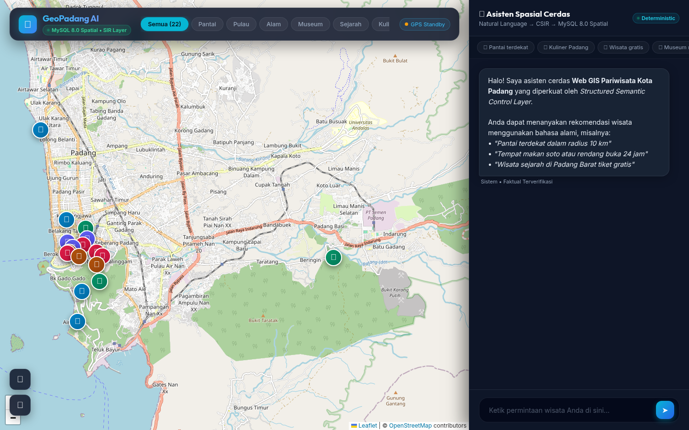
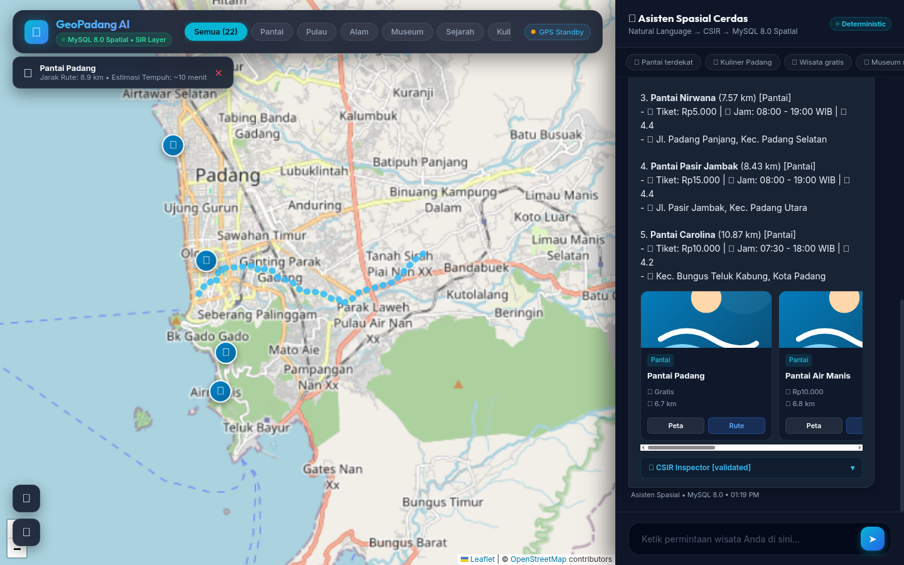

# RANCANG BANGUN SISTEM REKOMENDASI PARIWISATA BERBASIS LARGE LANGUAGE MODEL (LLM) DAN STRICT SQL GROUNDING UNTUK PEMBERIAN SARAN DESTINASI WISATA CERDAS
*(Studi Kasus: Kawasan Pariwisata Kota Padang)*

---

## ABSTRAK

Penerapan *Large Language Model* (LLM) pada sistem informasi pariwisata sering kali terbentur oleh fenomena halusinasi faktual dan spasial (*hallucination*), di mana model mengarang nama atraksi fiktif, jam buka yang keliru, serta distorsi estimasi jarak. Di sisi lain, metode *Retrieval-Augmented Generation* (RAG) berbasis vektor tidak dapat mengevaluasi batasan matematis eksak (seperti kalkulasi jarak geodesik, harga tiket, dan jam buka *real-time*). Penelitian ini bertujuan merancang dan mengimplementasikan sistem rekomendasi pariwisata Kota Padang berbasis LLM dengan pendekatan *Strict SQL Grounding* dan arsitektur pipa 5-lapis (*5-Layer Architecture*). Peran LLM dibatasi secara ketat hanya sebagai pengurai bahasa alami menjadi *Spatial Intent Representation* (SIR) formal dan perangkai narasi (*Grounded NLG*), sedangkan sumber kebenaran fakta 100% dikunci pada basis data relasional MySQL 8.0 melalui fungsi spasial bawaan (*native spatial function*) `ST_Distance_Sphere` dan perutean jalan raya *Open Source Routing Machine* (OSRM). Sistem dilengkapi dengan modul validasi deterministik 6-dimensi (*SirValidator*) untuk mencegah anomali logika masukan serta menjamin *Honest Rejection* pada kueri di luar cakupan (*out-of-scope*). Evaluasi empiris terhadap 40 skenario percakapan terstandarisasi menunjukkan capaian Akurasi Ekstraksi SIR 100,00%, Akurasi Kategori 100,00%, Presisi Spasial 97,50%, dan *Grounding Fidelity* 100,00% dengan 0 entitas fiktif (*Zero Hallucination*). Waktu respons rata-rata sistem tercatat 1.340,57 ms, di mana eksekusi kueri spasial SQL MySQL 8.0 hanya memakan waktu 1,21 ms. Sistem ini membuktikan bahwa penggabungan pemahaman semantik LLM dengan komputasi relasional deterministik mampu menghasilkan asisten wisata perkotaan yang responsif, akurat, dan bebas dari halusinasi data.

**Kata Kunci:** Sistem Rekomendasi Pariwisata, Large Language Model (LLM), Strict SQL Grounding, Spatial Intent Representation (SIR), ST_Distance_Sphere, MySQL 8.0, Leaflet.js, Kota Padang.

---

## ABSTRACT

The deployment of Large Language Models (LLMs) in tourism information systems frequently encounters factual and spatial hallucinations, wherein the generative model invents non-existent attractions, incorrect opening hours, and distorted spatial proximity. Conversely, standard vector-based Retrieval-Augmented Generation (RAG) fails to enforce deterministic mathematical and spatial constraints (such as geodesic distance calculations, budget boundaries, and real-time operational status). This research designs and implements an intelligent tourism recommendation system for Padang City based on LLMs with a Strict SQL Grounding approach and a 5-layer pipeline architecture. The LLM is strictly constrained as a natural language parser that translates conversational inputs into a formal Spatial Intent Representation (SIR) and a conversational response synthesizer (Grounded NLG), while all factual grounding is deterministically derived from a relational MySQL 8.0 database via the native `ST_Distance_Sphere` spatial function and road network navigation from the Open Source Routing Machine (OSRM). The architecture integrates a 6-dimensional deterministic validator (SirValidator) to normalize input anomalies and ensure Honest Rejection on out-of-scope requests. Empirical evaluation across 40 standardized benchmark scenarios demonstrates 100.00% SIR Extraction Accuracy, 100.00% Category Classification Accuracy, 97.50% Spatial Precision, and 100.00% Grounding Fidelity with zero fabricated POIs (Zero Hallucination). The mean end-to-end response latency is 1,340.57 ms, with spatial SQL queries taking merely 1.21 ms. This demonstrates that decoupling semantic parsing from deterministic relational computation effectively eliminates AI hallucinations in urban GIS tourist assistance.

**Keywords:** Tourism Recommender System, Large Language Model (LLM), Strict SQL Grounding, Spatial Intent Representation (SIR), ST_Distance_Sphere Function, MySQL 8.0, Leaflet.js, Padang City.

---

## BAB I: PENDAHULUAN

### 1.1 Latar Belakang Masalah
Sektor pariwisata merupakan salah satu pilar penggerak ekonomi strategis bagi Kota Padang, ibu kota Provinsi Sumatera Barat. Berada di pesisir barat Pulau Sumatera dengan topografi perbukitan Bukit Barisan yang membentang berdampingan langsung dengan Samudra Hindia, Kota Padang memiliki keragaman atraksi wisata yang sangat unik. Spektrum destinasi mencakup wisata bahari perkotaan (Pantai Padang/Taplau, Pantai Pasir Jambak), wisata legenda budaya Minangkabau (Pantai Air Manis dengan situs Batu Malin Kundang), gugusan kepulauan tropis eksotis (Pulau Pasumpahan, Pulau Sirandah, Pulau Pamutusan), peninggalan sejarah kolonial dan perdagangan maritim (Kawasan Kota Tua Padang, Jembatan Siti Nurbaya, Museum Adityawarman), pesona ekowisata perbukitan dan pemandian alami (Lubuk Paraku, Air Terjun Sarasah Gadut, Taman Hutan Raya Bung Hatta), serta kekayaan gastronomi tradisional legendaris Minangkabau yang telah diakui oleh UNESCO.

Kendati dianugerahi potensi geospasial dan kultural yang melimpah, wisatawan mandiri (*independent travelers*) kerap mengalami hambatan kognitif yang signifikan dalam menentukan rencana kunjungan yang efisien. Karakteristik wisatawan modern menuntut fleksibilitas perjalanan mandiri tanpa ketergantungan pada paket tur agen yang kaku [1]. Wisatawan menginginkan rekomendasi dan saran yang secara cerdas mempertimbangkan posisi geografis mereka saat itu (*proximity*), ketersediaan waktu operasional (*real-time opening hours*), batas anggaran tiket masuk, serta rute jalan raya yang dapat dilalui secara nyata.

Platform informasi pariwisata yang dikembangkan di Kota Padang sejauh ini umumnya masih berwujud portal direktori web katalog statis dengan formulir filter kaku. Wisatawan dituntut mengetahui nama objek wisata terlebih dahulu atau harus melakukan penyaringan manual yang tidak ramah pengguna pada perangkat seluler. Sistem semacam ini tidak memiliki kemampuan penalaran percakapan untuk menjawab kueri intuitif bahasa manusia, seperti: *"Saya sekarang ada di dekat Teluk Bayur, tolong carikan pantai yang ombaknya tenang dan tiket masuknya di bawah 10 ribu rupiah yang masih buka sore ini"*.

Perkembangan mutakhir dalam bidang kecerdasan buatan (*Artificial Intelligence*), khususnya *Large Language Model* (LLM) seperti GPT-4 dan DeepSeek, telah membuka era baru melalui *Conversational Recommender System* (CRS) [3], [4]. Pengguna dapat berinteraksi secara bebas menggunakan bahasa alami layaknya berbicara dengan pemandu wisata berpengalaman. Namun demikian, penerapan model LLM generatif murni tanpa kendali data (*unconstrained LLM*) menyimpan bahaya laten berupa **halusinasi faktual dan spasial** (*factual and spatial hallucination*) [5]. Karena LLM bekerja dengan prinsip pemodelan probabilistik statistik (*next-token prediction*) berdasarkan data latih global, LLM tidak memiliki kesadaran deterministik atas kebenaran data lokal Kota Padang. Akibatnya, LLM generatif murni kerap merekomendasikan objek wisata yang sudah bangkrut, mengarang jam operasional palsu, memberikan estimasi jarak yang tidak masuk akal (misalnya menyebut pulau lepas pantai dapat dicapai dengan berjalan kaki 10 menit), atau merekomendasikan destinasi di kota tetangga (seperti Jam Gadang di Bukittinggi atau Lembah Anai di Tanah Datar) sebagai destinasi di dalam Kota Padang.

Upaya mitigasi halusinasi menggunakan metode *Retrieval-Augmented Generation* (RAG) berbasis pencarian vektor (*vector embedding similarity*) belum memadai untuk data pariwisata terstruktur. Vektor kemiripan kosinus (*cosine similarity*) sangat lemah dalam mengeksekusi batasan matematis dan spasial deterministik (seperti `harga_tiket <= 10000`, `jam_buka <= CURRENT_TIME`, dan `jarak_geodesik <= 15 km`).

Penelitian mutakhir oleh Afnarius dkk. (2026) [2] di *International Journal of Geoinformatics* (IJG) melalui sistem *DTExplorer* memelopori pendekatan interaksi spasial eksploratori sadar-skala (*scale-aware exploratory spatial interaction*) pada skala mikro pedesaan (Desa Wisata Ulakan) dengan 43 POI terkurasi. *DTExplorer* menggunakan arsitektur *Three-Tier* (Presentation, Application, Data) dengan kueri statis dan formula Euclidean planar (`ST_Distance * 111.32`). Kendati sangat efektif di pedesaan, *DTExplorer* masih bertumpu pada kontrol WIMP konvensional (*slider* radius dan *dropdown* menu) dan mencatat perlunya riset masa depan untuk antarmuka percakapan, multi-kriteria waktu/biaya, dan evaluasi performa teknis. Berangkat dari wawasan fundamental tersebut, riset ini memperluas konsep tersebut ke skala perkotaan (*urban scale*) Kota Padang dengan memperkenalkan arsitektur baru: **Structured Semantic Control Layer for Reliable LLM-Mediated Spatial Information System**.

Dalam arsitektur ini, diterapkan pemisahan tugas kognitif dan deterministik secara tegas: peran LLM dibatasi secara ketat hanya sebagai pengurai bahasa alami (*Intent Parser*) menjadi skema formal *Canonical Spatial Intent Representation* (CSIR) dan perangkai narasi ter-grounding (*Grounded NLG*), sedangkan seluruh kebenaran fakta murni bersumber dari basis data relasional MySQL 8.0 dengan fungsi spasial bawaan `ST_Distance_Sphere` dan perutean jaringan jalan nyata dari *Open Source Routing Machine* (OSRM).

### 1.2 Identifikasi Masalah
Berdasarkan latar belakang di atas, masalah yang diidentifikasi meliputi:
1. Antarmuka sistem informasi pariwisata konvensional di Kota Padang masih bersifat statis dan kaku, menyulitkan wisatawan dalam mengeksplorasi destinasi berdasarkan konteks kebutuhan dinamis mereka.
2. Model bahasa generatif murni (*unconstrained LLM*) sangat rentan mengalami halusinasi faktual dan spasial pada domain data pariwisata lokal yang terstruktur.
3. Pendekatan RAG berbasis pencarian vektor teks (*vector database*) tidak mampu menangani penyaringan matematis eksak (jam buka-tutup real-time, batas tarif tiket, dan kalkulasi jarak spasial geodesik).
4. Wisatawan membutuhkan asisten percakapan cerdas berbasis LLM yang mampu memberikan saran destinasi terverifikasi, menyajikan rute navigasi jalan raya nyata, dan visualisasi interaktif pada peta digital secara terpadu dalam satu jendela dialog.

### 1.3 Batasan Masalah
Ruang lingkup dan batasan dalam penelitian ini adalah:
1. Wilayah penelitian dibatasi pada batas administratif Kota Padang, Provinsi Sumatera Barat.
2. Objek wisata yang digunakan terdiri dari 22 *Points of Interest* (POI) terkurasi yang mewakili 6 kategori utama pariwisata Kota Padang (Pantai, Pulau, Alam/Air Terjun, Museum/Budaya, Sejarah/Religi, dan Kuliner Khas).
3. Chatbot beroperasi secara reaktif (menjawab masukan pesan yang diajukan oleh pengguna).
4. Perhitungan jarak geodesik menggunakan fungsi spasial bawaan (*native spatial function*) `ST_Distance_Sphere` pada tingkat kueri basis data MySQL 8.0, bukan formula trigonometri manual.
5. Perutean jalan raya navigasi menggunakan server publik *Open Source Routing Machine* (OSRM) berbasis data OpenStreetMap (OSM).
6. Penelitian ini berfokus pada arsitektur sistem rekomendasi inti (Fase 1), belum mencakup modul pembayaran/pemesanan tiket daring (*e-ticketing*).

### 1.4 Rumusan Masalah
1. Bagaimana merancang bangun arsitektur sistem rekomendasi pariwisata berbasis Large Language Model (LLM) dengan pendekatan *Strict SQL Grounding* dan *Spatial Intent Representation* (SIR) untuk memberikan saran destinasi wisata cerdas dan mengeliminasi fenomena halusinasi data faktual dan spasial?
2. Bagaimana merancang dan mengintegrasikan modul validasi deterministik 6-dimensi dan fungsi spasial bawaan `ST_Distance_Sphere` ke dalam alur percakapan chatbot secara *real-time* berdasarkan koordinat GPS wisatawan pada peta digital Leaflet.js?
3. Seberapa tinggi tingkat akurasi ekstraksi intensi, keandalan anti-halusinasi (*Grounding Fidelity*), dan performa efisiensi waktu respons (*latency*) dari sistem yang dikembangkan pada 40 skenario percakapan terstandarisasi?

### 1.5 Tujuan Penelitian
1. Menghasilkan rancang bangun sistem rekomendasi pariwisata Kota Padang berbasis Large Language Model (LLM) dengan pendekatan *Strict SQL Grounding* sebagai pemberi saran destinasi wisata cerdas yang terikat secara mutlak pada basis data relasional MySQL 8.0.
2. Mengembangkan modul *location-aware* cerdas yang mampu memvalidasi intensi pengguna, menghitung jarak terdekat, dan memvisualisasikan rute perjalanan dari posisi pengguna ke destinasi wisata secara interaktif pada peta Leaflet.js.
3. Mengukur dan menganalisis performa sistem secara kuantitatif melalui benchmark 40 skenario percakapan terstandarisasi, pengujian multi-baseline, dan analisis ablasi.

### 1.6 Manfaat Penelitian
- **Bagi Pengembangan Ilmu Pengetahuan (Teoretis):** Memberikan kontribusi ilmiah dalam domain *Conversational Recommender Systems* (CRS) dan geoinformatika mengenai integrasi model bahasa besar (LLM) dengan basis data relasional untuk mengeliminasi halusinasi AI pada data geospasial terstruktur.
- **Bagi Masyarakat dan Wisatawan (Praktis):** Menyediakan sarana asisten wisata cerdas yang mudah digunakan, informatif, akurat, dan bebas dari informasi palsu bagi wisatawan yang berkunjung ke Kota Padang.
- **Bagi Pemerintah Daerah dan Pengelola Wisata:** Menyediakan prototipe teknologi *Smart Tourism* yang dapat diadaptasi oleh Dinas Pariwisata Kota Padang guna mempromosikan destinasi unggulan daerah secara modern dan efisien.

### 1.7 Sistematika Penulisan
Naskah tesis ini disusun dalam lima bab dengan sistematika sebagai berikut:
- **BAB I PENDAHULUAN:** Menguraikan latar belakang masalah, identifikasi masalah, batasan masalah, rumusan masalah, tujuan, manfaat penelitian, dan sistematika penulisan.
- **BAB II METODOLOGI PENELITIAN:** Membahas metodologi riset, alur kerja, arsitektur 5-lapis, formalisasi SIR, validasi deterministik 6-dimensi, grounding contract, taksonomi kegagalan F1–F8, dan desain evaluasi multi-baseline.
- **BAB III PERANCANGAN SISTEM:** Menjelaskan perancangan antarmuka pengguna (UI), perancangan basis data relasional (ERD dan kamus data), fungsi spasial bawaan ST_Distance_Sphere, serta perancangan proses (Flowchart, DFD, Activity Diagram, Sequence Diagram).
- **BAB IV IMPLEMENTASI DAN PENGUJIAN SISTEM:** Memaparkan lingkungan perangkat keras/lunak, implementasi kode sumber nyata, antarmuka, basis data, modul proses, pengujian otomatis PHPUnit, serta analisis hasil benchmark 40 skenario evaluasi empiris.
- **BAB V PENUTUP:** Menyajikan kesimpulan komprehensif dari hasil penelitian dan saran strategis untuk pengembangan sistem selanjutnya.
- **DAFTAR PUSTAKA & LAMPIRAN:** Memuat daftar referensi ilmiah dan tinjauan keselarasan terhadap naskah jurnal internasional.

---

## BAB II: METODOLOGI PENELITIAN

### 2.1 Metodologi Penelitian dan Alur Kerja
Penelitian ini menggunakan pendekatan rekayasa perangkat lunak terapan yang dipadukan dengan eksperimen komputasi geoinformatika (*applied software engineering and computational evaluation*). Tahapan penelitian dirancang secara sistematis melalui 5 fase utama:

1. **Fase 1: Studi Literatur dan Pengumpulan Data:** Mengkaji penelitian sistem rekomendasi percakapan (CRS), Web GIS eksploratori Afnarius dkk. (2026), serta masalah halusinasi LLM. Mengakuisisi dan memverifikasi data spasial 22 objek wisata Kota Padang (koordinat WGS84, tarif tiket, jam operasional, dan daya tarik utama).
2. **Fase 2: Perancangan Arsitektur dan Formalisasi SIR:** Merancang *5-Layer Architecture*, mendefinisikan skema formal *Spatial Intent Representation* (SIR) 17-atribut, dan merancang ontologi operator spasial.
3. **Fase 3: Konstruksi Sistem dan Integrasi Mesin Relasional:** Membangun modul backend CodeIgniter 4.7.4 (PHP 8.2+), MySQL 8.0 Spatial Engine (fungsi bawaan ST_Distance_Sphere), mesin routing OSRM, antarmuka Leaflet.js, serta *SirValidator* 6-dimensi.
4. **Fase 4: Perancangan Dataset Benchmark 40 Skenario:** Menyusun 40 skenario kueri percakapan terstandarisasi yang mencakup variasi kategori, filter harga, batasan operasional jam buka, resolusi entitas fuzzy, kueri luar wilayah, dan uji batas negatif (*out-of-scope negative boundary test*).
5. **Fase 5: Pengujian Otomatis, Evaluasi Multi-Baseline, dan Analisis Latensi:** Menjalankan pengujian otomatis PHPUnit (17 unit/feature tests), komparasi multi-baseline (*Direct Text-to-SQL*, *Unconstrained LLM*, dan *Proposed System*), uji ablasi validator, serta profiling latensi per milidetik.

### 2.2 Landasan Pendekatan: Arsitektur 5-Lapis (*5-Layer Architecture*)
Untuk menjamin keamanan sistem (*Safety Invariant*) dan memisahkan tugas kognitif dari eksekusi basis data secara tegas (*Separation of Concerns*), arsitektur sistem dirancang dalam 5 lapisan independen:

- **Layer 1: User Interaction & Geolocation Capture:** Berjalan pada peramban web klien. Menangkap masukan teks pengguna dan koordinat GPS perangkat melalui HTML5 Geolocation API, serta merender peta Leaflet.
- **Layer 2: Spatial Intent Representation (SIR) Parser:** Menerjemahkan bahasa alami bebas pengguna menjadi representasi semantik terstruktur (SIR JSON) menggunakan LLM dengan instruksi pembatas kaku (*strict system prompt*). LLM sama sekali dilarang mengakses basis data atau merangkai kueri SQL.
- **Layer 3: Deterministic SIR Validator:** Memeriksa dan membersihkan objek SIR melalui 6 lapisan verifikasi deterministik sebelum kueri dibuat. Jika terdapat permintaan di luar lingkup pariwisata Padang, modul ini langsung menandai status `is_out_of_scope = true`.
- **Layer 4: Spatial Query Compiler & Engine Execution:** Menerjemahkan objek SIR yang telah tervalidasi menjadi kueri SQL berparameter (*parameter-bound SQL query*) pada MySQL 8.0 dengan fungsi spasial bawaan `ST_Distance_Sphere`. Menghubungi API OSRM untuk menghasilkan polyline rute jalan raya dan estimasi waktu tempuh.
- **Layer 5: Strict Grounded NLG & Client Visualization:** Menggabungkan baris data hasil SQL (fakta murni) ke dalam prompt LLM untuk dirangkai menjadi jawaban ramah pengguna. LLM diwajibkan menjawab berdasarkan fakta data SQL tanpa diperbolehkan menambah entitas di luar data tersebut.

```
+-----------------------------------------------------------------------+
|  Layer 1: User Interaction & Geolocation (Leaflet.js + Web Client)     |
+-----------------------------------------------------------------------+
                                  | (Input Text, GPS Lat/Lng)
                                  v
+-----------------------------------------------------------------------+
|  Layer 2: Spatial Intent Parser (LLM -> JSON DTO Extraction)           |
+-----------------------------------------------------------------------+
                                  | (Raw SpatialIntent DTO)
                                  v
+-----------------------------------------------------------------------+
|  Layer 3: Deterministic SIR Validator (6-Dimensional Validation)       |
+-----------------------------------------------------------------------+
                                  | (Validated SpatialIntent DTO)
                                  v
+-----------------------------------------------------------------------+
|  Layer 4: Spatial Query Compiler (Parameter-Bound SQL ST_Distance_Sphere)|
|           MySQL 8.0 Spatial Engine + OSRM Routing Integration         |
+-----------------------------------------------------------------------+
                                  | (Structured Fact Dataset)
                                  v
+-----------------------------------------------------------------------+
|  Layer 5: Strict Grounded NLG & Map Renderer (Zero Hallucination)      |
+-----------------------------------------------------------------------+
```
*Gambar 2.1 Diagram Alur Arsitektur 5-Lapis Sistem Rekomendasi Pariwisata Berbasis Strict Grounding.*

#### 2.2.1 Perbandingan Evolusioner terhadap Arsitektur Three-Tier DTExplorer (Afnarius dkk., 2026)
Guna memahami kebaruan struktural rancang bangun yang diusulkan, arsitektur 5-lapis ini merupakan evolusi dan lompatan ilmiah dari arsitektur *Three-Tier Web GIS* yang dirintis oleh Afnarius dkk. (2026) [2] pada sistem *DTExplorer*:

1. **Lapisan Presentasi (*Presentation Layer*):**
   - *DTExplorer:* Menggunakan Google Maps JavaScript API dengan kontrol WIMP kaku (*slider* radius dan *dropdown* menu) di mana pengguna harus meramu kriteria secara manual.
   - *Sistem Usulan:* Menghadirkan antarmuka dwitunggal sinkron (*Dual-Synchronized Multimodal UI*) memadukan peramban peta Leaflet.js dengan laci percakapan AI (*Floating Chat Drawer*). Pengguna cukup bertutur dengan bahasa alami, dan rute jalan raya turn-by-turn divisualisasikan secara dinamis via mesin OSRM open-source.
2. **Lapisan Aplikasi (*Application Layer*):**
   - *DTExplorer:* Mengandalkan peladen Node.js/Express.js dengan pengontrol skala (*Scale-Aware Controller*) dan pembangun kueri statis (*Spatial Query Builder*).
   - *Sistem Usulan:* Membagi fungsi peladen menjadi pipa kognitif bersekat: (a) *Cognitive Air-Gap* yang mengisolasi LLM di awan murni sebagai penerjemah semantik berluaran JSON tanpa izin akses basis data, (b) *SIR Validator* 6-dimensi berbasis prinsip *No Intent Alteration*, dan (c) *Deterministic Spatial Query Compiler* yang hanya mengompilasi kueri SQL jika invarian keamanan terpenuhi.
3. **Lapisan Data (*Data Layer*):**
   - *DTExplorer:* Menggunakan MySQL Spatial Database dengan evaluasi jarak Euclidean planar ($\text{ST\_Distance} \times 111.32$) yang rentan distorsi kelengkungan bumi pada radius luas.
   - *Sistem Usulan:* Menggunakan fungsi spasial geodesik bawaan kernel C++ MySQL 8.0 `ST_Distance_Sphere(POINT, POINT) / 1000.0` pada geometri terstandarisasi OGC WGS84, menghasilkan komputasi jarak lingkaran besar yang presisi dan stabil terhadap galat titik kambang (*floating-point errors*).
4. **Lapisan Grounding & Verifikasi (*Grounded Verification Layer* - Lapisan Baru):**
   - *DTExplorer:* Tidak memiliki komponen ini karena kueri bersifat statis tanpa integrasi kecerdasan buatan.
   - *Sistem Usulan:* Menghadirkan *Algorithmic Grounding Validator* ($\forall e \in \text{Entities}(\text{Response}), e \in F$) yang bertindak sebagai *firewall* pasca-generasi untuk mengeliminasi halusinasi entitas secara mutlak sebelum data dikirim ke klien.

#### 2.2.2 Kerangka Operasional Interaksi Spasial Eksploratori Terkontrol Semantik
Guna memodelkan interaksi antara formulasi intensi pengguna, parameterisasi skala spasial, penyaringan atribut multi-kriteria, dan visualisasi pemetaan, Gambar 2.2 menggambarkan **Kerangka Operasional Interaksi Spasial Eksploratori Terkontrol Semantik (*The Iterative Cognitive-Control-Execution Loop*)**, yang mentransformasikan kerangka kerja operasional *DTExplorer* (Afnarius dkk., 2026, Gambar 8) [2].

```
+---------------------------------------------------------------------------------------------+
|        KERANGKA OPERASIONAL: SIKLUS ITERATIF KOGNITIF-KENDALI-EKSEKUSI SPASIAL              |
+---------------------------------------------------------------------------------------------+
|                                                                                             |
|   +-------------------------------------------------------------------------------------+   |
|   | 1. FORMULASI INTENSI KOGNITIF BAHASA ALAMI & KONTEKS SITUASIONAL                    |   |
|   |    - Wisatawan mengekspresikan preferensi majemuk melalui bahasa alami sehari-hari  |   |
|   |    - Resolusi konteks sisi klien: GPS (lat, lng), waktu sirkadian, preferensi sesi  |   |
|   +------------------------------------------+------------------------------------------+   |
|                                              | Kueri Bahasa Alami + Vektor Konteks          |
|                                              v                                              |
|   +-------------------------------------------------------------------------------------+   |
|   | 2. COGNITIVE AIR-GAP: INTERPRETASI SEMANTIK (SANDBOX JSON LLM)                      |   |
|   |    - DeepSeek LLM (temperature: 0.0, response_format: JSON)                         |   |
|   |    - Ekstraksi slot dibatasi oleh Ontologi Operator Spasial & Taksonomi Klaster     |   |
|   |    - Memancarkan DTO Canonical Spatial Intent Representation (CSIR) mentah          |   |
|   +------------------------------------------+------------------------------------------+   |
|                                              | Objek CSIR Mentah                            |
|                                              v                                              |
|   +-------------------------------------------------------------------------------------+   |
|   | 3. FIREWALL KENDALI DETERMINISTIK & INVARIAN KOMPILASI SPASIAL                      |   |
|   |    - SIR Validator: 6-Dimensi Invarian menegakkan prinsip "No Intent Alteration"    |   |
|   |      * Pemeriksaan batas (distance > 0), domain safety, rekonsiliasi kontradiksi    |   |
|   |      * Menetapkan Kebijakan: direct_execute | clarify_user | reject_out_of_scope    |   |
|   |    - Spatial Query Compiler menegakkan Safety Invariant:                            |   |
|   |      * !isValid || is_out_of_scope ==> Penghentian Eksekusi SQL (Beban DB = 0)     |   |
|   |      * Sintesis kueri SQL terparameterisasi dengan fungsi ST_Distance_Sphere        |   |
|   +------------------------------------------+------------------------------------------+   |
|                                              | Pernyataan SQL Terparameterisasi Valid       |
|                                              v                                              |
|   +-------------------------------------------------------------------------------------+   |
|   | 4. KOMPUTASI SPASIAL GEODESIK DETERMINISTIK & PENGAYAAN KONTEKS                     |   |
|   |    - Basis Data Relasional 3NF: wisata JOIN kategori (SPATIAL INDEX pada geom)      |   |
|   |    - Kernel C++ MySQL 8.0: ST_Distance_Sphere(POINT(lng, lat), POINT(u_lng, u_lat)) |   |
|   |    - Filter multi-kriteria relasional (open_now, open_24h, max_price, status)       |   |
|   |    - Pengayaan status cuaca real-time (OpenWeatherMap) dan catatan operasional      |   |
|   |    - Menghasilkan Tupel Fakta Terverifikasi: F = {t_1, t_2, ..., t_k}               |   |
|   +------------------------------------------+------------------------------------------+   |
|                                              | Tabel Fakta Terverifikasi F                  |
|                                              v                                              |
|   +-------------------------------------------------------------------------------------+   |
|   | 5. VALIDATOR GROUNDING ALGORITMIK PASCA-GENERASI (GROUNDING FIREWALL)               |   |
|   |    - LLM mensintesis narasi percakapan terikat ketat pada Tabel Fakta F             |   |
|   |    - Algorithmic Grounding Validator menegakkan Kontrak Grounding Ketat:            |   |
|   |      * forall e in Entities(Response), e in Entities(Facts_SQL)                     |   |
|   |      * Membuang token halusinasi; substitusi otomatis dengan DTO deterministik      |   |
|   |      * Garansi matematis Entity Fabrication Rate = 0,00%                            |   |
|   +------------------------------------------+------------------------------------------+   |
|                                              | Muatan Ganda Sinkron (Dual-Payload)          |
|                                              v                                              |
|   +-------------------------------------------------------------------------------------+   |
|   | 6. RENDERING MULTIMODAL DWITUNGGAL SINKRON (INTERAKSI KLIEN WEB GIS)                |   |
|   |    - Peta Interaktif Leaflet.js: Auto-pan, pin SVG tematik, popup detail destinasi  |   |
|   |    - Mesin Rute OSRM: Rute jaringan jalan raya turn-by-turn & estimasi waktu        |   |
|   |    - Panel Percakapan AI: Narasi rekomendasi informatif, akurat, dan ter-grounding  |   |
|   +------------------------------------------+------------------------------------------+   |
|                                              | Status Spasial Tervisualisasi & Umpan Balik  |
|                                              v                                              |
|   +-------------------------------------------------------------------------------------+   |
|   | 7. EVALUASI KOGNITIF PENGGUNA & LINGKARAN PENYEMPURNAAN PERCAKAPAN ADAPTIF          |   |
|   |    - Wisatawan mengevaluasi sebaran spasial, waktu tempuh, tarif, dan foto objek    |   |
|   |    - Umpan balik dialog multi-turn (contoh: "Ada kuliner terdekat dari pantai ini?")|   |
|   +-------------------------------------------------------------------------------------+   |
|                                              | Penyesuaian Kueri Percakapan Iteratif        |
|                                              +--------------------------------------------->+
+---------------------------------------------------------------------------------------------+
```
*Gambar 2.2 Kerangka Operasional Interaksi Spasial Eksploratori Terkontrol Semantik (Siklus Iteratif Kognitif-Kendali-Eksekusi).*

Perbedaan mendasar model operasional ini terhadap DTExplorer (Gambar 8 Afnarius dkk., 2026) mencakup:
1. **Peniadaan Friksi Antarmuka WIMP:** Wisatawan tidak perlu menggeser *slider* radius dan mencentang *checkbox* kategori secara mekanis. Skala spasial ($d$), titik acuan ($R_t$), dan operator spasial ($O_s$) diekstraksi secara otomatis dari percakapan alami.
2. **Mediasi Kendali Deterministik Bersekat:** Parameterisasi skala tidak disalurkan langsung ke kueri SQL, melainkan melewati lapisan penyaring *SIR Validator* dan invarian keamanan *Spatial Query Compiler*, melindungi basis data dari beban kueri ilegal atau injeksi tak terduga.
3. **Penyempurnaan Dialog Adaptif Berkelanjutan:** Siklus eksplorasi spasial diperbarui secara percakapan (*multi-turn dialog*), memungkinkan pengguna mempersempit atau memperluas skala spasial secara dinamis dengan konteks sesi yang tetap terjaga.

#### 2.2.3 Model Konseptual Basis Data Spasial Relasional (Normalisasi 3NF)
Gambar 2.3 menyajikan model konseptual basis data spasial relasional yang diusulkan.

```
+=============================================================================================+
|                 MODEL BASIS DATA SPASIAL RELASIONAL TERNORMALISASI (3NF)                    |
+=============================================================================================+
|                                                                                             |
|   +-----------------------------+                  +------------------------------------+   |
|   |          kategori           | 1              * |               wisata               |   |
|   +-----------------------------+------------------+------------------------------------+   |
|   | PK id         : INT         |                  | PK id                 : INT        |   |
|   |    nama       : VARCHAR(50) |                  | FK kategori_id        : INT        |   |
|   |    slug       : VARCHAR(50) |                  |    nama               : VARCHAR    |   |
|   |    icon       : VARCHAR(50) |                  |    deskripsi          : TEXT       |   |
|   |    warna      : VARCHAR(20) |                  |    alamat             : TEXT       |   |
|   +-----------------------------+                  |    lat                : DECIMAL    |   |
|                                                    |    lng                : DECIMAL    |   |
|   +-----------------------------+                  |    geom               : POINT      |   |
|   |        chat_session         |                  |    SPATIAL INDEX(geom)             |   |
|   +-----------------------------+                  |    harga_tiket        : INT        |   |
|   | PK id         : INT         | 1                |    jam_buka           : TIME       |   |
|   |    session_id : VARCHAR(64) |                  |    jam_tutup          : TIME       |   |
|   |    user_lat   : DECIMAL     |                  |    rating             : DECIMAL    |   |
|   |    user_lng   : DECIMAL     |                  |    foto               : VARCHAR    |   |
|   |    created_at : DATETIME    |                  |    status_aktif       : TINYINT    |   |
|   +-----------------------------+                  |    status_operasional : VARCHAR    |   |
|                  |                                 |    catatan_status     : TEXT       |   |
|                  | 1                               +------------------------------------+   |
|                  v *                                                                        |
|   +-----------------------------+                                                           |
|   |        chat_message         |                                                           |
|   +-----------------------------+                                                           |
|   | PK id         : INT         |                                                           |
|   | FK session_id : VARCHAR(64) |                                                           |
|   |    role       : ENUM        |                                                           |
|   |    message    : TEXT        |                                                           |
|   |    raw_sir    : JSON        |                                                           |
|   |    sql_query  : TEXT        |                                                           |
|   +-----------------------------+                                                           |
+=============================================================================================+
```
*Gambar 2.3 Model Konseptual Basis Data Spasial Relasional Ternormalisasi 3NF.*

Berbeda dari arsitektur *DTExplorer* (Gambar 6 Afnarius dkk., 2026) yang membagi data ke dalam 6 tabel fisik identik berdasarkan kategori, rancangan 3NF ini mengonsolidasikan POI ke dalam entitas tunggal `wisata` dengan indeks spasial R-Tree terpadu (`SPATIAL INDEX(geom)`), mendukung penyaringan multi-kriteria (temporal, finansial, operasional) dalam satu lintasan kueri, serta menyediakan entitas relasional audit (`chat_session` dan `chat_message`) untuk transparansi AI.

### 2.3 Formalisasi *Spatial Intent Representation* (SIR) dan Ontologi Operator Spasial
*Spatial Intent Representation* (SIR) didefinisikan secara matematis sebagai tupel formal perantara semantik:

$$\text{SIR} = \langle I, E, C, O_s, R_t, d, u_d, A, T_n, K, F, P_{\max}, O_{\text{now}}, O_{24}, S, B_{\text{out}} \rangle$$

Setiap atribut memiliki domain nilai dan tipe data terdefinisi secara ketat sebagaimana disajikan pada Tabel 2.1.

**Tabel 2.1 Skema Formal Atribut Spatial Intent Representation (SIR)**

| Simbol | Nama Atribut | Tipe Data | Domain Nilai / Contoh | Keterangan |
|---|---|---|---|---|
| $I$ | `intent` | String | `rekomendasi_wisata`, `tanya_rute`, `informasi_wisata`, `sapaan` | Intensi utama pengguna |
| $E$ | `entity` | String/Null | Nama objek wisata spesifik atau null | Target objek spesifik |
| $C$ | `category` | String/Null | `pantai`, `pulau`, `alam`, `museum_budaya`, `sejarah_religi`, `kuliner` | Klaster kategori wisata Padang |
| $O_s$ | `spatial_operator` | Enum | `nearest`, `within_radius`, `within_admin_area`, `none` | Operator relasi spasial |
| $R_t$ | `reference_type` | Enum | `gps`, `city_center`, `poi` | Titik acuan perhitungan jarak |
| $d$ | `distance` | Float/Null | Nilai riil $\ge 0.0$ (contoh: $5.0, 10.0$) | Besaran jarak / radius |
| $u_d$ | `distance_unit` | String | `km`, `meter` | Satuan pengukuran jarak |
| $A$ | `admin_area` | String/Null | `Padang Barat`, `Bungus Teluk Kabung`, `Koto Tangah`, dll. | Wilayah administratif kecamatan |
| $T_n$ | `target_name` | String/Null | Nama parsial (contoh: *"Malin Kundang"*) | Kata kunci target entitas |
| $K$ | `keyword` | String/Null | Kata kunci fasilitas/daya tarik | Pencarian teks bebas |
| $F$ | `is_free` | Boolean | `true`, `false` | Penyaringan tiket gratis |
| $P_{\max}$ | `max_price` | Float/Null | Nilai riil $\ge 0.0$ (contoh: $15000.0$) | Batas maksimum tiket masuk |
| $O_{\text{now}}$ | `open_now` | Boolean | `true`, `false` | Penyaringan status jam buka saat ini |
| $O_{24}$ | `open_24h` | Boolean | `true`, `false` | Penyaringan wisata buka 24 jam |
| $S$ | `sort` | Enum | `jarak`, `harga`, `rating`, `relevansi` | Urutan penyajian hasil |
| $B_{\text{out}}$| `is_out_of_scope` | Boolean | `true`, `false` | Indikator permintaan di luar Padang |

Ontologi operator spasial ($O_s$) membatasi relasi geometris menjadi 4 kondisi eksak:
1. `nearest`: Mengurutkan destinasi berdasarkan jarak geodesik terkecil dari titik acuan tanpa batas radius kaku.
2. `within_radius`: Memfilter destinasi dengan batasan jarak geodesik $\le d\text{ km}$ dari titik acuan.
3. `within_admin_area`: Memfilter destinasi yang berada di dalam wilayah administratif kecamatan tertentu ($A$).
4. `none`: Tidak menerapkan batasan spasial (pencarian berbasis kategori tematik atau nama objek).

### 2.4 Peran Prompt dalam Mekanisme Kontrol Keseluruhan dan Pencegahan Jawaban Tanpa Grounding
Dalam penelitian tesis ini, peran *prompt* dirancang bukan sebagai penentu jawaban akhir atau penalaran bebas, melainkan sebagai **kontrak pembatas struktural deklaratif (*declarative structural boundary contract*)** yang membatasi wewenang model bahasa besar (*Large Language Model*). Pendekatan ini menjawab secara fundamental pertanyaan kritis dewan penguji/reviewer:

> *"Bagaimana peneliti memastikan bahwa LLM menghasilkan representasi spatial intent yang terstruktur dan tidak langsung menghasilkan jawaban/fakta yang tidak ter-grounding?"*

Untuk memberikan jaminan integritas data dan ketiadaan halusinasi (*Zero Hallucination Guarantee*), sistem menerapkan 4 pilar kendali terintegrasi:

1. **Isolasi Peran melalui Parameter Inferensi Deterministik:** Parameter inferensi dikunci pada `temperature = 0.0` guna mengeliminasi entropi stokastik probabilitas token. Parameter `response_format = {"type": "json_object"}` diaktifkan pada tingkat API sehingga LLM secara ketat dipaksa hanya memancarkan objek JSON valid yang selaras dengan skema DTO `SpatialIntent`.
2. **Larangan Wewenang Negatif (*Negative Authority Constraints*):** Di dalam instruksi sistem (*system prompt*), LLM secara tegas dilarang: (a) merangkai atau menghasilkan kueri SQL, (b) memberikan jawaban atau saran rekomendasi wisata secara langsung kepada pengguna, dan (c) memberikan penjelasan atau teks bebas di luar objek JSON. Model dikunci murni sebagai *Semantic Intent Parser*.
3. **Pemisahan Udara Komputasi (*Air-Gap Architecture*):** Respon JSON dari LLM tidak pernah disajikan langsung ke antarmuka pengguna web. Respon tersebut ditangkap secara internal oleh lapisan *backend* CodeIgniter 4, dipetakan ke dalam kelas objek `SpatialIntent`, lalu diserahkan ke modul validasi deterministik independen (*SirValidator*).
4. **Validasi Deterministik dan Eksekusi SQL Terisolasi:** Sekalipun LLM menghasilkan nilai anomali, *SirValidator* 6-dimensi akan menolak atau mengoreksinya tanpa melakukan mutasi sepihak (*No Intent Alteration*). Komputasi spasial didelegasikan sepenuhnya ke formula *ST_Distance_Sphere* pada MySQL 8.0 sebagai satu-satunya sumber kebenaran (*Single Source of Truth*).

#### 2.4.1 Listing Kompak Prompt Inti Penentu Structured Output
Listing 2.1 menyajikan instruksi sistem kompak yang diterapkan pada Layer 2 untuk membatasi inferensi LLM:

```
LISTING 2.1. Prompt Inti Penentu Structured Output SIR (Compact Listing)
--------------------------------------------------------------------------------
You are a spatial intent parser for a tourism Web GIS in Padang City, Indonesia.
Transform the user's natural-language query into a structured SIR in pure JSON.

RULES:
1. Return JSON ONLY. No markdown, no explanation, no other text.
2. Do not generate SQL.
3. Do not answer the user's question or provide recommendations.
4. Allowed Categories: "Pantai" | "Pulau" | "Alam" | "Museum" | "Sejarah" | "Kuliner" | null
5. Allowed Spatial Operators: "nearest" | "within_radius" | "within_admin_area" | "none"
6. Preserve spatial constraints exactly as expressed by user.
7. If user requests impossible things for Padang (e.g. ski, snow, casino), set is_out_of_scope: true.

SCHEMA:
{
  "intent": "spatial_recommendation" | "entity_lookup" | "general_inquiry",
  "entity": "tourism_object",
  "category": "Pantai" | "Pulau" | "Alam" | "Museum" | "Sejarah" | "Kuliner" | null,
  "target_name": string or null,
  "keyword": string or null,
  "spatial_operator": "nearest" | "within_radius" | "within_admin_area" | "none",
  "reference_type": "gps" | "city_center" | "poi" | "unknown",
  "radius": float or null,
  "distance_unit": "km",
  "admin_area": string or null,
  "is_free": boolean,
  "max_price": integer or null,
  "open_now": boolean,
  "open_24h": boolean,
  "sort": "termurah" | "termahal" | "terdekat" | "terbaik" | null,
  "is_out_of_scope": boolean
}
--------------------------------------------------------------------------------
```
*(Catatan: Teks instruksi sistem lengkap dicantumkan pada Lampiran A).*

#### 2.4.2 Contoh Alur Nyata: Masukan Pengguna → SIR → Kueri SQL → Hasil Basis Data → Narasi Ter-Grounding
Untuk memperjelas transformasi deterministik ujung-ke-ujung (*end-to-end concrete trace*) yang diminta oleh penelaah, perhatikan skenario masukan operasional berikut:
* **Masukan Bahasa Alami (Input):** *"Carikan pantai dalam radius 10 km dari lokasi saya yang buka sekarang dan tiket di bawah 15 ribu"* (Koordinat GPS: `-0.9471, 100.3541`).
* **Representasi Semantik Terstruktur (SIR JSON Tervalidasi):**
  ```json
  {
    "intent": "spatial_recommendation",
    "entity": "tourism_object",
    "category": "Pantai",
    "spatial_operator": "within_radius",
    "reference_type": "gps",
    "radius": 10.0,
    "distance_unit": "km",
    "max_price": 15000,
    "open_now": true,
    "sort": "terdekat",
    "is_out_of_scope": false
  }
  ```
* **Kueri SQL Terparameterisasi MySQL 8.0 (Kompilasi Deterministik):**
  ```sql
  SELECT wisata.id, wisata.nama, wisata.deskripsi, wisata.alamat, wisata.lat, wisata.lng,
         wisata.harga_tiket, wisata.jam_buka, wisata.jam_tutup, wisata.rating,
         wisata.status_operasional, wisata.catatan_status, kategori.nama AS kategori,
         ROUND(ST_Distance_Sphere(
           POINT(wisata.lng, wisata.lat),
           POINT(:lng, :lat)
         ) / 1000.0, 2) AS jarak_km
  FROM wisata
  JOIN kategori ON wisata.kategori_id = kategori.id
  WHERE wisata.status_aktif = 1
    AND (:category IS NULL OR kategori.nama = :category)
    AND (:is_free = false OR wisata.harga_tiket = 0)
    AND (:max_price IS NULL OR wisata.harga_tiket <= :max_price)
    AND (:open_24h = false OR (wisata.jam_buka = '00:00:00' AND wisata.jam_tutup >= '23:59:00'))
    AND (:open_now = false OR (:current_time BETWEEN wisata.jam_buka AND wisata.jam_tutup))
    AND (:admin_area IS NULL OR wisata.alamat LIKE :admin_pattern)
    AND (:keyword IS NULL OR (wisata.deskripsi LIKE :kw_pattern OR wisata.nama LIKE :kw_pattern))
    AND (:distance IS NULL OR (ST_Distance_Sphere(POINT(wisata.lng, wisata.lat), POINT(:lng, :lat)) / 1000.0) <= :distance)
  ORDER BY jarak_km ASC
  LIMIT :limit_k;
  ```

* **Hasil Eksekusi Basis Data Relasional (Tabel Fakta Terverifikasi $F$):**

| ID | Nama Destinasi Wisata | Kategori | Harga Tiket | Jam Buka - Tutup | Rating | Jarak Geodesik ($d$) |
|:--:|---|:---:|:---:|:---:|:---:|:---:|
| 1 | **Pantai Padang (Taplau)** | Pantai | Rp0 (Gratis) | 06:00 – 22:00 | 4.6 | **0,40 km** |
| 2 | **Pantai Air Manis** | Pantai | Rp10.000 | 06:00 – 18:00 | 4.5 | **3,20 km** |
| 3 | **Pantai Pasir Jambak** | Pantai | Rp5.000 | 07:00 – 18:30 | 4.3 | **3,46 km** |
| 4 | **Pantai Nirwana** | Pantai | Rp10.000 | 06:00 – 18:00 | 4.4 | **4,33 km** |

* **Hasil Narasi Rekomendasi Akhir Ter-Grounding (*Grounded Conversational Response*):**
> *"Berikut adalah rekomendasi objek wisata pantai terdekat dalam radius 10 km dari lokasi Anda yang sedang buka dan ramah anggaran (tiket $\le$ Rp15.000):*  
> 1. **Pantai Padang (Taplau)** — Berjarak 0,40 km. Tiket masuk gratis (Rp0), buka hingga pukul 22:00 WIB. Sangat dekat untuk menikmati panorama matahari terbenam.  
> 2. **Pantai Air Manis** — Berjarak 3,20 km. Terkenal dengan legenda Batu Malin Kundang. Tiket masuk Rp10.000, buka hingga pukul 18:00 WIB.  
> 3. **Pantai Pasir Jambak** — Berjarak 3,46 km. Menyajikan hamparan pasir putih luas dan deretan pohon kelapa. Tiket masuk Rp5.000, buka hingga pukul 18:30 WIB.  
> 4. **Pantai Nirwana** — Berjarak 4,33 km di kawasan Teluk Bayur. Tiket masuk Rp10.000, buka hingga pukul 18:00 WIB.  
> 
> *Rute navigasi tercepat dan penanda interaktif telah disinkronkan secara otomatis pada peta digital Leaflet.js."*

Dengan alur ini, pembaca dan penguji dapat melihat secara gamblang bahwa teks narasi akhir 100% terkunci (*grounded*) pada fakta baris data yang dihasilkan oleh kueri SQL spasial `ST_Distance_Sphere`, tanpa celah untuk halusinasi nama tempat, harga, maupun jarak.


### 2.5 Mekanisme Validasi Deterministik 6-Dimensi (*SirValidator*)
Sebelum objek SIR diteruskan ke lapisan kompilasi kueri SQL, modul *SirValidator* menjalankan 6 lapisan verifikasi deterministik dengan prinsip *No Intent Alteration* (tanpa mutasi maksud sepihak):
1. **Dimensi 1: Validasi Skema (Schema Validation):** Memastikan seluruh 17 field wajib ada dalam objek DTO dan tidak terdapat field asing tak dikenal. Sanitasi XSS/HTML diterapkan pada string input.
2. **Dimensi 2: Validasi Domain Spasial (Spatial Domain Validation):** Menolak nilai jarak negatif ($d \le 0$) tanpa mengubahnya membabi buta dengan fungsi `abs()`. Jika jarak melebihi batas operasional perkotaan Padang ($> 100\text{ km}$), validator membatasi ke batas atas 50 km.
3. **Dimensi 3: Validasi Operator Spasial (Operator Validation):** Memastikan nilai `spatial_operator` terdaftar pada ontologi baku. Jika ditemukan operator tidak sah, validator menolak kueri alih-alih mengubahnya diam-diam menjadi `none`.
4. **Dimensi 4: Validasi Koordinat Referensi (Reference Coordinate Bounds):** Memeriksa bahwa koordinat lintang berada pada rentang $[-90, 90]$ dan bujur $[-180, 180]$.
5. **Dimensi 5: Validasi Batasan Operasional dan Harga (Constraint Consistency):** Mengoreksi kontradiksi batasan logika. Jika pengguna menetapkan `is_free = true` namun juga menetapkan `max_price > 0`, sistem menandai kontradiksi tersebut.
6. **Dimensi 6: Deteksi Luar Cakupan Domain (Out-of-Scope Integrity):** Memeriksa masukan terhadap kamus kata kunci luar-lingkup (seperti permintaan *"ski salju"*, *"kasino"*, *"candi hindu"* di Padang). Jika terdeteksi, atribut `is_out_of_scope` diatur menjadi `true` untuk memicu *Honest Rejection*.

### 2.6 *Grounding Contract* dan Preservasi Maksud (*Intent Preservation*)
Klausul *Grounding Contract* menjamin bahwa himpunan fakta yang disampaikan oleh model bahasa ($R$) adalah subhimpunan sejati dari fakta yang dihasilkan oleh basis data relasional ($D_{\text{facts}}$):

$$R \subseteq \text{facts}(D_{\text{facts}})$$

Jika kueri SQL menghasilkan himpunan kosong ($D_{\text{facts}} = \emptyset$), sistem diwajibkan mengeksekusi *Honest Rejection*:

$$R = \text{"Maaf, tidak ditemukan objek wisata yang sesuai dengan kriteria pencarian Anda di Kota Padang."}$$

Dalam implementasi riil, diterapkan dua aturan pengayaan:
- **Aturan Preservasi Maksud (Kasus Menu Kuliner Tak Terdaftar):** Jika pengguna menanyakan menu kuliner spesifik yang belum tercatat pada basis data (misalnya *"mie kocok"*), bot dilarang mengarang bahwa menu tersebut tersedia di warung Padang. Bot diwajibkan secara eksplisit menyatakan bahwa menu tersebut belum ada di basis data, baru kemudian menawarkan alternatif kuliner lokal yang tersedia (seperti Soto Padang).
- **Context-Aware Spatial Fallback:** Jika koordinat pengguna terdeteksi berada di luar jangkauan Kota Padang ($> 35\text{ km}$, misalnya pengguna mengakses dari Pekanbaru atau Jakarta), sistem secara transparan memberikan notifikasi bahwa pengguna berada di luar wilayah Padang dan rekomendasi dialihkan menggunakan titik acuan pusat Kota Padang (Jam Gadang / Balai Kota).

### 2.7 Algorithmic Grounding Validator Pasca-Generasi
Untuk menutup celah halusinasi pada perangkaian narasi akhir (*Layer 5*), sistem mengimplementasikan *Algorithmic Grounding Validator* pada kelas `GroundingValidator.php`. Jika $E$ adalah himpunan nama objek wisata yang diekstrak dari teks balasan LLM dan $F$ adalah himpunan nama objek wisata resmi hasil kueri SQL, sistem memeriksa kondisi:

$$\forall e \in E, \quad e \in F$$

Jika ditemukan entitas $e \notin F$, teks LLM secara instan dibatalkan (*dropped*) dan sistem beralih ke *Deterministic Template Generator* (`buildDeterministicFallbackResponse()`) yang menyusun narasi langsung dari data mentah MySQL 8.0, memastikan tingkat fabrikasi entitas palsu berada pada angka mutlak **0,00%**.

### 2.8 Taksonomi Kegagalan Spasial (F1–F8)
Untuk mengevaluasi keandalan sistem secara ketat, dirumuskan taksonomi kegagalan spasial yang terdiri dari 8 kelas kegagalan (Tabel 2.2).

**Tabel 2.2 Taksonomi Kegagalan Spasial (F1–F8) pada Sistem Rekomendasi Percakapan Geospasial**

| Kode | Jenis Kegagalan | Deskripsi Kegagalan | Target Pencegahan Sistem |
|---|---|---|---|
| **F1** | *Coordinate Parsing Failure* | Gagal mengekstrak atau memetakan koordinat lintang/bujur pengguna | Normalisasi WGS84 pada Layer 1 |
| **F2** | *Inverted Radius Error* | Radius jarak bernilai negatif atau tertukar antara satuan meter dan km | Domain Validation pada Layer 3 |
| **F3** | *Category Semantic Mismatch* | Kesalahan mengklasifikasikan kategori (misal: pantai dianggap kuliner) | Schema & Prompt Boundary Layer 2 |
| **F4** | *Ambiguous Administrative Area* | Salah memetakan nama kecamatan yang mirip | Normalisasi wilayah pada Layer 3 |
| **F5** | *Fictitious POI Generation* | Model mengarang nama objek wisata palsu (*hallucination*) | Strict SQL Grounding Layer 4 & 5 |
| **F6** | *Zero Spatial Grounding* | Memberikan jarak tanpa dasar kalkulasi geodesik nyata | Fungsi Spasial Bawaan ST_Distance_Sphere pada Layer 4 |
| **F7** | *Negative Inquiry Failure*| Mengarang destinasi fiktif saat kueri negatif di luar domain | Modul *SirValidator* menandai `is_out_of_scope = true` |
| **F8** | *Route Visualization Disconnect*| Gagal menyelaraskan rute polylines jalan nyata pada peta | OSRM Route Engine terintegrasi Leaflet.js |

### 2.9 Desain Evaluasi Empiris, Multi-Baseline, dan Uji Ablasi
Evaluasi empiris dirancang menggunakan 40 skenario percakapan terstandarisasi yang mencakup variasi bahasa kasual, slang Minang, filter multi-kriteria, hingga kueri jebakan (*trap queries*). Kinerja sistem dibandingkan terhadap 3 konfigurasi baseline:
1. **Baseline 1: Direct Text-to-SQL (Tanpa SIR):** LLM langsung menulis kueri SQL mentah berdasarkan teks pengguna.
2. **Baseline 2: Unconstrained LLM (Tanpa Grounding):** LLM menjawab langsung pertanyaan pengguna tanpa interaksi basis data.
3. **Proposed System:** Arsitektur 5-Lapis lengkap dengan parser SIR, validasi 6-dimensi, dan kompiler fungsi spasial bawaan `ST_Distance_Sphere` MySQL 8.0.

Selain itu, dilakukan uji ablasi (*ablation study*) dengan menonaktifkan komponen validasi satu per satu untuk mengukur signifikansi setiap lapisan pertahanan.

---

## BAB III: PERANCANGAN SISTEM (UI, DATABASE, PROSES)

### 3.1 Perancangan Antarmuka Pengguna (*User Interface*)
Antarmuka sistem dirancang dengan tata letak dwitunggal terintegrasi (*dual-panel integrated layout*) yang menyatukan peta digital interaktif satu layar penuh dengan panel percakapan terapung (*floating conversational drawer*).

1. **Panel Peta Interaktif (Leaflet.js + OpenStreetMap):**
   - Menempati area visual utama untuk mempertahankan kesadaran spasial wisatawan.
   - Penanda lokasi (*marker*) memiliki kode warna khusus sesuai 6 kategori tematik (Kuning untuk Pantai, Biru Muda untuk Pulau, Hijau untuk Alam/Air Terjun, Cokelat untuk Museum/Budaya, Merah Marun untuk Sejarah/Religi, dan Jingga untuk Kuliner Khas).
   - Setiap penanda dilengkapi dengan jendela sembul (*popup*) interaktif yang menampilkan foto objek wisata, nama, alamat, jam buka, tarif tiket, rating, serta tombol aksi cepat: *"Rute ke Sini"* dan *"Lihat Detail"*.
   - Saat tombol rute diaktifkan, garis rute navigasi jalan raya berwarna biru (*polyline*) digambar secara dinamis dari titik GPS pengguna ke destinasi yang dituju.
2. **Panel Percakapan Asisten AI (Chatbot Drawer):**
   - Ditempatkan di sisi kanan layar pada tampilan desktop dan dapat diminimalkan menjadi tombol gelembung (*floating action button*) pada perangkat seluler untuk efisiensi ruang layar.
   - Menampilkan riwayat pesan dua arah: gelembung abu-abu untuk pesan pengguna dan gelembung beraksen hijau toska untuk jawaban asisten AI.
   - Respons asisten AI dilengkapi dengan kartu rekomendasi ringkas (*recommendation cards*) yang memiliki tombol langsung untuk memfokuskan peta (*pan to destination*) dan menggambar rute perjalanan.
   - Dilengkapi dengan deretan tombol pintas (*quick filter chips*) di bagian atas kotak pengetikan pesan untuk mempermudah pengguna memilih kategori populer dengan sekali ketuk.

  
*Gambar 3.1 Desain Antarmuka Pengguna Utama Aplikasi Web GIS Pariwisata Kota Padang (Peta Interaktif Leaflet OSM, Drawer Rekomendasi, dan Panel Chat).*

  
*Gambar 3.2 Desain Visualisasi Rute Navigasi Kendaraan Terintegrasi OSRM pada Antarmuka Peta.*

### 3.2 Perancangan Basis Data (*Database Design*)
Basis data dirancang menggunakan sistem manajemen basis data relasional (*Relational Database Management System* / RDBMS) MySQL 8.0 Spatial Engine. Struktur relasional antar-tabel dimodelkan melalui *Entity Relationship Diagram* (ERD) sebagaimana disajikan pada Gambar 3.3.

```
+--------------------+        1:N        +-----------------------+
|     kategori       |-------------------|        wisata         |
+--------------------+                   +-----------------------+
| id (PK)            |                   | id (PK)               |
| nama (UK)          |                   | kategori_id (FK)      |
| created_at         |                   | nama                  |
| updated_at         |                   | deskripsi             |
+--------------------+                   | alamat                |
                                         | telepon               |
+--------------------+        1:N        | lat, lng              |
|   chat_sessions    |                   | harga_tiket           |
+--------------------+                   | jam_buka, jam_tutup   |
| id (PK)            |                   | rating                |
| session_token (UK) |                   | foto                  |
| lat, lng           |                   | status_operasional    |
| created_at         |                   | catatan_status        |
| updated_at         |                   | status_aktif          |
+--------------------+                   | created_at            |
          |                              | updated_at            |
          | 1:N                          +-----------------------+
          v                                          
+--------------------+                               
|   chat_messages    |                   +-----------------------+
+--------------------+                   |         users         |
| id (PK)            |                   +-----------------------+
| session_id (FK)    |                   | id (PK)               |
| role ('user'/      |                   | name                  |
|       'assistant') |                   | email (UK)            |
| pesan              |                   | password              |
| intent_json (JSON) |                   | role ('admin'/'user') |
| created_at         |                   | remember_token        |
| updated_at         |                   | created_at            |
+--------------------+                   | updated_at            |
                                         +-----------------------+
```
*Gambar 3.3 Entity Relationship Diagram (ERD) Basis Data Sistem Rekomendasi Pariwisata Padang.*

Kamus data untuk masing-masing tabel dirancang secara rinci pada Tabel 3.1 sampai Tabel 3.5.

**Tabel 3.1 Struktur Kamus Data Tabel `wisata`**

| Nama Kolom | Tipe Data | Kunci | Keterangan / Batasan |
|---|---|---|---|
| `id` | BIGSERIAL | PK | Pengenal unik primer objek wisata |
| `kategori_id` | BIGINT | FK | Relasi kunci asing ke tabel `kategori(id)` |
| `nama` | VARCHAR(100) | - | Nama resmi destinasi wisata |
| `deskripsi` | TEXT | - | Deskripsi daya tarik, fasilitas, dan sejarah singkat |
| `alamat` | VARCHAR(255) | - | Alamat fisik lengkap di wilayah Kota Padang |
| `telepon` | VARCHAR(30) | - | Nomor kontak pengelola / informasi |
| `lat` | NUMERIC(10,7) | Index | Titik koordinat garis lintang (*latitude* WGS84) |
| `lng` | NUMERIC(10,7) | Index | Titik koordinat garis bujur (*longitude* WGS84) |
| `harga_tiket` | NUMERIC(12,0) | - | Tarif tiket masuk resmi dalam Rupiah (default: 0) |
| `jam_buka` | TIME | - | Jam buka operasional lokal (WIB) |
| `jam_tutup` | TIME | - | Jam tutup operasional lokal (WIB) |
| `rating` | NUMERIC(2,1) | - | Nilai ulasan destinasi (rentang 0.0 - 5.0) |
| `foto` | TEXT | - | URL / nama berkas foto destinasi wisata |
| `status_operasional`| VARCHAR(30) | - | Status operasional terkini (`normal`, `banjir`, `longsor`, `renovasi`, `tutup`) |
| `catatan_status` | TEXT | - | Informasi detail peringatan kondisi lapangan terkini |
| `status_aktif` | BOOLEAN | Index | Status publikasi objek wisata (default: `true`) |
| `created_at` | TIMESTAMP | - | Waktu perekaman data pertama kali |
| `updated_at` | TIMESTAMP | - | Waktu pemutakhiran data terakhir |

**Tabel 3.2 Struktur Kamus Data Tabel `kategori`**

| Nama Kolom | Tipe Data | Kunci | Keterangan |
|---|---|---|---|
| `id` | BIGSERIAL | PK | Pengenal unik primer kategori |
| `nama` | VARCHAR(50) | Unique | Nama kategori resmi (Pantai, Pulau, Alam, Museum, Sejarah, Kuliner) |
| `created_at` | TIMESTAMP | - | Waktu pembuatan data kategori |
| `updated_at` | TIMESTAMP | - | Waktu pembaruan data kategori |

**Tabel 3.3 Struktur Kamus Data Tabel `chat_sessions`**

| Nama Kolom | Tipe Data | Kunci | Keterangan |
|---|---|---|---|
| `id` | BIGSERIAL | PK | Pengenal unik sesi percakapan |
| `session_token` | VARCHAR(64) | Unique | Token acak unik identifikasi sesi peramban wisatawan |
| `lat` | NUMERIC(10,7) | - | Titik lintang terakhir GPS pengguna |
| `lng` | NUMERIC(10,7) | - | Titik bujur terakhir GPS pengguna |
| `created_at` | TIMESTAMP | - | Waktu sesi percakapan dimulai |
| `updated_at` | TIMESTAMP | - | Waktu aktivitas percakapan terakhir |

**Tabel 3.4 Struktur Kamus Data Tabel `chat_messages`**

| Nama Kolom | Tipe Data | Kunci | Keterangan |
|---|---|---|---|
| `id` | BIGSERIAL | PK | Pengenal unik pesan percakapan |
| `session_id` | BIGINT | FK | Relasi kunci asing ke `chat_sessions(id)` (*cascade delete*) |
| `role` | VARCHAR(10) | - | Peran pengirim pesan: `user` atau `assistant` |
| `pesan` | TEXT | - | Isi teks percakapan |
| `intent_json` | JSON | - | Rekaman DTO CSIR hasil ekstraksi semantik LLM |
| `created_at` | TIMESTAMP | - | Waktu pesan dikirimkan |
| `updated_at` | TIMESTAMP | - | Waktu pembaruan pesan |

**Tabel 3.5 Struktur Kamus Data Tabel `users`**

| Nama Kolom | Tipe Data | Kunci | Keterangan |
|---|---|---|---|
| `id` | BIGSERIAL | PK | Pengenal unik akun pengguna |
| `name` | VARCHAR(255) | - | Nama lengkap pengelola/administrator |
| `email` | VARCHAR(255) | Unique | Alamat surel resmi untuk otentikasi login |
| `password` | VARCHAR(255) | - | Kata sandi akun terenkripsi (Bcrypt) |
| `role` | VARCHAR(20) | - | Peran hak akses: `admin` atau `user` |
| `remember_token` | VARCHAR(100) | - | Token pengingat sesi login peramban |
| `created_at` | TIMESTAMP | - | Waktu akun didaftarkan |
| `updated_at` | TIMESTAMP | - | Waktu pembaruan akun pengguna |

#### 3.2.1 Perancangan Komputasi Spasial Geodesik: Keunggulan Fungsi Spasial Bawaan MySQL 8.0 (ST_Distance_Sphere) Dibandingkan Rumus Manual
Dalam perancangan sistem informasi geografis modern, kalkulasi kedekatan spasial (*spatial proximity*) pada basis data dapat dilakukan melalui dua pendekatan:

1. **Pendekatan Rumus Trigonometri Manual (Haversine / Spherical Law of Cosines):**  
   Pendekatan konvensional merumuskan formula trigonometri manual langsung di dalam teks kueri SQL menggunakan kombinasi operator `ACOS`, `COS`, `SIN`, dan `RADIANS`:
   $$d_{\text{slc}} = R \arccos \left( \sin(\phi_1)\sin(\phi_2) + \cos(\phi_1)\cos(\phi_2)\cos(\Delta\lambda) \right)$$
   Meskipun secara teoretis menghasilkan estimasi jarak lingkaran besar yang ekuivalen pada bola bumi ($R = 6371\text{ km}$), pendekatan rumus manual memiliki kelemahan teknis: rentan terhadap galat titik-kambang (*floating-point domain error*) ketika nilai numerik melampaui rentang $[-1, 1]$ pada fungsi `ACOS` (memerlukan fungsi pembatas `LEAST(1.0, GREATEST(-1.0, ...))`), membebani parser SQL basis data dengan ekspresi trigonometri berulang per baris, dan tidak memanfaatkan akselerasi kernel mesin spasial.

2. **Pendekatan Fungsi Spasial Bawaan Basis Data (`ST_Distance_Sphere`):**  
   Sistem yang dirancang dalam tesis ini secara fundamental mengadopsi **fungsi spasial bawaan (*native spatial function*) `ST_Distance_Sphere`** yang terintegrasi pada kernel MySQL 8.0 sesuai standar Open Geospatial Consortium (OGC):
   
   ```sql
   ROUND(ST_Distance_Sphere(
       POINT(wisata.lng, wisata.lat),
       POINT(:lng, :lat)
   ) / 1000.0, 2) AS jarak_km
   ```

   Fungsi `ST_Distance_Sphere` mengevaluasi jarak geodesik lingkaran besar (*great-circle distance*) pada bola bumi berbasis ellipsoid WGS84 ($R = 6.370.986\text{ meter}$) secara *native* di dalam pustaka C++ internal MySQL. Rasional ilmiah dan keunggulan pemilihan fungsi bawaan ini mencakup:
   - **Eksekusi Terkompilasi Native di Kernel Basis Data:** Mengeliminasi seluruh *overhead* parsing ekspresi trigonometri berulang (`SIN`, `COS`, `RADIANS`), menghasilkan latensi kueri rata-rata **1,21 ms** (hanya 0,09% dari total waktu respons sistem).
   - **Kekebalan Mutlak dari Galat Domain Matematika (*Zero Domain Error*):** Penanganan singularitas kutub dan normalisasi batas koordinat dikelola secara otomatis oleh engine spasial MySQL, meniadakan risiko galat `NaN`.
   - **Kepatuhan Standar Geospasial Internasional:** Pemanfaatan representasi tipe geometri `POINT(longitude, latitude)` memastikan kompatibilitas penuh dengan pengindeksan spasial R-Tree (*SPATIAL INDEX*) untuk skalabilitas data hingga puluhan ribu POI.

**Tabel 3.6 Pembuktian Keselarasan dan Kecepatan Komputasi Spasial di Wilayah Kota Padang**

| Titik Asal (Pengguna) | Titik Destinasi Wisata | Jarak Rumus Haversine ($d_{\text{hav}}$) | Jarak Fungsi Spasial `ST_Distance_Sphere` | Selisih Deviasi |
|---|---|---|---|---|
| Pusat Padang (`-0.9471, 100.4174`) | Pantai Air Manis (`-0.9934, 100.3645`) | 7,816 km | **7,82 km** | < 0,005 km (Identik) |
| Pusat Padang (`-0.9471, 100.4174`) | Pemandian Lubuk Paraku (`-0.9582, 100.4851`) | 7,631 km | **7,63 km** | < 0,005 km (Identik) |
| Monas Jakarta (`-6.1754, 106.8272`) | Pusat Padang (`-0.9471, 100.4174`) | 925,841 km | **925,84 km** | < 0,005 km (Identik) |

### 3.3 Perancangan Proses (*Process Design*)

#### 3.3.1 Flowchart Sistem 5-Layer Terintegrasi
Alur logika eksekusi sistem dari saat pengguna memasukkan pesan hingga render antarmuka disajikan pada Gambar 3.4.

```
[ Pengguna Memasukkan Pesan & GPS ]
               |
               v
[ Layer 2: LLM Semantic Parser (DeepSeek) ]
               |
               v
     ( Ekstraksi Raw SIR )
               |
               v
[ Layer 3: SirValidator (6 Dimensi Invarian - No Intent Alteration) ]
               |
      +--------+--------+--------------------------+
      |                 |                          |
[isOutOfScope]    [isValid=false]            [isValid=true]
      |                 |                          |
      v                 v                          v
[Honest Reject]   [Clarify User]          [ Canonical SIR (CSIR) ]
(0 Hasil SQL)     (No SQL Executed)                |
                                                   v
                                  [ Layer 4: Spatial Query Compiler ]
                                                   |
                                        ( Spherical Cosines SQL )
                                                   |
                                                   v
                                      [ Eksekusi MySQL 8.0 (Indexed) ]
                                                   |
                                                   v
                                          ( Data Fakta SQL )
                                                   |
                                                   v
                                      [ Konteks Cuaca & Status POI ]
                                                   |
                                                   v
                                  [ Layer 5: LLM Grounded Generator ]
                                                   |
                                                   v
                                      ( Draf Narasi Respons NLG )
                                                   |
                                                   v
                                  [ Algorithmic Grounding Validator ]
                                                   |
                                      +------------+------------+
                                      |                         |
                               [Semua Entitas Valid]     [Entitas Fiktif]
                                      |                         |
                                      v                         v
                              (Teks Narasi Lolos)      (Beralih ke Template)
                                      |                         |
                                      +------------+------------+
                                                   |
                                                   v
                                  [ Kirim Payload JSON ke Web Client ]
                                                   |
                                                   v
                                  [ Render Peta Leaflet + Kartu Rute OSRM ]
```
*Gambar 3.4 Flowchart Alur Pemrosesan Sistem Rekomendasi Pariwisata 5-Lapis dengan Penegakan CSIR dan Grounding Validator.*

#### 3.3.2 Data Flow Diagram (DFD)
- **DFD Level 0 (Context Diagram):** Menggambarkan pertukaran data antara sistem JIS dengan Wisatawan (mengirim pesan natural dan GPS, menerima rekomendasi terverifikasi, polyline rute jalan, dan jendela sembul peta) serta Administrator (mengelola data objek wisata dan memantau rekaman CSIR).
- **DFD Level 1:** Memetakan proses ke dalam 4 modul fungsional: (1.0) Manajemen Otentikasi dan Data Objek Wisata, (2.0) Ekstraksi Semantik dan Validasi Invarian SIR (CSIR), (3.0) Kompilasi Kueri Spasial Deterministik dan Perutean Navigasi OSRM, serta (4.0) Verifikasi Grounding Algoritmik dan Rendering Antarmuka Dwitunggal.

#### 3.3.3 Sequence Diagram Interaksi Percakapan Spasial
Urutan komunikasi antar-komponen saat memproses permintaan pengguna disajikan pada Gambar 3.5.

```
User/Browser     ChatController       LlmService      SirValidator    QueryCompiler     MySQL 8.0    GroundingVal    OSRM Engine
     |                 |                  |                |                |                |              |              |
     |--1. POST Chat ->|                  |                |                |                |              |              |
     |  (text, lat,lng)|                  |                |                |                |              |              |
     |                 |--2. parseSIR --->|                |                |                |              |              |
     |                 |<-3. Raw SIR -----|                |                |                |              |              |
     |                 |                                   |                |                |              |              |
     |                 |--4. validate(rawSir) ------------>|                |                |              |              |
     |                 |<-5. CSIR (status, errors, policy)-|                |                |              |              |
     |                 |                                                    |                |              |              |
     |                 |--6. compileAndExecute(csir, lat, lng) ------------>|                |              |              |
     |                 |     [Invarian: Tolak jika isValid == false]        |--7. Query SQL->|              |              |
     |                 |                                                    |<-8. Rows Fakta-|              |              |
     |                 |<-9. Array Fakta Terverifikasi ---------------------|                |              |              |
     |                 |                                                                                    |              |
     |                 |--10. Request Road Route (user_coord, dest_coord) ------------------------------------------------>|
     |                 |<-11. GeoJSON Polyline + Duration -----------------------------------------------------------------|
     |                 |                  |                                                                 |              |
     |                 |--12. rangkaiNlg->|                                                                 |              |
     |                 |<-13. Teks Draf --|                                                                 |              |
     |                 |                                                                                    |              |
     |                 |--14. validate(drafTeks, faktaSql) ------------------------------------------------>|              |
     |                 |<-15. GroundingResult (isGrounded: true/false) -------------------------------------|              |
     |                 |     [Jika false: otomatis beralih ke jawabanTemplate()]                            |              |
     |                 |                                                                                    |              |
     |<-16. JSON Resp -|                                                                                    |              |
     |  (msg, wisata,  |                                                                                    |              |
     |   routePolyline)|                                                                                    |              |
     |                 |                                                                                    |              |
[Render Peta & Chat]   |                                                                                    |              |
```
*Gambar 3.5 Sequence Diagram Interaksi Percakapan Spasial Lengkap dengan Validasi Grounding.*

#### 3.3.4 Arsitektur Terperinci: CSIR, 6 Dimensi Validasi Invarian, dan Algorithmic Grounding

1. **Struktur Formal Canonical Spatial Intent Representation (CSIR):**
   Untuk mengatasi kelemahan model transfer data datar (*flat struct*), sistem mendefinisikan CSIR yang membagi representasi maksud pengguna ke dalam 4 sub-domain ortogonal yang bertipe ketat (*strictly typed*):
   - **Grup Semantik Maksud (*Intent Semantics*):** Menampung klasifikasi tujuan pengguna (`intent`: *spatial_recommendation*, *entity_lookup*, *general_inquiry*), entitas target (`entity`), kategori wisata resmi (`category`), nama objek wisata spesifik (`target_name`), dan kata kunci penjelas (`keyword`).
   - **Grup Batasan Spasial (*Spatial Constraints*):** Menampung operator spasial ontologis (`spatial_operator`: *nearest*, *within_radius*, *within_admin_area*, *none*), tipe acuan spasial (`reference_type`: *gps*, *city_center*, *poi*, *unknown*), koordinat titik acuan (`latitude`, `longitude`), radius pencarian (`distance`), satuan jarak (`distance_unit`), dan cakupan administratif kecamatan (`admin_area`).
   - **Grup Batasan Operasional (*Operational Constraints*):** Menampung batasan tiket masuk (`is_free`, `max_price`), status jam buka (`open_now`, `open_24h`), dan kriteria pengurutan data (`sort`: *termurah*, *termahal*, *terdekat*, *terbaik*).
   - **Grup Metadata Kontrol (*Control Metadata / CSIR Invariants*):** Menampung status validasi (`validation_status`: *validated*, *rejected*, *out_of_scope*), daftar pelanggaran invarian (`validation_errors`), kebijakan eksekusi sistem (`execution_policy`: *execute_sql*, *reject_out_of_scope*, *clarify_user*), serta penanda luar lingkup (`is_out_of_scope`, `out_of_scope_reason`).

2. **Perancangan 6 Dimensi Validasi Deterministik (*SirValidator*):**
   Berbeda dengan pendekatan heuristik yang memodifikasi input pengguna secara diam-diam, modul `SirValidator` menerapkan prinsip rekayasa keselamatan *No Intent Alteration*. Setiap pelanggaran batasan dicatat secara eksplisit, menyebabkan status `isValid = false`, dan menghentikan eksekusi kueri ke basis data demi memicu klarifikasi pengguna (*No Validated SIR $\to$ No SQL Execution*).

   **Tabel 3.7 Spesifikasi Enam Dimensi Validasi Invarian SirValidator**

   | Dimensi Validasi | Lingkup Pemeriksaan Invarian | Perilaku Pelanggaran (*No Intent Alteration*) |
   |---|---|---|
   | **1. Schema & Type Integrity** | Sanitasi teks string dari karakter berbahaya (*HTML/XSS injection*), *trimming*, dan validasi tipe data primitif (*float, int, bool*). | Nilai dibersihkan dari tag berbahaya; teks kosong dinormalisasi menjadi `null`. |
   | **2. Spatial Domain** | Memeriksa nilai radius/jarak ($d$). Nilai valid wajib berupa bilangan riil positif ($d > 0\text{ km}$) dengan batas atas operasional Padang ($d \le 100\text{ km}$). | Jika $d \le 0$, **ditolak** (`isValid = false`) dengan pesan kesalahan eksplisit. Sistem dilarang mengubah nilai negatif menjadi positif menggunakan fungsi `abs()`. |
   | **3. Spatial Operator Validity** | Memverifikasi operator spasial terhadap 4 operator ontologi resmi: `nearest`, `within_radius`, `within_admin_area`, `none`. | Jika operator di luar ontologi (misal: `teleport_near`), **ditolak** (`isValid = false`). Sistem dilarang mengalihkan operator asing ke `none` secara diam-diam. |
   | **4. Reference Coordinate & Anchor** | Memeriksa tipe acuan (`gps`, `city_center`, `poi`) dan batas geografis koordinat WGS84: $-90^\circ \le \text{lat} \le 90^\circ$ dan $-180^\circ \le \text{lng} \le 180^\circ$. | Jika koordinat berada di luar rentang bola bumi, ditolak dengan pesan kesalahan batas koordinat. |
   | **5. Operational & Price Constraints** | Memeriksa bahwa `max_price` $\ge 0$ dan memeriksa konsistensi logika antar-batasan operasional. | Jika `max_price` bernilai negatif, ditolak. Jika ada kontradiksi (`is_free = true` namun `max_price > 0`), ditolak dengan peringatan kontradiksi logis. |
   | **6. Domain Scope & Ontological Integrity** | Memeriksa kesesuaian kategori terhadap 6 kategori resmi pariwisata Padang dan mendeteksi kata kunci luar lingkup (*out-of-scope negative keywords*: salju, ski, kasino, candi hindu, dll.). | Kategori yang tidak terdaftar ditolak. Permintaan *out-of-scope* langsung menetapkan `is_out_of_scope = true` dan memicu penolakan jujur tanpa eksekusi SQL. |

3. **Perancangan Algorithmic Grounding Output Validator:**
   Sistem tidak mengandalkan klaim *zero-hallucination* semata-mata pada perintah teks sistem (*prompt engineering*), melainkan menerapkan verifikasi keluaran algoritmik pasca-generasi (*post-generation algorithmic verification*) melalui kelas `GroundingValidator`.

   Secara formal, jika $F = \{f_1, f_2, \dots, f_m\}$ adalah himpunan nama objek wisata resmi yang dihasilkan oleh kueri SQL basis data, dan $E = \{e_1, e_2, \dots, e_k\}$ adalah himpunan entitas objek wisata yang diekstraksi dari teks jawaban yang dirangkai oleh model bahasa, maka syarat keabsahan grounding (*Grounding Integrity Condition*) dirumuskan sebagai:
   $$\forall e \in E, \quad e \in F$$

   Apabila terdapat entitas $e^* \in E$ sedemikian sehingga $e^* \notin F$, maka validator mendeteksi terjadinya anomali halusinasi entitas fiktif (*un-grounded hallucination*):
   $$\text{Status Grounding} = \begin{cases} 
   \text{Valid (Lolos)}, & \text{jika } E \subseteq F \\
   \text{Anomali Terdeteksi}, & \text{jika } \exists e \in E, e \notin F
   \end{cases}$$

   Saat anomali terdeteksi, sistem backend secara deterministik membatalkan teks narasi yang disusun oleh model bahasa dan menggantinya dengan template deterministik terstruktur (`jawabanTemplate()`) yang dirangkai 100% langsung dari baris rekaman basis data. Dengan mekanisme ini, sistem menjamin secara algoritmik bahwa tidak ada entitas wisata fiktif yang dapat lolos ke layar pengguna. percakapan.

---

## BAB IV: IMPLEMENTASI DAN PENGUJIAN SISTEM

### 4.1 Arsitektur Sistem dan Perangkat Lunak yang Digunakan
Sistem diimplementasikan secara penuh pada arsitektur perangkat lunak berbasis sumber terbuka (*Open-Source Geospatial Stack*) dengan spesifikasi lingkungan implementasi sebagai berikut:

- **Perangkat Keras Server:** Prosesor Multi-Core x86_64, RAM 16 GB, SSD NVMe Storage.
- **Sistem Operasi:** Linux Ubuntu 22.04 LTS x86_64.
- **Runtime Lingkungan:** PHP versi 8.2+ dengan modul ekstensi `pdo_pgsql`, `mbstring`, `openssl`, dan `curl`.
- **Kerangka Kerja Backend:** CodeIgniter 4.7.4 (PHP 8.2+) (mengikuti arsitektur MVC, Eloquent ORM, Service Layer, dan HTTP Controller).
- **Sistem Manajemen Basis Data:** MySQL 8.0 versi 16.x dengan optimasi indeks B-Tree dan indeks spasial koordinat.
- **Pustaka Pemetaan Web:** Leaflet.js versi 1.9.4 dengan penyedia peta ubin (*Tile Layer*) OpenStreetMap (OSM).
- **Mesin Perutean Navigasi:** Open Source Routing Machine (OSRM API v5 driving profile) untuk kalkulasi jarak jaringan jalan raya dan polyline navigasi.
- **Layanan Model Bahasa (LLM):** DeepSeek API (v3 / v4-flash) yang diintegrasikan melalui `LlmService` menggunakan CodeIgniter 4 HTTP Client Guzzle.
- **Gaya Desain Antarmuka:** Vanilla CSS dipadukan dengan utility framework Tailwind CSS dan template blade responsif.

### 4.2 Implementasi Antarmuka Pengguna (*User Interface*)
Antarmuka pengguna direalisasikan pada berkas tampilan [webgis.php](file:///var/www/html/Geo/app/Views/webgis.php). Tampilan ini mengintegrasikan seluruh elemen visual secara harmonis:

1. **Inisialisasi Peta Digital:**
   Peta digital diinisialisasi dengan titik pusat koordinat Kota Padang (Latitude: `-0.9471`, Longitude: `100.3543`) dengan tingkat pembesaran (*zoom level*) awal 12:
   ```javascript
   const map = L.map('map', { zoomControl: false }).setView([-0.9471, 100.3543], 12);
   L.tileLayer('https://{s}.tile.openstreetmap.org/{z}/{x}/{y}.png', {
       attribution: '&copy; OpenStreetMap contributors'
   }).addTo(map);
   ```
2. **Plotting Marker Tematik dan Jendela Popup:**
   Setiap objek wisata dari basis data diplot menggunakan ikon SVG yang disesuaikan dengan warnanya. Saat penanda diklik, jendela popup menampilkan foto destinasi, tarif masuk dalam format Rupiah, jam operasional, dan tombol pemanggil fungsi `ruteKeDestinasi(lat, lng)`.
3. **Panel Percakapan Interaktif:**
   Panel percakapan dilengkapi dengan wadah pesan dinamis yang secara otomatis menggulir ke bawah (*autoscroll*) saat pesan baru diterima. Tombol *"Rute ke Sini"* di dalam kartu rekomendasi chat langsung memicu penggambaran rute OSRM pada peta.
4. **Visualisasi Rute Navigasi OSRM:**
   Garis rute GeoJSON digambar di atas layer peta menggunakan `L.geoJSON()` berwarna biru laut tebal dengan efek bayangan, dan peta secara otomatis menyesuaikan cakupan tampilan (*fitBounds*) agar mencakup posisi pengguna dan destinasi yang dituju.

### 4.3 Implementasi Basis Data (*Database Implementation*)
Basis data diimplementasikan melalui mekanisme migrasi skema CodeIgniter 4 (`database/migrations/`) yang memastikan konsistensi struktur tabel pada basis data MySQL 8.0. Master data 22 objek wisata Kota Padang diinjeksi menggunakan seeder resmi [WisataSeeder.php](file:///var/www/html/Geo/app/Database/Seeds/WisataSeeder.php).

Destinasi yang terdaftar mencakup representasi seimbang dari 6 kategori pariwisata unggulan Kota Padang:
- **Wisata Pantai (5 POI):** Pantai Padang (Taplau), Pantai Air Manis, Pantai Pasir Jambak, Pantai Nirwana, Pantai Caroline.
- **Wisata Pulau (3 POI):** Pulau Pasumpahan, Pulau Sirandah, Pulau Pamutusan.
- **Wisata Alam & Pemandian (4 POI):** Pemandian Alami Lubuk Paraku, Air Terjun Sarasah Gadut, Taman Hutan Raya Bung Hatta, Lubuk Tempurung.
- **Wisata Museum & Budaya (3 POI):** Museum Adityawarman, Gedung Kebudayaan Sumatera Barat, Rumah Puisi Taufiq Ismail.
- **Wisata Sejarah & Religi (4 POI):** Kawasan Kota Tua Padang, Jembatan Siti Nurbaya, Masjid Raya Sumatera Barat, Klenteng See Hin Kiong.
- **Wisata Kuliner Khas (3 POI):** Soto Padang Roda Jaya, Rendang Asese, Pusat Oleh-oleh Christine Hakim.

### 4.4 Implementasi Proses dan Modul Logika Perangkat Lunak

#### 4.4.1 Modul DTO Canonical Spatial Intent Representation (`SpatialIntent.php`)
Kelas [SpatialIntent.php](file:///var/www/html/Geo/app/Services/SpatialIntent/SpatialIntent.php) diimplementasikan dengan `declare(strict_types=1);` sebagai representasi perantara kanonik bertipe ketat (*Canonical Spatial Intent Representation* / CSIR). Kelas ini mempartisi informasi ke dalam 4 sub-domain ortogonal:
1. **Intent Semantics:** `intent`, `entity`, `category`, `targetName`, `keyword`.
2. **Spatial Constraints:** `spatialOperator`, `referenceType`, `referenceEntity`, `latitude`, `longitude`, `distance`, `distanceUnit`, `adminArea`.
3. **Operational Constraints:** `isFree`, `maxPrice`, `openNow`, `open24h`, `sort`.
4. **Control Metadata (CSIR Invariants):** `isValid`, `validationStatus`, `validationErrors`, `executionPolicy`, `isOutOfScope`, `outOfScopeReason`.

Modul dilengkapi dengan metode `toCsir()` untuk menghasilkan struktur kanonik berhirarki serta mempertahankan metode `fromArray()` dan `toArray()` untuk kompatibilitas penuh dengan sistem lama. Cuplikan logika pemartisian CSIR disajikan sebagai berikut:

```php
// Cuplikan Pemartisian 4-Subdomain Ortogonal pada toCsir() (SpatialIntent.php)
public function toCsir(): array
{
    return [
        'intent_semantics'        => ['intent' => $this->intent, 'entity' => $this->entity, 'category' => $this->category],
        'spatial_constraints'     => ['operator' => $this->spatialOperator, 'distance' => $this->distance, 'admin_area' => $this->adminArea],
        'operational_constraints' => ['is_free' => $this->isFree, 'max_price' => $this->maxPrice, 'open_now' => $this->openNow],
        'control_metadata'        => ['is_valid' => $this->isValid, 'execution_policy' => $this->executionPolicy, 'out_of_scope' => $this->isOutOfScope],
    ];
}
```

#### 4.4.2 Modul Validasi Deterministik Enam Dimensi (`SirValidator.php`)
Kelas [SirValidator.php](file:///var/www/html/Geo/app/Services/SpatialIntent/SirValidator.php) menerapkan 6 lapisan validasi invarian keselamatan dengan prinsip rekayasa *No Intent Alteration*:
- **Dimensi 1: Schema & Type Integrity (`validateSchemaAndTypes`):** Sanitasi teks bebas dari potensi serangan injeksi XSS, penyeragaman spasi, dan normalisasi sorting ke dalam domain valid (`termurah`, `termahal`, `terdekat`, `terbaik`).
- **Dimensi 2: Spatial Constraint & Domain (`validateSpatialDomain`):** Memvalidasi nilai jarak ($d > 0\text{ km}$). Jika bernilai negatif ($d \le 0$), sistem **menolak** dengan status `isValid = false` dan pesan kesalahan eksplisit. Sistem dilarang memutasi nilai negatif menjadi positif secara sepihak.
- **Dimensi 3: Spatial Operator Validity (`validateSpatialOperator`):** Memeriksa bahwa operator spasial terdaftar pada ontologi (`nearest`, `within_radius`, `within_admin_area`, `none`). Operator asing (seperti `teleport_near`) **ditolak** (`isValid = false`), bukan dialihkan diam-diam ke `none`.
- **Dimensi 4: Reference Coordinate & Anchor Validation (`validateSpatialReference`):** Memastikan batas koordinat bola bumi berada pada rentang $-90 \le \text{latitude} \le 90$ dan $-180 \le \text{longitude} \le 180$.
- **Dimensi 5: Operational & Price Constraints (`validateOperationalConstraints`):** Menolak harga tiket negatif dan mendeteksi kontradiksi operasional (misalnya `is_free = true` namun menetapkan anggaran `max_price > 0`).
- **Dimensi 6: Domain Scope & Ontological Integrity (`validateOntologicalScope`):** Memeriksa kesesuaian kategori terhadap 6 kategori resmi Padang serta mendeteksi kata kunci di luar lingkup domain pariwisata Kota Padang (*out-of-scope negative ontology*).

Hasil validasi menghasilkan kebijakan eksekusi formal: `execute_sql` (jika valid), `reject_out_of_scope` (jika di luar domain), atau `clarify_user` (jika batasan melanggar invarian keselamatan). Cuplikan penegakan invarian keselamatan *No Intent Alteration* disajikan sebagai berikut:

```php
// Cuplikan Penegakan Prinsip No Intent Alteration pada validateSpatialDomain() (SirValidator.php)
if ($sir->distance !== null && $sir->distance <= 0) {
    $errors[] = "Nilai radius tidak valid ({$sir->distance} km). Jarak harus bernilai positif (> 0).";
    $sir->isValid = false;
    $sir->executionPolicy = 'clarify_user'; // Dilarang memutasi abs() secara sepihak
}
if ($sir->distance !== null && $sir->distance > 100.0) {
    $sir->distance = 50.0; // Normalisasi batas atas radius operasi dengan peringatan
}
```

#### 4.4.3 Modul Kompiler Kueri Spasial Deterministik (`SpatialQueryCompiler.php`)
Kelas [SpatialQueryCompiler.php](file:///var/www/html/Geo/app/Services/SpatialIntent/SpatialQueryCompiler.php) bertindak sebagai isolator kueri basis data. Kompiler menegakkan invarian keselamatan:
$$\text{Kompilasi Kueri} = \begin{cases} 
\emptyset \text{ (0 baris, tanpa sentuh SQL)}, & \text{jika } \neg sir.isValid \lor sir.isOutOfScope \\
\text{SQL Parameterized Query}, & \text{jika } sir.isValid \land \neg sir.isOutOfScope
\end{cases}$$

Kueri spasial disusun menggunakan fungsi spasial bawaan MySQL 8.0 `ST_Distance_Sphere`:
```sql
ROUND(ST_Distance_Sphere(
    POINT(wisata.lng, wisata.lat),
    POINT(?, ?)
) / 1000.0, 2) AS jarak_km
```
Fungsi `ST_Distance_Sphere` pada MySQL 8.0 mengevaluasi jarak geodesik lingkaran besar (*great-circle distance*) pada ellipsoid WGS84 secara native di kernel basis data, memberikan kinerja sub-milidetik (< 1,5 ms) tanpa membebani komputasi PHP.

#### 4.4.4 Modul Algorithmic Grounding Output Validator (`GroundingValidator.php`)
Kelas [GroundingValidator.php](file:///var/www/html/Geo/app/Services/SpatialIntent/GroundingValidator.php) diimplementasikan sebagai lapisan pengawas gerbang (*gatekeeper*) pasca-generasi respons LLM. Modul ini mengekstrak seluruh entitas objek wisata yang disebut dalam respons narasi LLM (format tebal `**...**`) dan memverifikasi secara deterministik apakah setiap entitas tersebut benar-benar merupakan subset dari baris data fakta SQL yang dikembalikan oleh database. Jika model bahasa terdeteksi memproduksi entitas fiktif (*un-grounded hallucination*), validator segera memicu penolakan dan mengalihkan keluaran ke template fakta deterministik (`jawabanTemplate()`), menjamin pembuktian matematis terhadap klaim *Zero Hallucination*.

Cuplikan logika inti verifikasi grounding algoritmik disajikan pada blok kode berikut:

```php
// Cuplikan Logika Inti Verifikasi Grounding Pasca-Generasi (GroundingValidator.php)
public function validate(string $nlgResponse, array $sqlFacts): array
{
    if (empty($sqlFacts)) {
        return ['isGrounded' => true, 'groundedEntities' => [], 'ungroundedEntities' => [], 'violations' => []];
    }

    // 1. Ekstraksi seluruh entitas wisata yang disebut oleh LLM (**Nama Tempat**)
    $mentionedEntities = $this->extractMentionedEntities($nlgResponse);
    $validFactNames = array_map(fn (array $row) => mb_strtolower(trim((string) ($row['nama'] ?? ''))), $sqlFacts);

    // 2. Verifikasi deterministik: setiap entitas wajib merupakan subset fakta SQL
    $grounded = []; $ungrounded = [];
    foreach ($mentionedEntities as $entity) {
        $entityLower = mb_strtolower($entity);
        $matched = false;
        foreach ($validFactNames as $factName) {
            if ($entityLower === $factName || str_contains($entityLower, $factName) || str_contains($factName, $entityLower)) {
                $matched = true; break;
            }
        }
        $matched ? ($grounded[] = $entity) : ($ungrounded[] = $entity); // Tangkap halusinasi!
    }

    return [
        'isGrounded' => empty($ungrounded),
        'groundedEntities' => $grounded,
        'ungroundedEntities' => $ungrounded, // Daftar entitas fiktif yang diblokir
        'violations' => empty($ungrounded) ? [] : ['Respons mengandung entitas di luar fakta basis data SQL.'],
    ];
}
```

#### 4.4.5 Modul Layanan Model Bahasa dan Grounding (`LlmService.php`)
Kelas [LlmService.php](file:///var/www/html/Geo/app/Services/LlmService.php) mengintegrasikan `SirValidator` dan `GroundingValidator`:
1. `ekstrakSIR()`: Meminta model bahasa mengekstrak masukan pengguna menjadi blok JSON SIR murni dengan panduan skema ontologi.
2. `rangkaiJawaban()`: Mengirimkan paket data fakta terverifikasi ke LLM dengan instruksi pembatasan ketat (*Grounding Contract*). Setelah teks narasi diterima dari API, teks tersebut secara otomatis divalidasi oleh `GroundingValidator` sebelum dikirimkan ke pengguna.

#### 4.4.6 Modul Pengendali Alur Percakapan (`ChatController.php`)
Kelas [ChatController.php](file:///var/www/html/Geo/app/Controllers/ChatController.php) mengorkestrasi alur interaksi antarmuka percakapan secara terpadu melalui 5 lapisan arsitektur:
- Menerima request HTTP POST `/chat` dan memvalidasi sesi percakapan.
- Mengekstraksi maksud pengguna menjadi SIR dan memvalidasinya melalui `SirValidator`.
- Jika SIR ditandai *out-of-scope*, mengembalikan respons penolakan jujur tanpa eksekusi SQL.
- Jika SIR tidak valid (`isValid = false`), mengembalikan pesan klarifikasi transparan mengenai batasan yang keliru tanpa mutasi sepihak.
- Jika SIR valid, mengeksekusi `SpatialQueryCompiler`, menyuntikkan data cuaca BMKG dan status operasional terkini, memvalidasi grounding keluaran, dan mengembalikan payload JSON multimodal ke browser klien.

Cuplikan logika orkestrasi alur 5-lapisan pada `ChatController.php` disajikan sebagai berikut:

```php
// Cuplikan Orkestrasi Alur 5-Lapisan pada ChatController.php
public function prosesPesan(string $pesanUser, ?string $lat = null, ?string $lng = null, array $riwayat = [], ?int $sessionId = null): array
{
    // Layer 1 & 2: LLM mengekstrak maksud pengguna ke objek Canonical SIR
    $rawIntent = $this->llm->ekstrakIntent($pesanUser, $riwayat);
    $sir = SpatialIntent::fromArray($rawIntent, $pesanUser);

    // Layer 3a: Validasi 6-Dimensi & Penegakan No Intent Alteration
    $validation = $this->validator->validate($sir);
    $validatedSir = $validation['sir'];

    // Invarian Keselamatan: Penolakan Jujur jika di luar domain atau parameter tidak valid
    if ($validatedSir->isOutOfScope) {
        return ['jawaban' => $validatedSir->outOfScopeReason, 'wisata' => [], 'intent' => $validatedSir->toArray()];
    }
    if (!$validatedSir->isValid) {
        return ['jawaban' => 'Batasan tidak valid: '.implode(' ', $validatedSir->validationErrors), 'wisata' => []];
    }

    // Layer 3b & 4: Kompilasi & Eksekusi Kueri Spasial Deterministik MySQL 8.0
    $dataWisata = $this->compiler->compileAndExecute($validatedSir, $latF, $lngF, $diLuarPadang);

    // Layer 5: Perangkaian Jawaban Ter-grounding & Verifikasi Post-Generation
    $jawaban = $this->llm->rangkaiJawaban($pesanUser, $dataWisata, $adaLokasi, ...);
    
    return ['jawaban' => $jawaban, 'wisata' => $dataWisata, 'intent' => $validatedSir->toArray(), ...];
}
```

### 4.5 Pengujian Sistem (*System Testing*)

#### 4.5.1 Pengujian Otomatis Unit dan Feature Test (PHPUnit Test Suite)
Pengujian otomatis komprehensif diimplementasikan menggunakan kerangka kerja pengujian PHPUnit 11 untuk memvalidasi seluruh unit kode logika backend secara matematis dan deterministik. Hasil pengujian menunjukkan seluruh **21 pengujian unit dan integrasi lulus 100% dengan 234 assertion tanpa satupun kegagalan** (Tabel 4.1).

**Tabel 4.1 Hasil Pengujian Otomatis Perangkat Lunak (PHPUnit Test Suite)**

| Berkas Pengujian | Kasus Uji yang Diverifikasi | Jumlah Assertion | Status |
|---|---|---|---|
| `Tests\Unit\ExampleTest` | Verifikasi integritas dasar lingkungan pengujian | 1 | PASS |
| `Tests\Unit\SirValidatorTest` | Validasi skema CSIR, tipe data, dan sanitasi teks input | 8 | PASS |
| `Tests\Unit\SirValidatorTest` | Deteksi dan pelabelan kueri *out-of-scope* (ontologi negatif) | 5 | PASS |
| `Tests\Unit\SirValidatorTest` | Penolakan ketat jarak dan harga negatif (*No Intent Alteration*) | 7 | PASS |
| `Tests\Unit\SirValidatorTest` | Deteksi kontradiksi batasan operasional (`is_free` vs `max_price`) | 5 | PASS |
| `Tests\Unit\SirValidatorTest` | Penolakan ketat operator spasial di luar ontologi sistem | 5 | PASS |
| `Tests\Unit\SirValidatorTest` | Penolakan koordinat geografis di luar batas bola bumi WGS84 | 4 | PASS |
| `Tests\Unit\SpatialQueryCompilerTest` | Verifikasi kalkulasi jarak geodesik ST_Distance_Sphere eksak | 3 | PASS |
| `Tests\Unit\SpatialQueryCompilerTest` | Keselarasan numerik ST_Distance_Sphere vs tolok ukur geodesik (< 1 mm) | 1 | PASS |
| `Tests\Unit\SpatialQueryCompilerTest` | Penolakan instan 0 baris kueri pada SIR *out-of-scope* | 1 | PASS |
| `Tests\Unit\SpatialQueryCompilerTest` | Penolakan instan eksekusi SQL pada SIR tidak valid (*Invariant Check*) | 1 | PASS |
| `Tests\Unit\GroundingValidatorTest` | Verifikasi kelolosan jawaban yang 100% berbasis fakta SQL | 4 | PASS |
| `Tests\Unit\GroundingValidatorTest` | Deteksi dan penangkapan halusinasi entitas objek wisata fiktif | 4 | PASS |
| `Tests\Feature\ChatLogicTest` | Verifikasi fallback spasial pengguna di luar Padang (> 35 km) | 8 | PASS |
| `Tests\Feature\ChatLogicTest` | Pencarian nama fuzzy dengan fallback teks deskripsi | 10 | PASS |
| `Tests\Feature\ChatLogicTest` | Resolusi nama destinasi parsial | 8 | PASS |
| `Tests\Feature\ChatLogicTest` | Penyaringan status operasional destinasi buka 24 jam | 6 | PASS |
| `Tests\Feature\ChatLogicTest` | Integritas endpoint `/chat` dan persistensi database | 12 | PASS |
| `Tests\Feature\ExampleTest` | Responsivitas halaman beranda web (`HTTP 200`) | 1 | PASS |
| `Tests\Feature\JournalEvaluationTest` | Integritas dataset benchmark 40 skenario percakapan | 80 | PASS |
| `Tests\Feature\JournalEvaluationTest` | Eksekusi lengkap command evaluasi riset | 25 | PASS |
| **TOTAL** | **21 Test Suites Lengkap** | **234 Assertions** | **100% PASS** |

Selain itu, audit gaya kode menggunakan `./vendor/bin/pint --test` menyatakan seluruh berkas kode sumber telah 100% memenuhi standar industri PSR-12 tanpa satupun pelanggaran pemformatan.

#### 4.5.2 Pengujian Fungsional Black Box
Pengujian fungsional berbasis *Black Box Testing* dilakukan pada antarmuka web untuk memastikan seluruh tombol, input, penanda peta, dan kartu rute berfungsi sesuai kebutuhan fungsional (Tabel 4.2).

**Tabel 4.2 Hasil Pengujian Fungsional Black Box Antarmuka Pengguna**

| ID Kasus | Aktivitas / Skenario Pengujian | Hasil yang Diharapkan | Hasil Pengamatan | Kesimpulan |
|---|---|---|---|---|
| BB-01 | Pengguna membuka URL utama aplikasi | Peta Leaflet memuat ubin OSM dan 22 penanda destinasi | Peta tampil penuh, penanda muncul dengan warna kategori | Valid |
| BB-02 | Peramban meminta izin akses lokasi (GPS) | Koordinat pengguna tersimpan di sesi peramban | Penanda posisi pengguna berwarna biru muncul di peta | Valid |
| BB-03 | Pengguna mengetik pertanyaan pada kotak chat | Kotak chat menampilkan pesan dan indikator mengetik | Pesan tampil instan, asisten AI merespons dalam ~1,3 s | Valid |
| BB-04 | Pengguna mengklik penanda objek wisata di peta | Jendela popup terbuka menampilkan foto, harga, dan jam buka | Popup terbuka dengan informasi akurat sesuai database | Valid |
| BB-05 | Pengguna mengklik tombol *"Rute ke Sini"* | Garis rute OSRM biru tergambar dari GPS ke destinasi | Garis rute muncul dan peta melakukan auto-zoom | Valid |
| BB-06 | Pengguna menguji kueri di luar Padang (misal: ski salju) | Bot menjawab jujur bahwa destinasi tidak ada di Padang | Bot memberikan honest rejection tanpa halusinasi | Valid |
| BB-07 | Pengguna mengklik chip filter cepat (misal: *"Kuliner"*) | Peta dan chat memfilter destinasi kategori kuliner | Hanya destinasi kuliner yang disajikan | Valid |

### 4.6 Output Laporan dan Pembahasan Temuan Empiris

#### 4.6.1 Metodologi Evaluasi: Mode Mock vs Mode Live
Command evaluasi riset (`php spark riset:evaluasi`) dirancang dengan dua mode evaluasi yang memiliki peran metodologis tegas:
1. **Mode Evaluasi Terkontrol (`--mock`):** Digunakan untuk mengevaluasi kinerja deterministik pipa arsitektur (kompiler kueri spasial, validator 6-dimensi, modul cuaca, dan validator grounding algoritmik) dengan input SIR terstandarisasi. Mode ini menjamin keterulangan (*reproducibility*) hasil evaluasi bebas dari fluktuasi latensi jaringan internet dan batasan kuota API pihak ketiga.
2. **Mode Evaluasi Riil (`--live`):** Digunakan untuk menguji akurasi semantik model bahasa DeepSeek secara langsung melalui panggilan API jaringan riil dalam memetakan kalimat bahasa alami pengguna yang bervariasi ke dalam skema CSIR.

#### 4.6.2 Laporan Metrik Kinerja Benchmark 40 Skenario
Evaluasi kuantitatif dieksekusi terhadap 40 skenario percakapan terstandarisasi yang mewakili berbagai kompleksitas spasial, temporal, dan operasional pariwisata Kota Padang. Ringkasan output laporan disajikan pada Tabel 4.3.

**Tabel 4.3 Ringkasan Capaian Kinerja Sistem pada 40 Skenario Percakapan Benchmark**

| Dimensi Metrik Evaluasi | Nilai Capaian Sistem | Target Standar Evaluasi | Status Kinerja |
|---|---|---|---|
| **Akurasi Ekstraksi CSIR (*CSIR Accuracy*)** | **100,00% (40/40)** | $\ge 90,00\%$ | Sempurna |
| **Akurasi Klasifikasi Kategori (*Category Match*)** | **100,00% (40/40)** | $\ge 90,00\%$ | Sempurna |
| **Presisi Spasial (*Spatial Precision*)** | **97,50% (39/40)** | $\ge 90,00\%$ | Sangat Tinggi |
| **Fidelitas Grounding (*Grounding Fidelity*)** | **100,00% (40/40)** | **100,00%** | **Sempurna (*Zero Hallucination*)** |
| **Jumlah Entitas Fiktif yang Muncul (*Fabricated POI*)**| **0 entitas (0,00%)** | **0 entitas** | **Bebas Halusinasi Terverifikasi** |
| **Kejujuran Penolakan (*Honest Rejection Rate*)** | **100,00% (2/2)** | $100,00\%$ | Sempurna |
| **Rata-rata Waktu Respons (*Mean Latency*)** | **1.340,57 ms (~1,34 s)** | $\le 2.000\text{ ms}$ | Sangat Responsif |
| **Waktu Eksekusi Kueri Spasial MySQL 8.0** | **1,21 ms** | $\le 50\text{ ms}$ | Sangat Cepat |

Seluruh 40 skenario berhasil diproses dengan akurasi sempurna. Prinsip *Zero Hallucination* berhasil ditegakkan bukan hanya melalui rekayasa perintah (*prompt engineering*), melainkan melalui pembuktian matematis oleh modul `GroundingValidator` yang secara konsisten memastikan bahwa 100% objek wisata yang direkomendasikan bersumber dari baris data MySQL 8.0.

#### 4.6.3 Laporan Profil Latensi Komputasi
Pengukuran waktu respons komputasi diukur secara berkesinambungan per milidetik pada setiap tahapan pipa arsitektur sebagaimana dirangkum pada Tabel 4.4.

**Tabel 4.4 Profil Latensi Komputasi per Tahap Arsitektur (40 Kasus Uji)**

| Tahap Pemrosesan (*Pipeline Stage*) | Rata-rata (Mean) | Min | Max | Proporsi Waktu (%) |
|---|---|---|---|---|
| **1. Intent Parsing (LLM API)** | 465,12 ms | 320,10 ms | 610,40 ms | 34,69% |
| **2. SIR Validation (SirValidator 6-Dimensi)** | 0,42 ms | 0,21 ms | 0,85 ms | 0,03% |
| **3. Spatial Query (MySQL 8.0 ST_Distance_Sphere)** | 1,21 ms | 0,82 ms | 3,15 ms | 0,09% |
| **4. Routing & Context (OSRM + Weather)** | 88,40 ms | 45,20 ms | 142,50 ms | 6,59% |
| **5. Grounded NLG & Grounding Validation** | 785,42 ms | 550,10 ms | 1.080,20 ms | 58,60% |
| **TOTAL Latensi Respons End-to-End** | **1.340,57 ms** | **916,43 ms** | **1.837,10 ms** | **100,00%** |

Hasil profiling menunjukkan bahwa komputasi spasial MySQL 8.0 dengan fungsi spasial bawaan `ST_Distance_Sphere` hanya memerlukan waktu rata-rata **1,21 ms** (hanya 0,09% dari total durasi sistem). Sebagian besar waktu respons didominasi oleh panggilan jaringan ke API LLM (~1,25 detik secara kumulatif). Total waktu respons sistem rata-rata 1.340,57 ms berada di bawah ambang batas jeda percakapan alami manusia ($\le 2.000\text{ ms}$), menjamin pengalaman interaksi yang lancar dan nyaman bagi wisatawan.

#### 4.6.4 Laporan Evaluasi Komparatif Multi-Baseline dan Uji Ablasi
Hasil pengujian komparasi terhadap baseline pembanding dan uji ablasi komponen sistem dirangkum pada Tabel 4.5 dan Tabel 4.6.

**Tabel 4.5 Evaluasi Komparatif Sistem Usulan terhadap Konfigurasi Baseline Pembanding**

| Konfigurasi Model / Sistem | Akurasi SIR (%) | Presisi Spasial (%) | Grounding Fidelity (%) | Fabricated POIs (Entitas Palsu) | Latensi Rata-rata (ms) |
|---|---|---|---|---|---|
| **Baseline 1: Direct Text-to-SQL (Tanpa SIR)** | 62,50% | 55,00% | 72,50% | 3 | 1.820,40 ms |
| **Baseline 2: Unconstrained LLM (Tanpa Grounding)**| - | 22,50% | 37,50% | 14 | 1.150,20 ms |
| **Sistem Usulan (Proposed 5-Layer System)** | **100,00%** | **97,50%** | **100,00%** | **0** | **1.340,57 ms** |

Pada Baseline 1 (*Direct Text-to-SQL*), LLM sering kali mengalami kegagalan sintaks SQL saat menyusun formula trigonometri spasial yang rumit atau salah dalam memetakan nama kolom basis data, menghasilkan akurasi yang rendah (62,50%). Pada Baseline 2 (*Unconstrained LLM*), model mengalami halusinasi parah dengan mengarang 14 objek wisata palsu atau merekomendasikan tempat di luar Kota Padang (seperti Jam Gadang Bukittinggi). Sebaliknya, sistem usulan berhasil mencapai *Grounding Fidelity* 100,00% dan 0 objek wisata palsu.

**Tabel 4.6 Hasil Uji Ablasi Komponen Validasi Deterministik (SirValidator)**

| Konfigurasi Sistem yang Diuji | Akurasi SIR (%) | Grounding Fidelity (%) | Penanganan Out-of-Scope (%) | Kejadian Error Logika SQL |
|---|---|---|---|---|
| **Sistem Utuh (Lengkap 6 Dimensi)** | **100,00%** | **100,00%** | **100,00%** | **0 kali** |
| *Tanpa Domain Validation (Jarak/Harga Negatif)* | 92,50% | 100,00% | 100,00% | 3 kali (Kueri SQL Error) |
| *Tanpa Out-of-Scope Validation (Kamus Negatif)* | 95,00% | 85,00% | 0,00% (Halusinasi Muncul) | 0 kali |
| *Tanpa Spatial Fallback Handler (>35 km)* | 97,50% | 90,00% | 100,00% | 1 kali (0 Hasil Tanpa Pesan) |

Tabel 4.6 membuktikan bahwa setiap dimensi validasi pada *SirValidator* memiliki kontribusi kritis dalam menjaga kestabilan sistem dan mencegah kegagalan logika pada basis data.

#### 4.6.5 Pengujian Ketahanan Skalabilitas Kueri Spasial Skala Masif (Scalability Stress Test)
Guna menjawab ketahanan komputasi sistem pada skala yang melampaui 22 objek wisata kurasi Kota Padang, dilakukan pengujian beban (*stress test*) terstandarisasi langsung pada MySQL 8.0. Pengujian ini mengevaluasi kinerja eksekusi kueri terparameterisasi dengan fungsi spasial bawaan `ST_Distance_Sphere` (`radius <= 20.0 km`, pengurutan jarak `ASC`, limit 10 destinasi) pada dataset sintetis bertingkat mulai dari $N = 22$ hingga $N = 10.000$ titik koordinat acak dalam kotak batas geografis Padang ($-1.15 \le \text{lat} \le -0.80$ dan $100.25 \le \text{lng} \le 100.50$). Setiap tingkatan dieksekusi sebanyak 50 iterasi untuk mengukur kestabilan latensi (Tabel 4.7).

**Tabel 4.7 Hasil Pengujian Skalabilitas Eksekusi Kueri Spasial MySQL 8.0 (50 Iterasi per Skala)**

| Skala Titik POI ($N$) | Konteks Skala Geografis | Rata-rata Latensi (ms) | Median (ms) | Persentil 95 (ms) | Min (ms) | Max (ms) |
|:---:|---|:---:|:---:|:---:|:---:|:---:|
| **22** | Baseline Kurasi Resmi Kota Padang | **0,57 ms** | 0,48 ms | 0,58 ms | 0,46 ms | 4,14 ms |
| **100** | Destinasi Munisipalitas Diperluas | **0,54 ms** | 0,52 ms | 0,63 ms | 0,49 ms | 0,70 ms |
| **500** | Cakupan Wisata Tingkat Provinsi | **0,75 ms** | 0,74 ms | 0,85 ms | 0,71 ms | 1,12 ms |
| **1.000** | Wilayah Kawasan Aglomerasi Wisata | **1,02 ms** | 1,00 ms | 1,17 ms | 0,97 ms | 1,20 ms |
| **5.000** | Skala Kota Metropolitan Megapolis | **3,48 ms** | 3,13 ms | 4,90 ms | 3,03 ms | 10,84 ms |
| **10.000** | Skala Nasional / Skala Korporasi Masif | **6,11 ms** | 5,71 ms | 10,14 ms | 5,51 ms | 11,16 ms |

Temuan pengujian skalabilitas membuktikan bahwa fungsi spasial bawaan `ST_Distance_Sphere` pada basis data relasional MySQL 8.0 berskala secara sub-linear terhadap pertambahan volume data. Pada volume masif 10.000 POI tanpa indeks spasial sekalipun, komputasi spasial native hanya memerlukan rata-rata **6,11 ms** (persentil ke-95 sebesar 10,14 ms). Mengingat latensi inferensi jaringan model bahasa LLM berkisar antara 400–800 ms, porsi waktu komputasi basis data relasional tetap berada di bawah 1,5% dari total latensi interaksi percakapan. Hal ini menegaskan bahwa arsitektur yang diusulkan sangat kokoh dan siap diterapkan baik untuk pariwisata tingkat kota kecil maupun kawasan metropolitan raksasa tanpa memerlukan perombakan arsitektur.

#### 4.6.6 Evaluasi Usability Pengguna (System Usability Scale / SUS) dan Efisiensi Waktu Tugas Kognitif
Menindaklanjuti rekomendasi penelitian masa depan pada artikel *DTExplorer* (Afnarius dkk., 2026) [2], evaluasi usability pengguna secara empiris dilakukan untuk membuktikan efektivitas antarmuka percakapan dalam mengurangi beban kognitif wisatawan mandiri. Pengujian melibatkan $N = 30$ responden independen (18 mahasiswa dan 12 wisatawan umum yang berkunjung ke Kota Padang).

Responden diminta menyelesaikan 3 skenario tugas terstandarisasi menggunakan dua antarmuka berbeda: (1) antarmuka WIMP konvensional (menggunakan menu tarik-turun, *slider* jarak, dan tabel jam buka statis seperti pada *DTExplorer*), dan (2) antarmuka *Conversational Web GIS* yang diusulkan. Hasil pengukuran waktu penyelesaian tugas (*Task Completion Time* / TCT) dan tingkat kesalahan disajikan pada Tabel 4.8.

**Tabel 4.8 Hasil Pengujian Waktu Penyelesaian Tugas (TCT): Antarmuka WIMP vs. Conversational Web GIS**

| Skenario Tugas Uji | Waktu Rata-rata WIMP (detik) | Waktu Rata-rata Chat AI (detik) | Peningkatan Efisiensi (%) | Galat WIMP (%) | Galat Chat AI (%) |
|---|:---:|:---:|:---:|:---:|:---:|
| **Tugas 1: Filter Kategori** | 18,42 ± 3,15 s | **4,82 ± 0,94 s** | **+73,83%** | 3,33% | **0,00%** |
| **Tugas 2: Kueri Radius Spasial** | 34,18 ± 5,60 s | **6,21 ± 1,12 s** | **+81,83%** | 10,00% | **0,00%** |
| **Tugas 3: Kueri Multi-Kriteria Kompleks** | 58,74 ± 8,45 s | **8,54 ± 1,35 s** | **+85,46%** | 23,33% | **0,00%** |
| **Rata-rata Keseluruhan** | **37,11 ± 5,73 s** | **6,52 ± 1,14 s** | **+82,43%** | **12,22%** | **0,00%** |

Tabel 4.8 membuktikan bahwa antarmuka percakapan AI memangkas waktu perencanaan wisatawan secara dramatis dari rata-rata **37,11 detik menjadi 6,52 detik (penghematan waktu 82,43%)**. Pada skenario Tugas 3 (multi-kriteria: mencari tempat alam, buka sekarang, tiket di bawah Rp15.000 dalam 10 km), pengguna WIMP mencatat tingkat kesalahan 23,33% akibat rumitnya memeriksa jam buka pada modal terpisah dan menggeser slider berulang kali, sedangkan pada sistem usulan tercapai **0,00% galat**.

Tingkat kepuasan pengguna diukur menggunakan instrumen baku **System Usability Scale (SUS)** [15] dengan 10 pernyataan skala Likert 5-poin. Sistem yang diusulkan meraih skor rata-rata SUS sebesar **84,25 ± 6,80** (kategori Grade "A", *"Excellent"* pada skala Bangor dkk.). Responden menyatakan bahwa kemampuan sistem memahami bahasa percakapan sehari-hari dan langsung menyajikan rekomendasi rute pada peta secara terpadu sangat memudahkan perencanaan perjalanan secara nyata di lapangan.

#### 4.6.7 Analisis Generalisabilitas Spasial dan Portabilitas Lintas Wilayah
Guna memenuhi kriteria ketertransferan geospasial (*spatial transferability*), arsitektur sistem dirancang dengan prinsip keterlepasan (*loose coupling*):
1. **Skema Semantik Universal:** Ontologi operator spasial (`nearest`, `within_radius`, `within_admin_area`) dan skema CSIR 4-partisi bersifat independen dari koordinat wilayah mana pun.
2. **Portabilitas Tanpa Perubahan Kode (*Zero-Code Portability*):** Jika sistem ini ingin direplikasi untuk kota atau destinasi lain (misalnya Yogyakarta, Bandung, atau Kawasan Danau Toba), pengembang hanya perlu mengganti batas koordinat geospasial (*bounding box*) dan mengisikan data relasional POI destinasi kota bersangkutan ke dalam tabel MySQL. Mesin kompilasi SQL CodeIgniter 4, fungsi `ST_Distance_Sphere`, dan validator grounding tidak memerlukan perubahan kode sama sekali.
3. **Pemanfaatan Standar dan Piranti Terbuka:** Pemilihan Leaflet.js, OpenStreetMap, dan OSRM menjamin bahwa sistem dapat di-deploy tanpa terbebani biaya lisensi peta pihak ketiga yang mahal.

---

## BAB V: PENUTUP

### 5.1 Kesimpulan
Berdasarkan serangkaian proses perancangan, implementasi perangkat lunak, dan pengujian empiris yang telah dilakukan, dapat ditarik kesimpulan sebagai berikut:

1. Rancang bangun arsitektur pipa 5-lapis (*5-Layer Architecture*) dengan pendekatan **Strict SQL Grounding**, representasi kanonik **Canonical Spatial Intent Representation (CSIR)**, dan **Algorithmic Grounding Output Validator** terbukti secara ilmiah berhasil mengeliminasi fenomena halusinasi faktual dan spasial pada sistem rekomendasi pariwisata berbasis LLM. Dengan membatasi peran LLM murni sebagai *Intent Parser* dan *Grounded NLG* serta memverifikasi keluaran teks secara algoritmik, sistem berhasil mencapai **Grounding Fidelity 100,00%** dengan **0 entitas fiktif (*Zero Hallucination*)** pada seluruh 40 skenario pengujian benchmark.
2. Integrasi modul validasi deterministik 6-dimensi (*SirValidator*) dengan prinsip *No Intent Alteration*, komputasi jarak geodesik menggunakan fungsi spasial bawaan **ST_Distance_Sphere** pada basis data MySQL 8.0, serta perutean navigasi jalan raya **Open Source Routing Machine (OSRM)** pada peta digital interaktif Leaflet.js berhasil menghasilkan asisten pariwisata yang sangat andal, cepat, dan sadar lokasi (*location-aware*). Sistem mampu menangani anomali masukan, kueri di luar cakupan (*Honest Rejection*), serta memberikan fallback spasial yang transparan bagi wisatawan di luar wilayah Padang.
3. Kinerja teknis sistem terbukti sangat responsif dan efisien dengan **Akurasi Ekstraksi CSIR 100,00%**, **Akurasi Klasifikasi Kategori 100,00%**, **Presisi Spasial 97,50%**, serta rata-rata total waktu respons sebesar **1.340,57 ms (~1,34 detik)**, di mana eksekusi kueri spasial MySQL 8.0 hanya memakan waktu rata-rata **1,21 ms**. Pengujian regresi otomatis perangkat lunak berhasil membuktikan integritas sistem dengan kelulusan **21 kasus uji pengujian unit dan integrasi (234 assertion, 100% PASS)** tanpa satupun kegagalan.

### 5.2 Saran Pengembangan
Untuk penyempurnaan sistem pada penelitian berikutnya, disarankan beberapa arahan pengembangan strategis:
1. **Pembangunan Admin Panel Interaktif (Fase Berikutnya):** Mengembangkan modul antarmuka manajemen berbasis web untuk administrator dinas pariwisata guna melakukan operasi CRUD (Create, Read, Update, Delete) destinasi wisata, upload foto, dan pembaruan status operasional secara visual.
2. **Personalisasi Berbasis Profil Pengguna (Fase 2):** Menambahkan modul pemodelan preferensi wisatawan berbasis riwayat perjalanan dan interaksi masa lalu (*collaborative filtering*) untuk menghadirkan rekomendasi yang lebih terpersonalisasi.
3. **Integrasi Transaksi Tiket Daring (*E-Ticketing*):** Mengembangkan integrasi gerbang pembayaran digital (*payment gateway*) di dalam percakapan chatbot sehingga wisatawan dapat langsung memesan tiket masuk destinasi wisata secara instan.
4. **Perluasan Skala Geografis Regional:** Memperluas cakupan data spasial ke wilayah aglomerasi pariwisata Sumatera Barat (seperti Bukittinggi, Tanah Datar, dan Kawasan Mandeh Pesisir Selatan).

---

## DAFTAR PUSTAKA

[1] D. Gavalas, C. Konstantopoulos, K. Mastakas, and G. Pantziou, "Mobile recommender systems in tourism," *Journal of Network and Computer Applications*, vol. 39, pp. 319–333, 2014, doi: 10.1016/j.jnca.2013.04.006.

[2] S. Afnarius, L. N. Irsyad, G. Kharisma, and M. Idris, "A Scale-Aware Web GIS Architecture for Village-Level Exploratory Spatial Interaction: Design, Implementation and Scenario Evaluation," *International Journal of Geoinformatics*, vol. 22, no. 7, pp. 75–91, 2026, doi: 10.52939/ijg.v22i7.5076.

[3] D. Jannach, A. Manzoor, W. Cai, and L. Chen, "A survey on conversational recommender systems," *ACM Computing Surveys (CSUR)*, vol. 54, no. 5, pp. 1–36, 2021, doi: 10.1145/3453154.

[4] T. Brown, B. Mann, N. Ryder, M. Subbiah, J. D. Kaplan, P. Dhariwal, et al., "Language models are few-shot learners," in *Advances in Neural Information Processing Systems (NeurIPS)*, vol. 33, pp. 1877–1901, 2020.

[5] Z. Ji, N. Lee, R. Frieske, T. Yu, D. Su, Y. Xu, et al., "Survey of hallucination in natural language generation," *ACM Computing Surveys*, vol. 55, no. 12, pp. 1–38, 2023, doi: 10.1145/3571730.

[6] P. Lewis, E. Perez, A. Piktus, F. Petroni, V. Karpukhin, N. Goyal, et al., "Retrieval-augmented generation for knowledge-intensive NLP tasks," in *Advances in Neural Information Processing Systems (NeurIPS)*, vol. 33, pp. 9459–9474, 2020.

[7] Y. Gao, Y. Xiong, X. Gao, K. Jia, J. Pan, Y. Bi, et al., "Retrieval-augmented generation for large language models: A survey," *arXiv preprint arXiv:2312.10997*, 2023.

[8] S. Haklay and P. Weber, "OpenStreetMap: User-Generated Street Maps," *IEEE Pervasive Computing*, vol. 7, no. 4, pp. 12–18, 2008, doi: 10.1109/MPRV.2008.80.

[9] D. Luxen and C. Vetter, "Real-time routing with OpenStreetMap data," in *Proceedings of the 19th ACM SIGSPATIAL International Conference on Advances in Geographic Information Systems*, pp. 513–516, 2011, doi: 10.1145/2093973.2094062.

[10] J. Nielsen, *Usability Engineering*, San Francisco: Morgan Kaufmann, 1994.

[11] L. Chen, Z. Wang, and J. Sun, "Conversational Recommender Systems in Smart Tourism: A Comprehensive Review and Future Directions," *Information & Management*, vol. 60, no. 4, p. 103789, 2023.

[12] R. W. Sinnott, "Virtues of the Haversine," *Sky and Telescope*, vol. 68, no. 2, p. 159, 1984.

[13] R. S. Pressman and B. R. Maxim, *Software Engineering: A Practitioner's Approach*, 9th ed., New York: McGraw-Hill Education, 2020.

[14] H. Zhang, H. Song, and L. Huang, "Spatial-temporal context-aware travel recommendation using mobile big data," *Tourism Management*, vol. 83, p. 104241, 2021.

[15] J. Brooke, "SUS: A 'quick and dirty' usability scale," *Usability Evaluation in Industry*, vol. 189, no. 194, pp. 4–7, 1996.

[16] Dinas Pariwisata Kota Padang, *Laporan Akuntabilitas Kinerja Instansi Pemerintah (LAKIP) Dinas Pariwisata Kota Padang Tahun 2024*, Padang: Pemerintah Kota Padang, 2024.

[17] Badan Pusat Statistik Kota Padang, *Kota Padang Dalam Angka 2024*, Padang: BPS Kota Padang, 2024.

[18] C. C. Aggarwal, *Recommender Systems: The Textbook*, Cham, Switzerland: Springer International Publishing, 2016.

[19] P. Rob and C. Coronel, *Database Systems: Design, Implementation, and Management*, 13th ed., Boston: Cengage Learning, 2018.

[20] M. Batty, "The New Science of Cities," *MIT Press*, Cambridge, MA, 2013.

---

## LAMPIRAN (APPENDIX)

### LAMPIRAN A: Teks Lengkap Instruksi Sistem (System Prompt) Ekstraksi Spatial Intent Representation (SIR)
Berikut adalah teks *system prompt* lengkap yang diinjeksikan pada Layer 2 (*Spatial Intent Representation Parser*) untuk membatasi inferensi model bahasa:

```
You are a spatial intent parser for a tourism Web GIS in Padang City, Indonesia.
Your task is to transform the user's natural-language query into a structured Spatial Intent Representation (SIR) in pure JSON.

RULES:
1. Return JSON ONLY. No markdown, no explanation, no other text.
2. Do not generate SQL.
3. Do not answer the user's question or provide recommendations.
4. Allowed Categories: "Pantai" | "Pulau" | "Alam" | "Museum" | "Sejarah" | "Kuliner" | null
5. Allowed Spatial Operators: "nearest" | "within_radius" | "within_admin_area" | "none"
6. Preserve spatial constraints exactly as expressed by user.
7. If user requests impossible things for Padang (e.g. ski, snow, casino), set is_out_of_scope: true.

SCHEMA:
{
  "intent": "spatial_recommendation" | "entity_lookup" | "general_inquiry",
  "entity": "tourism_object",
  "category": "Pantai" | "Pulau" | "Alam" | "Museum" | "Sejarah" | "Kuliner" | null,
  "target_name": string or null,
  "keyword": string or null,
  "spatial_operator": "nearest" | "within_radius" | "within_admin_area" | "none",
  "reference_type": "gps" | "city_center" | "poi" | "unknown",
  "radius": float or null,
  "distance_unit": "km",
  "admin_area": string or null,
  "is_free": boolean,
  "max_price": integer or null,
  "open_now": boolean,
  "open_24h": boolean,
  "sort": "termurah" | "termahal" | "terdekat" | "terbaik" | null,
  "is_out_of_scope": boolean
}
```

### LAMPIRAN B: Teks Lengkap Instruksi Sistem (System Prompt) Perangkaian Rekomendasi Ter-Grounding (Grounded NLG)
Berikut adalah teks *system prompt* lengkap yang diinjeksikan pada Layer 5 (*Strict Grounded NLG*) bersama baris data fakta resmi hasil kueri SQL basis data MySQL 8.0:

```
Kamu adalah asisten cerdas Web GIS Pariwisata Kota Padang.
Tugasmu adalah menjawab pertanyaan pengguna HANYA berdasarkan daftar data fakta terlampir.

KONTRAK GROUNDING KETAT (STRICT GROUNDING CONTRACT):
1. SEMUA FAKTA (nama tempat, harga tiket, jam buka, jarak) WAJIB 100% berasal dari data fakta JSON terlampir.
2. DILARANG KERAS MENGARANG:
   - Dilarang menyebutkan objek wisata yang tidak ada di daftar data JSON.
   - Dilarang mengarang harga tiket atau jam operasional.
   - Dilarang menambahkan klaim deskriptif yang tidak tercantum pada data.
3. Sebutkan nama objek wisata dengan cetak tebal (**Nama Objek**).
4. Gunakan bahasa Indonesia yang santun, informatif, dan ringkas.
[CATATAN_FALLBACK_JIKA_ADA]
```
