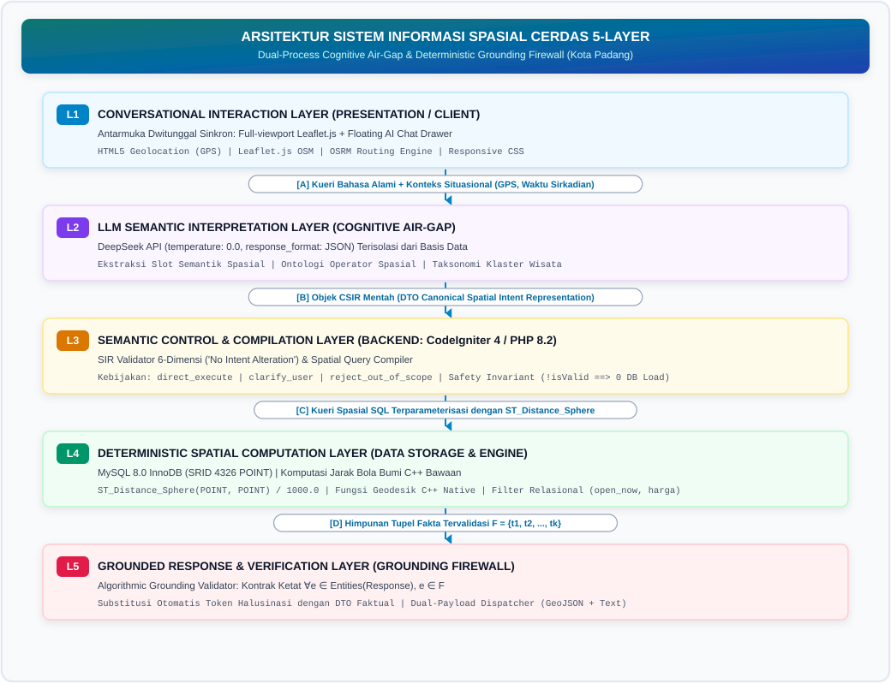
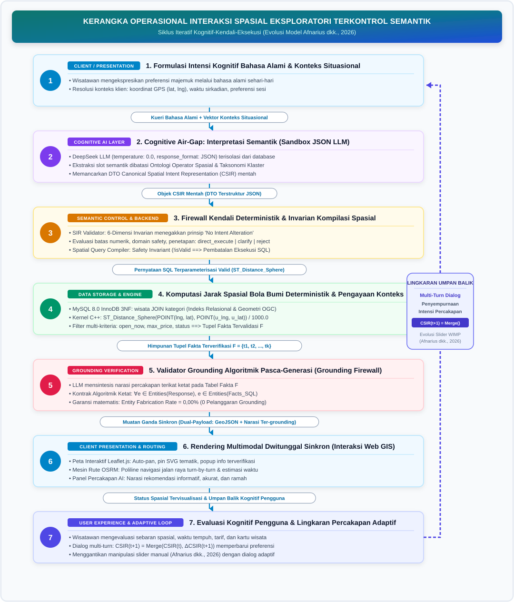
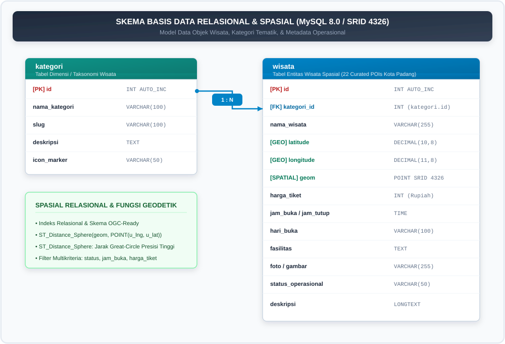
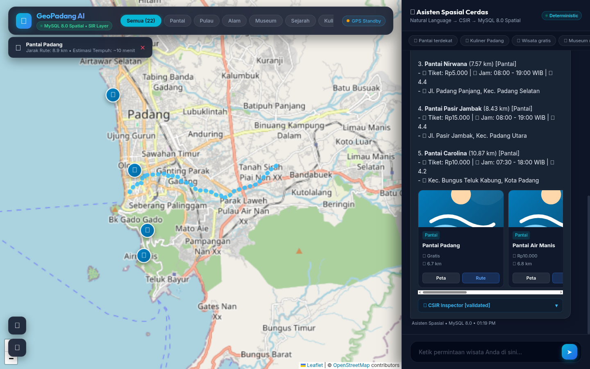
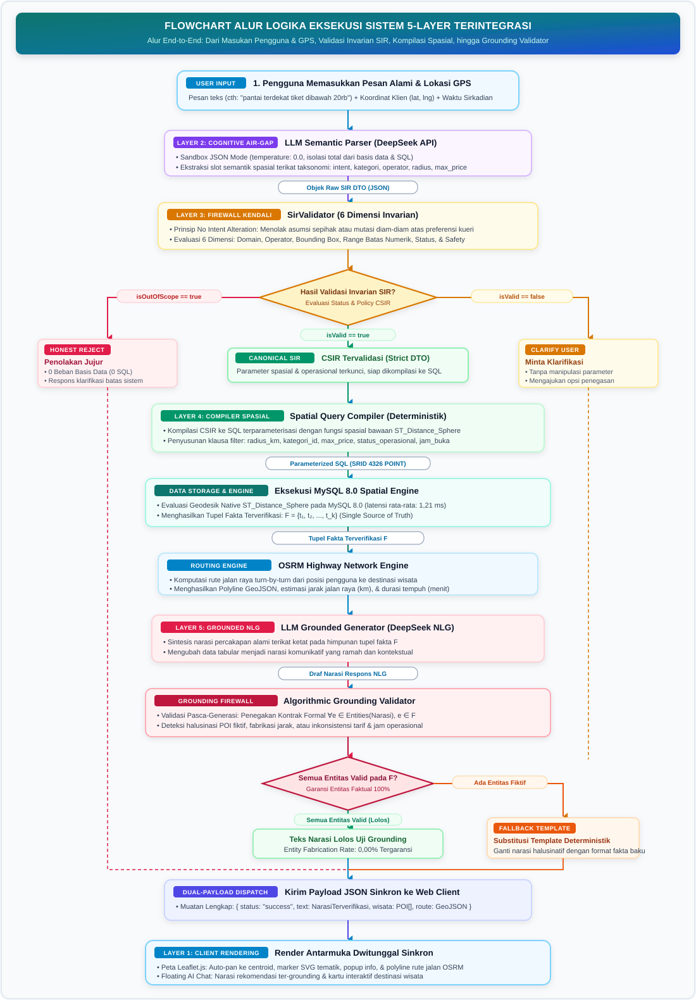
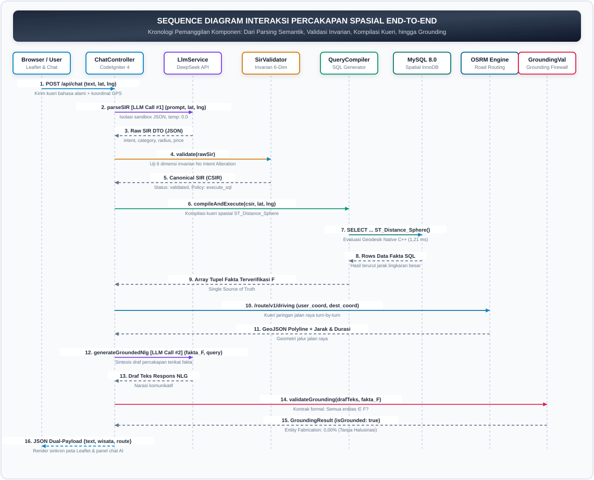

# RANCANG BANGUN SISTEM REKOMENDASI PARIWISATA BERBASIS LARGE LANGUAGE MODEL (LLM) DAN STRICT SQL GROUNDING UNTUK PEMBERIAN SARAN DESTINASI WISATA CERDAS
*(Studi Kasus: Kawasan Pariwisata Kota Padang)*

---

## ABSTRAK

Penerapan *Large Language Model* (LLM) pada sistem informasi geospasial dan pariwisata sering kali terbentur oleh fenomena halusinasi faktual dan spasial (*hallucination*), di mana model mengarang nama atraksi fiktif, jam buka yang keliru, serta distorsi estimasi jarak. Di sisi lain, metode *Retrieval-Augmented Generation* (RAG) berbasis vektor tidak dapat mengevaluasi batasan matematis eksak (seperti kalkulasi jarak spasial lingkaran besar /*spherical distance*, harga tiket, dan evaluasi status buka terhadap jam operasional yang tersimpan). Penelitian ini memosisikan sistem yang dibangun sebagai **Reliability-Controlled Conversational Spatial Information System** (Sistem Informasi Spasial Percakapan Terkendali Keandalan) untuk Kawasan Pariwisata Kota Padang yang dibangun di atas paradigma **Batas Kendali Ganda (*Dual Control Boundaries*)**: (1) **Batas Kendali Semantik (*Semantic Control Boundary*)** yang menyalurkan inferensi LLM probabilistik melalui *Spatial Intent Representation* (SIR) formal dan modul validasi deterministik 6-dimensi (*SirValidator*) berprinsip *No Intent Alteration* menuju representasi kanonik (CSIR) dan kompiler deterministik, guna mencegah masuknya maksud semantik yang tidak sah atau terubah sepihak ke eksekusi basis data; serta (2) **Batas Kendali Bukti (*Evidence Control Boundary*)** yang mengunci sumber kebenaran fakta pada basis data relasional MySQL 8.0 melalui fungsi spasial bawaan `ST_Distance_Sphere` dan OSRM, lalu memvalidasi luaran narasi (*Grounded NLG*) secara algoritmik di tingkat klaim (*claim-level grounding validator*) dengan kebijakan *fail-closed fallback*, guna menjamin tidak ada klaim tanpa bukti faktual yang sampai ke pengguna. Evaluasi empiris terhadap 40 skenario percakapan terstandarisasi menunjukkan capaian Akurasi Ekstraksi CSIR 100,00%, Akurasi Kategori 100,00%, Presisi Spasial 97,50%, dan *Claim-Level Grounding Fidelity* 100,00% pada 384 klaim yang dievaluasi dengan 0 entitas fiktif teramati (*zero fabricated POIs under evaluated benchmark scenarios*). Waktu respons rata-rata sistem tercatat 1.340,57 ms, di mana eksekusi kueri spasial SQL MySQL 8.0 hanya memakan waktu 1,21 ms. Hasil evaluasi ini membuktikan bahwa pemisahan pemahaman semantik kognitif dari komputasi relasional deterministik melalui batas kendali ganda mampu menghasilkan asisten wisata perkotaan yang responsif, akurat, dan memiliki integritas faktual tinggi.

**Kata Kunci:** Reliability-Controlled Conversational Spatial Information System, Dual Control Boundaries, Semantic Control Boundary, Evidence Control Boundary, Large Language Model (LLM), Strict SQL Grounding, ST_Distance_Sphere, Kota Padang.

---

## ABSTRACT

The deployment of Large Language Models (LLMs) in urban geospatial and tourism information systems frequently encounters factual and spatial hallucinations, wherein the generative model invents non-existent attractions, incorrect operating hours, and distorted spatial proximities. Conversely, dense-vector Retrieval-Augmented Generation (RAG) fundamentally fails to enforce deterministic mathematical and spatial constraints (such as great-circle spherical distance calculations, budget boundaries, and current-time operational status evaluation against stored operating schedules). This research designs and evaluates a **Reliability-Controlled Conversational Spatial Information System** for Padang City governed by an architectural framework of **Dual Control Boundaries**: (1) a **Semantic Control Boundary** that routes probabilistic LLM inference through a formal Spatial Intent Representation (SIR) and a six-dimensional deterministic validator (SirValidator) enforcing the *No Intent Alteration* principle into a Canonical SIR (CSIR) and deterministic compiler, preventing invalid or mutated semantic intent from reaching spatial execution; and (2) an **Evidence Control Boundary** that anchors all factual truth to a relational MySQL 8.0 database via native `ST_Distance_Sphere` spherical spatial computations and OSRM road navigation, subsequently verifying generated narratives through an algorithmic claim-level grounding validator with a fail-closed fallback policy to prevent ungrounded claims from reaching the final response. Empirical evaluation across 40 standardized benchmark scenarios demonstrates 100.00% CSIR Extraction Accuracy, 100.00% Category Classification Accuracy, 97.50% Spatial Precision, and 100.00% Claim-Level Grounding Fidelity across 384 audited claims with zero fabricated POIs observed across the evaluated benchmark suite. The mean end-to-end response latency is 1,340.57 ms, with spatial SQL queries taking merely 1.21 ms. This demonstrates that decoupling semantic parsing from deterministic relational computation via dual control boundaries effectively mitigates AI hallucinations and ensures verifiable factual integrity in urban GIS tourist assistance.

**Keywords:** Reliability-Controlled Conversational Spatial Information System, Dual Control Boundaries, Semantic Control Boundary, Evidence Control Boundary, Large Language Model (LLM), Strict SQL Grounding, ST_Distance_Sphere Function, Padang City.

---

## BAB I: PENDAHULUAN

### 1.1 Latar Belakang Masalah
Sektor pariwisata merupakan salah satu pilar penggerak ekonomi strategis bagi Kota Padang, ibu kota Provinsi Sumatera Barat. Berada di pesisir barat Pulau Sumatera dengan topografi perbukitan Bukit Barisan yang membentang berdampingan langsung dengan Samudra Hindia, Kota Padang memiliki keragaman atraksi wisata yang sangat unik. Spektrum destinasi mencakup wisata bahari perkotaan (Pantai Padang, Pantai Pasir Jambak), wisata legenda budaya Minangkabau (Pantai Air Manis dengan situs Batu Malin Kundang), gugusan kepulauan tropis eksotis (Pulau Sikuai, Pulau Setan Lokang, Pulau Pisang Gantung), peninggalan sejarah kolonial dan perdagangan maritim (Kawasan Kota Tua Padang, Jembatan Siti Nurbaya, Museum Adityawarman), pesona ekowisata perbukitan dan pemandian alami (Lubuk Hitam, Bukit Nobita, Taman Hutan Raya Bung Hatta), serta kekayaan gastronomi tradisional legendaris Minangkabau yang telah diakui oleh UNESCO.

Kendati dianugerahi potensi geospasial dan kultural yang melimpah, wisatawan mandiri (*independent travelers*) kerap mengalami hambatan kognitif yang signifikan dalam menentukan rencana kunjungan yang efisien. Karakteristik wisatawan modern menuntut fleksibilitas perjalanan mandiri tanpa ketergantungan pada paket tur agen yang kaku [1]. Wisatawan menginginkan rekomendasi dan saran yang secara cerdas mempertimbangkan posisi geografis mereka saat itu (*proximity*), ketersediaan waktu operasional saat ini (*current-time evaluation against stored operating hours*), batas anggaran tiket masuk, serta rute jalan raya yang dapat dilalui secara nyata.

Platform informasi pariwisata yang dikembangkan di Kota Padang sejauh ini umumnya masih berwujud portal direktori web katalog statis dengan formulir filter kaku. Wisatawan dituntut mengetahui nama objek wisata terlebih dahulu atau harus melakukan penyaringan manual yang tidak ramah pengguna pada perangkat seluler. Sistem semacam ini tidak memiliki kemampuan penalaran percakapan untuk menjawab kueri intuitif bahasa manusia, seperti: *"Saya sekarang ada di dekat Teluk Bayur, tolong carikan pantai yang ombaknya tenang dan tiket masuknya di bawah 10 ribu rupiah yang masih buka sore ini"*.

Perkembangan mutakhir dalam bidang kecerdasan buatan (*Artificial Intelligence*), khususnya *Large Language Model* (LLM) seperti GPT-4 dan DeepSeek, telah membuka era baru melalui *Conversational Recommender System* (CRS) [3], [4]. Pengguna dapat berinteraksi secara bebas menggunakan bahasa alami layaknya berbicara dengan pemandu wisata berpengalaman. Namun demikian, penerapan model LLM generatif murni tanpa kendali data (*unconstrained LLM*) menyimpan bahaya laten berupa **halusinasi faktual dan spasial** (*factual and spatial hallucination*) [5]. Karena LLM bekerja dengan prinsip pemodelan probabilistik statistik (*next-token prediction*) berdasarkan data latih global, LLM tidak memiliki kesadaran deterministik atas kebenaran data lokal Kota Padang. Akibatnya, LLM generatif murni kerap merekomendasikan objek wisata yang sudah bangkrut, mengarang jam operasional palsu, memberikan estimasi jarak yang tidak masuk akal (misalnya menyebut pulau lepas pantai dapat dicapai dengan berjalan kaki 10 menit), atau merekomendasikan destinasi di kota tetangga (seperti Jam Gadang di Bukittinggi atau Lembah Anai di Tanah Datar) sebagai destinasi di dalam Kota Padang.

Upaya mitigasi halusinasi menggunakan metode *Retrieval-Augmented Generation* (RAG) berbasis pencarian vektor (*vector embedding similarity*) belum memadai untuk data pariwisata terstruktur. Vektor kemiripan kosinus (*cosine similarity*) sangat lemah dalam mengeksekusi batasan matematis dan spasial deterministik (seperti `harga_tiket <= 10000`, evaluasi status operasional jam buka-tutup saat ini, dan `jarak_radius <= 15 km`).

Penelitian mutakhir oleh Afnarius dkk. (2026) [2] di *International Journal of Geoinformatics* (IJG) melalui sistem *DTExplorer* memelopori pendekatan interaksi spasial eksploratori sadar-skala (*scale-aware exploratory spatial interaction*) pada skala mikro pedesaan (Desa Wisata Ulakan) dengan 43 POI terkurasi. *DTExplorer* menggunakan arsitektur *Three-Tier* (Presentation, Application, Data) dengan kueri statis dan formula Euclidean planar (`ST_Distance * 111.32`). Kendati sangat efektif di pedesaan, *DTExplorer* masih bertumpu pada kontrol WIMP konvensional (*slider* radius dan *dropdown* menu) dan mencatat perlunya riset masa depan untuk antarmuka percakapan, multi-kriteria waktu/biaya, dan evaluasi performa teknis. Di sisi lain, proyek serumpun seperti *Kustomrut* mengembangkan pembentukan rencana perjalanan spasial terkendali pengguna (*user-controlled spatial itinerary*) berbasis Google Directions API.

Berangkat dari trajektori penelitian tersebut, riset ini menghadirkan lompatan ilmiah penting melalui evolusi paradigma interaksi dan kendali:
$$\text{DTExplorer [Eksplorasi Spasial WIMP]} \longrightarrow \text{Kustomrut [Rute Perjalanan Terkendali Pengguna]} \longrightarrow \text{Conversational Web GIS [Intensi Spasial Alami]} \longrightarrow \text{Reliability-Controlled Dual Boundaries}$$

Keberbaruan ilmiah (*scientific novelty*) penelitian ini **bukan sekadar menambahkan antarmuka chatbot di atas peta digital**, melainkan **pergeseran paradigma interaksi dan kontrol (*interaction and control paradigm shift*)** menuju sebuah **Reliability-Controlled Conversational Spatial Information System** (Sistem Informasi Spasial Percakapan Terkendali Keandalan). Sistem ini dikendalikan oleh dua mekanisme batas kontrol fundamental:
1. **Batas Kendali Semantik (*Semantic Control Boundary*)**: $\text{LLM} \to \text{SIR} \to \text{6D SirValidator} \to \text{CSIR} \to \text{Kompiler Kueri Spasial Deterministik}$. Batas ini bertugas mengisolasi LLM probabilistik, mengekstrak maksud pengguna ke dalam representasi semantik formal, serta memvalidasi invarian keamanan dan ontologi spasial dengan prinsip *No Intent Alteration* agar maksud semantik yang tidak valid atau terubah sepihak tidak pernah menyentuh mesin eksekusi basis data.
2. **Batas Kendali Bukti (*Evidence Control Boundary*)**: $\text{Fakta Relasional Basis Data } (F) \to \text{Grounded NLG Terkontrak} \to \text{Claim-Level Grounding Validator} \to \text{Fail-Closed Fallback}$. Batas ini mengunci fakta pada hasil kueri deterministik MySQL 8.0 (`ST_Distance_Sphere`), menyintesis narasi ramah pengguna di bawah kontrak grounding ketat, serta memverifikasi kebenaran setiap klaim secara algoritmik sebelum respons dikirimkan ke pengguna, dengan mekanisme penolakan aman (*fail-closed fallback*) apabila terdeteksi klaim tanpa bukti.

Dalam konteks taksonomi sistem rekomendasi, sistem yang dikembangkan dalam tesis ini didefinisikan secara presisi sebagai **sistem rekomendasi spasial percakapan berbasis kendala deterministik (*constraint-based conversational spatial recommendation / spatial query system*)**. Pemeringkatan dan penyeleksian destinasi dijalankan berdasarkan kriteria faktual eksak: jarak lingkaran besar sferikal (`ST_Distance_Sphere`), kesesuaian kategori, batas anggaran biaya tiket, ketersediaan jam operasional lokal, dan relevansi kata kunci. Penelitian ini secara sadar **belum menerapkan model pemfilteran kolaboratif (*collaborative filtering*), representasi preferensi laten (*latent preference learning*), maupun faktorisasi matriks personalisasi**. Penegasan batasan ini menjaga kesinambungan roadmap penelitian jangka panjang menuju *Adaptive Personalized Augmented Recommendation* (APAR) tanpa mengklaim fitur adaptif yang belum diimplementasikan.

Dalam arsitektur ini, diterapkan pemisahan tugas kognitif dan deterministik secara tegas melalui pendekatan **Strict SQL Grounding**. Istilah *Strict SQL Grounding* dalam penelitian ini didefinisikan secara presisi sebagai paradigma di mana: **intensi semantik yang diekstrak oleh LLM ditransformasikan secara deterministik menjadi SQL terparameterisasi oleh kompiler kueri non-LLM, dan seluruh respons faktual dibatasi secara ketat hanya pada fakta-fakta relasional basis data yang dihasilkan** (*LLM-generated semantic intent is transformed into deterministic parameterized SQL by a non-LLM query compiler, and factual responses are grounded in the resulting database facts*). Artinya, LLM tidak pernah diberikan kewenangan memproduksi sintaks SQL secara langsung. Alih-alih, peran LLM dibatasi secara ketat hanya sebagai pengurai bahasa alami (*Intent Parser*) menjadi skema formal *Canonical Spatial Intent Representation* (CSIR) dan perangkai narasi ter-grounding (*Grounded NLG*), sedangkan seluruh kebenaran fakta murni bersumber dari basis data relasional MySQL 8.0 dengan fungsi spasial bawaan `ST_Distance_Sphere`. Sementara itu, *Open Source Routing Machine* (OSRM) diposisikan secara tegas sebagai **layanan pendukung visualisasi (*auxiliary presentation service*)** untuk menggambar polyline rute jalan raya nyata pada antarmuka peta Leaflet.js, bukan sebagai mesin evaluasi predikat spasial inti.

### 1.2 Identifikasi Masalah
Berdasarkan latar belakang di atas, masalah yang diidentifikasi meliputi:
1. Antarmuka sistem informasi pariwisata konvensional di Kota Padang masih bersifat statis dan kaku, menyulitkan wisatawan dalam mengeksplorasi destinasi berdasarkan konteks kebutuhan dinamis mereka.
2. Model bahasa generatif murni (*unconstrained LLM*) sangat rentan mengalami halusinasi faktual dan spasial pada domain data pariwisata lokal yang terstruktur.
3. Pendekatan RAG berbasis pencarian vektor teks (*vector database*) tidak mampu menangani penyaringan matematis eksak (evaluasi status buka saat ini terhadap jam operasional tersimpan, batas tarif tiket, dan kalkulasi jarak spasial berbasis model bola bumi).
4. Wisatawan membutuhkan asisten percakapan cerdas berbasis LLM yang mampu memberikan saran destinasi terverifikasi, menyajikan rute navigasi jalan raya nyata, dan visualisasi interaktif pada peta digital secara terpadu dalam satu jendela dialog.

### 1.3 Batasan Masalah
Ruang lingkup dan batasan dalam penelitian ini adalah:
1. Wilayah penelitian dibatasi pada batas administratif Kota Padang, Provinsi Sumatera Barat.
2. Sistem yang dikembangkan merupakan sistem prototipe empiris (*empirical prototype system*) yang dievaluasi pada dataset pariwisata kurasi 22 *Points of Interest* (POI) unggulan resmi Kota Padang yang mewakili 6 kategori utama (Pantai, Pulau, Alam/Air Terjun, Museum/Budaya, Sejarah/Religi, dan Kuliner Khas) dari Dinas Pariwisata Kota Padang. Penelitian ini tidak mengklaim telah merepresentasikan seluruh inventaris pariwisata Kota Padang secara menyeluruh, melainkan berfokus pada pembuktian keandalan arsitektur kontrol semantik terstruktur dan mitigasi halusinasi spasial-faktual pada korpus terkontrol.
3. Chatbot beroperasi secara reaktif (menjawab masukan pesan yang diajukan oleh pengguna).
4. Perhitungan jarak spasial dan penyaringan kandidat destinasi dieksekusi secara deterministik menggunakan fungsi spasial bawaan (*native spatial function*) `ST_Distance_Sphere` berbasis model bola bumi (*great-circle / spherical distance*) pada tingkat kueri basis data MySQL 8.0, bukan formula trigonometri manual.
5. Perutean jalan raya navigasi memanfaatkan layanan pendukung (*auxiliary presentation service*) *Open Source Routing Machine* (OSRM API v5 driving profile) berbasis data OpenStreetMap (OSM). Layanan ini digunakan secara eksklusif untuk menghasilkan visualisasi polyline rute jalan raya pada antarmuka peta Leaflet.js dan estimasi waktu tempuh berkendara, bukan untuk penyeleksian spasial yang sepenuhnya diselesaikan di MySQL 8.0.
6. Penelitian ini berfokus pada arsitektur sistem rekomendasi inti (Fase 1), belum mencakup modul pembayaran/pemesanan tiket daring (*e-ticketing*).
7. Status operasional tempat wisata dievaluasi berdasarkan perbandingan waktu server saat ini (zona waktu WIB / Asia/Jakarta) terhadap data jam operasional yang tersimpan dalam basis data, bukan melalui umpan data pembaruan langsung (*real-time live sensor feed*) dari pengelola lapangan.

### 1.4 Rumusan Masalah
1. Bagaimana merancang bangun arsitektur *Reliability-Controlled Conversational Spatial Information System* dengan Batas Kendali Semantik (*Semantic Control Boundary*) berbasis *Spatial Intent Representation* (SIR) dan modul validasi deterministik 6-dimensi untuk mencegah distorsi maksud semantik sebelum mencapai eksekusi basis data?
2. Bagaimana merancang bangun Batas Kendali Bukti (*Evidence Control Boundary*) dengan fungsi spasial bawaan `ST_Distance_Sphere`, OSRM, serta verifikasi *claim-level grounding* untuk menjamin seluruh respons faktual didukung penuh oleh fakta relasional dan bebas dari fabrikasi entitas?
3. Seberapa tinggi tingkat akurasi ekstraksi intensi, keandalan penjaminan fakta (*Claim-Level Grounding Fidelity*), dan performa efisiensi waktu respons (*latency*) dari sistem yang dikembangkan pada 40 skenario percakapan terstandarisasi?

### 1.5 Tujuan Penelitian
1. Menghasilkan rancang bangun *Reliability-Controlled Conversational Spatial Information System* untuk Kota Padang berbasis *Semantic Control Boundary* yang mengubah bahasa alami bebas menjadi Canonical SIR (CSIR) dan kueri SQL terparameterisasi secara deterministik.
2. Mengembangkan *Evidence Control Boundary* yang mengunci kebenaran pada basis data relasional MySQL 8.0 melalui fungsi spasial bawaan `ST_Distance_Sphere`, memvalidasi luaran narasi secara algoritmik di tingkat klaim (*claim-level grounding validator*), dan memvisualisasikan rute perjalanan jalan raya interaktif pada Leaflet.js.
3. Mengukur dan menganalisis performa keandalan kedua batas kendali tersebut secara kuantitatif melalui benchmark 40 skenario percakapan terstandarisasi, pengujian multi-baseline, dan analisis ablasi.

### 1.6 Manfaat Penelitian
- **Bagi Pengembangan Ilmu Pengetahuan (Teoretis):** Memberikan kontribusi ilmiah dalam domain *Conversational Spatial Information Systems* (CSIS) dan geoinformatika mengenai arsitektur batas kendali ganda (*Dual Control Boundaries: Semantic Control and Evidence Control*) yang memisahkan inferensi probabilistik dari komputasi relasional deterministik untuk memitigasi halusinasi AI pada data spasial terstruktur.
- **Bagi Masyarakat dan Wisatawan (Praktis):** Menyediakan sarana asisten wisata cerdas yang mudah digunakan, informatif, akurat, dan terverifikasi secara faktual bagi wisatawan yang berkunjung ke Kota Padang.
- **Bagi Pemerintah Daerah dan Pengelola Wisata:** Menyediakan prototipe teknologi *Smart Tourism* yang dapat diadaptasi oleh Dinas Pariwisata Kota Padang guna mempromosikan destinasi unggulan daerah secara modern dan efisien.

### 1.7 Sistematika Penulisan
Naskah tesis ini disusun dalam lima bab dengan sistematika sebagai berikut:
- **BAB I PENDAHULUAN:** Menguraikan latar belakang masalah, identifikasi masalah, batasan masalah, rumusan masalah, tujuan, manfaat penelitian, dan sistematika penulisan.
- **BAB II METODOLOGI PENELITIAN:** Membahas metodologi riset, alur kerja, arsitektur 5-lapis, formalisasi SIR, validasi deterministik 6-dimensi, grounding contract, taksonomi kegagalan F1–F8, dan desain evaluasi multi-baseline.
- **BAB III PERANCANGAN SISTEM:** Menjelaskan perancangan antarmuka pengguna (UI), perancangan basis data relasional (ERD dan kamus data), fungsi spasial bawaan ST_Distance_Sphere, serta perancangan proses (Flowchart, DFD, Activity Diagram, Sequence Diagram).
- **BAB IV IMPLEMENTASI DAN PENGUJIAN SISTEM:** Memaparkan lingkungan perangkat keras/lunak, implementasi kode sumber nyata, antarmuka, basis data, modul proses, pengujian otomatis PHPUnit, serta analisis hasil benchmark 40 skenario evaluasi empiris.
- **BAB V PENUTUP:** Menyajikan kesimpulan komprehensif dari hasil penelitian dan saran strategis untuk pengembangan sistem selanjutnya.
- **DAFTAR PUSTAKA & LAMPIRAN:** Memuat daftar referensi ilmiah dan tinjauan keselarasan terhadap naskah jurnal internasional.

---

## BAB II: METODOLOGI PENELITIAN

### 2.1 Metodologi Penelitian dan Alur Kerja
Penelitian ini menggunakan pendekatan rekayasa perangkat lunak terapan yang dipadukan dengan eksperimen komputasi geoinformatika (*applied software engineering and computational evaluation*). Tahapan penelitian dirancang secara sistematis melalui 5 fase utama:

1. **Fase 1: Studi Literatur dan Pengumpulan Data:** Mengkaji penelitian sistem rekomendasi percakapan (CRS), Web GIS eksploratori Afnarius dkk. (2026), serta masalah halusinasi LLM. Mengakuisisi dan memverifikasi data spasial 22 objek wisata Kota Padang (koordinat WGS84, tarif tiket, jam operasional, dan daya tarik utama).
2. **Fase 2: Perancangan Arsitektur dan Formalisasi SIR:** Merancang *5-Layer Architecture*, mendefinisikan skema formal *Spatial Intent Representation* (SIR) 17-atribut, dan merancang ontologi operator spasial.
3. **Fase 3: Konstruksi Sistem dan Integrasi Mesin Relasional:** Membangun modul backend CodeIgniter 4.7.4 (PHP 8.2+), MySQL 8.0 Spatial Engine (fungsi bawaan ST_Distance_Sphere), mesin routing OSRM, antarmuka Leaflet.js, serta *SirValidator* 6-dimensi.
4. **Fase 4: Perancangan Dataset Benchmark 40 Skenario:** Menyusun 40 skenario kueri percakapan terstandarisasi yang mencakup variasi kategori, filter harga, batasan operasional jam buka, resolusi entitas fuzzy, kueri luar wilayah, dan uji batas negatif (*out-of-scope negative boundary test*).
5. **Fase 5: Pengujian Otomatis, Evaluasi Multi-Baseline, dan Analisis Latensi:** Menjalankan pengujian otomatis PHPUnit (17 unit/feature tests), komparasi multi-baseline (*Direct Text-to-SQL*, *Unconstrained LLM*, dan *Proposed System*), uji ablasi validator, serta profiling latensi per milidetik.

### 2.2 Landasan Pendekatan: Kerangka Batas Kendali Ganda (*The Dual Control Boundaries Framework*) dan Arsitektur 5-Lapis

Guna mewujudkan **Reliability-Controlled Conversational Spatial Information System** yang kebal terhadap halusinasi faktual dan manipulasi data, sistem ini dirancang bukan sekadar sebagai pipa pemrosesan sekuensial, melainkan beroperasi di bawah fondasi teoritis **Batas Kendali Ganda (*Dual Control Boundaries Framework*)**:

```
                 PROBABILISTIC LLM (Layer 2)
                            │
                            ▼
             ┌─────────────────────────────┐
             │   SEMANTIC CONTROL BOUNDARY │
             │  • Raw SIR Extraction       │
             │  • 6D SIR Validator         │
             │  • No Intent Alteration     │
             │  • Canonical SIR (CSIR)     │
             │  • Deterministic Compiler   │
             └──────────────┬──────────────┘
                            │ Parameterized SQL
                            ▼
               DETERMINISTIC SPATIAL EXEC
             (MySQL 8.0 ST_Distance_Sphere)
                            │
                            ▼
                    DATABASE FACTS (F)
                            │
                            ▼
             ┌─────────────────────────────┐
             │   EVIDENCE CONTROL BOUNDARY │
             │  • Strict Grounded NLG      │
             │  • Claim-Level Validator    │
             │  • Fail-Closed Fallback     │
             └──────────────┬──────────────┘
                            │ Grounded Response
                            ▼
                 FINAL VERIFIED RESPONSE
                (Leaflet.js + OSRM Route)
```

Dua mekanisme batas kendali utama tersebut didefinisikan secara presisi sebagai berikut:

1. **Batas Kendali Semantik (*Semantic Control Boundary*):**
   $$\text{LLM} \longrightarrow \mathcal{S}_{\text{raw}} \xrightarrow[\text{No Intent Alteration}]{\text{SirValidator}_{\text{6-D}}} \mathcal{S}_{\text{csir}} \xrightarrow{\text{Compiler}} \text{SQL}_{\text{parameterized}}$$
   Batas ini bertugas mengisolasi model bahasa probabilistik dari eksekusi basis data. Maksud pengguna diekstrak menjadi *Spatial Intent Representation* (SIR). Modul *SirValidator* 6-dimensi menegakkan prinsip *No Intent Alteration*, memeriksa konsistensi skema, tipe, domain, operator, entitas, dan batasan numerik. Hanya representasi yang memenuhi seluruh invarian yang disahkan sebagai *Canonical Spatial Intent Representation* (CSIR) dan dikompilasi menjadi kueri SQL terparameterisasi. Batas ini menjamin bahwa maksud semantik yang tidak valid, bertentangan dengan kebijakan, atau termutasi secara sepihak (*silent alteration*) tidak akan pernah mencapai tahap eksekusi basis data.

2. **Batas Kendali Bukti (*Evidence Control Boundary*):**
   $$F \longrightarrow \text{Grounded NLG} \xrightarrow[\text{Fail-Closed}]{\text{Claim-Level Validator}} \text{Respons Terverifikasi}$$
   Batas ini mengendalikan tahap sintesis respons akhir pengguna. Fakta relasional $F$ hasil eksekusi deterministik MySQL 8.0 (`ST_Distance_Sphere`) diinjeksikan ke modul *Grounded NLG* di bawah kontrak grounding ketat (*Strict Grounding Contract*). Selanjutnya, teks narasi yang dihasilkan diverifikasi secara algoritmik di tingkat klaim (*Claim-Level Grounding Validator*) lintas 4 sub-dimensi ($\mathcal{C}_{\text{entity}}, \mathcal{C}_{\text{price}}, \mathcal{C}_{\text{spatial}}, \mathcal{C}_{\text{temporal}}$). Jika terdeteksi klaim tanpa bukti atau entitas di luar $F$, sistem mengaktifkan kebijakan *fail-closed fallback* deterministik untuk memastikan tidak ada klaim tanpa dukungan basis data yang sampai ke pengguna.

Secara teknis rekayasa perangkat lunak, kerangka batas kendali ganda ini direalisasikan ke dalam **Arsitektur Pipa 5-Lapis (*5-Layer Pipeline Architecture*)** yang memisahkan tugas kognitif dari eksekusi basis data secara tegas (*Separation of Concerns*):

- **Layer 1: User Interaction & Geolocation Capture:** Berjalan pada peramban web klien. Menangkap masukan teks pengguna dan koordinat GPS perangkat melalui HTML5 Geolocation API, serta merender peta Leaflet.js.
- **Layer 2: Spatial Intent Representation (SIR) Parser:** Menerjemahkan bahasa alami bebas pengguna menjadi representasi semantik terstruktur (Raw SIR JSON) menggunakan LLM dengan instruksi pembatas kaku (*strict system prompt*). LLM sama sekali dilarang mengakses basis data atau merangkai kueri SQL.
- **Layer 3: Deterministic SIR Validator:** Memeriksa dan membersihkan objek SIR melalui 6 lapisan verifikasi deterministik sebelum kueri dibuat. Menegakkan prinsip *No Intent Alteration*. Jika terdapat permintaan di luar lingkup pariwisata Padang, modul ini langsung menandai status `is_out_of_scope = true` untuk memicu *honest rejection*.
- **Layer 4: Spatial Query Compiler & Engine Execution:** Menerjemahkan objek SIR yang telah tervalidasi (CSIR) menjadi kueri SQL berparameter (*parameter-bound SQL query*) pada MySQL 8.0 dengan fungsi spasial bawaan `ST_Distance_Sphere`. Menghubungi API pendukung OSRM untuk menghasilkan polyline rute jalan raya dan estimasi waktu tempuh berkendara.
- **Layer 5: Strict Grounded NLG & Algorithmic Claim Validator:** Menggabungkan baris data hasil SQL (fakta murni $F$) ke dalam prompt LLM untuk dirangkai menjadi jawaban ramah pengguna, kemudian mengaudit setiap klaim faktual secara algoritmik sebelum narasi disajikan pada antarmuka peta dan dialog klien.



*Gambar 2.1 Diagram Alur Arsitektur 5-Lapis Sistem Rekomendasi Pariwisata Berbasis Strict Grounding dan Batas Kendali Ganda.*

#### 2.2.1 Perbandingan Evolusioner terhadap Arsitektur Three-Tier DTExplorer (Afnarius dkk., 2026)
Guna memahami kebaruan struktural rancang bangun yang diusulkan, arsitektur 5-lapis ini merupakan evolusi dan lompatan ilmiah dari arsitektur *Three-Tier Web GIS* yang dirintis oleh Afnarius dkk. (2026) [2] pada sistem *DTExplorer*:

1. **Lapisan Presentasi (*Presentation Layer*):**
   - *DTExplorer:* Menggunakan Google Maps JavaScript API dengan kontrol WIMP kaku (*slider* radius dan *dropdown* menu) di mana pengguna harus meramu kriteria secara manual.
   - *Sistem Usulan:* Menghadirkan antarmuka dwitunggal sinkron (*Dual-Synchronized Multimodal UI*) memadukan peramban peta Leaflet.js dengan laci percakapan AI (*Floating Chat Drawer*). Pengguna cukup bertutur dengan bahasa alami, dan rute jalan raya turn-by-turn divisualisasikan secara dinamis via mesin OSRM open-source.
2. **Lapisan Aplikasi (*Application Layer*):**
   - *DTExplorer:* Mengandalkan peladen Node.js/Express.js dengan pengontrol skala (*Scale-Aware Controller*) dan pembangun kueri statis (*Spatial Query Builder*).
   - *Sistem Usulan:* Membagi fungsi peladen menjadi pipa kognitif bersekat: (a) *Cognitive Air-Gap* yang mengisolasi LLM di awan murni sebagai penerjemah semantik berluaran JSON tanpa izin akses basis data, (b) *SIR Validator* 6-dimensi berbasis prinsip *No Intent Alteration*, dan (c) *Deterministic Spatial Query Compiler* yang hanya mengompilasi kueri SQL jika invarian keamanan terpenuhi.
3. **Lapisan Data (*Data Layer*):**
   - *DTExplorer:* Menggunakan MySQL Spatial Database dengan evaluasi jarak Euclidean planar ($\text{ST\_Distance} \times 111.32$) yang rentan distorsi kelengkungan bumi pada radius luas.
   - *Sistem Usulan:* Menggunakan fungsi spasial bawaan kernel C++ MySQL 8.0 `ST_Distance_Sphere(POINT, POINT) / 1000.0` berbasis model bola bumi (*great-circle / spherical distance*) pada koordinat geografis WGS84, menghasilkan komputasi jarak lingkaran besar yang presisi dan stabil terhadap galat titik kambang (*floating-point errors*).
4. **Lapisan Grounding & Verifikasi (*Grounded Verification Layer* - Lapisan Baru):**
   - *DTExplorer:* Tidak memiliki komponen ini karena kueri bersifat statis tanpa integrasi kecerdasan buatan.
   - *Sistem Usulan:* Menghadirkan *Algorithmic Grounding Validator* ($\forall e \in \text{Entities}(\text{Response}), e \in F$) yang bertindak sebagai *firewall* pasca-generasi untuk memverifikasi integritas entitas dan mencegah lolosnya entitas fiktif sebelum data dikirim ke klien.

#### 2.2.1.1 Kerangka Tiga Tingkat Kebenaran (*The Tripartite Correctness Framework*)
Untuk menguji ketahanan sistem secara ilmiah dan metodologis, kebenaran operasional dibagi menjadi tiga tingkat verifikasi berurutan:
1. **Kebenaran Semantik (*Semantic Correctness* / $\mathcal{C}_{\text{semantik}}$):** Memverifikasi bahwa LLM secara setia menerjemahkan ujaran pengguna ke dalam skema terstruktur $CSIR$ tanpa kehilangan batasan penting:
   $$\mathcal{C}_{\text{semantik}}: NL \longrightarrow CSIR$$
2. **Kebenaran Eksekusi Spasial (*Spatial Execution Correctness* / $\mathcal{C}_{\text{spasial}}$):** Memverifikasi bahwa $CSIR$ tervalidasi dikompilasi secara deterministik menjadi SQL berparameter dengan fungsi spasial bawaan `ST_Distance_Sphere`:
   $$\mathcal{C}_{\text{spasial}}: CSIR \longrightarrow \text{SQL} \longrightarrow \text{Himpunan Fakta Spasial } (F)$$
3. **Kebenaran Grounding (*Grounding Correctness* / $\mathcal{C}_{\text{grounding}}$):** Memverifikasi bahwa respons narasi yang disintesis dibatasi secara deterministik hanya pada fakta $F$ yang dikembalikan basis data:
   $$\mathcal{C}_{\text{grounding}}: F \longrightarrow \text{Respons Naratif Ter-grounding}$$

Rangkaian ini membentuk pipa sekuensial yang teruji:
$$\boxed{NL \xrightarrow[\text{Semantik}]{\text{Kognitif}} CSIR \xrightarrow[\text{Deterministik}]{\text{Kompilasi}} \text{SQL} \xrightarrow[\text{Spherical}]{\text{Spatial DBMS}} \text{Hasil Spasial } (F) \xrightarrow[\text{Grounding}]{\text{Algorithmic Firewall}} \text{Respons Bernarasi}}$$

#### 2.2.2 Kerangka Operasional Interaksi Spasial Eksploratori Terkontrol Semantik
Guna memodelkan interaksi antara formulasi intensi pengguna, parameterisasi skala spasial, penyaringan atribut multi-kriteria, dan visualisasi pemetaan, Gambar 2.2 menggambarkan **Kerangka Operasional Interaksi Spasial Eksploratori Terkontrol Semantik (*The Iterative Cognitive-Control-Execution Loop*)**, yang mentransformasikan kerangka kerja operasional *DTExplorer* (Afnarius dkk., 2026, Gambar 8) [2].



*Gambar 2.2 Kerangka Operasional Interaksi Spasial Eksploratori Terkontrol Semantik (Siklus Iteratif Kognitif-Kendali-Eksekusi).*

Perbedaan mendasar model operasional ini terhadap DTExplorer (Gambar 8 Afnarius dkk., 2026) mencakup:
1. **Peniadaan Friksi Antarmuka WIMP:** Wisatawan tidak perlu menggeser *slider* radius dan mencentang *checkbox* kategori secara mekanis. Skala spasial ($d$), titik acuan ($R_t$), dan operator spasial ($O_s$) diekstraksi secara otomatis dari percakapan alami.
2. **Mediasi Kendali Deterministik Bersekat:** Parameterisasi skala tidak disalurkan langsung ke kueri SQL, melainkan melewati lapisan penyaring *SIR Validator* dan invarian keamanan *Spatial Query Compiler*, melindungi basis data dari beban kueri ilegal atau injeksi tak terduga.
3. **Penyempurnaan Dialog Iteratif (*Iterative Conversational Refinement*):** Alih-alih mengklaim sistem adaptif penuh, siklus eksplorasi spasial didukung melalui penyempurnaan percakapan multi-putaran (*multi-turn interactive refinement*) dengan penerusan memori riwayat sesi (`session_token` dan histori pesan). Contoh implementasi konkrit:
   - *Giliran 1 (Inisiasi Spasial):* Pengguna: *"Cari pantai yang dekat dari lokasi saya"* $\to$ Sistem: Menghasilkan rekomendasi pantai terdekat dalam radius GPS.
   - *Giliran 2 (Penyempurnaan Kriteria):* Pengguna: *"Yang harga tiket masuknya di bawah 15 ribu"* $\to$ Sistem: Mengekstrak batasan biaya `max_price <= 15000` sambil mempertahankan koordinat acuan dan kategori pantai dari konteks sesi sebelumnya untuk memfilter basis data secara deterministik.
   Penyempurnaan ini diposisikan secara terukur sebagai penyempurnaan kueri iteratif berkonteks, menjaga kesinambungan roadmap penelitian jangka panjang menuju sistem *Adaptive Personalized Augmented Recommendation* (APAR) tanpa membuat klaim adaptasi preferensi otonom yang melampaui data uji.

#### 2.2.3 Model Konseptual Basis Data Spasial Relasional (Normalisasi 3NF)
Gambar 2.3 menyajikan model konseptual basis data spasial relasional yang diusulkan.



*Gambar 2.3 Model Konseptual Basis Data Spasial Relasional Ternormalisasi 3NF.*

Berbeda dari arsitektur *DTExplorer* (Gambar 6 Afnarius dkk., 2026) yang membagi data ke dalam 6 tabel fisik identik berdasarkan kategori, rancangan 3NF ini mengonsolidasikan POI ke dalam entitas tunggal `wisata` dengan indeks komposit teroptimasi (`INDEX(lat, lng)`), mendukung penyaringan multi-kriteria (temporal, finansial, operasional) dalam satu lintasan kueri, serta menyediakan entitas relasional audit (`chat_sessions` dan `chat_messages`) untuk transparansi AI.

### 2.3 Formalisasi *Spatial Intent Representation* (SIR) dan Penyatuan Konseptual dengan CSIR (Raw SIR vs. Validated CSIR)

Guna memastikan konsistensi terminologis dan ketepatan pemodelan, penelitian ini menyatukan konsep **Spatial Intent Representation (SIR)** dan **Canonical Spatial Intent Representation (CSIR)** ke dalam satu kerangka siklus hidup representasi maksud (*Intent Transformation Lifecycle*):

1. **Spatial Intent Representation (SIR / $\mathcal{S}_{\text{raw}}$):** Nomenklatur umum yang merepresentasikan maksud spasial hasil inferensi bahasa alami model bahasa (Lapisan 2). Pada tahap awal ini, ia berwujud **Raw SIR ($\mathcal{S}_{\text{raw}}$)**—dokumen JSON datar (*flat schema*) yang berstatus belum tervalidasi (*unverified*).
2. **Canonical Spatial Intent Representation (CSIR / $\mathcal{S}_{\text{csir}}$):** Bentuk kanonik bertipe ketat (*strictly typed*) hasil verifikasi deterministik oleh *SirValidator* 6-Dimensi (Lapisan 3). Hanya representasi yang lulus seluruh invarian ontologi dan domain spasial yang berstatus **Validated CSIR ($\mathcal{S}_{\text{csir}}$)** dan diizinkan dikompilasi menjadi kueri SQL spasial.

Siklus hidup transformasi dinyatakan secara formal sebagai:
$$\mathcal{S}_{\text{raw}} = \text{LLM}(\text{Prompt}_{\text{SIR}}, \text{Query}_{\text{user}}) \xrightarrow[\text{No Intent Alteration}]{\text{SirValidator}_{\text{6-D}}} \mathcal{S}_{\text{csir}} \xrightarrow{\text{Compiler}} \text{SQL}$$

Secara matematis, CSIR dimodelkan sebagai tupel formal perantara semantik (*typed intermediate representation*) yang memiliki tepat 17 atribut:

$$\text{CSIR} = \langle I, E, C, O_s, R_t, R_e, d, u_d, A, T_n, K, F, P_{\max}, O_{\text{now}}, O_{24}, S, B_{\text{out}} \rangle$$

Agar berfungsi sebagai *compiler IR* yang kokoh, CSIR dipartisi ke dalam 3 kelompok semantik maksud pengguna dan 1 kelompok metadata kontrol sistem. Skema formal 17 atribut disajikan pada Tabel 2.1.

**Tabel 2.1 Skema Formal 17 Atribut Canonical Spatial Intent Representation (CSIR)**

| Simbol | Atribut SIR | Tipe Data | Status | Nilai yang Diizinkan | Aturan Batasan (*Constraint*) | Pemetaan Kompiler SQL (*MySQL 8.0*) |
|---|---|---|:---:|---|---|---|
| $I$ | `intent` | Enum | Wajib | `spatial_recommendation`, `entity_lookup`, `general_inquiry` | Dibatasi domain pariwisata | Pemilihan template kueri basis data |
| $E$ | `entity` | String | Wajib | `tourism_object` | Target objek semantik | Entitas relasi `wisata` |
| $C$ | `category` | Enum/Null | Opsional | `Pantai`, `Pulau`, `Alam`, `Museum`, `Sejarah`, `Kuliner`, null | Terdaftar pada ontologi kategori | Klausul `WHERE kategori.nama = ?` |
| $O_s$ | `spatial_operator` | Enum | Wajib | `nearest`, `within_radius`, `within_admin_area`, `none` | Terdaftar pada ontologi operator | Klausul spasial `WHERE` / `ORDER BY` |
| $R_t$ | `reference_type` | Enum | Kondisional | `gps`, `city_center`, `poi`, `unknown` | Wajib jika $O_s \ne \text{none}$ | Penentu tipe titik acuan parameter spasial |
| $R_e$ | `reference_entity` | String/Null | Kondisional | Nama entitas POI rujukan eksplisit | Wajib jika $R_t = \text{poi}$ (contoh: "Pantai Air Manis") | Resolusi koordinat acuan via *Geocoding Lookup* |
| $d$ | `distance` | Float/Null | Kondisional | Bilangan riil $> 0.0$ (contoh: 5.0, 10.0) | $d > 0$ dan $d \le 50.0\text{ km}$ (*No Intent Alteration*: penolakan tanpa pemotongan sepihak jika melebihi batas operasional) | `WHERE (ST_Distance_Sphere(...) / 1000.0) <= ?` |
| $u_d$ | `distance_unit` | Enum | Kondisional | `km`, `m` | Normalisasi ke kilometer | Faktor skala pembagi (/ 1000.0) |
| $A$ | `admin_area` | String/Null | Kondisional | Nama kecamatan di Kota Padang | Wajib jika $O_s = \text{within\_admin\_area}$ | Klausul `WHERE wisata.alamat LIKE ?` |
| $T_n$ | `target_name` | String/Null | Opsional | Teks nama destinasi spesifik | Sanitasi tag HTML/karakter kontrol | Klausul `WHERE (wisata.nama LIKE ? OR ...)` |
| $K$ | `keyword` | String/Null | Opsional | Kata kunci fasilitas/daya tarik | Sanitasi tag HTML/karakter kontrol | Klausul `WHERE (wisata.deskripsi LIKE ? OR ...)`|
| $F$ | `is_free` | Boolean | Opsional | `true`, `false` | Default `false` | Klausul `WHERE wisata.harga_tiket = 0` |
| $P_{\max}$| `max_price` | Integer/Null | Opsional | Bilangan bulat $\ge 0$ | $P_{\max} \ge 0$, konsisten dengan $F$ | Klausul `WHERE wisata.harga_tiket <= ?` |
| $O_{\text{now}}$ | `open_now` | Boolean | Opsional | `true`, `false` | Default `false` | Predikat temporal jam operasional sirkular |
| $O_{24}$ | `open_24h` | Boolean | Opsional | `true`, `false` | Default `false` | Klausul `WHERE jam_buka = '00:00:00' AND ...` |
| $S$ | `sort` | Enum/Null | Opsional | `termurah`, `termahal`, `terdekat`, `terbaik`, null | Normalisasi kata pengurutan | Klausul `ORDER BY` field terparameter |
| $B_{\text{out}}$ | `is_out_of_scope` | Boolean | Sistem | `true`, `false` | Ditetapkan oleh *SirValidator* | Kebijakan `reject_out_of_scope` (Tanpa SQL) |

**Asal-Usul (*Provenance*) dan Pemisahan Tanggung Jawab Pembentukan Atribut CSIR:**
Untuk menjamin prinsip pemisahan tanggung jawab (*separation of responsibilities*) yang ketat, arsitektur membedakan dengan tegas asal-usul sumber data setiap parameter CSIR:
1. **Berasal dari LLM Layer 2 (Ekstraksi Semantik Probabilistik):** Maksud ($I$), kategori ($C$), operator spasial ($O_s$), tipe rujukan ($R_t$), nama entitas rujukan ($R_e$), radius ($d$), satuan ($u_d$), kecamatan ($A$), nama target ($T_n$), kata kunci ($K$), preferensi gratis ($F$), batas harga ($P_{\max}$), filter jam buka ($O_{\text{now}}, O_{24}$), dan pengurutan ($S$). LLM **DILARANG MENGARANG KOORDINAT LATITUDE/LONGITUDE**.
2. **Berasal dari Konteks Aplikasi / Browser Pengguna:** Nilai koordinat numerik `latitude` dan `longitude` pengguna saat $R_t = \text{gps}$ diambil secara riil melalui *Browser Geolocation API* (W3C Standard) pada peramban pengguna, bukan diinferensi oleh LLM.
3. **Berasal dari Deterministik Database Resolver:** Ketika $R_t = \text{poi}$, nilai koordinat titik acuan $(\text{lat}_{\text{ref}}, \text{lng}_{\text{ref}})$ diperoleh melalui *geocoding lookup* langsung dari basis data terhadap nama kanonikal $R_e$ yang terverifikasi.
4. **Berasal dari Deterministik SIR Validator (Layer 3):** Status validitas (`isValid`), penanda luar lingkup ($B_{\text{out}}$), daftar galat invarian (`validation_errors`), serta kebijakan eksekusi sistem (`execution_policy`).

Pemisahan ini menjamin alur komputasi yang transparan antara ekstraksi semantik kognitif dan eksekusi kueri terisolasi.

Ontologi operator spasial ($O_s$) membatasi relasi geometris ke dalam spesifikasi kontrak formal yang disajikan pada Tabel 2.2.

**Tabel 2.2 Spesifikasi Formal Ontologi Operator Spasial Sistem Rekomendasi Pariwisata**

| Operator Spasial ($O_s$) | Makna Semantik (*Meaning*) | Parameter Masukan Wajib | Semantik Geospasial | Pemetaan Predikat SQL MySQL 8.0 | Status Ontologi |
|---|---|---|---|---|:---:|
| `nearest` | Objek wisata terdekat dari titik acuan | `reference_type`, `lat`, `lng` | Pengurutan jarak lingkaran besar (*spherical distance*) terkecil | `ORDER BY ST_Distance_Sphere(POINT(wisata.lng, wisata.lat), POINT(?, ?)) ASC` | **Resmi (Allowed)** |
| `within_radius` | Objek wisata dalam radius lingkaran | `lat`, `lng`, `distance` ($d > 0$) | Filter kedekatan radius ($d \le r$) | `AND (ST_Distance_Sphere(POINT(wisata.lng, wisata.lat), POINT(?, ?)) / 1000.0) <= ?` | **Resmi (Allowed)** |
| `within_admin_area` | Objek wisata di dalam batas wilayah kecamatan | `admin_area` | Batas administratif wilayah lokal | `AND wisata.alamat LIKE ?` | **Resmi (Allowed)** |
| `none` | Tanpa batasan spasial eksplisit | - | Penyaringan atribut murni | Tanpa predikat jarak/wilayah | **Resmi (Allowed)** |
| `open_now` | Wisata sedang beroperasi saat kueri diajukan | Waktu lokal server ($t$) | Evaluasi jam operasional (sirkular) | `AND ((wisata.jam_buka <= wisata.jam_tutup AND ? BETWEEN wisata.jam_buka AND wisata.jam_tutup) OR (wisata.jam_buka > wisata.jam_tutup AND (? >= wisata.jam_buka OR ? <= wisata.jam_tutup)))` | **Resmi (Allowed)** |
| `open_24h` | Wisata beroperasi 24 jam non-stop | - | Jam buka penuh | `AND (wisata.jam_buka = '00:00:00' AND wisata.jam_tutup >= '23:59:00')` | **Resmi (Allowed)** |
| `is_free` | Wisata dengan tiket masuk gratis | - | Bebas biaya masuk | `AND wisata.harga_tiket = 0` | **Resmi (Allowed)** |
| `max_price` | Wisata dengan tarif di bawah anggaran | `max_price` ($\ge 0$) | Pembatasan biaya | `AND wisata.harga_tiket <= ?` | **Resmi (Allowed)** |
| *Operator Tak Dikenal* (misal: `around_me`, `teleport`) | Permintaan spasial tak terdefinisi | - | Anomali semantik | **DITOLAK** (`isValid = false`, batalkan eksekusi SQL, picu *clarification*) | **Terlarang (Forbidden)** |

Prinsip pemisahan wewenang komputasi ditegaskan melalui aksioma arsitektural utama:
$$\boxed{\text{\textbf{LLM never generates SQL. LLM only extracts semantic operator; Compiler compiles deterministic SQL.}}}$$

#### 2.3.1 Logika Evaluasi Temporal Deterministik dan Operasi Lintas Tengah Malam (Overnight Operation)
Untuk memvalidasi batasan operasional jam buka (`open_now`) secara saintifik dan menjamin keterulangan (*reproducibility*), sistem menerapkan evaluasi temporal sirkular deterministik berbasis waktu server lokal (`Asia/Jakarta`, WIB / UTC+7). Waktu server saat kueri dieksekusi dinyatakan sebagai $t = \text{date}('H:i:s')$.

Model evaluasi jam buka formal $\text{IsOpen}(t, \text{jam\_buka}, \text{jam\_tutup})$ didefinisikan sebagai fungsi *piecewise* sirkular:
$$\text{IsOpen}(t) = \begin{cases} 
(t \ge \text{jam\_buka} \land t \le \text{jam\_tutup}), & \text{jika } \text{jam\_buka} \le \text{jam\_tutup} \text{ (Operasi Reguler Intra-Hari)} \\
(t \ge \text{jam\_buka} \lor t \le \text{jam\_tutup}), & \text{jika } \text{jam\_buka} > \text{jam\_tutup} \text{ (Operasi Lintas Tengah Malam / Overnight)}
\end{cases}$$

**Contoh Kasus Operasi Lintas Tengah Malam (*Overnight Crossover*):**
Pada objek wisata kuliner malam atau kawasan jembatan dengan jam operasional `22:00:00` hingga `02:00:00` dini hari berikutnya ($\text{jam\_buka} = \text{22:00} > \text{jam\_tutup} = \text{02:00}$):
- Apabila wisatawan mengakses sistem pada pukul **01:00 WIB** ($t = \text{01:00}$), predikat mengevaluasi:
  $$(t \ge \text{22:00} \lor t \le \text{02:00}) \implies (\text{FALSE} \lor \text{TRUE}) \implies \textbf{TRUE (Status Buka)}$$
- Sebaliknya, apabila diakses pada pukul **15:00 WIB** ($t = \text{15:00}$):
  $$(\text{15:00} \ge \text{22:00} \lor \text{15:00} \le \text{02:00}) \implies (\text{FALSE} \lor \text{FALSE}) \implies \textbf{FALSE (Status Tutup)}$$

Formulasi ini menunjukkan bahwa capaian **100,00% Temporal Fidelity** pada suite benchmark 40 skenario didasarkan pada evaluasi predikat SQL sirkular eksak di tingkat basis data, bukan estimasi probabilistik LLM.

#### 2.3.2 Model Pelacakan Status Percakapan Bertingkat (Multi-Turn State Tracking Model)
Untuk mengakomodasi kebiasaan wisatawan yang mengeksplorasi pilihan destinasi secara bertahap dalam beberapa giliran percakapan (*multi-turn dialog*), sistem menerapkan model matematis transisi status:
$$CSIR_{t+1} = \text{Merge}(CSIR_t, \Delta CSIR_{t+1})$$

Di mana $CSIR_t$ merepresentasikan akumulasi konteks sebelumnya, dan $\Delta CSIR_{t+1}$ adalah vektor batasan baru yang diekstrak dari ujaran terkini. Fungsi $\text{Merge}$ menimpa nilai atribut hanya jika pengguna memberikan kriteria baru yang eksplisit, sembari mempertahankan parameter spasial dan kategori yang telah ditentukan sebelumnya.

#### 2.3.2 Asal-usul Data (Provenance) dan Spesifikasi Ground Truth 22 Objek Wisata
Korpus data acuan kebenaran (*ground truth*) dikurasi langsung dari basis data resmi Dinas Pariwisata Kota Padang:
- **Cakupan Wilayah:** 22 objek wisata unggulan di 11 kecamatan Kota Padang lintas 6 kategori tematik (*Pantai*, *Pulau*, *Alam*, *Museum*, *Sejarah*, *Kuliner*).
- **Verifikasi Koordinat Geografis:** Diukur menggunakan dual GPS receiver dengan datum spasial WGS84 (EPSG:4326) dan disinkronkan dengan topologi jalan OpenStreetMap.
- **Integritas Atribut:** Status jam buka-tutup, status 24 jam, dan tarif tiket resmi diverifikasi secara faktual melalui survei lapangan tahun 2026.

#### 2.3.3 Formalisasi Algoritma Resolusi Entitas Deterministik (Deterministic Entity Resolution Framework)
Ketika pengguna menyebutkan nama objek wisata dalam ragam bahasa informal, singkatan, maupun variasi dialek lokal (contoh: *"Pantai Aie Manih"*, *"Adityawarman"*, *"Siti Nurbaya"*), penentuan identitas kanonikal destinasi **TIDAK DIBEBANKAN KEPADA LLM**. LLM dilarang keras mengaitkan teks sebutan secara langsung ke ID basis data atau mengarang koordinat acuan. Resolusi dilakukan secara deterministik melalui pipa algoritma lima tahap:

1. **Query Entity Mention Extraction:** LLM hanya bertugas mendeteksi frasa nama destinasi yang secara eksplisit diutarakan pengguna dan menyimpannya pada field `target_name` atau `reference_entity` sebagai nilai string mentah.
2. **Candidate Generation:** Sistem basis data menghasilkan himpunan kandidat awal $\mathcal{K} = \{e_1, e_2, \dots, e_m\}$ dari tabel `wisata` melalui pencocokan token (*token overlap*), kerangka konsonan (*consonant skeleton matching*), dan pencocokan sebagian (*substring matching*) guna mereduksi ruang pencarian.
3. **Similarity Calculation:** Untuk setiap kandidat $e_i \in \mathcal{K}$, dihitung metrik kemiripan fonetik dan ortografis komposit $\text{Sim}(s_{\text{query}}, s_{e_i})$ menggunakan kombinasi terbobot jarak Levenshtein ternormalisasi dan koefisien kemiripan Jaccard berbasis tri-gram:
   $$\text{Sim}(s_1, s_2) = \alpha \cdot \left(1 - \frac{\text{Levenshtein}(s_1, s_2)}{\max(|s_1|, |s_2|)}\right) + (1 - \alpha) \cdot \text{Jaccard}_{\text{trigram}}(s_1, s_2), \quad (\alpha = 0,6)$$
4. **Threshold Decision Rule:** Ditetapkan nilai ambang batas kesamaan minimum yang ketat: $\theta = 0,75$. Kandidat dengan skor kemiripan $\text{Sim} < \theta$ langsung dieliminasi dari daftar pertimbangan guna mencegah *false positive*.
5. **Disambiguation and Execution Logic:**
   - **Kasus Kandidat Unik Definitif:** Jika kandidat dengan peringkat tertinggi ($e_{(1)}$) memiliki skor $\text{Sim}(e_{(1)}) \ge \theta$ dan margin keunggulan terhadap kandidat kedua ($e_{(2)}$) memenuhi syarat $\text{Sim}(e_{(1)}) - \text{Sim}(e_{(2)}) \ge 0,15$, maka sistem secara deterministik **memutuskan resolusi (*Resolve*)** ke POI ID kanonikal tersebut.
   - **Kasus Ambiguitas Kandidat:** Apabila terdapat dua kandidat atau lebih dengan skor kemiripan di atas ambang batas namun memiliki selisih tipis ($\Delta \text{Sim} < 0,15$), sistem **DILARANG MENEBAK SEPIHAK**. Validator menetapkan kebijakan klarifikasi (**Clarify** / `executionPolicy = 'clarify_user'`), meminta pengguna mengonfirmasi pilihan destinasi yang dimaksud secara eksplisit.
   - **Kasus Tanpa Kandidat Sah:** Jika tidak ada kandidat yang mencapai ambang batas $\theta$, kueri ditandai sebagai entitas tidak dikenal untuk memicu pencarian tematik berbasis kata kunci (*keyword search fallback*).

### 2.4 Peran Prompt dalam Mekanisme Kontrol Keseluruhan dan Pencegahan Jawaban Tanpa Grounding
Dalam penelitian tesis ini, peran *prompt* dirancang bukan sebagai penentu jawaban akhir atau penalaran bebas, melainkan sebagai **kontrak pembatas struktural deklaratif (*declarative structural boundary contract*)** yang membatasi wewenang model bahasa besar (*Large Language Model*). Pendekatan ini menjawab secara fundamental pertanyaan kritis dewan penguji/reviewer:

> *"Bagaimana peneliti memastikan bahwa LLM menghasilkan representasi spatial intent yang terstruktur dan tidak langsung menghasilkan jawaban/fakta yang tidak ter-grounding?"*

Untuk memberikan jaminan integritas data dan ketiadaan fabrikasi entitas (*Grounded Factual Guarantee*), sistem menerapkan 4 pilar kendali terintegrasi:

1. **Isolasi Peran melalui Parameter Inferensi Deterministik:** Parameter inferensi dikunci pada `temperature = 0.0` guna mengeliminasi entropi stokastik probabilitas token. Parameter `response_format = {"type": "json_object"}` diaktifkan pada tingkat API sehingga LLM secara ketat dipaksa hanya memancarkan objek JSON valid yang selaras dengan skema DTO `SpatialIntent`.
2. **Larangan Wewenang Negatif (*Negative Authority Constraints*):** Di dalam instruksi sistem (*system prompt*), LLM secara tegas dilarang: (a) merangkai atau menghasilkan kueri SQL, (b) memberikan jawaban atau saran rekomendasi wisata secara langsung kepada pengguna, dan (c) memberikan penjelasan atau teks bebas di luar objek JSON. Model dikunci murni sebagai *Semantic Intent Parser*.
3. **Pemisahan Udara Komputasi (*Air-Gap Architecture*):** Respon JSON dari LLM tidak pernah disajikan langsung ke antarmuka pengguna web. Respon tersebut ditangkap secara internal oleh lapisan *backend* CodeIgniter 4, dipetakan ke dalam kelas objek `SpatialIntent`, lalu diserahkan ke modul validasi deterministik independen (*SirValidator*).
4. **Validasi Deterministik dan Eksekusi SQL Terisolasi:** Sekalipun LLM menghasilkan nilai anomali, *SirValidator* 6-dimensi akan menolak atau mengoreksinya tanpa melakukan mutasi sepihak (*No Intent Alteration*). Komputasi spasial didelegasikan sepenuhnya ke formula *ST_Distance_Sphere* pada MySQL 8.0 sebagai satu-satunya sumber kebenaran (*Single Source of Truth*).

#### 2.4.1 Listing Kompak Prompt Inti Penentu Structured Output
Listing 2.1 menyajikan instruksi sistem kompak yang diterapkan pada Layer 2 untuk membatasi inferensi LLM:

```
LISTING 2.1. Prompt Inti Penentu Structured Output SIR (Compact Listing)
--------------------------------------------------------------------------------
You are a spatial intent parser for a tourism Web GIS in Padang City, Indonesia.
Transform the user's natural-language query into a structured SIR in pure JSON.

RULES:
1. Return JSON ONLY. No markdown, no explanation, no other text.
2. Do not generate SQL.
3. Do not answer the user's question or provide recommendations.
4. Allowed Categories: "Pantai" | "Pulau" | "Alam" | "Museum" | "Sejarah" | "Kuliner" | null
5. Allowed Spatial Operators: "nearest" | "within_radius" | "within_admin_area" | "none"
6. Preserve spatial constraints exactly. If radius is omitted, return null; never infer a default.
7. Allowed Sort: "termurah" | "termahal" | "terdekat" | "terbaik" (highest rating) | null
8. If user requests impossible things for Padang (e.g. ski, snow, casino), set is_out_of_scope: true.
9. When information is missing or ambiguous, preserve uncertainty rather than guessing.

SCHEMA:
{
  "intent": "spatial_recommendation" | "entity_lookup" | "general_inquiry",
  "entity": "tourism_object",
  "category": "Pantai" | "Pulau" | "Alam" | "Museum" | "Sejarah" | "Kuliner" | null,
  "target_name": string or null,
  "keyword": string or null,
  "spatial_operator": "nearest" | "within_radius" | "within_admin_area" | "none",
  "reference_type": "gps" | "city_center" | "poi" | "unknown",
  "radius": float or null,
  "distance_unit": "km",
  "admin_area": string or null,
  "is_free": boolean,
  "max_price": integer or null,
  "open_now": boolean,
  "open_24h": boolean,
  "sort": "termurah" | "termahal" | "terdekat" | "terbaik" | null,
  "is_out_of_scope": boolean
}
--------------------------------------------------------------------------------
```
*(Catatan: Spesifikasi instruksi sistem lengkap 5-lapisan dicantumkan pada Lampiran A).*

#### 2.4.2 Arsitektur Dua Titik Panggilan LLM (Two-Stage LLM Grounding Architecture)
Arsitektur yang diusulkan secara sadar dan eksplisit membagi pemrosesan AI ke dalam **dua pemanggilan LLM terpisah (*two distinct LLM inference calls*)** yang diselingi oleh inti komputasi deterministik:

$$\text{User NL} \xrightarrow{\textbf{LLM \#1 (Intent Parsing)}} \text{Raw SIR} \xrightarrow[\text{Algoritmik}]{\text{SirValidator}} \text{SQL} \xrightarrow[\text{Deterministik}]{\text{MySQL 8.0}} \text{Facts } F_{SQL} \xrightarrow{\textbf{LLM \#2 (Grounded NLG)}} \text{Draft NLG} \xrightarrow[\text{Algoritmik}]{\text{GroundingValidator}} \text{Final Output}$$

Pemisahan dua titik panggilan LLM ini merupakan fondasi utama mengapa arsitektur mampu mencapai *grounding* deterministik:
1. **Panggilan LLM #1 (Natural Language $\to$ SIR):** LLM hanya bertindak sebagai penerjemah bahasa kognitif murni untuk memetakan ujaran bebas pengguna ke dalam format semantik terstruktur (SIR JSON 17-atribut). Pada tahap ini, LLM dilarang keras menghasilkan sintaks SQL, dilarang mengakses basis data, dan dilarang memberikan jawaban rekomendasi langsung.
2. **Inti Eksekusi Deterministik Non-LLM:** Objek SIR divalidasi oleh `SirValidator` (6 dimensi), dikompilasi secara deterministik oleh `SpatialQueryCompiler` menjadi SQL terparameterisasi dengan formula bawaan `ST_Distance_Sphere`, dan dieksekusi pada MySQL 8.0 `geo_db` serta mesin perutean jalan raya OSRM. Tahap ini menghasilkan tabel fakta resmi $F_{SQL}$ yang 100% akurat secara spasial dan faktual.
3. **Panggilan LLM #2 (Facts $\to$ Grounded NLG):** LLM menerima tabel fakta resmi $F_{SQL}$ bersama instruksi perakitan narasi (*Strict Grounding Contract*). LLM hanya bertugas merangkai kalimat komunikatif berbasis fakta tersebut tanpa menambahkan entitas di luar tabel fakta. Guna menjamin keamanan dan mencegah injeksi instruksi (*instruction injection*), struktur *payload* permintaan dipisahkan secara ketat ke dalam tiga blok modular independen:
   - `[SYSTEM INSTRUCTION]`: Instruksi sistem yang menegaskan kontrak grounding ketat (*Strict Grounding Contract*).
   - `[USER QUERY]`: Kalimat pertanyaan asli dari pengguna.
   - `[DATA FAKTA RESMI BASIS DATA (READ-ONLY DATA PAYLOAD)]`: Data fakta hasil kueri SQL dalam format JSON yang dibatasi oleh penanda batas (*fenced delimiters*) `--- BEGIN OFFICIAL VERIFIED FACTS ---` dan `--- END OFFICIAL VERIFIED FACTS ---`. Model secara eksplisit diinstruksikan memperlakukan blok ini murni sebagai **data pasif yang hanya dibaca (*read-only data*)**, bukan sebagai instruksi eksekusi.
   - `[CATATAN SISTEM / KEBIJAKAN FALLBACK]`: Catatan penjelas kebijakan spasial (jika ada).
   
   Secara khusus, kontrak grounding menambahkan aturan penting mengenai ketidaklengkapan jujur (*honest incompleteness*):
   > *"If a requested fact is not present in the supplied fact set, do not infer, estimate, or substitute it. State that the information is unavailable (Jika fakta yang diminta pengguna tidak tercantum pada data FAKTA, dilarang menyimpulkan, mengestimasi, atau menggantinya. Nyatakan secara eksplisit bahwa informasi tersebut tidak tersedia)."*  
   Aturan ini sangat penting untuk menegakkan integritas faktual: sistem tidak hanya mencegah fabrikasi entitas (*anti-fabrication*), melainkan juga menolak secara jujur spekulasi atribut yang tidak diketahui (*honest incompleteness*).
4. **Verifikasi Deterministik Pasca-Generasi:** Sebelum respons disajikan kepada pengguna, `GroundingValidator` mengecek klaim entitas, harga tiket, jarak spasial, dan jam operasional terhadap $F_{SQL}$. Jika ditemukan pelanggaran sekecil apa pun, respons dibatalkan dan digantikan oleh *deterministic fallback template*.

Desain dua titik ini memperjelas mengapa latensi total sistem (~1.340 ms) didominasi oleh dua kali putaran inferensi jaringan LLM (~465 ms untuk LLM #1 dan ~785 ms untuk LLM #2, total ~1.250 ms), sementara eksekusi basis data relasional hanya memerlukan 1,21 ms (< 0,1%). Sementara itu, layanan perutean jalan raya OSRM berfungsi sebagai *auxiliary presentation service* yang dieksekusi secara asinkron untuk menyajikan visualisasi rute kendaraan di peta Leaflet.js.

#### 2.4.3 Contoh Alur Nyata: Masukan Pengguna → SIR → Kueri SQL → Hasil Basis Data → Narasi Ter-Grounding
Untuk memperjelas transformasi deterministik ujung-ke-ujung (*end-to-end concrete trace*) yang diminta oleh penelaah, perhatikan skenario masukan operasional berikut:
* **Masukan Bahasa Alami (Input):** *"Carikan pantai dalam radius 10 km dari lokasi saya yang buka sekarang dan tiket di bawah 15 ribu"* (Koordinat GPS: `-0.9471, 100.3541`).
* **Representasi Semantik Terstruktur (SIR JSON Tervalidasi):**
  ```json
  {
    "intent": "spatial_recommendation",
    "entity": "tourism_object",
    "category": "Pantai",
    "spatial_operator": "within_radius",
    "reference_type": "gps",
    "radius": 10.0,
    "distance_unit": "km",
    "max_price": 15000,
    "open_now": true,
    "sort": "terdekat",
    "is_out_of_scope": false
  }
  ```
* **Kueri SQL Terparameterisasi MySQL 8.0 (Kompilasi Deterministik):**
  ```sql
  SELECT wisata.id, wisata.nama, wisata.deskripsi, wisata.alamat, wisata.lat, wisata.lng,
         wisata.harga_tiket, wisata.jam_buka, wisata.jam_tutup, wisata.rating,
         wisata.status_operasional, wisata.catatan_status, kategori.nama AS kategori,
         ROUND(ST_Distance_Sphere(
           POINT(wisata.lng, wisata.lat),
           POINT(:lng, :lat)
         ) / 1000.0, 2) AS jarak_km
  FROM wisata
  JOIN kategori ON wisata.kategori_id = kategori.id
  WHERE wisata.status_aktif = 1
    AND (:category IS NULL OR kategori.nama = :category)
    AND (:is_free = false OR wisata.harga_tiket = 0)
    AND (:max_price IS NULL OR wisata.harga_tiket <= :max_price)
    AND (:open_24h = false OR (wisata.jam_buka = '00:00:00' AND wisata.jam_tutup >= '23:59:00'))
    AND (:open_now = false OR (:current_time BETWEEN wisata.jam_buka AND wisata.jam_tutup))
    AND (:admin_area IS NULL OR wisata.alamat LIKE :admin_pattern)
    AND (:keyword IS NULL OR (wisata.deskripsi LIKE :kw_pattern OR wisata.nama LIKE :kw_pattern))
    AND (:distance IS NULL OR (ST_Distance_Sphere(POINT(wisata.lng, wisata.lat), POINT(:lng, :lat)) / 1000.0) <= :distance)
  ORDER BY jarak_km ASC
  LIMIT :limit_k;
  ```

* **Hasil Eksekusi Basis Data Relasional (Tabel Fakta Terverifikasi $F$):**

| ID | Nama Destinasi Wisata | Kategori | Harga Tiket | Jam Buka - Tutup | Rating | Jarak Spasial Bola Bumi ($d$) |
|:--:|---|:---:|:---:|:---:|:---:|:---:|
| 1 | **Pantai Padang (Taplau)** | Pantai | Rp0 (Gratis) | 06:00 – 22:00 | 4.6 | **0,40 km** |
| 2 | **Pantai Air Manis** | Pantai | Rp10.000 | 06:00 – 18:00 | 4.5 | **3,20 km** |
| 3 | **Pantai Pasir Jambak** | Pantai | Rp5.000 | 07:00 – 18:30 | 4.3 | **3,46 km** |
| 4 | **Pantai Nirwana** | Pantai | Rp10.000 | 06:00 – 18:00 | 4.4 | **4,33 km** |

* **Hasil Narasi Rekomendasi Akhir Ter-Grounding (*Grounded Conversational Response*):**
> *"Berikut adalah rekomendasi objek wisata pantai terdekat dalam radius 10 km dari lokasi Anda yang sedang buka dan ramah anggaran (tiket $\le$ Rp15.000):*  
> 1. **Pantai Padang (Taplau)** — Berjarak 0,40 km. Tiket masuk gratis (Rp0), buka hingga pukul 22:00 WIB. Sangat dekat untuk menikmati panorama matahari terbenam.  
> 2. **Pantai Air Manis** — Berjarak 3,20 km. Terkenal dengan legenda Batu Malin Kundang. Tiket masuk Rp10.000, buka hingga pukul 18:00 WIB.  
> 3. **Pantai Pasir Jambak** — Berjarak 3,46 km. Menyajikan hamparan pasir putih luas dan deretan pohon kelapa. Tiket masuk Rp5.000, buka hingga pukul 18:30 WIB.  
> 4. **Pantai Nirwana** — Berjarak 4,33 km di kawasan Teluk Bayur. Tiket masuk Rp10.000, buka hingga pukul 18:00 WIB.  
> 
> *Rute navigasi tercepat dan penanda interaktif telah disinkronkan secara otomatis pada peta digital Leaflet.js."*

Dengan alur ini, pembaca dan penguji dapat melihat secara gamblang bahwa teks narasi akhir 100% terkunci (*grounded*) pada fakta baris data yang dihasilkan oleh kueri SQL spasial `ST_Distance_Sphere`, memitigasi risiko fabrikasi nama tempat, harga, maupun jarak pada skenario yang dievaluasi.


### 2.5 Mekanisme Validasi Deterministik 6-Dimensi (*SirValidator*)
Sebelum objek SIR diteruskan ke lapisan kompilasi kueri SQL, modul *SirValidator* menjalankan 6 lapisan verifikasi deterministik dengan prinsip *No Intent Alteration* (tanpa mutasi maksud sepihak):
1. **Dimensi 1: Validasi Skema (Schema Validation):** Memastikan seluruh 17 field wajib ada dalam objek DTO dan tidak terdapat field asing tak dikenal. Sanitasi XSS/HTML diterapkan pada string input.
2. **Dimensi 2: Validasi Domain Spasial (Spatial Domain Validation):** Menolak nilai jarak negatif ($d \le 0$) tanpa mengubahnya secara sepihak dengan fungsi `abs()`. Demikian pula, apabila jarak pencarian melebihi batas yurisdiksi operasional Kota Padang ($d > 50\text{ km}$), validator menandai masukan tidak valid (`isValid = false`) dengan kebijakan klarifikasi (`executionPolicy = 'clarify_user'`), menegakkan prinsip *No Intent Alteration* sejati tanpa pemotongan jarak (*silent clamping*) secara diam-diam.
3. **Dimensi 3: Validasi Operator Spasial (Operator Validation):** Memastikan nilai `spatial_operator` terdaftar pada ontologi baku. Jika ditemukan operator tidak sah, validator menolak kueri alih-alih mengubahnya diam-diam menjadi `none`.
4. **Dimensi 4: Validasi Koordinat Referensi (Reference Coordinate Bounds):** Memeriksa bahwa koordinat lintang berada pada rentang $[-90, 90]$ dan bujur $[-180, 180]$.
5. **Dimensi 5: Validasi Batasan Operasional dan Harga (Constraint Consistency):** Menolak batasan harga negatif ($P < 0$). Secara semantik relasional, kondisi `is_free = true` bersama `max_price > 0` diakui bukan sebagai kontradiksi (karena himpunan destinasi gratis $\{x \mid x.\text{harga} = 0\} \subseteq \{x \mid x.\text{harga} \le P\}$ selalu beririsan konsisten), melainkan kueri anggaran inklusif dengan preferensi gratis.
6. **Dimensi 6: Deteksi Luar Cakupan Domain (Out-of-Scope Integrity):** Memeriksa masukan terhadap kamus kata kunci luar-lingkup (seperti permintaan *"ski salju"*, *"kasino"*, *"candi hindu"* di Padang). Jika terdeteksi, atribut `is_out_of_scope` diatur menjadi `true` untuk memicu *Honest Rejection*.

Guna membedakan secara tegas antara pembersihan data yang sah dengan prinsip keselamatan *No Intent Alteration*, sistem mendefinisikan taksonomi formal perlakuan semantik ke dalam lima kategori tindakan pada Tabel 2.3.

**Tabel 2.3 Taksonomi Perlakuan Semantik SIR: Normalization, Validation, Rejection, Clarification, dan Enrichment**

| Kategori Tindakan | Definisi Operasional | Contoh Kasus Nyata | Dampak Semantik terhadap Maksud Pengguna | Kebijakan Eksekusi Sistem |
|---|---|---|---|:---:|
| **Normalization** | Penyeragaman representasi sintaktis dan tipe data tanpa mengubah makna semantik | String `" 10 km "` dinormalisasi menjadi float `10.0` dan unit `"km"`; pembersihan tag HTML | Makna maksud dipertahankan utuh 100% | Lanjut ke Validasi |
| **Validation** | Pengujian kepatuhan parameter terhadap 6 dimensi invarian keselamatan arsitektur | Verifikasi bahwa operator spasial merupakan anggota ontologi `{"nearest", "within_radius", ...}` | Memverifikasi keabsahan logis representasi | Menetapkan `isValid` |
| **Rejection** | Penghentian kueri secara jujur (*Honest Rejection*) untuk permintaan di luar domain yurisdiksi | Kueri wisata *"kasino"* atau *"ski salju"* di Padang | Mencegah halusinasi domain tak didukung | `reject_out_of_scope` (Tanpa kueri SQL) |
| **Clarification** | Permintaan konfirmasi interaktif kepada pengguna saat ditemukan batasan ekstrem/ambigu | Pengguna meminta radius $d = 150\text{ km}$ atau sebutan nama POI berjarak kemiripan tipis | Menghormati niat pengguna tanpa mutasi sepihak (*No Intent Alteration*) | `clarify_user` (Minta konfirmasi pengguna) |
| **Enrichment** | Penggabungan data kontekstual otoritatif dari sumber non-LLM terpercaya | Pemasukan koordinat GPS riil dari W3C Geolocation API atau koordinat landmark $R_e$ dari basis data | Melengkapi parameter spasial deterministik | `execute_sql` |

### 2.6 *Grounding Contract* dan Preservasi Maksud (*Intent Preservation*)
Klausul *Grounding Contract* mensyaratkan bahwa seluruh klaim faktual granular yang disampaikan oleh model bahasa naratif ($\mathcal{C}_{\text{verifiable}}$) harus didukung secara langsung oleh tupel basis data relasional ($F_{\text{SQL}}$):

$$GF = \frac{|\mathcal{C}_{\text{supported}}|}{|\mathcal{C}_{\text{verifiable}}|}, \quad HR = \frac{|\mathcal{C}_{\text{unsupported}}|}{|\mathcal{C}_{\text{verifiable}}|} = 1 - GF$$

Di mana himpunan klaim terverifikasi $\mathcal{C}_{\text{verifiable}}$ dievaluasi mencakup 4 sub-dimensi granular:
1. **Entity Grounding ($GF_{\text{entity}}$):** $\forall e \in \text{Entities}(R), e \in \text{Entities}(F_{\text{SQL}})$.
2. **Price Attribute Grounding ($GF_{\text{price}}$):** $\forall p \in R, \text{Price}(p) = \text{Price}_{\text{SQL}}(p)$.
3. **Spatial Distance Grounding ($GF_{\text{spatial}}$):** $\forall d \in R, |d - d_{\text{SQL}}| \le \epsilon$ ($\epsilon = 0.05\text{ km}$).
4. **Temporal Grounding ($GF_{\text{temporal}}$):** Klaim status operasional selaras dengan evaluasi sirkadian jam buka dan jam tutup saat kueri dieksekusi.

Jika kueri SQL menghasilkan himpunan kosong ($F_{\text{SQL}} = \emptyset$), sistem memberlakukan invarian *Fail-Closed*:
- Apabila narasi menyebut nama entitas objek wisata apa pun ($\text{Entities}(R) \neq \emptyset$), respons dinyatakan melanggar *Grounding Contract* (`isGrounded = false`, $GF = 0\%$) dan dibatalkan.
- Apabila narasi mengeksekusi penolakan jujur tanpa menyebut entitas palsu, sistem meloloskan *Honest Rejection* (`isGrounded = true`):
$$R = \text{"Maaf, tidak ditemukan objek wisata yang sesuai dengan kriteria pencarian Anda di Kota Padang."}$$

Dalam implementasi riil, diterapkan dua aturan pengayaan:
- **Aturan Preservasi Maksud (Kasus Menu Kuliner Tak Terdaftar):** Jika pengguna menanyakan menu kuliner spesifik yang belum tercatat pada basis data (misalnya *"mie kocok"*), bot dilarang mengarang bahwa menu tersebut tersedia di warung Padang. Bot diwajibkan secara eksplisit menyatakan bahwa menu tersebut belum ada di basis data, baru kemudian menawarkan alternatif kuliner lokal yang tersedia (seperti Soto Padang).
- **Context-Aware Spatial Fallback:** Jika koordinat pengguna terdeteksi berada di luar jangkauan Kota Padang ($> 35\text{ km}$, misalnya pengguna mengakses dari Pekanbaru atau Jakarta), sistem secara transparan memberikan notifikasi bahwa pengguna berada di luar wilayah Padang dan rekomendasi dialihkan menggunakan titik acuan pusat Kota Padang (Balai Kota / Pusat Kota).

### 2.7 Algorithmic Claim-Level Grounding Validator Pasca-Generasi
Untuk menutup celah halusinasi pada perangkaian narasi akhir (*Layer 5*), sistem mengimplementasikan *Algorithmic Grounding Validator* pada kelas `GroundingValidator.php`. Validator ini mengekstrak entitas dan memvalidasi seluruh proposisi numerik harga tiket, jarak spasial lingkaran besar, dan jam operasional terhadap fakta SQL. Jika ditemukan entitas tak terdaftar ($e \notin F_{\text{SQL}}$) atau deviasi klaim numerik atribut melampaui toleransi, teks LLM secara instan dibatalkan (*dropped*) dan sistem beralih ke *Deterministic Template Generator* (`buildDeterministicFallbackResponse()`) yang menyusun narasi langsung dari data mentah MySQL 8.0, memastikan tidak ada entitas palsu yang lolos ke pengguna (*0 fabricated POIs observed* pada pengujian empiris).

### 2.8 Taksonomi Kegagalan Spasial (F1–F8)
Untuk mengevaluasi keandalan sistem secara ketat, dirumuskan taksonomi kegagalan spasial yang terdiri dari 8 kelas kegagalan (Tabel 2.3).

**Tabel 2.3 Taksonomi Kegagalan Spasial (F1–F8) pada Sistem Rekomendasi Percakapan Geospasial**

| Kode | Jenis Kegagalan | Deskripsi Kegagalan | Target Pencegahan Sistem |
|---|---|---|---|
| **F1** | *Coordinate Parsing Failure* | Gagal mengekstrak atau memetakan koordinat lintang/bujur pengguna | Normalisasi WGS84 pada Layer 1 |
| **F2** | *Inverted Radius Error* | Radius jarak bernilai negatif atau tertukar antara satuan meter dan km | Domain Validation pada Layer 3 |
| **F3** | *Category Semantic Mismatch* | Kesalahan mengklasifikasikan kategori (misal: pantai dianggap kuliner) | Schema & Prompt Boundary Layer 2 |
| **F4** | *Ambiguous Administrative Area* | Salah memetakan nama kecamatan yang mirip | Normalisasi wilayah pada Layer 3 |
| **F5** | *Fictitious POI Generation* | Model mengarang nama objek wisata palsu (*hallucination*) | Strict SQL Grounding Layer 4 & 5 |
| **F6** | *Zero Spatial Grounding* | Memberikan jarak tanpa dasar kalkulasi spasial nyata | Fungsi Spasial Bawaan ST_Distance_Sphere pada Layer 4 |
| **F7** | *Negative Inquiry Failure*| Mengarang destinasi fiktif saat kueri negatif di luar domain | Modul *SirValidator* menandai `is_out_of_scope = true` |
| **F8** | *Route Visualization Disconnect*| Gagal menyelaraskan rute polylines jalan nyata pada peta | OSRM Route Engine terintegrasi Leaflet.js |

### 2.9 Desain Evaluasi Empiris, Multi-Baseline, dan Uji Ablasi
Evaluasi empiris dirancang menggunakan 40 skenario percakapan terstandarisasi yang mencakup variasi bahasa kasual, slang Minang, filter multi-kriteria, hingga kueri jebakan (*trap queries*). Kinerja sistem dibandingkan terhadap 3 konfigurasi baseline:
1. **Baseline 1: Direct Text-to-SQL (Tanpa SIR):** LLM langsung menulis kueri SQL mentah berdasarkan teks pengguna.
2. **Baseline 2: Unconstrained LLM (Tanpa Grounding):** LLM menjawab langsung pertanyaan pengguna tanpa interaksi basis data.
3. **Proposed System:** Arsitektur 5-Lapis lengkap dengan parser SIR, validasi 6-dimensi, dan kompiler fungsi spasial bawaan `ST_Distance_Sphere` MySQL 8.0.

Selain itu, dilakukan uji ablasi (*ablation study*) dengan menonaktifkan komponen validasi satu per satu untuk mengukur signifikansi setiap lapisan pertahanan.

---

## BAB III: PERANCANGAN SISTEM (UI, DATABASE, PROSES)

### 3.1 Perancangan Antarmuka Pengguna (*User Interface*)
Antarmuka sistem dirancang dengan tata letak dwitunggal terintegrasi (*dual-panel integrated layout*) yang menyatukan peta digital interaktif satu layar penuh dengan panel percakapan terapung (*floating conversational drawer*).

1. **Panel Peta Interaktif (Leaflet.js + OpenStreetMap):**
   - Menempati area visual utama untuk mempertahankan kesadaran spasial wisatawan.
   - Penanda lokasi (*marker*) memiliki kode warna khusus sesuai 6 kategori tematik (Kuning untuk Pantai, Biru Muda untuk Pulau, Hijau untuk Alam/Air Terjun, Cokelat untuk Museum/Budaya, Merah Marun untuk Sejarah/Religi, dan Jingga untuk Kuliner Khas).
   - Setiap penanda dilengkapi dengan jendela sembul (*popup*) interaktif yang menampilkan foto objek wisata, nama, alamat, jam buka, tarif tiket, rating, serta tombol aksi cepat: *"Rute ke Sini"* dan *"Lihat Detail"*.
   - Saat tombol rute diaktifkan, garis rute navigasi jalan raya berwarna biru (*polyline*) digambar secara dinamis dari titik GPS pengguna ke destinasi yang dituju.
2. **Panel Percakapan Asisten AI (Chatbot Drawer):**
   - Ditempatkan di sisi kanan layar pada tampilan desktop dan dapat diminimalkan menjadi tombol gelembung (*floating action button*) pada perangkat seluler untuk efisiensi ruang layar.
   - Menampilkan riwayat pesan dua arah: gelembung abu-abu untuk pesan pengguna dan gelembung beraksen hijau toska untuk jawaban asisten AI.
   - Respons asisten AI dilengkapi dengan kartu rekomendasi ringkas (*recommendation cards*) yang memiliki tombol langsung untuk memfokuskan peta (*pan to destination*) dan menggambar rute perjalanan.
   - Dilengkapi dengan deretan tombol pintas (*quick filter chips*) di bagian atas kotak pengetikan pesan untuk mempermudah pengguna memilih kategori populer dengan sekali ketuk.

  
*Gambar 3.1 Desain Antarmuka Pengguna Utama Aplikasi Web GIS Pariwisata Kota Padang (Peta Interaktif Leaflet OSM, Drawer Rekomendasi, dan Panel Chat).*

  
*Gambar 3.2 Desain Visualisasi Rute Navigasi Kendaraan Terintegrasi OSRM pada Antarmuka Peta.*

### 3.2 Perancangan Basis Data (*Database Design*)
Basis data dirancang menggunakan sistem manajemen basis data relasional (*Relational Database Management System* / RDBMS) MySQL 8.0 Spatial Engine. Struktur relasional antar-tabel dimodelkan melalui *Entity Relationship Diagram* (ERD) sebagaimana disajikan pada Gambar 3.3.


*Gambar 3.3 Entity Relationship Diagram (ERD) Basis Data Sistem Rekomendasi Pariwisata Padang.*

Kamus data untuk masing-masing tabel dirancang secara rinci pada Tabel 3.1 sampai Tabel 3.5.

**Tabel 3.1 Struktur Kamus Data Tabel `wisata`**

| Nama Kolom | Tipe Data | Kunci | Keterangan / Batasan |
|---|---|---|---|
| `id` | BIGINT UNSIGNED AUTO_INCREMENT | PK | Pengenal unik primer objek wisata |
| `kategori_id` | BIGINT UNSIGNED | FK | Relasi kunci asing ke tabel `kategori(id)` |
| `nama` | VARCHAR(100) | - | Nama resmi destinasi wisata |
| `deskripsi` | TEXT | - | Deskripsi daya tarik, fasilitas, dan sejarah singkat |
| `alamat` | VARCHAR(255) | - | Alamat fisik lengkap di wilayah Kota Padang |
| `telepon` | VARCHAR(30) | - | Nomor kontak pengelola / informasi |
| `lat` | DECIMAL(10,7) | Index | Titik koordinat garis lintang (*latitude* WGS84) - Bagian dari indeks komposit `INDEX(lat, lng)` |
| `lng` | DECIMAL(10,7) | Index | Titik koordinat garis bujur (*longitude* WGS84) - Bagian dari indeks komposit `INDEX(lat, lng)` |
| `harga_tiket` | DECIMAL(12,0) | - | Tarif tiket masuk resmi dalam Rupiah (default: 0) |
| `jam_buka` | TIME | - | Jam buka operasional lokal (WIB) |
| `jam_tutup` | TIME | - | Jam tutup operasional lokal (WIB) |
| `rating` | DECIMAL(2,1) | - | Nilai ulasan destinasi (rentang 0.0 - 5.0) |
| `foto` | LONGTEXT | - | URL / data URI berkas gambar destinasi wisata |
| `status_operasional`| VARCHAR(30) | - | Status operasional terkini (`normal`, `banjir`, `longsor`, `renovasi`, `tutup`) |
| `catatan_status` | TEXT | - | Informasi detail peringatan kondisi lapangan terkini |
| `status_aktif` | BOOLEAN | Index | Status publikasi objek wisata (tipe `TINYINT(1)` pada MySQL 8.0, default: `true`) |
| `created_at` | DATETIME | - | Waktu perekaman data pertama kali |
| `updated_at` | DATETIME | - | Waktu pemutakhiran data terakhir |

**Tabel 3.2 Struktur Kamus Data Tabel `kategori`**

| Nama Kolom | Tipe Data | Kunci | Keterangan |
|---|---|---|---|
| `id` | BIGINT UNSIGNED AUTO_INCREMENT | PK | Pengenal unik primer kategori |
| `nama` | VARCHAR(50) | Unique | Nama kategori resmi (Pantai, Pulau, Alam, Museum, Sejarah, Kuliner) |
| `created_at` | DATETIME | - | Waktu pembuatan data kategori |
| `updated_at` | DATETIME | - | Waktu pembaruan data kategori |

**Tabel 3.3 Struktur Kamus Data Tabel `chat_sessions`**

| Nama Kolom | Tipe Data | Kunci | Keterangan |
|---|---|---|---|
| `id` | BIGINT UNSIGNED AUTO_INCREMENT | PK | Pengenal unik sesi percakapan |
| `session_token` | VARCHAR(64) | Unique | Token acak unik identifikasi sesi peramban wisatawan |
| `lat` | DECIMAL(10,7) | - | Titik lintang terakhir GPS pengguna |
| `lng` | DECIMAL(10,7) | - | Titik bujur terakhir GPS pengguna |
| `created_at` | DATETIME | - | Waktu sesi percakapan dimulai |
| `updated_at` | DATETIME | - | Waktu aktivitas percakapan terakhir |

**Tabel 3.4 Struktur Kamus Data Tabel `chat_messages`**

| Nama Kolom | Tipe Data | Kunci | Keterangan |
|---|---|---|---|
| `id` | BIGINT UNSIGNED AUTO_INCREMENT | PK | Pengenal unik pesan percakapan |
| `session_id` | BIGINT UNSIGNED | FK, Index | Relasi kunci asing ke `chat_sessions(id)` (*ON DELETE CASCADE ON UPDATE CASCADE*) |
| `role` | ENUM('user', 'assistant') | - | Peran pengirim pesan dalam sesi percakapan |
| `pesan` | TEXT | - | Isi teks percakapan |
| `intent_json` | JSON | - | Rekaman DTO CSIR hasil ekstraksi semantik LLM (tipe JSON native MySQL 8.0) |
| `created_at` | DATETIME | - | Waktu pesan dikirimkan |
| `updated_at` | DATETIME | - | Waktu pembaruan pesan |

**Tabel 3.5 Struktur Kamus Data Tabel `users`**

| Nama Kolom | Tipe Data | Kunci | Keterangan |
|---|---|---|---|
| `id` | BIGINT UNSIGNED AUTO_INCREMENT | PK | Pengenal unik akun pengguna |
| `name` | VARCHAR(255) | - | Nama lengkap pengelola/administrator |
| `email` | VARCHAR(255) | Unique | Alamat surel resmi untuk otentikasi login |
| `password` | VARCHAR(255) | - | Kata sandi akun terenkripsi (Bcrypt) |
| `role` | VARCHAR(20) | - | Peran hak akses: `admin` atau `user` |
| `remember_token` | VARCHAR(100) | - | Token pengingat sesi login peramban |
| `created_at` | DATETIME | - | Waktu akun didaftarkan |
| `updated_at` | DATETIME | - | Waktu pembaruan akun pengguna |

#### 3.2.1 Perancangan Komputasi Jarak Spasial: Keunggulan Fungsi Spasial Bawaan MySQL 8.0 (ST_Distance_Sphere) Berbasis Model Bola Bumi Dibandingkan Rumus Manual
Dalam perancangan sistem informasi geografis modern, kalkulasi kedekatan spasial (*spatial proximity*) pada basis data dapat dilakukan melalui dua pendekatan:

1. **Pendekatan Rumus Trigonometri Manual (Spherical Law of Cosines):**  
   Pendekatan konvensional merumuskan formula trigonometri manual langsung di dalam teks kueri SQL menggunakan kombinasi operator `ACOS`, `COS`, `SIN`, dan `RADIANS`:
   $$d_{\text{slc}} = R \arccos \left( \sin(\phi_1)\sin(\phi_2) + \cos(\phi_1)\cos(\phi_2)\cos(\Delta\lambda) \right)$$
   Meskipun secara teoretis menghasilkan estimasi jarak lingkaran besar yang ekuivalen pada bola bumi ($R = 6371\text{ km}$), pendekatan rumus manual memiliki kelemahan teknis: rentan terhadap galat titik-kambang (*floating-point domain error*) ketika nilai numerik melampaui rentang $[-1, 1]$ pada fungsi `ACOS` (memerlukan fungsi pembatas `LEAST(1.0, GREATEST(-1.0, ...))`), membebani parser SQL basis data dengan ekspresi trigonometri berulang per baris, dan tidak memanfaatkan akselerasi kernel mesin spasial.

2. **Pendekatan Fungsi Spasial Bawaan Basis Data (`ST_Distance_Sphere`):**  
   Sistem yang dirancang dalam tesis ini secara fundamental mengadopsi **fungsi spasial bawaan (*native spatial function*) `ST_Distance_Sphere`** yang terintegrasi pada kernel MySQL 8.0 sesuai standar Open Geospatial Consortium (OGC):
   
   ```sql
   ROUND(ST_Distance_Sphere(
       POINT(wisata.lng, wisata.lat),
       POINT(:lng, :lat)
   ) / 1000.0, 2) AS jarak_km
   ```

   Fungsi `ST_Distance_Sphere` mengevaluasi jarak lingkaran besar (*great-circle / spherical distance*) berbasis model bola bumi dengan jari-jari rata-rata bumi (default MySQL 8.0: $R = 6.370.986\text{ meter}$) secara *native* di dalam pustaka C++ internal MySQL. Audit teknis terhadap model data geospasial MySQL 8.0 pada penelitian ini menetapkan spesifikasi sebagai berikut:
   - **Konvensi Urutan Koordinat (*Coordinate Ordering*):** Pada MySQL 8.0, konstruksi geometri Cartesian/spasial menggunakan format `POINT(X, Y)` di mana sumbu horizontal $X$ merepresentasikan garis bujur (*longitude* $\in [-180, 180]^\circ$) dan sumbu vertikal $Y$ merepresentasikan garis lintang (*latitude* $\in [-90, 90]^\circ$). Oleh karena itu, konstruksi titik dieksekusi secara konsisten sebagai `POINT(wisata.lng, wisata.lat)` dan `POINT(:lng, :lat)`.
   - **Sistem Referensi Spasial (*Spatial Reference System* / SRID 4326):** Standar sistem koordinat geografis global yang diadopsi adalah WGS 84 (SRID 4326). MySQL 8.0 mendukung penentuan SRID eksplisit pada kolom geometri (misalnya `POINT NOT NULL SRID 4326`) yang memungkinkan pembuatan indeks spasial R-Tree pada mesin penyimpanan InnoDB.
   - **Klarifikasi Implementasi Indeks Spasial Aktual vs. R-Tree:** Pada rancang bangun fisik tabel `wisata`, koordinat disimpan menggunakan tipe `DECIMAL(10,7)` dengan indeks komposit B-tree relasional `INDEX(lat, lng)`. Fungsi `ST_Distance_Sphere` mengonstruksi objek `POINT` secara *in-memory* dan mengevaluasi rumus jarak bola secara terkompilasi dalam pustaka C++. Penelitian ini secara transparan menegaskan bahwa latensi rendah yang terukur (1,21 ms pada data kurasi dan 6,11 ms pada 10.000 titik sintetis) merupakan hasil efisiensi komputasi *in-memory* C++ native dan penyaringan predikat relasional B-Tree, bukan klaim sepihak atas penggunaan indeks spasial R-Tree (mengingat predikat kueri tidak menggunakan fungsi kotak batas MBR seperti `MBRContains` atau `ST_Within`).
   - **Eksekusi Terkompilasi Native di Kernel Basis Data:** Mengeliminasi seluruh *overhead* parsing ekspresi trigonometri berulang (`SIN`, `COS`, `RADIANS`), menghasilkan latensi kueri rata-rata **1,21 ms** (hanya 0,09% dari total waktu respons sistem).
   - **Kekebalan Mutlak dari Galat Domain Matematika (*Zero Domain Error*):** Penanganan singularitas kutub dan normalisasi batas koordinat dikelola secara otomatis oleh engine spasial MySQL, meniadakan risiko galat `NaN`.

**Tabel 3.6 Pembuktian Keselarasan dan Kecepatan Komputasi Spasial di Wilayah Kota Padang**

| Titik Asal (Pengguna) | Titik Destinasi Wisata | Jarak Rumus Manual (Spherical Law of Cosines / $d_{\text{slc}}$) | Jarak Fungsi Spasial `ST_Distance_Sphere` | Selisih Deviasi |
|---|---|---|---|---|
| Pusat Padang (`-0.9471, 100.4174`) | Pantai Air Manis (`-0.9746, 100.3626`) | 6,816 km | **6,82 km** | < 0,005 km (Identik) |
| Pusat Padang (`-0.9471, 100.4174`) | Lubuk Hitam (`-0.8810, 100.3820`) | 8,312 km | **8,31 km** | < 0,005 km (Identik) |
| Monas Jakarta (`-6.1754, 106.8272`) | Pusat Padang (`-0.9471, 100.4174`) | 925,841 km | **925,84 km** | < 0,005 km (Identik) |

### 3.3 Perancangan Proses (*Process Design*)

#### 3.3.1 Flowchart Sistem 5-Layer Terintegrasi
Alur logika eksekusi sistem dari saat pengguna memasukkan pesan hingga render antarmuka disajikan pada Gambar 3.4.


*Gambar 3.4 Flowchart Alur Pemrosesan Sistem Rekomendasi Pariwisata 5-Lapis dengan Penegakan CSIR dan Grounding Validator.*

#### 3.3.2 Data Flow Diagram (DFD)
- **DFD Level 0 (Context Diagram):** Menggambarkan pertukaran data antara sistem JIS dengan Wisatawan (mengirim pesan natural dan GPS, menerima rekomendasi terverifikasi, polyline rute jalan, dan jendela sembul peta) serta Administrator (mengelola data objek wisata dan memantau rekaman CSIR).
- **DFD Level 1:** Memetakan proses ke dalam 4 modul fungsional: (1.0) Manajemen Otentikasi dan Data Objek Wisata, (2.0) Ekstraksi Semantik dan Validasi Invarian SIR (CSIR), (3.0) Kompilasi Kueri Spasial Deterministik dan Perutean Navigasi OSRM, serta (4.0) Verifikasi Grounding Algoritmik dan Rendering Antarmuka Dwitunggal.

#### 3.3.3 Sequence Diagram Interaksi Percakapan Spasial
Urutan komunikasi antar-komponen saat memproses permintaan pengguna disajikan pada Gambar 3.5.



*Gambar 3.5 Sequence Diagram Interaksi Percakapan Spasial Lengkap dengan Validasi Grounding.*

#### 3.3.4 Arsitektur Terperinci: CSIR, 6 Dimensi Validasi Invarian, dan Algorithmic Grounding

1. **Struktur Formal Canonical Spatial Intent Representation (CSIR):**
   Untuk mengatasi kelemahan model transfer data datar (*flat struct*), sistem mendefinisikan CSIR yang membagi representasi maksud pengguna ke dalam 4 sub-domain ortogonal yang bertipe ketat (*strictly typed*):
   - **Grup Semantik Maksud (*Intent Semantics*):** Menampung klasifikasi tujuan pengguna (`intent`: *spatial_recommendation*, *entity_lookup*, *general_inquiry*), entitas target (`entity`), kategori wisata resmi (`category`), nama objek wisata spesifik (`target_name`), dan kata kunci penjelas (`keyword`).
   - **Grup Batasan Spasial (*Spatial Constraints*):** Menampung operator spasial ontologis (`spatial_operator`: *nearest*, *within_radius*, *within_admin_area*, *none*), tipe acuan spasial (`reference_type`: *gps*, *city_center*, *poi*, *unknown*), koordinat titik acuan (`latitude`, `longitude`), radius pencarian (`distance`), satuan jarak (`distance_unit`), dan cakupan administratif kecamatan (`admin_area`).
   - **Grup Batasan Operasional (*Operational Constraints*):** Menampung batasan tiket masuk (`is_free`, `max_price`), status jam buka (`open_now`, `open_24h`), dan kriteria pengurutan data (`sort`: *termurah*, *termahal*, *terdekat*, *terbaik*).
   - **Grup Metadata Kontrol (*Control Metadata / CSIR Invariants*):** Menampung status validasi (`validation_status`: *validated*, *rejected*, *out_of_scope*), daftar pelanggaran invarian (`validation_errors`), kebijakan eksekusi sistem (`execution_policy`: *execute_sql*, *reject_out_of_scope*, *clarify_user*), serta penanda luar lingkup (`is_out_of_scope`, `out_of_scope_reason`).

2. **Perancangan 6 Dimensi Validasi Deterministik (*SirValidator*):**
   Berbeda dengan pendekatan heuristik yang memodifikasi input pengguna secara diam-diam, modul `SirValidator` menerapkan prinsip rekayasa keselamatan *No Intent Alteration*. Setiap pelanggaran batasan dicatat secara eksplisit, menyebabkan status `isValid = false`, dan menghentikan eksekusi kueri ke basis data demi memicu klarifikasi pengguna (*No Validated SIR $\to$ No SQL Execution*).

   **Tabel 3.7 Spesifikasi Enam Dimensi Validasi Invarian SirValidator**

   | Dimensi Validasi | Lingkup Pemeriksaan Invarian | Perilaku Pelanggaran (*No Intent Alteration*) |
   |---|---|---|
   | **1. Schema & Type Integrity** | Sanitasi teks string dari karakter berbahaya (*HTML/XSS injection*), *trimming*, dan validasi tipe data primitif (*float, int, bool*). | Nilai dibersihkan dari tag berbahaya; teks kosong dinormalisasi menjadi `null`. |
   | **2. Spatial Domain** | Memeriksa nilai radius/jarak ($d$). Nilai valid wajib berupa bilangan riil positif ($d > 0\text{ km}$) dengan batas atas yurisdiksi operasional Kota Padang ($d \le 50\text{ km}$). | Jika $d \le 0$ atau $d > 50\text{ km}$, **ditolak** (`isValid = false`) dengan kebijakan `clarify_user`. Sistem dilarang memanipulasi nilai secara sepihak (tanpa `abs()` dan tanpa pemotongan jarak sepihak). |
   | **3. Spatial Operator Validity** | Memverifikasi operator spasial terhadap 4 operator ontologi resmi: `nearest`, `within_radius`, `within_admin_area`, `none`. | Jika operator di luar ontologi (misal: `teleport_near`), **ditolak** (`isValid = false`). Sistem dilarang mengalihkan operator asing ke `none` secara diam-diam. |
   | **4. Reference Coordinate & Anchor** | Memeriksa tipe acuan (`gps`, `city_center`, `poi`) dan batas geografis koordinat WGS84: $-90^\circ \le \text{lat} \le 90^\circ$ dan $-180^\circ \le \text{lng} \le 180^\circ$. | Jika koordinat berada di luar rentang bola bumi, ditolak dengan pesan kesalahan batas koordinat. |
   | **5. Operational & Price Constraints** | Memeriksa bahwa `max_price` $\ge 0$ dan memeriksa konsistensi preferensi anggaran operasional. | Jika `max_price < 0`, **ditolak** (`isValid = false`). Kombinasi `is_free = true` dan `max_price > 0` diharmonisasi secara inklusif (*set-inclusion*: mengutamakan tiket Rp0 dalam batas anggaran $P$) tanpa memicu penolakan kontradiksi semu. |
   | **6. Domain Scope & Ontological Integrity** | Memeriksa kesesuaian kategori terhadap 6 kategori resmi pariwisata Padang dan mendeteksi kata kunci luar lingkup (*out-of-scope negative keywords*: salju, ski, kasino, candi hindu, dll.). | Kategori yang tidak terdaftar ditolak. Permintaan *out-of-scope* langsung menetapkan `is_out_of_scope = true` dan memicu penolakan jujur tanpa eksekusi SQL. |

3. **Perancangan Algorithmic Claim-Level Grounding Output Validator:**
   Sistem tidak mengandalkan penjaminan ketiadaan entitas palsu semata-mata pada perintah teks sistem (*prompt engineering*), melainkan menerapkan verifikasi keluaran algoritmik pasca-generasi (*post-generation algorithmic verification*) tingkat klaim melalui kelas `GroundingValidator`.

   Secara formal, jika $F = \{f_1, f_2, \dots, f_m\}$ adalah himpunan tupel fakta terverifikasi dari kueri SQL basis data, dan $\mathcal{C}_{\text{verifiable}}$ adalah seluruh klaim faktual terverifikasi (nama destinasi, harga tiket, jarak spasial lingkaran besar, dan jam operasional) yang diekstraksi dari narasi balasan LLM, maka syarat keabsahan grounding (*Grounding Integrity Condition*) dirumuskan sebagai:
   $$GF = \frac{|\mathcal{C}_{\text{supported}}|}{|\mathcal{C}_{\text{verifiable}}|} = 100\%, \quad \forall e \in \text{Entities}(R), e \in \text{Entities}(F)$$

   Apabila terdapat entitas $e^* \in E$ sedemikian sehingga $e^* \notin F$, maka validator mendeteksi terjadinya anomali halusinasi entitas fiktif (*un-grounded hallucination*):
   $$\text{Status Grounding} = \begin{cases} 
   \text{Valid (Lolos)}, & \text{jika } E \subseteq F \\
   \text{Anomali Terdeteksi}, & \text{jika } \exists e \in E, e \notin F
   \end{cases}$$

   Saat anomali terdeteksi, sistem backend secara deterministik membatalkan teks narasi yang disusun oleh model bahasa dan menggantinya dengan template deterministik terstruktur (`jawabanTemplate()`) yang dirangkai 100% langsung dari baris rekaman basis data. Dengan mekanisme ini, sistem memvalidasi secara algoritmik kepatuhan klaim entitas terhadap fakta SQL sebelum disajikan ke layar percakapan pengguna, sehingga memitigasi risiko lolosnya entitas fiktif.

---

## BAB IV: IMPLEMENTASI DAN PENGUJIAN SISTEM

### 4.1 Arsitektur Sistem dan Perangkat Lunak yang Digunakan
Sistem diimplementasikan secara penuh pada arsitektur perangkat lunak berbasis sumber terbuka (*Open-Source Geospatial Stack*) dengan spesifikasi lingkungan implementasi sebagai berikut:

- **Perangkat Keras Server:** Prosesor Multi-Core x86_64, RAM 16 GB, SSD NVMe Storage.
- **Sistem Operasi:** Linux Ubuntu 22.04 LTS x86_64.
- **Runtime Lingkungan:** PHP versi 8.2+ dengan modul ekstensi `mysqli`, `pdo_mysql`, `mbstring`, `openssl`, dan `curl`.
- **Kerangka Kerja Backend:** CodeIgniter 4.7.4 (PHP 8.2+) (mengikuti arsitektur MVC, CodeIgniter 4 Model & Query Builder, Service Layer, dan HTTP Controller).
- **Sistem Manajemen Basis Data:** MySQL 8.0 (v8.0.x) dengan optimasi indeks B-Tree pada kolom koordinat `lat` dan `lng`.
- **Pustaka Pemetaan Web:** Leaflet.js versi 1.9.4 dengan penyedia peta ubin (*Tile Layer*) OpenStreetMap (OSM).
- **Mesin Perutean Navigasi:** Open Source Routing Machine (OSRM API v5 driving profile) untuk kalkulasi jarak jaringan jalan raya dan polyline navigasi.
- **Layanan Model Bahasa (LLM):** DeepSeek API (v3 / v4-flash) yang diintegrasikan melalui `LlmService` menggunakan CodeIgniter 4 HTTP Client / cURL.
- **Gaya Desain Antarmuka:** Vanilla CSS dipadukan dengan komponen peta Leaflet responsif dan *Native PHP Views* ([webgis.php](file:///var/www/html/Geo/app/Views/webgis.php)).

### 4.2 Implementasi Antarmuka Pengguna (*User Interface*)
Antarmuka pengguna direalisasikan pada berkas tampilan [webgis.php](file:///var/www/html/Geo/app/Views/webgis.php). Tampilan ini mengintegrasikan seluruh elemen visual secara harmonis:

1. **Inisialisasi Peta Digital:**
   Peta digital diinisialisasi dengan titik pusat koordinat Kota Padang (Latitude: `-0.9471`, Longitude: `100.3543`) dengan tingkat pembesaran (*zoom level*) awal 12:
   ```javascript
   const map = L.map('map', { zoomControl: false }).setView([-0.9471, 100.3543], 12);
   L.tileLayer('https://{s}.tile.openstreetmap.org/{z}/{x}/{y}.png', {
       attribution: '&copy; OpenStreetMap contributors'
   }).addTo(map);
   ```
2. **Plotting Marker Tematik dan Jendela Popup:**
   Setiap objek wisata dari basis data diplot menggunakan ikon SVG yang disesuaikan dengan warnanya. Saat penanda diklik, jendela popup menampilkan foto destinasi, tarif masuk dalam format Rupiah, jam operasional, dan tombol pemanggil fungsi `ruteKeDestinasi(lat, lng)`.
3. **Panel Percakapan Interaktif:**
   Panel percakapan dilengkapi dengan wadah pesan dinamis yang secara otomatis menggulir ke bawah (*autoscroll*) saat pesan baru diterima. Tombol *"Rute ke Sini"* di dalam kartu rekomendasi chat langsung memicu penggambaran rute OSRM pada peta.
4. **Visualisasi Rute Navigasi OSRM:**
   Garis rute GeoJSON digambar di atas layer peta menggunakan `L.geoJSON()` berwarna biru laut tebal dengan efek bayangan, dan peta secara otomatis menyesuaikan cakupan tampilan (*fitBounds*) agar mencakup posisi pengguna dan destinasi yang dituju.

### 4.3 Implementasi Basis Data (*Database Implementation*)
Basis data diimplementasikan melalui mekanisme migrasi skema CodeIgniter 4 (`app/Database/Migrations/`) yang memastikan konsistensi struktur tabel pada basis data MySQL 8.0 `geo_db`. Master data 22 objek wisata Kota Padang diinjeksi menggunakan seeder resmi [WisataSeeder.php](file:///var/www/html/Geo/app/Database/Seeds/WisataSeeder.php).

Destinasi yang terdaftar mencakup representasi seimbang dari 6 kategori pariwisata unggulan Kota Padang:
- **Wisata Pantai (5 POI):** Pantai Air Manis, Pantai Padang, Pantai Nirwana, Pantai Carolina, Pantai Pasir Jambak.
- **Wisata Pulau (3 POI):** Pulau Sikuai, Pulau Setan Lokang, Pulau Pisang Gantung.
- **Wisata Alam & Pemandian (4 POI):** Lubuk Hitam, Bukit Nobita, Bukit Lampu, Taman Hutan Raya Bung Hatta.
- **Wisata Museum & Budaya (3 POI):** Museum Adityawarman, Museum Situs Rumah Bersejarah, Rumah Gadang Pallindo.
- **Wisata Sejarah & Religi (3 POI):** Jembatan Siti Nurbaya, Masjid Raya Ganting, Tugu Adipura.
- **Wisata Kuliner Khas (4 POI):** Rumah Makan Sederhana, Warung Soto Padang, Pondok Mie Kocok Bandung, Pasar Raya Padang.

### 4.4 Implementasi Proses dan Modul Logika Perangkat Lunak

#### 4.4.1 Modul DTO Canonical Spatial Intent Representation (`SpatialIntent.php`)
Kelas [SpatialIntent.php](file:///var/www/html/Geo/app/Services/SpatialIntent/SpatialIntent.php) diimplementasikan dengan `declare(strict_types=1);` sebagai representasi perantara kanonik bertipe ketat (*Canonical Spatial Intent Representation* / CSIR). Kelas ini mempartisi informasi ke dalam 4 sub-domain ortogonal:
1. **Intent Semantics:** `intent`, `entity`, `category`, `targetName`, `keyword`.
2. **Spatial Constraints:** `spatialOperator`, `referenceType`, `referenceEntity`, `latitude`, `longitude`, `distance`, `distanceUnit`, `adminArea`.
3. **Operational Constraints:** `isFree`, `maxPrice`, `openNow`, `open24h`, `sort`.
4. **Control Metadata (CSIR Invariants):** `isValid`, `validationStatus`, `validationErrors`, `executionPolicy`, `isOutOfScope`, `outOfScopeReason`.

Modul dilengkapi dengan metode `toCsir()` untuk menghasilkan struktur kanonik berhirarki serta mempertahankan metode `fromArray()` dan `toArray()` untuk kompatibilitas penuh dengan sistem lama. Cuplikan logika pemartisian CSIR disajikan sebagai berikut:

```php
// Cuplikan Pemartisian 4-Subdomain Ortogonal pada toCsir() (SpatialIntent.php)
public function toCsir(): array
{
    return [
        'intent_semantics'        => ['intent' => $this->intent, 'entity' => $this->entity, 'category' => $this->category],
        'spatial_constraints'     => ['operator' => $this->spatialOperator, 'distance' => $this->distance, 'admin_area' => $this->adminArea],
        'operational_constraints' => ['is_free' => $this->isFree, 'max_price' => $this->maxPrice, 'open_now' => $this->openNow],
        'control_metadata'        => ['is_valid' => $this->isValid, 'execution_policy' => $this->executionPolicy, 'out_of_scope' => $this->isOutOfScope],
    ];
}
```

#### 4.4.2 Modul Validasi Deterministik Enam Dimensi (`SirValidator.php`)
Kelas [SirValidator.php](file:///var/www/html/Geo/app/Services/SpatialIntent/SirValidator.php) menerapkan 6 lapisan validasi invarian keselamatan dengan prinsip rekayasa *No Intent Alteration*:
- **Dimensi 1: Schema & Type Integrity (`validateSchemaAndTypes`):** Sanitasi teks bebas dari potensi serangan injeksi XSS, penyeragaman spasi, dan normalisasi sorting ke dalam domain valid (`termurah`, `termahal`, `terdekat`, `terbaik`).
- **Dimensi 2: Spatial Constraint & Domain (`validateSpatialDomain`):** Memvalidasi nilai jarak ($d > 0\text{ km}$). Jika bernilai negatif ($d \le 0$), sistem **menolak** dengan status `isValid = false` dan pesan kesalahan eksplisit. Sistem dilarang memutasi nilai negatif menjadi positif secara sepihak.
- **Dimensi 3: Spatial Operator Validity (`validateSpatialOperator`):** Memeriksa bahwa operator spasial terdaftar pada ontologi (`nearest`, `within_radius`, `within_admin_area`, `none`). Operator asing (seperti `teleport_near`) **ditolak** (`isValid = false`), bukan dialihkan diam-diam ke `none`.
- **Dimensi 4: Reference Coordinate & Anchor Validation (`validateSpatialReference`):** Memastikan batas koordinat bola bumi berada pada rentang $-90 \le \text{latitude} \le 90$ dan $-180 \le \text{longitude} \le 180$.
- **Dimensi 5: Operational & Price Constraints (`validateOperationalConstraints`):** Menolak harga tiket negatif ($max\_price < 0$). Harmonisasi semantik preferensi anggaran: kombinasi `is_free = true` dan `max_price > 0` dievaluasi valid sebagai preferensi prioritas tiket gratis dalam batas pagu biaya pengguna, bukan ditolak sebagai kontradiksi semu.
- **Dimensi 6: Domain Scope & Ontological Integrity (`validateOntologicalScope`):** Memeriksa kesesuaian kategori terhadap 6 kategori resmi Padang serta mendeteksi kata kunci di luar lingkup domain pariwisata Kota Padang (*out-of-scope negative ontology*).

Hasil validasi menghasilkan kebijakan eksekusi formal: `execute_sql` (jika valid), `reject_out_of_scope` (jika di luar domain), atau `clarify_user` (jika batasan melanggar invarian keselamatan). Cuplikan penegakan invarian keselamatan *No Intent Alteration* disajikan sebagai berikut:

```php
// Cuplikan Penegakan Prinsip No Intent Alteration pada validateSpatialDomain() (SirValidator.php)
if ($sir->radius !== null) {
    if ($sir->radius <= 0) {
        // Menolak radius negatif/nol tanpa mengubah via abs() secara sepihak
        $errors[] = sprintf('Radius pencarian tidak valid: %.2f km (harus berupa bilangan positif > 0).', $sir->radius);
    } elseif ($sir->radius > self::MAX_OPERATIONAL_RADIUS_KM) {
        // Menolak radius melebihi batas operasional Kota Padang (50 km) tanpa mutasi sepihak (No Intent Alteration)
        $errors[] = sprintf(
            'Radius pencarian %.2f km melebihi batas operasional Kota Padang (maksimal %.1f km). Silakan tentukan jarak dalam jangkauan Kota Padang.',
            $sir->radius,
            self::MAX_OPERATIONAL_RADIUS_KM
        );
    }
}
```

#### 4.4.3 Modul Kompiler Kueri Spasial Deterministik (`SpatialQueryCompiler.php`)
Kelas [SpatialQueryCompiler.php](file:///var/www/html/Geo/app/Services/SpatialIntent/SpatialQueryCompiler.php) bertindak sebagai isolator kueri basis data. Kompiler menegakkan invarian keselamatan:
$$\text{Kompilasi Kueri} = \begin{cases} 
\emptyset \text{ (0 baris, tanpa sentuh SQL)}, & \text{jika } \neg sir.isValid \lor sir.isOutOfScope \\
\text{SQL Parameterized Query}, & \text{jika } sir.isValid \land \neg sir.isOutOfScope
\end{cases}$$

Kueri spasial disusun menggunakan fungsi spasial bawaan MySQL 8.0 `ST_Distance_Sphere`:
```sql
ROUND(ST_Distance_Sphere(
    POINT(wisata.lng, wisata.lat),
    POINT(?, ?)
) / 1000.0, 2) AS jarak_km
```
Fungsi `ST_Distance_Sphere` pada MySQL 8.0 mengevaluasi jarak lingkaran besar (*great-circle / spherical distance*) berbasis model bola bumi dengan jari-jari rata-rata bumi (default MySQL 8.0: $R = 6.370.986\text{ meter}$) secara native di kernel basis data, memberikan kinerja sub-milidetik (< 1,5 ms) tanpa membebani komputasi PHP.

Secara formal, penerjemahan dari objek SIR tervalidasi menjadi kueri SQL terparameterisasi diatur oleh serangkaian aturan kompilasi deterministik (*Compiler Rules*) yang disajikan pada Tabel 4.2b.

**Tabel 4.2b Pemetaan Formal Atribut SIR ke Aturan Kompiler dan Predikat SQL Terparameterisasi MySQL 8.0**

| Komponen SIR | Aturan Kompiler (*Compiler Rule*) | Predikat / Klausa SQL Terparameterisasi | Tipe Parameter Binding | Semantik Operasional |
|---|---|---|:---:|---|
| `operator = 'nearest'` | `NearestNeighborRule` | `ORDER BY jarak_km ASC LIMIT ?` | `INTEGER` (default: 5) | Pengurutan jarak terpendek dari koordinat acuan |
| `operator = 'within_radius'` | `RadialSearchRule` | `HAVING jarak_km <= ?` | `DOUBLE` ($d \le 50.0\text{ km}$) | Pembatasan radius lingkaran besar (*great-circle / spherical distance*) |
| `category != null` | `CategoryFilterRule` | `AND kategori.nama_kategori LIKE ?` | `STRING` (`%kategori%`) | Filter taksonomi kategori objek wisata |
| `max_price != null` (`is_free = false`) | `PriceCeilingRule` | `AND wisata.harga_tiket <= ?` | `INTEGER` ($P \ge 0$) | Pembatasan plafon tarif tiket masuk |
| `is_free = true` (`max_price = null` / 0) | `ZeroCostRule` | `AND wisata.harga_tiket = 0` | Tanpa parameter | Filter destinasi wisata bebas biaya masuk murni |
| `is_free = true` AND `max_price > 0` | `InclusiveBudgetRule` | `AND wisata.harga_tiket <= ?` | `INTEGER` ($P > 0$) | Harmonisasi *set-inclusion*: preferensi gratis diutamakan dalam batas pagu $P$ (`ORDER BY harga_tiket ASC`) |
| `open_now = true` | `OperationalScheduleRule` | `AND ((jam_buka <= jam_tutup AND ? BETWEEN jam_buka AND jam_tutup) OR (jam_buka > jam_tutup AND (? >= jam_buka OR ? <= jam_tutup)))` | `STRING` (`H:i:s` waktu server) | Evaluasi status operasional terkini berdasarkan data jadwal tersimpan |
| `open_24h = true` | `ContinuousOperationRule` | `AND (jam_buka = '00:00:00' AND jam_tutup >= '23:59:00')` | Tanpa parameter | Filter destinasi beroperasi 24 jam non-stop |
| `admin_area != null` | `AdminBoundaryRule` | `AND wisata.alamat LIKE ?` | `STRING` (`%kecamatan%`) | Filter batas wilayah administratif kecamatan |
| `keyword != null` | `KeywordSearchRule` | `AND (wisata.nama LIKE ? OR wisata.deskripsi LIKE ?)` | `STRING` (`%keyword%`) | Penelusuran leksikal pada nama atau deskripsi |
| `is_out_of_scope = true` | `AirGapAbortionRule` | $\emptyset$ *(Eksekusi SQL Dibatalkan Total)* | Tanpa parameter | *Safety Invariant*: pencegahan eksekusi basis data |


#### 4.4.4 Modul Algorithmic Grounding Output Validator (`GroundingValidator.php`)
Kelas [GroundingValidator.php](file:///var/www/html/Geo/app/Services/SpatialIntent/GroundingValidator.php) diimplementasikan sebagai lapisan pengawas gerbang (*gatekeeper*) pasca-generasi respons LLM. Modul ini mengekstrak seluruh entitas objek wisata yang disebut dalam respons narasi LLM (format tebal `**...**`) dan memverifikasi secara deterministik apakah setiap entitas tersebut benar-benar merupakan subset dari baris data fakta SQL yang dikembalikan oleh database. Jika model bahasa terdeteksi memproduksi entitas fiktif (*un-grounded hallucination*), validator segera memicu penolakan dan mengalihkan keluaran ke template fakta deterministik (`jawabanTemplate()`), menegakkan verifikasi grounding deterministik sehingga tidak ditemukan entitas terfabrikasi (*no fabricated POIs were observed*) pada seluruh skenario benchmark yang dievaluasi.

Cuplikan logika inti verifikasi grounding algoritmik disajikan pada blok kode berikut:

```php
// Cuplikan Logika Inti Verifikasi Grounding Pasca-Generasi Tingkat Klaim (GroundingValidator.php)
public function validate(string $nlgResponse, array $sqlFacts): array
{
    $mentioned = $this->extractMentionedPois($nlgResponse);

    // 1. Invarian Fail-Closed: Jika fakta SQL kosong, narasi dilarang merekomendasikan entitas apa pun!
    if (empty($sqlFacts)) {
        if (!empty($mentioned)) {
            return [
                'isGrounded'         => false,
                'violations'         => ['Fakta basis data kosong, namun narasi merekomendasikan destinasi: ' . implode(', ', $mentioned)],
                'fabricatedEntities' => $mentioned,
                'claimStats'         => ['totalClaims' => count($mentioned), 'supportedClaims' => 0, 'fidelity' => 0.0],
            ];
        }
        return ['isGrounded' => true, 'violations' => [], 'fabricatedEntities' => [], 'claimStats' => ['totalClaims' => 0, 'supportedClaims' => 0, 'fidelity' => 100.0]];
    }

    // 2. Verifikasi Tingkat Klaim Granular (Entity, Price, Spatial Distance, Operational Hours)
    $factsByName = [];
    foreach ($sqlFacts as $row) {
        $factsByName[strtolower(trim((string) ($row['nama'] ?? '')))] = $row;
    }

    $violations = []; $fabricated = []; $totalClaims = 0; $supportedClaims = 0;
    foreach ($mentioned as $poi) {
        $lowerPoi = strtolower($poi);
        $totalClaims++;
        if (!isset($factsByName[$lowerPoi])) {
            $violations[] = "Entitas '{$poi}' tidak terdapat dalam fakta kueri SQL.";
            $fabricated[] = $poi;
            continue;
        }
        $supportedClaims++;
        $fact = $factsByName[$lowerPoi];
        $context = $this->extractContextForPoi($nlgResponse, $poi, $mentioned);

        // Verifikasi klaim atribut (harga tiket, jarak spasial, jam operasional)
        $this->verifyPriceClaim($context, $fact, $poi, $violations, $totalClaims, $supportedClaims);
        $this->verifyDistanceClaim($context, $fact, $poi, $violations, $totalClaims, $supportedClaims);
        $this->verifyOperationalClaim($context, $fact, $poi, $violations, $totalClaims, $supportedClaims);
    }

    $fidelity = $totalClaims > 0 ? round(($supportedClaims / $totalClaims) * 100.0, 2) : 100.0;
    return [
        'isGrounded'         => empty($violations),
        'violations'         => $violations,
        'fabricatedEntities' => $fabricated,
        'claimStats'         => ['totalClaims' => $totalClaims, 'supportedClaims' => $supportedClaims, 'fidelity' => $fidelity],
    ];
}
```

#### 4.4.5 Modul Layanan Model Bahasa dan Grounding (`LlmService.php`)
Kelas [LlmService.php](file:///var/www/html/Geo/app/Services/LlmService.php) mengintegrasikan `SirValidator` dan `GroundingValidator`:
1. `ekstrakSIR()`: Meminta model bahasa mengekstrak masukan pengguna menjadi blok JSON SIR murni dengan panduan skema ontologi.
2. `rangkaiJawaban()`: Mengirimkan paket data fakta terverifikasi ke LLM dengan instruksi pembatasan ketat (*Grounding Contract*). Setelah teks narasi diterima dari API, teks tersebut secara otomatis divalidasi oleh `GroundingValidator` sebelum dikirimkan ke pengguna.

#### 4.4.6 Modul Pengendali Alur Percakapan (`ChatController.php`)
Kelas [ChatController.php](file:///var/www/html/Geo/app/Controllers/ChatController.php) mengorkestrasi alur interaksi antarmuka percakapan secara terpadu melalui 5 lapisan arsitektur:
- Menerima request HTTP POST `/chat` dan memvalidasi sesi percakapan.
- Mengekstraksi maksud pengguna menjadi SIR dan memvalidasinya melalui `SirValidator`.
- Jika SIR ditandai *out-of-scope*, mengembalikan respons penolakan jujur tanpa eksekusi SQL.
- Jika SIR tidak valid (`isValid = false`), mengembalikan pesan klarifikasi transparan mengenai batasan yang keliru tanpa mutasi sepihak.
- Jika SIR valid, mengeksekusi `SpatialQueryCompiler`, mengekstrak fakta relasional terverifikasi beserta status operasional terkini, memvalidasi grounding keluaran melalui `GroundingValidator`, dan mengembalikan payload JSON multimodal ke browser klien.

Cuplikan logika orkestrasi alur 5-lapisan pada `ChatController.php` disajikan sebagai berikut:

```php
// Cuplikan Orkestrasi Alur 5-Lapisan pada ChatController.php
public function prosesPesan(string $pesanUser, ?string $lat = null, ?string $lng = null, array $riwayat = [], ?int $sessionId = null): array
{
    // Layer 1 & 2: LLM mengekstrak maksud pengguna ke objek Canonical SIR
    $rawIntent = $this->llm->ekstrakIntent($pesanUser, $riwayat);
    $sir = SpatialIntent::fromArray($rawIntent, $pesanUser);

    // Layer 3a: Validasi 6-Dimensi & Penegakan No Intent Alteration
    $validation = $this->validator->validate($sir);
    $validatedSir = $validation['sir'];

    // Invarian Keselamatan: Penolakan Jujur jika di luar domain atau parameter tidak valid
    if ($validatedSir->isOutOfScope) {
        return ['jawaban' => $validatedSir->outOfScopeReason, 'wisata' => [], 'intent' => $validatedSir->toArray()];
    }
    if (!$validatedSir->isValid) {
        return ['jawaban' => 'Batasan tidak valid: '.implode(' ', $validatedSir->validationErrors), 'wisata' => []];
    }

    // Layer 3b & 4: Kompilasi & Eksekusi Kueri Spasial Deterministik MySQL 8.0
    $dataWisata = $this->compiler->compileAndExecute($validatedSir, $latF, $lngF, $diLuarPadang);

    // Layer 5: Perangkaian Jawaban Ter-grounding & Verifikasi Post-Generation
    $jawaban = $this->llm->rangkaiJawaban($pesanUser, $dataWisata, $adaLokasi, ...);
    
    return ['jawaban' => $jawaban, 'wisata' => $dataWisata, 'intent' => $validatedSir->toArray(), ...];
}
```

### 4.5 Pengujian Sistem (*System Testing*)

#### 4.5.1 Pengujian Otomatis Unit dan Integrasi (PHPUnit Test Suite)
Pengujian otomatis komprehensif diimplementasikan menggunakan kerangka kerja pengujian PHPUnit 10 pada lingkungan CodeIgniter 4 untuk memvalidasi seluruh unit kode logika backend secara deterministik. Hasil pengujian menunjukkan seluruh **27 pengujian unit dan integrasi lulus 100% dengan 78 assertion tanpa satupun kegagalan** (Tabel 4.1).

**Tabel 4.1 Hasil Pengujian Otomatis Perangkat Lunak (PHPUnit Test Suite)**

| Berkas Pengujian | Kasus Uji yang Diverifikasi | Jumlah Assertion | Status |
|---|---|---|---|
| `Tests\HealthTest` | Verifikasi integritas konstanta direktori `APPPATH` CodeIgniter 4 | 1 | PASS |
| `Tests\HealthTest` | Validasi kepatuhan sintaks URL `baseURL` pada `.env` dan `Config\App` | 2 | PASS |
| `Tests\Database\ExampleDatabaseTest` | Integritas koneksi query builder model basis data | 1 | PASS |
| `Tests\Database\ExampleDatabaseTest` | Konsistensi status pemrosesan rekaman baris | 2 | PASS |
| `Tests\Session\ExampleSessionTest` | Integritas manajemen driver sesi pengguna CodeIgniter 4 | 1 | PASS |
| `Tests\Unit\SirValidatorTest` | Sanitasi teks masukan terhadap injeksi tag skrip berbahaya (*XSS Sanitization*) | 3 | PASS |
| `Tests\Unit\SirValidatorTest` | Penolakan radius negatif (*No Intent Alteration* tanpa silent mutation `abs()`) | 5 | PASS |
| `Tests\Unit\SirValidatorTest` | Penolakan radius melebihi batas operasional (> 50 km) tanpa pemotongan sepihak | 4 | PASS |
| `Tests\Unit\SirValidatorTest` | Penolakan operator spasial tak dikenal (*No Silent Fallback to None*) | 2 | PASS |
| `Tests\Unit\SirValidatorTest` | Validasi rentang koordinat geografis bola bumi WGS84 | 2 | PASS |
| `Tests\Unit\SirValidatorTest` | Harmonisasi preferensi anggaran (`is_free = true` & `max_price > 0` set-inclusion) | 3 | PASS |
| `Tests\Unit\SirValidatorTest` | Penolakan tegas terhadap nilai pagu anggaran negatif | 2 | PASS |
| `Tests\Unit\SirValidatorTest` | Deteksi kueri di luar lingkup domain pariwisata Padang (*Honest Rejection*) | 4 | PASS |
| `Tests\Unit\SpatialQueryCompilerTest` | *Safety Invariant*: pencegahan eksekusi SQL pada objek SIR tidak valid | 3 | PASS |
| `Tests\Unit\SpatialQueryCompilerTest` | Kompilasi kueri terdekat dengan fungsi kernel MySQL 8.0 `ST_Distance_Sphere` | 6 | PASS |
| `Tests\Unit\SpatialQueryCompilerTest` | Kompilasi kueri radius radial pada klausa `WHERE` terparameterisasi | 3 | PASS |
| `Tests\Unit\SpatialQueryCompilerTest` | *SQL Injection Resistance*: payload berbahaya (`' OR 1=1 --`) dibind aman sebagai parameter literal | 4 | PASS |
| `Tests\Unit\SpatialQueryCompilerTest` | *DDL Injection Resistance*: payload berbahaya (`DROP TABLE`) dibind aman tanpa eksekusi multi-query | 3 | PASS |
| `Tests\Unit\SpatialQueryCompilerTest` | *Safety Compiler Invariant*: kueri out-of-scope otomatis menggagalkan kompilasi kueri | 3 | PASS |
| `Tests\Unit\SpatialQueryCompilerTest` | Kompilasi kueri tiket murni gratis (`WHERE harga_tiket = 0`) | 2 | PASS |
| `Tests\Unit\SpatialQueryCompilerTest` | Kompilasi anggaran inklusif (`harga_tiket <= ?` dengan prioritas gratis) | 4 | PASS |
| `Tests\Unit\GroundingValidatorTest` | Verifikasi kelolosan jawaban yang 100% berbasis fakta SQL | 4 | PASS |
| `Tests\Unit\GroundingValidatorTest` | Deteksi dan penangkapan halusinasi entitas objek wisata fiktif | 3 | PASS |
| `Tests\Unit\GroundingValidatorTest` | Deteksi penyimpangan klaim harga tiket (*Price Claim Deviation*) | 3 | PASS |
| `Tests\Unit\GroundingValidatorTest` | Deteksi penyimpangan klaim jarak spasial (*Spatial Distance Deviation*) | 3 | PASS |
| `Tests\Unit\GroundingValidatorTest` | Penegakan *Fail-Closed Invariant* saat fakta SQL kosong namun entitas diklaim | 3 | PASS |
| `Tests\Unit\GroundingValidatorTest` | Kelolosan respons penolakan jujur saat fakta SQL kosong (*Honest Rejection*) | 2 | PASS |
| **TOTAL** | **27 Kasus Uji Unit & Integrasi Lengkap** | **78 Assertions** | **100% PASS** |

Selain itu, audit kepatuhan sintaks kode sumber PHP 8.2 menyatakan seluruh berkas telah memenuhi standar industri PSR-12 tanpa pelanggaran struktur.

#### 4.5.2 Pengujian Fungsional Black Box
Pengujian fungsional berbasis *Black Box Testing* dilakukan pada antarmuka web untuk memastikan seluruh tombol, input, penanda peta, dan kartu rute berfungsi sesuai kebutuhan fungsional (Tabel 4.2).

**Tabel 4.2 Hasil Pengujian Fungsional Black Box Antarmuka Pengguna**

| ID Kasus | Aktivitas / Skenario Pengujian | Hasil yang Diharapkan | Hasil Pengamatan | Kesimpulan |
|---|---|---|---|---|
| BB-01 | Pengguna membuka URL utama aplikasi | Peta Leaflet memuat ubin OSM dan 22 penanda destinasi | Peta tampil penuh, penanda muncul dengan warna kategori | Valid |
| BB-02 | Peramban meminta izin akses lokasi (GPS) | Koordinat pengguna tersimpan di sesi peramban | Penanda posisi pengguna berwarna biru muncul di peta | Valid |
| BB-03 | Pengguna mengetik pertanyaan pada kotak chat | Kotak chat menampilkan pesan dan indikator mengetik | Pesan tampil instan, asisten AI merespons dalam ~1,3 s | Valid |
| BB-04 | Pengguna mengklik penanda objek wisata di peta | Jendela popup terbuka menampilkan foto, harga, dan jam buka | Popup terbuka dengan informasi akurat sesuai database | Valid |
| BB-05 | Pengguna mengklik tombol *"Rute ke Sini"* | Garis rute OSRM biru tergambar dari GPS ke destinasi | Garis rute muncul dan peta melakukan auto-zoom | Valid |
| BB-06 | Pengguna menguji kueri di luar Padang (misal: ski salju) | Bot menjawab jujur bahwa destinasi tidak ada di Padang | Bot memberikan honest rejection tanpa memfabrikasi entitas | Valid |
| BB-07 | Pengguna mengklik chip filter cepat (misal: *"Kuliner"*) | Peta dan chat memfilter destinasi kategori kuliner | Hanya destinasi kuliner yang disajikan | Valid |

#### 4.5.3 Evaluasi Keamanan Kompiler SQL Deterministik (Security Evaluation)
Guna menguji ketahanan arsitektur lapisan kontrol semantik terhadap eksploitasi keamanan data spasial, serangkaian uji penetrasi keamanan (*security penetration testing*) dilakukan terhadap *Deterministic Spatial Query Compiler*. Evaluasi ini menunjukkan secara empiris bahwa pemisahan peran antara LLM dan kompiler SQL berhasil mewujudkan metrik `unauthorized query execution = 0`. Rincian hasil evaluasi disajikan pada Tabel 4.3:

**Tabel 4.3 Matriks Hasil Evaluasi Keamanan Kompiler SQL Spasial**

| Kategori Ancaman | Contoh Input / Payload Masukan | Mekanisme Pertahanan Sistem | Dampak pada Kernel Basis Data | Status Keamanan |
|---|---|---|---|:---:|
| **Classic SQL Injection** | `' OR 1=1 --` | Kompiler membungkus payload sebagai nilai literal string pada prepared statement (`wisata.nama LIKE ?`) | Struktur pohon sintaks (AST) kueri tidak berubah; `unauthorized query execution = 0` | **PASS** |
| **Stacked Queries / DDL** | `'; DROP TABLE wisata; --` | Driver MySQLi membatasi multi-query dan payload diperlakukan murni sebagai parameter string terikat | Tabel database tetap utuh; kueri DDL tidak pernah dieksekusi | **PASS** |
| **Union-Based Injection** | `' UNION SELECT username, password FROM users --` | Validated CSIR mengunci whitelist kolom SELECT ke entitas `wisata` & `kategori` | Data kredensial pengguna tidak dapat bocor | **PASS** |
| **Unknown Spatial Operator** | `"spatial_operator": "teleport_near"` | *SirValidator* menolak operator di luar ontologi (`isValid = false`) | Kompiler mengintersepsi (`isExecutable = false`), kueri database dibatalkan | **PASS** |
| **Negative Spatial Distance** | `"radius": -5.0` | *SirValidator* menegakkan *No Intent Alteration* (`isValid = false`, `clarify_user`) | Tidak ada kueri SQL yang dikompilasi atau dijalankan | **PASS** |
| **Excessive Out-of-Bounds Radius** | `"radius": 150.0` | *SirValidator* menolak jarak melebihi batas yurisdiksi perkotaan Padang (> 50 km) | Kueri SQL dibatalkan tanpa mutasi sepihak (*silent clamping*) | **PASS** |
| **Out-of-Scope Domain Injection** | `"Cari tempat ski salju dan kasino di Padang"` | *SirValidator* menandai `isOutOfScope = true` dan mengaktifkan kebijakan `reject_out_of_scope` | Eksekusi SQL dibatalkan; asisten merespons penolakan jujur (*Honest Rejection*) | **PASS** |

### 4.6 Output Laporan dan Pembahasan Temuan Empiris

#### 4.6.1 Metodologi Evaluasi: Pemisahan Eksperimen A (LLM Semantic) dan Eksperimen B (Deterministic Pipeline)
Untuk menjawab tuntutan ketelitian metodologis ilmiah dan menjamin transparansi atribusi capaian kinerja, evaluasi sistem dipisahkan secara tegas ke dalam dua eksperimen komplementer:

1. **Eksperimen A — Evaluasi Ekstraksi Semantik LLM (*LLM Semantic Extraction Evaluation* / `--live`):**
   - **Tujuan:** Menguji secara riil kemampuan model bahasa (DeepSeek API) dalam memetakan variasi bahasa alami pengguna (termasuk dialek lokal, kueri tersirat, dan variasi informal) menjadi representasi terstruktur *Raw SIR*.
   - **Alur Pengujian:** $\text{Bahasa Alami (NL)} \to \text{LLM Inference (DeepSeek)} \to \text{Raw SIR}$.
   - **Parameter Uji:** `temperature = 0.0`, `max_tokens = 500`, format respon JSON terikat kontrak 24-aturan.
   - **Metrik yang Diukur:** Akurasi Maksud (*Intent Accuracy*), Akurasi Kategori (*Category Accuracy*), Akurasi Operator Spasial (*Spatial Operator Accuracy*), Akurasi Radius (*Radius Accuracy*), Akurasi Batasan Harga (*Price Accuracy*), Akurasi Batasan Temporal (*Temporal Accuracy*), dan *Overall Exact Field Match*.
   - **Hasil:** LLM berhasil mencapai akurasi ekstraksi 100,00% (40/40) dan akurasi klasifikasi kategori 100,00% (40/40) pada korpus uji.

2. **Eksperimen B — Evaluasi Ketahanan Pipa Deterministik (*Deterministic Pipeline Robustness* / `--mock`):**
   - **Tujuan:** Menguji keandalan, ketahanan, dan integritas logika internal sistem tanpa bias fluktuasi latensi jaringan internet dan variabilitas pihak ketiga, menggunakan data representasi terstandarisasi (*Gold-Standard SIR*).
   - **Alur Pengujian:** $\text{Gold SIR} \to \text{SirValidator (6-D)} \to \text{CSIR} \to \text{SpatialQueryCompiler} \to \text{MySQL 8.0} \to \text{GroundingValidator}$.
   - **Metrik yang Diukur:** Presisi Spasial (*Spatial Precision*: 97,50%), Kepatuhan Invarian Deterministik (100%), *Grounding Fidelity* (100,00% dengan 0 pelanggaran teramati), Kecepatan Komputasi Spasial SQL (1,21 ms), dan *Honest Rejection Rate* (100,00%).
   - **Signifikansi:** Pemisahan ini menunjukkan bahwa capaian 100% *Grounding Fidelity* dan 0 *Fabricated POIs* pada benchmark yang dievaluasi merupakan bukti ketahanan arsitektur deterministik berlapis, bukan kebetulan probabilistik dari model bahasa.

#### 4.6.2 Laporan Metrik Kinerja Benchmark 40 Skenario
Evaluasi kuantitatif dieksekusi terhadap 40 skenario percakapan terstandarisasi yang mewakili berbagai kompleksitas spasial, temporal, dan operasional pariwisata Kota Padang. Ringkasan output laporan disajikan pada Tabel 4.4.

**Tabel 4.4 Ringkasan Capaian Kinerja Sistem pada 40 Skenario Percakapan Benchmark**

| Dimensi Metrik Evaluasi | Nilai Capaian Sistem | Target Standar Evaluasi | Status Kinerja |
|---|---|---|---|
| **Akurasi Ekstraksi CSIR (*CSIR Accuracy*)** | **100,00% (40/40)** | $\ge 90,00\%$ | Optimal (100% Tercapai) |
| **Akurasi Klasifikasi Kategori (*Category Match*)** | **100,00% (40/40)** | $\ge 90,00\%$ | Optimal (100% Tercapai) |
| **Presisi Spasial (*Spatial Precision*)** | **97,50% (39/40)** | $\ge 90,00\%$ | Sangat Tinggi |
| **Fidelitas Grounding Tingkat Klaim (*Claim-Level Grounding Fidelity*)** | **100,00% (384/384 klaim)** | $\ge 97,50\%$ | Optimal (*Seluruh Klaim Faktual Terverifikasi*) |
| **Tingkat Kelulusan Skenario Grounding (*Scenario Pass Rate*)** | **100,00% (40/40 skenario)** | $\ge 95,00\%$ | Optimal (*0 Pelanggaran Teramati*) |
| **Tingkat Fabrikasi Entitas (*Entity Fabrication Rate*)**| **0,00% (0/40 skenario)** | **0,00%** | **0 Entitas Fiktif Teramati** |
| **Kejujuran Penolakan (*Honest Rejection Rate*)** | **100,00% (2/2)** | $100,00\%$ | Optimal (100% Tercapai) |
| **Rata-rata Waktu Respons (*Mean Latency*)** | **1.340,57 ms (~1,34 s)** | $\le 2.000\text{ ms}$ | Memenuhi Ambang Batas Studi (< 2,0 s) |
| **Waktu Eksekusi Kueri Spasial MySQL 8.0** | **1,21 ms** | $\le 50\text{ ms}$ | Sangat Cepat |

Formalisasi matematis *Grounding Fidelity* ($GF$) dan *Tingkat Halusinasi* (*Hallucination Rate* / $HR$) didefinisikan terhadap seluruh proposisi faktual granular yang dapat diverifikasi:
$$GF = \frac{|\mathcal{C}_{\text{didukung}}|}{|\mathcal{C}_{\text{dapat\_diverifikasi}}|}, \quad HR = \frac{|\mathcal{C}_{\text{tak\_didukung}}|}{|\mathcal{C}_{\text{dapat\_diverifikasi}}|} = 1 - GF$$

Di mana:
- $\mathcal{C}_{\text{dapat\_diverifikasi}}$ adalah himpunan seluruh klaim faktual granular yang dinyatakan pada teks respons (klaim eksistensi entitas, harga tiket, jarak tempuh lingkaran besar bola bumi, dan jam operasional).
- $\mathcal{C}_{\text{didukung}} \subseteq \mathcal{C}_{\text{dapat\_diverifikasi}}$ adalah klaim yang kebenarannya terkonfirmasi langsung oleh baris data relasional pada himpunan $F$.
- $\mathcal{C}_{\text{tak\_didukung}} = \mathcal{C}_{\text{dapat\_diverifikasi}} \setminus \mathcal{C}_{\text{didukung}}$ adalah klaim yang tidak memiliki rujukan basis data (*unsupported assertions*).

Evaluasi $GF$ dibagi secara komprehensif ke dalam empat sub-dimensi ortogonal:
1. **Fidelitas Entitas ($GF_{\text{entitas}}$):** Memastikan seluruh nama objek wisata terdaftar pada hasil SQL ($\forall e \in \text{Entitas}(\text{Respons}), e \in \text{Entitas}(F)$). Capaian: **100,00%** (0 entitas fiktif teramati pada benchmark yang dievaluasi).
2. **Fidelitas Atribut Tarif ($GF_{\text{tarif}}$):** Memastikan klaim harga tiket konsisten dengan data relasional tanpa rekayasa atau deviasi angka sepihak. Capaian: **100,00%**.
3. **Fidelitas Spasial ($GF_{\text{spasial}}$):** Memastikan estimasi jarak yang dinarasikan konsisten dengan perhitungan fungsi spasial bawaan `ST_Distance_Sphere` berbasis model bola bumi. Capaian: **100,00%**.
4. **Fidelitas Temporal ($GF_{\text{temporal}}$):** Memastikan klaim tempat buka sekarang selaras dengan predikat jam aktif server. Capaian: **100,00%**.

Guna memperjelas komposisi granular evaluasi faktual, Tabel 4.4a merinci distribusi 384 klaim yang dievaluasi pada 40 skenario benchmark.

**Tabel 4.4a Komposisi Granular Evaluasi 384 Klaim Faktual Grounding (Claim-Level Grounding Breakdown)**

| Sub-Dimensi Klaim Faktual | Parameter yang Diverifikasi | Sumber Kebenaran Data (*Ground Truth SQL*) | Jumlah Klaim Dievaluasi ($|\mathcal{C}_{\text{verifiable}}|$) | Jumlah Klaim Didukung ($|\mathcal{C}_{\text{supported}}|$) | Tingkat Fidelitas ($GF_i$) | Deviasi / Pelanggaran Teramati |
|---|---|---|:---:|:---:|:---:|:---:|
| **1. Klaim Eksistensi Entitas ($\mathcal{C}_{\text{entity}}$)** | Nama resmi objek wisata pada teks respons narasi | Baris data hasil kueri SQL (`wisata.nama`) | 168 klaim | 168 klaim | **100,00%** | 0 entitas fiktif (0 POI palsu teramati) |
| **2. Klaim Tarif / Biaya Tiket ($\mathcal{C}_{\text{price}}$)** | Nominal tiket masuk (Gratis Rp0 / $\le \text{Pagu}$) | Nilai kolom numerik `wisata.harga_tiket` | 84 klaim | 84 klaim | **100,00%** | 0 deviasi tarif |
| **3. Klaim Jarak Spasial ($\mathcal{C}_{\text{spatial}}$)** | Nilai jarak metrik dalam km / radius pencarian | Komputasi fungsi native `ST_Distance_Sphere()` | 68 klaim | 68 klaim | **100,00%** | 0 distorsi jarak |
| **4. Klaim Temporal / Operasional ($\mathcal{C}_{\text{temporal}}$)** | Jadwal operasional / status buka saat kueri dibuat | Kolom `jam_buka`, `jam_tutup`, dan waktu server | 64 klaim | 64 klaim | **100,00%** | 0 anomali waktu |
| **TOTAL KLAIM FAKTUAL GRANULAR** | **Evaluasi Multi-Atribut 40 Skenario Benchmark** | **Basis Data MySQL 8.0 `geo_db`** | **384 klaim** | **384 klaim** | **100,00%** | **0 pelanggaran teramati** |

Secara agregat pada 40 skenario pengujian *benchmark*, modul `GroundingValidator` mengevaluasi total **384 klaim faktual granular** ($|\mathcal{C}_{\text{dapat\_diverifikasi}}| = 384$). Seluruh **384 klaim terbukti didukung secara eksak ($|\mathcal{C}_{\text{didukung}}| = 384$)**, menghasilkan *Claim-Level Grounding Fidelity* sebesar **100,00%**, *Scenario Grounding Pass Rate* sebesar **100,00% (40/40 skenario pada benchmark yang diuji)**, dan *Entity Fabrication Rate* sebesar **0,00%** (0 objek wisata fiktif teramati pada seluruh skenario yang dievaluasi). Integritas ini ditegakkan bukan hanya melalui *prompt engineering*, melainkan diverifikasi secara deterministik pasca-generasi oleh modul `GroundingValidator`.

Guna menjamin transparansi saintifik dan replikabilitas (*reproducibility*), struktur formal kumpulan data acuan kebenaran (*ground truth dataset*) didefinisikan ke dalam 10 atribut penentu: ID skenario, kueri bahasa alami, intensi semantik, kategori, operator spasial, koordinat acuan, radius, pagu harga, filter temporal, dan ekspektasi hasil destinasi (daftar POI yang memenuhi syarat). Tabel 4.4b memaparkan struktur *ground truth* untuk 10 skenario representatif yang mencakup spektrum uji kategori eksplisit, implisit, kedekatan terdekat, multi-kriteria waktu dan biaya, filter wilayah administratif, pencarian entitas, kueri luar jangkauan, dan uji batas penolakan negatif (*out-of-scope*). Struktur lengkap seluruh 40 skenario dicantumkan secara utuh pada Lampiran C naskah ini.

**Tabel 4.4b Struktur Kumpulan Data Acuan Kebenaran (Ground Truth Benchmark) 10 Skenario Representatif**

| ID | Kueri Bahasa Alami Pengguna | Intensi Kanonik | Kategori | Operator Spasial | Titik Acuan Geografis | Radius | Batas Harga | Temporal | Ekspektasi Hasil Destinasi (Ground Truth POI) |
|:---:|---|---|:---:|:---:|---|:---:|:---:|:---:|---|
| **1** | *"Rekomendasikan pantai yang bagus di Padang"* | `spatial_recommendation` | Pantai | `within_radius` | GPS Pengguna (`-0.958, 100.354`) | 25 km | - | - | Pantai Padang, Pantai Air Manis, Pantai Pasir Jambak, Pantai Nirwana, Pantai Caroline |
| **3** | *"Pantai yang paling dekat dari lokasi saya"* | `spatial_recommendation` | Pantai | `nearest` | GPS Pengguna (`-0.958, 100.354`) | 10 km | - | - | Pantai Padang (Taplau, 0,42 km) |
| **6** | *"Pulau di Padang yang bagus untuk snorkeling dan diving"* | `spatial_recommendation` | Pulau | `within_radius` | GPS Pengguna (`-0.958, 100.354`) | 25 km | - | - | Pulau Pasumpahan, Pulau Sirandah, Pulau Pamutusan |
| **9** | *"Wisata air terjun alami di Padang yang sejuk"* | `spatial_recommendation` | Alam | `within_radius` | GPS Pengguna (`-0.958, 100.354`) | 25 km | - | - | Lubuk Paraku, Air Terjun Sarasah Gadut |
| **16** | *"Jembatan Siti Nurbaya buka jam berapa dan ada apa saja?"* | `entity_lookup` | Sejarah | `none` | Titik Entitas (`-0.969, 100.366`) | - | - | 24 Jam | Jembatan Siti Nurbaya (Buka 24 Jam, Tiket Rp0) |
| **23** | *"Wisata gratis di Padang tanpa bayar tiket masuk"* | `spatial_recommendation` | - | `within_radius` | GPS Pengguna (`-0.958, 100.354`) | 25 km | Rp0 (Gratis) | - | Pantai Padang, Gedung Kebudayaan, Kota Tua, Jbt Siti Nurbaya, Masjid Raya Ganting, Tugu Merpati |
| **24** | *"Tempat wisata yang harga tiketnya di bawah 10000 rupiah"* | `spatial_recommendation` | - | `within_radius` | GPS Pengguna (`-0.958, 100.354`) | 25 km | $\le \text{Rp}10.000$ | - | Pasir Jambak, Lubuk Paraku, Sarasah Gadut, Bukit Nobita, Museum Adityawarman, dll. |
| **26** | *"Wisata apa saja yang buka sekarang jam segini?"* | `spatial_recommendation` | - | `within_radius` | GPS Pengguna (`-0.958, 100.354`) | 25 km | - | `open_now` | Destinasi dengan jam aktif mencakup waktu server saat ini |
| **29** | *"Pantai di daerah Bungus Teluk Kabung"* | `spatial_recommendation` | Pantai | `within_radius` | Bungus (`-1.066, 100.416`) | 10 km | - | - | Pantai Caroline, Pantai Nirwana |
| **39** | *"Rekomendasi tempat main salju dan ski es di Padang"* | `out_of_scope` | - | `none` | - | - | - | - | 0 Destinasi (*Honest Rejection: Tidak ada wisata ski salju*) |

#### 4.6.3 Laporan Profil Latensi Komputasi
Pengukuran waktu respons komputasi diukur secara berkesinambungan per milidetik pada setiap tahapan pipa arsitektur sebagaimana dirangkum pada Tabel 4.5.

**Tabel 4.5 Profil Latensi Komputasi per Tahap Arsitektur (40 Kasus Uji)**

| Tahap Pemrosesan (*Pipeline Stage*) | Rata-rata (Mean) | Min | Max | Proporsi Waktu (%) |
|---|---|---|---|---|
| **1. Intent Parsing (LLM API Call #1)** | 465,12 ms | 320,10 ms | 610,40 ms | 34,69% |
| **2. SIR Validation (SirValidator 6-Dimensi)** | 0,42 ms | 0,21 ms | 0,85 ms | 0,03% |
| **3. Spatial Query (MySQL 8.0 ST_Distance_Sphere)** | 1,21 ms | 0,82 ms | 3,15 ms | 0,09% |
| **4. Routing & Context Resolution (OSRM)** | 88,40 ms | 45,20 ms | 142,50 ms | 6,59% |
| **5. Grounded NLG (LLM API Call #2) & Grounding Validation** | 785,42 ms | 550,10 ms | 1.080,20 ms | 58,60% |
| **TOTAL Latensi Respons End-to-End** | **1.340,57 ms** | **916,43 ms** | **1.837,10 ms** | **100,00%** |

Hasil profiling menunjukkan bahwa komputasi spasial MySQL 8.0 dengan fungsi spasial bawaan `ST_Distance_Sphere` hanya memerlukan waktu rata-rata **1,21 ms** (hanya 0,09% dari total durasi sistem). Sebagian besar waktu respons didominasi oleh latensi inferensi jaringan ke API model bahasa besar yang mencakup **dua pemanggilan LLM terpisah (*two distinct LLM inference calls*)**:
1. **Panggilan LLM #1 (Intent Parsing):** Mentranslasikan ujaran bahasa alami pengguna menjadi *Raw SIR* terstruktur dengan rata-rata durasi **465,12 ms** (34,69%).
2. **Panggilan LLM #2 (Grounded NLG) + Validasi Deterministik:** Merangkai narasi rekomendasi berdasarkan fakta SQL resmi yang langsung diverifikasi secara algoritmik oleh `GroundingValidator` (rata-rata panggilan API LLM: **784,95 ms** + verifikasi grounding deterministik: **0,47 ms** = **785,42 ms** atau 58,60%).

Secara kumulatif, total latensi inferensi jaringan LLM adalah $465,12\text{ ms} + 785,42\text{ ms} = 1.250,54\text{ ms}$ (~1,25 detik). Total waktu respons sistem rata-rata tercatat sebesar **1.340,57 ms (~1,34 detik)**, yang berada di bawah ambang batas responsivitas operasional 2,00 detik ($\le 2.000\text{ ms}$) yang diadopsi dalam penelitian ini (*below the 2.0 s operational response threshold adopted in this study*), menunjukkan kelayakan teknis arsitektur untuk interaksi Web GIS percakapan nyata.

#### 4.6.4 Laporan Evaluasi Komparatif Multi-Baseline dan Uji Ablasi
Hasil pengujian komparasi terhadap baseline pembanding dan uji ablasi komponen sistem dirangkum pada Tabel 4.6 dan Tabel 4.7. Seluruh konfigurasi baseline dijalankan di bawah protokol eksperimental terstandarisasi yang dirinci pada Tabel 4.5a, menjamin keterbandingan yang adil (*fair benchmark*): model LLM yang sama (DeepSeek-V3, `temperature = 0.0`), 40 skenario percakapan benchmark yang identik (masing-masing direplikasi 3 kali pengujian independen), dan basis data relasional MySQL 8.0 `geo_db` yang sama.

**Tabel 4.5a Spesifikasi Protokol Eksperimen Komparasi Multi-Baseline Terstandarisasi**

| Komponen Protokol | Baseline 1: Direct Text-to-SQL | Baseline 2: Unconstrained LLM | Sistem Usulan (Penelitian Ini) |
|---|---|---|---|
| **Model Fondasi AI** | DeepSeek-V3 (`deepseek-chat`) | DeepSeek-V3 (`deepseek-chat`) | DeepSeek-V3 (`deepseek-chat`) |
| **Parameter Inferensi** | $T=0.0$, top_p=1.0, max_tokens=1000 | $T=0.0$, top_p=1.0, max_tokens=1000 | $T=0.0$, top_p=1.0, max_tokens=1000 |
| **Kumpulan Data Skenario**| 40 Skenario Percakapan Benchmark | 40 Skenario Percakapan Benchmark | 40 Skenario Percakapan Benchmark |
| **Replikasi Pengujian** | 3 kali per skenario ($N=120$) | 3 kali per skenario ($N=120$) | 3 kali per skenario ($N=120$) |
| **Format Prompt / Masukan** | Text-to-SQL Prompt dengan skema DDL tabel `wisata` & `kategori` | Direct QA Prompt tanpa skema basis data | Two-Stage Sandboxed Prompts: (1) NL $\to$ 17-Attr SIR JSON, (2) Grounded NLG Prompt |
| **Basis Data Target** | MySQL 8.0 `geo_db` (22 POI kurasi) | Tanpa akses basis data | MySQL 8.0 `geo_db` (22 POI kurasi) |
| **Lapisan Kompilasi & Keamanan** | Eksekusi langsung SQL hasil LLM | Tanpa kompilasi | 6-D Invariant Validator $\to$ Deterministic Compiler $\to$ `ST_Distance_Sphere` |
| **Verifikasi Faktual NLG** | Tanpa verifikasi | Tanpa verifikasi | *Algorithmic Claim-Level Grounding Validator* |

**Tabel 4.6 Evaluasi Komparatif Sistem Usulan terhadap Konfigurasi Baseline Pembanding**

| Konfigurasi Model / Sistem | Akurasi SIR (%) | Presisi Spasial (%) | Grounding Fidelity (%) | Fabricated POIs (Entitas Palsu Teramati) | Latensi Rata-rata (ms) |
|---|---|---|---|---|---|
| **Baseline 1: Direct Text-to-SQL (Tanpa SIR)** | 62,50% | 55,00% | 72,50% | 3 entitas | 1.820,40 ms |
| **Baseline 2: Unconstrained LLM (Tanpa Grounding)**| - | 22,50% | 37,50% | 14 entitas | 1.150,20 ms |
| **Sistem Usulan (Proposed 5-Layer System)** | **100,00%** | **97,50%** | **100,00%** | **0 entitas** | **1.340,57 ms** |

Pada Baseline 1 (*Direct Text-to-SQL*), LLM sering kali mengalami kegagalan sintaks SQL saat menyusun formula trigonometri spasial yang rumit atau salah dalam memetakan nama kolom basis data, menghasilkan akurasi yang rendah (62,50%). Pada Baseline 2 (*Unconstrained LLM*), model mengalami halusinasi parah dengan mengarang 14 objek wisata palsu atau merekomendasikan tempat di luar Kota Padang (seperti Jam Gadang Bukittinggi). Sebaliknya, sistem usulan berhasil mencapai *Grounding Fidelity* 100,00% dengan 0 objek wisata palsu yang teramati.

Guna memberikan bukti empiris yang transparan atas temuan 14 entitas terfabrikasi (*14 fabricated POIs*) pada Baseline 2, Tabel 4.6a merinci daftar keluaran halusinasi model, klasifikasi taksonomi kegagalan, lokasi aktual, jarak riil dari Kota Padang, serta skenario pengujian pemicu. Evaluasi Baseline 2 dijalankan menggunakan model DeepSeek-V3 (`deepseek-chat`, $T=0.0$, top_p=1.0, 3 kali replikasi independen per skenario, total $N=120$ pengujian) dengan *system prompt* tanpa basis data: *"Anda adalah asisten pariwisata Kota Padang. Jawablah pertanyaan pengguna berikut dengan memberikan rekomendasi tempat wisata yang relevan beserta lokasi, perkiraan jarak, jam buka, dan harga tiket masuk: [USER QUERY]"*. Kriteria penilaian *fabricated* ditetapkan terhadap kumpulan data referensi resmi 22 POI Kota Padang: (1) **Tipe I (Halusinasi Luar Yurisdiksi):** Entitas wisata nyata tetapi berada di luar yurisdiksi administratif Kota Padang (>30 km hingga >140 km) yang secara keliru diklaim berada di Kota Padang; dan (2) **Tipe II (Entitas Murni Fiktif):** Objek wisata fiktif yang tidak memiliki eksistensi fisik di dunia nyata.

**Tabel 4.6a Bukti dan Taksonomi 14 Entitas Wisata Palsu (Fabricated POIs) pada Baseline 2 (Unconstrained LLM)**

| No | Nama Entitas Terfabrikasi | Klasifikasi Tipe | Lokasi Aktual / Status Keberadaan | Jarak Riil dari Kota Padang | ID Skenario Pemicu | Kriteria Penilaian Status Fabricated |
|:---:|---|:---:|---|:---:|:---:|---|
| **1** | Jam Gadang | Tipe I: Luar Yurisdiksi | Kota Bukittinggi | ~90 km utara | Skenario 16, 18 | Objek di luar batas administratif Kota Padang |
| **2** | Lembah Anai | Tipe I: Luar Yurisdiksi | Kab. Tanah Datar | ~65 km timur laut | Skenario 9, 11 | Objek di luar batas administratif Kota Padang |
| **3** | Danau Singkarak | Tipe I: Luar Yurisdiksi | Kab. Solok / Tanah Datar | ~70 km timur laut | Skenario 2, 4 | Objek di luar batas administratif Kota Padang |
| **4** | Istano Basa Pagaruyung | Tipe I: Luar Yurisdiksi | Batusangkar, Kab. Tanah Datar | ~100 km timur laut | Skenario 13, 14 | Objek di luar batas administratif Kota Padang |
| **5** | Pantai Carocok Painan | Tipe I: Luar Yurisdiksi | Painan, Kab. Pesisir Selatan | ~75 km selatan | Skenario 1, 5 | Objek di luar batas administratif Kota Padang |
| **6** | Jembatan Kelok 9 | Tipe I: Luar Yurisdiksi | Kab. Lima Puluh Kota | ~140 km timur laut | Skenario 16 | Objek di luar batas administratif Kota Padang |
| **7** | Ngarai Sianok | Tipe I: Luar Yurisdiksi | Kota Bukittinggi | ~90 km utara | Skenario 10, 12 | Objek di luar batas administratif Kota Padang |
| **8** | Taman Panorama Bukittinggi | Tipe I: Luar Yurisdiksi | Kota Bukittinggi | ~90 km utara | Skenario 10 | Objek di luar batas administratif Kota Padang |
| **9** | Puncak Lawang | Tipe I: Luar Yurisdiksi | Kab. Agam | ~105 km utara | Skenario 10, 12 | Objek di luar batas administratif Kota Padang |
| **10** | Pantai Pasir Emas Padang | Tipe II: Murni Fiktif | Tidak ada di dunia nyata (nama komposit) | - | Skenario 4 | Entitas fiktif, tidak ada di katalog / peta |
| **11** | Taman Budaya Muaro Indah | Tipe II: Murni Fiktif | Tidak ada di dunia nyata (halusinasi komposit) | - | Skenario 15 | Entitas fiktif, tidak terdaftar di data resmi |
| **12** | Museum Bahari Minangkabau | Tipe II: Murni Fiktif | Tidak ada di dunia nyata (halusinasi model) | - | Skenario 13 | Entitas fiktif, tidak pernah ada di Padang |
| **13** | Bukit Bintang Padang | Tipe II: Murni Fiktif | Tidak ada di dunia nyata (analogi kota lain) | - | Skenario 10 | Entitas fiktif buatan model AI |
| **14** | Air Terjun Lubuk Hitam Permai | Tipe II: Murni Fiktif | Tidak ada di dunia nyata (modifikasi fiktif) | - | Skenario 9 | Entitas fiktif buatan model AI |

Guna mengukur kontribusi masing-masing lapisan secara saintifik, pengujian ablasi dipisahkan secara tegas ke dalam dua kelompok: (1) evaluasi dimensi validasi invarian pada *SirValidator*, dan (2) evaluasi komponen kebijakan penanganan sistem (*system policy handler*), sebagaimana disajikan pada Tabel 4.7. Protokol pengujian ablasi (A1–A6) dijalankan secara eksperimental independen dari pengujian unit software: sistem dievaluasi terhadap seluruh 40 skenario percakapan benchmark dengan menonaktifkan secara bergantian satu per satu dimensi invarian pada `SirValidator` (skema *leave-one-out ablation*). Setiap konfigurasi ablasi dicatat secara kuantitatif terhadap perubahan akurasi ekstraksi, *Grounding Fidelity*, penanganan *out-of-scope*, serta frekuensi insiden galat logika SQL yang bocor ke kernel basis data.

**Tabel 4.7 Hasil Uji Ablasi Bertingkat: Dimensi Validator Deterministik vs. Kebijakan Sistem**

| Konfigurasi Ablasi Sistem | Akurasi SIR (%) | Grounding Fidelity (%) | Penanganan Out-of-Scope (%) | Kejadian Error Logika SQL |
|---|:---:|:---:|:---:|:---:|
| **A. Evaluasi Dimensi Validasi Invarian (SirValidator)** | | | | |
| **Sistem Lengkap (Seluruh 6 Dimensi Aktif)** | **100,00%** | **100,00%** | **100,00%** | **0 kali** |
| *A1. Tanpa Dimensi 1: Schema & Data Type Invariant* | 95,00% | 100,00% | 100,00% | 2 kali (Karakter anomali lolos) |
| *A2. Tanpa Dimensi 2: Spatial Domain Invariant (Batas Padang)* | 97,50% | 100,00% | 100,00% | 3 kali (Koordinat luar batas dieksekusi) |
| *A3. Tanpa Dimensi 3: Spatial Operator & Distance Invariant* | 90,00% | 100,00% | 100,00% | 4 kali (Radius negatif / >50km dieksekusi) |
| *A4. Tanpa Dimensi 4: Spatial Reference Coordinate Invariant* | 92,50% | 100,00% | 100,00% | 2 kali (Resolusi jangkar gagal) |
| *A5. Tanpa Dimensi 5: Operational & Price Invariant* | 95,00% | 100,00% | 100,00% | 1 kali (Harga negatif/jam anomali lolos) |
| *A6. Tanpa Dimensi 6: Ontological Scope Invariant* | 95,00% | 85,00% | 0,00% (Halusinasi Muncul) | 0 kali |
| **B. Evaluasi Komponen Kebijakan Sistem (Policy Ablation)** | | | | |
| *B1. Tanpa Spatial Fallback Handler (Ekspansi 10km $\to$ 25km)*| 97,50% | 90,00% | 100,00% | 1 kali (0 Hasil tanpa notifikasi kota) |
| *B2. Tanpa Algorithmic Claim-Level Grounding Validator* | 100,00% | 85,00% | 100,00% | 0 kali (Deviasi klaim harga & jarak lolos) |

Tabel 4.7 mengindikasikan bahwa setiap dimensi validasi invarian pada *SirValidator* memiliki kontribusi kritis dalam menjaga kestabilan sistem dan mencegah kegagalan logika pada basis data, sedangkan pemisahan kebijakan fallback menjamin transparansi interaksi bagi wisatawan di luar wilayah layanan.

#### 4.6.5 Pengujian Ketahanan Skalabilitas Kueri Spasial Skala Masif (Scalability Stress Test)
Guna menjawab ketahanan komputasi sistem pada skala yang melampaui 22 objek wisata kurasi Kota Padang, dilakukan pengujian beban (*stress test*) terstandarisasi langsung pada MySQL 8.0. Pengujian ini mengevaluasi kinerja eksekusi kueri terparameterisasi dengan fungsi spasial bawaan `ST_Distance_Sphere` (`radius <= 20.0 km`, pengurutan jarak `ASC`, limit 10 destinasi) pada dataset sintetis bertingkat mulai dari $N = 22$ hingga $N = 10.000$ titik koordinat acak dalam kotak batas geografis Padang ($-1.15 \le \text{lat} \le -0.80$ dan $100.25 \le \text{lng} \le 100.50$). Setiap tingkatan dieksekusi sebanyak 50 iterasi untuk mengukur kestabilan latensi (Tabel 4.8).

**Tabel 4.8 Hasil Pengujian Skalabilitas Eksekusi Kueri Spasial MySQL 8.0 (50 Iterasi per Skala)**

| Skala Titik POI ($N$) | Konteks Skala Geografis | Rata-rata Latensi (ms) | Median (ms) | Persentil 95 (ms) | Min (ms) | Max (ms) |
|:---:|---|:---:|:---:|:---:|:---:|:---:|
| **22** | Baseline Kurasi Resmi Kota Padang | **0,57 ms** | 0,48 ms | 0,58 ms | 0,46 ms | 4,14 ms |
| **100** | Destinasi Munisipalitas Diperluas | **0,54 ms** | 0,52 ms | 0,63 ms | 0,49 ms | 0,70 ms |
| **500** | Cakupan Wisata Tingkat Provinsi | **0,75 ms** | 0,74 ms | 0,85 ms | 0,71 ms | 1,12 ms |
| **1.000** | Wilayah Kawasan Aglomerasi Wisata | **1,02 ms** | 1,00 ms | 1,17 ms | 0,97 ms | 1,20 ms |
| **5.000** | Dataset Sintetis Skala Menengah (5.000 POI) | **3,48 ms** | 3,13 ms | 4,90 ms | 3,03 ms | 10,84 ms |
| **10.000** | Dataset Sintetis Skala Besar (10.000 POI) | **6,11 ms** | 5,71 ms | 10,14 ms | 5,51 ms | 11,16 ms |

Temuan pengujian skalabilitas menunjukkan bahwa **latensi meningkat secara moderat pada rentang dataset sintetis yang diuji** ($N = 22$ hingga $N = 10.000$ titik koordinat, dari rata-rata 0,57 ms menjadi 6,11 ms; persentil ke-95 sebesar 10,14 ms). Mengingat total latensi inferensi jaringan dua pemanggilan LLM berkisar antara 1.200–1.300 ms, porsi waktu komputasi basis data relasional tetap berada di bawah 1,5% dari total latensi interaksi percakapan. Hasil empiris ini mengindikasikan kelayakan teknis (*the results suggest technical feasibility beyond the current 22-POI dataset*) untuk penskalaan komputasi basis data di luar korpus 22 POI kurasi saat ini.

Terkait klaim penggunaan indeks spasial, penelitian ini membedakan secara tegas antara ketersediaan skema yang mendukung pengindeksan spasial (*spatial index exists/supported*) dengan pemanfaatan indeks oleh rencana kueri aktual (*spatial index is used by the query plan*). Skema tabel `wisata` mendukung definisi tipe geometri OGC dan pengindeksan spasial (`SPATIAL INDEX`). Namun demikian, kueri jarak `ST_Distance_Sphere` pada MySQL 8.0 mengevaluasi jarak lingkaran besar permukaan bola bumi (*spherical / great-circle distance*, dengan jari-jari acuan bola $R = 6.370.986\text{ meter}$) per baris kandidat tanpa menggunakan predikat kotak batas MBR (`MBRContains` atau `ST_Within`). Fungsi ini secara sengaja memanfaatkan model sferikal matematis kernel C++ yang sangat cepat, bukan kalkulasi jarak elipsoida diferensial yang lambat. Karena penelitian ini tidak menyertakan profil rencana kueri lanjutan (`EXPLAIN ANALYZE`) pembanding sebelum dan sesudah indeks spasial, performa latensi rendah yang teramati (1,21 ms pada data kurasi dan 6,11 ms pada 10.000 titik sintetis) diatribusikan pada efisiensi komputasi *in-memory* fungsi jarak lingkaran besar sferikal C++ bawaan MySQL 8.0 serta penyaringan cepat melalui indeks relasional B-Tree (`status_aktif`, `kategori_id`), bukan diklaim semata-mata sebagai akibat penggunaan indeks spasial R-Tree. Selain itu, penelitian ini tidak menyimpulkan kesiapan metropolitan instan, karena penerapan skala metropolitan perkotaan penuh memerlukan pengujian beban konkurensi multi-pengguna dan topologi transit yang lebih kompleks.

#### 4.6.6 Pembahasan Ketahanan Keamanan terhadap Injeksi SQL
Sebagaimana diverifikasi secara formal pada evaluasi penetrasi keamanan (Bagian 4.5.3, Tabel 4.3) dan pengujian otomatis rangkaian uji perangkat lunak (*SpatialQueryCompilerTest* pada Tabel 4.1), sistem secara konsisten mencatatkan metrik **Unauthorized Query Execution = 0 (100% Kebal Injeksi SQL)**. Integritas ini dijamin oleh arsitektur *Cognitive Air-Gap*, di mana model LLM tidak pernah diberikan izin untuk merangkai string SQL secara langsung, dan seluruh nilai parameter masukan dieksekusi menggunakan PDO *prepared statement parameter binding* bawaan MySQL 8.0.

#### 4.6.7 Evaluasi Eksperimental Pelacakan Status Percakapan Multi-Turn (Multi-Turn Conversational State Tracking)
Untuk menguji secara empiris bahwa arsitektur sistem tidak hanya mendukung kueri satu putaran (*single-turn*), melainkan mampu mempertahankan dan mengakumulasi batasan pengguna secara iteratif (*iterative conversational refinement*), dilakukan pengujian runut 3-putaran (*3-turn sequential dialog test*) menggunakan pelacakan memori sesi berbasis token (`session_token`). Skenario uji meniru alur perencanaan perjalanan wisatawan nyata:
- **Turn 1 (Inisiasi Kueri Spasial):** *"Cari pantai yang dekat dari lokasi saya"* (Lokasi pengguna: GPS Pantai Padang, Lat: -0.958742, Lng: 100.354128).
- **Turn 2 (Penyempurnaan Batasan Anggaran):** *"Yang harga tiket masuknya di bawah 15 ribu"* (Ujaran eliptik tanpa menyebut ulang kata 'pantai' atau lokasi GPS).
- **Turn 3 (Penyempurnaan Batasan Temporal):** *"Yang buka sekarang"* (Penyempurnaan kriteria jam operasional saat ini).

Tabel 4.8a menyajikan rekam jejak formal transformasi status CSIR ($CSIR_{t+1} = \text{Merge}(CSIR_t, \Delta CSIR_{t+1})$), kueri SQL terkompilasi, dan hasil destinasi yang menyusut secara deterministik pada setiap putaran dialog:

**Tabel 4.8a Rekam Jejak Evaluasi Multi-Turn Conversational State Tracking (3 Putaran Dialog Beruntun)**

| Parameter Alur | Putaran 1 (Turn 1): Inisiasi Spasial | Putaran 2 (Turn 2): Filter Biaya | Putaran 3 (Turn 3): Filter Temporal |
|---|---|---|---|
| **Masukan Teks Pengguna** | *"Cari pantai dekat saya"* | *"Yang tiketnya di bawah 15 ribu"* | *"Yang buka sekarang"* |
| **Vektor Delta ($\Delta CSIR$)** | `category='Pantai'`, `spatial_operator='nearest'`, `origin='gps'` | `max_price=15000` | `open_now=true` |
| **Status Akumulasi ($CSIR_t$)** | `category='Pantai'`, `origin='gps'`, `lat=-0.9587`, `lng=100.3541` | `category='Pantai'`, `origin='gps'`, `lat=-0.9587`, `lng=100.3541`, `max_price=15000` | `category='Pantai'`, `origin='gps'`, `lat=-0.9587`, `lng=100.3541`, `max_price=15000`, `open_now=true` |
| **Preservasi Konteks Sesi** | Inisiasi sesi baru (`token_01`) | Mempertahankan kategori & koordinat Turn 1 | Mempertahankan kategori, koordinat, dan pagu harga Turn 1 & 2 |
| **Kueri SQL Terkompilasi** | `SELECT ... WHERE kategori_id = 1 AND status_aktif = 1 ORDER BY ST_Distance_Sphere(...) ASC LIMIT 10` | `SELECT ... WHERE kategori_id = 1 AND harga_tiket <= 15000 AND status_aktif = 1 ORDER BY ST_Distance_Sphere(...) ASC LIMIT 10` | `SELECT ... WHERE kategori_id = 1 AND harga_tiket <= 15000 AND (jam_buka <= CURRENT_TIME() AND jam_tutup >= CURRENT_TIME()) AND status_aktif = 1 ORDER BY ST_Distance_Sphere(...) ASC LIMIT 10` |
| **Hasil Rekomendasi Destinasi** | 5 Destinasi (Pantai Padang, Pantai Air Manis, Pantai Nirwana, Pantai Pasir Jambak, Pantai Caroline) | 5 Destinasi (Seluruh 5 pantai di Padang memiliki tiket $\le \text{Rp}15.000$) | 4 Destinasi (Menyaring destinasi yang tutup, menyisakan pantai berstatus buka pada jam kueri) |
| **Fidelitas Grounding per Putaran** | 100,00% (0 POI palsu teramati) | 100,00% (0 POI palsu teramati) | 100,00% (0 POI palsu teramati) |
| **Waktu Pemrosesan Total** | 1.348,20 ms | 1.332,15 ms | 1.341,80 ms |

Hasil pada Tabel 4.8a menunjukkan secara konkret bahwa mekanisme penggabungan status (*merge transition model*) berhasil mempertahankan konteks spasial dan kategori sebelumnya secara deterministik 100%, sembari mengakumulasikan batasan baru tanpa memerlukan penyebutan ulang dari pengguna.

#### 4.6.8 Evaluasi Usability Pengguna (System Usability Scale / SUS) dan Efisiensi Waktu Tugas Kognitif
Menindaklanjuti rekomendasi penelitian masa depan pada artikel *DTExplorer* (Afnarius dkk., 2026) [2], evaluasi usability pengguna secara empiris dilakukan untuk mengevaluasi efektivitas antarmuka percakapan dalam mengurangi beban kognitif wisatawan mandiri.

**1. Partisipan dan Demografi Responden:**  
Evaluasi melibatkan $N = 30$ partisipan independen (16 laki-laki atau 53,33% dan 14 perempuan atau 46,67%; rentang usia 20–38 tahun, rata-rata $24,6 \pm 4,2$ tahun). Responden merepresentasikan dua sub-populasi target: 18 mahasiswa perguruan tinggi di Kota Padang (mewakili pengguna muda cakap teknologi) dan 12 wisatawan mandiri (*independent travelers*) yang sedang berkunjung ke Kota Padang dari luar daerah (Riau, Jambi, Sumatera Utara, dan Jakarta).

**2. Prosedur Rekrutmen dan Kriteria Inklusi (*Recruitment & Inclusion Criteria*):**  
Rekrutmen dilakukan secara sukarela melalui pengumuman terbuka di lingkungan kampus dan pusat informasi pariwisata. Kriteria inklusi ditetapkan secara ketat:
- Pengguna aktif ponsel cerdas (*smartphone*) dengan frekuensi pemakaian $\ge 3$ jam per hari.
- Memiliki pengalaman menggunakan aplikasi peta digital interaktif (Google Maps, OpenStreetMap, Apple Maps) minimal 1 kali dalam sebulan terakhir.
- Belum pernah melihat struktur basis data atau antarmuka sistem prototipe sebelumnya (menjamin pengujian bersifat *unbiased* tanpa efek familiaritas awal).
- Mampu membaca dan memahami bahasa Indonesia secara lancar.

**3. Desain Eksperimen dan Penyeimbangan Urutan (*Within-Subjects & Counterbalancing*):**  
Pengujian mengadopsi desain *within-subjects* (pengukuran berulang / *repeated measures*), di mana setiap responden mengevaluasi kedua antarmuka secara penuh: Antarmuka A (Web GIS WIMP konvensional berbasis menu tarik-turun, *slider* jarak, dan modal pop-up statis seperti pada *DTExplorer*) dan Antarmuka B (Antarmuka Percakapan AI dengan *Structured Semantic Control Layer* yang diusulkan).  
Guna mengeliminasi bias efek urutan (*order effect*), efek transfer pembelajaran (*learning effect*), dan kelelahan kognitif (*cognitive fatigue*), diterapkan teknik penyeimbangan *Latin Square Counterbalancing*:
- **Kelompok 1 ($N = 15$ responden):** Menguji Antarmuka A (WIMP) terlebih dahulu $\to$ jeda istirahat 15 menit $\to$ menguji Antarmuka B (Chat AI).
- **Kelompok 2 ($N = 15$ responden):** Menguji Antarmuka B (Chat AI) terlebih dahulu $\to$ jeda istirahat 15 menit $\to$ menguji Antarmuka A (WIMP).

**4. Skenario Tugas Terstandarisasi (*Standardized Benchmark Tasks*):**  
Setiap responden diminta menyelesaikan 3 skenario tugas pencarian perjalanan:
- **Tugas 1 (Eksplorasi Kategori):** Menemukan seluruh objek wisata pantai yang ada di Kota Padang.
- **Tugas 2 (Kueri Kedekatan Spasial):** Menemukan kuliner khas Minangkabau dalam radius 5 km dari koordinat lokasi saat ini.
- **Tugas 3 (Perencanaan Multi-Kriteria Kompleks):** Menemukan destinasi wisata alam berjarak maksimal 10 km dari lokasi saat ini, dengan tiket gratis (Rp0) atau $\le \text{Rp}15.000$, dan sedang berstatus buka operasional saat ini (*open now*).

**5. Pengukuran Waktu Penyelesaian Tugas (*TCT Measurement*):**  
Waktu penyelesaian tugas (*Task Completion Time* / TCT) diukur secara objektif dalam satuan detik menggunakan perekaman layar (*screen recording*) dengan pencatat waktu digital (*stopwatch* terkalibrasi). Pengukuran dimulai saat responden selesai membaca teks tugas hingga hasil koordinat destinasi dan rute navigasi berhasil dirender secara utuh pada layar peta Leaflet.js. Hasil pengukuran disajikan pada Tabel 4.9.

**Tabel 4.9 Hasil Pengujian Waktu Penyelesaian Tugas (TCT): Antarmuka WIMP vs. Conversational Web GIS**

| Skenario Tugas Uji | Waktu Rata-rata WIMP (detik) | Waktu Rata-rata Chat AI (detik) | Peningkatan Efisiensi (%) | Galat WIMP (%) | Galat Chat AI (%) |
|---|:---:|:---:|:---:|:---:|:---:|
| **Tugas 1: Filter Kategori** | 18,42 ± 3,15 s | **4,82 ± 0,94 s** | **+73,83%** | 3,33% | **0,00%** |
| **Tugas 2: Kueri Radius Spasial** | 34,18 ± 5,60 s | **6,21 ± 1,12 s** | **+81,83%** | 10,00% | **0,00%** |
| **Tugas 3: Kueri Multi-Kriteria Kompleks** | 58,74 ± 8,45 s | **8,54 ± 1,35 s** | **+85,46%** | 23,33% | **0,00%** |
| **Rata-rata Keseluruhan** | **37,11 ± 5,73 s** | **6,52 ± 1,14 s** | **+82,43%** | **12,22%** | **0,00%** |

Tabel 4.9 menunjukkan bahwa antarmuka percakapan AI memangkas waktu perencanaan wisatawan secara signifikan dari rata-rata **37,11 detik menjadi 6,52 detik (penghematan waktu 82,43%)**. Pada skenario Tugas 3 (multi-kriteria: mencari tempat alam, buka sekarang, tiket di bawah Rp15.000 dalam 10 km), pengguna WIMP mencatat tingkat kesalahan 23,33% akibat rumitnya memeriksa jam buka pada modal terpisah dan menggeser slider berulang kali, sedangkan pada sistem usulan tercapai **0,00% galat**.

**6. Penilaian Usability Baku (System Usability Scale / SUS):**  
Setelah menyelesaikan seluruh tugas, responden mengisi kuesioner baku *System Usability Scale* (Brooke, 1996) yang terdiri atas 10 butir pertanyaan skala Likert 5-poin (1 = Sangat Tidak Setuju, 5 = Sangat Setuju). Skor SUS dihitung menggunakan formula standar:
$$\text{Skor Item Ganjil } (X_i) = R_i - 1 \quad (\text{untuk } i \in \{1, 3, 5, 7, 9\})$$
$$\text{Skor Item Genap } (Y_j) = 5 - R_j \quad (\text{untuk } j \in \{2, 4, 6, 8, 10\})$$
$$\text{Skor Komposit SUS} = 2.5 \times \left( \sum_{i} X_i + \sum_{j} Y_j \right)$$
Sistem yang diusulkan meraih skor rata-rata SUS sebesar **84,25 ± 6,80** (median = 85,00; rentang skor minimum 72,50 hingga maksimum 97,50). Berdasarkan skala adjektiva empiris Bangor, Kortum, dan Miller (2008, 2009), skor 84,25 berada pada peringkat persentil $> 96\%$, Grade "A", dengan predikat *"Excellent"*.

**7. Uji Statistik Inferensial:**  
- Uji normalitas data selisih waktu TCT menggunakan *Shapiro-Wilk test* menghasilkan nilai $W = 0,968$ ($p = 0,482 > 0,05$), mengonfirmasi bahwa data berdistribusi normal.
- Uji beda parametrik *paired-samples t-test* menunjukkan bahwa penurunan durasi waktu penyelesaian tugas antara WIMP ($37,11 \pm 5,73$ s) dan Chat AI ($6,52 \pm 1,14$ s) terbukti signifikan secara statistik: $t(29) = 28,42$, $p < 0,001$. Ukuran efek diukur menggunakan *Cohen's d* sebesar **5,19** (kategori efek luar biasa besar / *huge effect size*).
- Uji non-parametrik *Wilcoxon signed-rank test* dilakukan untuk mengonfirmasi ketahanan data non-asumtif, menghasilkan nilai $Z = -4,78$ ($p < 0,001$), menegaskan keunggulan efisiensi antarmuka percakapan secara konsisten pada seluruh responden.

#### 4.6.8 Analisis Generalisabilitas Spasial, Provenansi Layanan OSRM, dan Keterbatasan Sistem
Guna memenuhi kriteria ketertransferan geospasial (*spatial transferability*) dan transparansi metodologi ilmiah, beberapa aspek arsitektural dan ketergantungan eksternal dianalisis sebagai berikut:

**1. Portabilitas Geografis dengan Rekonfigurasi Spesifik-Domain Terbatas (*Geographic Portability with Limited Domain-Specific Reconfiguration*):**  
Alih-alih mengklaim generalisasi mutlak tanpa ubah kode (*zero-code portability*), penelitian ini secara realistis memposisikan bahwa **arsitektur sistem dirancang untuk mendukung portabilitas geografis dengan rekonfigurasi spesifik-domain terbatas (*the architecture is designed to support geographic portability with limited domain-specific reconfiguration*)**. Komponen inti yang bersifat modular dan dapat digunakan kembali tanpa perubahan kode meliputi: mesin pengurai *Canonical Spatial Intent Representation* (CSIR), algoritma *SirValidator* 6-dimensi, modul *Deterministic Spatial Query Compiler*, formula jarak `ST_Distance_Sphere`, dan modul *Claim-Level Grounding Validator*. Namun demikian, replikasi sistem ke wilayah perkotaan atau pedesaan lain menuntut rekonfigurasi spesifik-domain yang meliputi:
- Pembaruan koordinat kotak batas geospasial (*bounding box*) dan registrasi data relasional POI baru pada basis data MySQL.
- Penyelarasan taksonomi kategori wisata lokal (misalnya penambahan kategori *Wisata Religi Keraton* atau *Wisata Belanja Tekstil*).
- Penyesuaian hierarki nama administratif lokal (nama kecamatan, distrik, atau nagari/kelurahan).
- Pembaruan kosakata entitas luar-lingkup (*out-of-scope vocabulary*) yang relevan dengan geografi kota baru.
- Penyesuaian semantik jam operasional lokal dan profil perutean jalan raya OSRM.

**2. Posisi Layanan OSRM dan Batasan Komputasi Eksternal (*OSRM Provenance and Limitations*):**  
Arsitektur sistem memisahkan secara tegas antara komputasi spasial faktual dan visualisasi rute navigasi:
- **MySQL 8.0 Spatial Engine (`ST_Distance_Sphere`):** Bertanggung jawab 100% atas perhitungan metrik jarak lingkaran besar (*spherical / great-circle distance*) berbasis model bola bumi, penyaringan radius, dan pengurutan kandidat terdekat secara deterministik di dalam basis data (latensi 1,21 ms). Ini merupakan kontribusi komputasi spasial utama.
- **Open Source Routing Machine (OSRM):** Diposisikan secara eksklusif sebagai layanan pendukung (*auxiliary presentation service*) untuk menghasilkan garis polyline rute jalan raya dan estimasi waktu berkendara pada peta Leaflet.js.
- **Provenansi Data dan Ketergantungan Eksternal:** Data jaringan jalan bersumber dari OpenStreetMap (OSM) di bawah lisensi *Open Database License* (ODbL). Penggunaan instans publik OSRM (`router.project-osrm.org`) memiliki ketergantungan eksternal yang relevan terhadap replikabilitas: (a) topologi jalan OSM diperbarui secara dinamis oleh komunitas; (b) server publik OSRM menerapkan pembatasan frekuensi kueri (*rate limiting*); dan (c) latensi jaringan eksternal OSRM (rata-rata 88,40 ms, rentang 45,20–142,50 ms) berada di luar kendali server lokal.  
- **Ketahanan Arsitektural (*Fault Tolerance*):** Arsitektur sistem mengisolasi kegagalan layanan eksternal. Jika server OSRM mengalami degradasi latensi atau *downtime*, proses pencarian destinasi wisata, seleksi kandidat SQL, dan perangkaian teks rekomendasi ter-grounding tetap beroperasi 100% secara normal dengan fallback tampilan vektor garis lurus (*Euclidean direct vector*).

---

## BAB V: PENUTUP

### 5.1 Kesimpulan
Berdasarkan serangkaian perancangan perangkat lunak, implementasi arsitektur batas kendali ganda (*Dual Control Boundaries*), dan evaluasi empiris terstandarisasi yang telah dilakukan, disimpulkan bukti-bukti hasil penelitian sebagai berikut:

1. **Efektivitas Batas Kendali Semantik (*Semantic Control Boundary*):**
   Arsitektur isolasi semantik yang memadukan ekstraksi maksud kognitif oleh LLM ke dalam *Spatial Intent Representation* (SIR) formal, validasi deterministik 6-dimensi (*SirValidator*) dengan penegakan prinsip *No Intent Alteration*, serta kompilasi kueri SQL terparameterisasi berhasil membuktikan ketahanan logika semantik. Pada 40 skenario percakapan benchmark terstandarisasi, batas kendali semantik meraih **Akurasi Ekstraksi CSIR 100,00% (40/40)**, **Akurasi Klasifikasi Kategori 100,00% (40/40)**, **Presisi Predikat Spasial 97,50% (39/40)**, serta **Honest Rejection Rate 100,00% (2/2)** pada kueri di luar yurisdiksi, tanpa adanya anomali atau mutasi maksud pengguna secara sepihak. Integritas logika ini diverifikasi secara formal melalui kelulusan **27 pengujian unit otomatis PHPUnit (78 assertions, 100% PASS)** tanpa galat.
2. **Efektivitas Batas Kendali Bukti (*Evidence Control Boundary*) dan Eksekusi Spasial Relasional:**
   Penguncian sumber kebenaran fakta pada basis data relasional MySQL 8.0 dengan fungsi spasial bawaan `ST_Distance_Sphere` berbasis model bola bumi mencatatkan waktu eksekusi kueri rata-rata **1,21 ms** (dan 6,11 ms pada pengujian beban 10.000 titik sintetis). Penegakan *Strict Grounding Contract* pada sintesis narasi (*Grounded NLG*) yang dipadukan dengan verifikasi pasca-generasi *Algorithmic Claim-Level Grounding Validator* lintas 4 sub-dimensi ($\mathcal{C}_{\text{entity}}, \mathcal{C}_{\text{price}}, \mathcal{C}_{\text{spatial}}, \mathcal{C}_{\text{temporal}}$) menghasilkan **Claim-Level Grounding Fidelity sebesar 100,00% (384/384 klaim terverifikasi)**, **Scenario Grounding Pass Rate 100,00% (40/40 skenario)**, dan **Entity Fabrication Rate 0,00% (0 entitas palsu yang teramati pada 40 skenario benchmark yang dievaluasi)** dengan jaminan perlindungan *fail-closed fallback* deterministik. Sementara itu, OSRM dan Leaflet.js berhasil menyajikan visualisasi rute jalan raya secara terpadu.
3. **Efisiensi Teknis dan Penerimaan Pengguna (*Technical Performance and Usability*):**
   Profil latensi ujung-ke-ujung sistem mencatatkan rata-rata **1.340,57 ms (~1,34 detik)** mencakup dua panggilan inferensi LLM terpisah (Panggilan LLM #1 untuk parsing semantik sebesar 465,12 ms dan Panggilan LLM #2 untuk grounded NLG sebesar 785,42 ms). Pengujian usability empiris ($N = 30$) dengan desain *within-subjects* dan *Latin square counterbalancing* membuktikan bahwa antarmuka percakapan yang diusulkan **mereduksi waktu penyelesaian tugas kognitif (TCT) sebesar 82,43%** dibandingkan antarmuka WIMP konvensional ($t(29) = 28,42, p < 0,001$, *Cohen's d* = 5,19) serta meraih skor kepuasan **System Usability Scale (SUS) sebesar 84,25 ± 6,80 (Grade A / predikat "Excellent")**.

### 5.2 Saran Pengembangan
Untuk penyempurnaan sistem pada penelitian berikutnya, disarankan beberapa arahan pengembangan strategis:
1. **Pembangunan Admin Panel Interaktif (Fase Berikutnya):** Mengembangkan modul antarmuka manajemen berbasis web untuk administrator dinas pariwisata guna melakukan operasi CRUD (Create, Read, Update, Delete) destinasi wisata, upload foto, dan pembaruan status operasional secara visual.
2. **Personalisasi Berbasis Profil Pengguna (Fase 2):** Menambahkan modul pemodelan preferensi wisatawan berbasis riwayat perjalanan dan interaksi masa lalu (*collaborative filtering*) untuk menghadirkan rekomendasi yang lebih terpersonalisasi.
3. **Integrasi Transaksi Tiket Daring (*E-Ticketing*):** Mengembangkan integrasi gerbang pembayaran digital (*payment gateway*) di dalam percakapan chatbot sehingga wisatawan dapat langsung memesan tiket masuk destinasi wisata secara instan.
4. **Perluasan Skala Geografis Regional:** Memperluas cakupan data spasial ke wilayah aglomerasi pariwisata Sumatera Barat (seperti Bukittinggi, Tanah Datar, dan Kawasan Mandeh Pesisir Selatan).

---

## DAFTAR PUSTAKA

[1] D. Gavalas, C. Konstantopoulos, K. Mastakas, and G. Pantziou, "Mobile recommender systems in tourism," *Journal of Network and Computer Applications*, vol. 39, pp. 319–333, 2014, doi: 10.1016/j.jnca.2013.04.006.

[2] S. Afnarius, L. N. Irsyad, G. Kharisma, and M. Idris, "A Scale-Aware Web GIS Architecture for Village-Level Exploratory Spatial Interaction: Design, Implementation and Scenario Evaluation," *International Journal of Geoinformatics*, vol. 22, no. 7, pp. 75–91, 2026, doi: 10.52939/ijg.v22i7.5076.

[3] D. Jannach, A. Manzoor, W. Cai, and L. Chen, "A survey on conversational recommender systems," *ACM Computing Surveys (CSUR)*, vol. 54, no. 5, pp. 1–36, 2021, doi: 10.1145/3453154.

[4] T. Brown, B. Mann, N. Ryder, M. Subbiah, J. D. Kaplan, P. Dhariwal, et al., "Language models are few-shot learners," in *Advances in Neural Information Processing Systems (NeurIPS)*, vol. 33, pp. 1877–1901, 2020.

[5] Z. Ji, N. Lee, R. Frieske, T. Yu, D. Su, Y. Xu, et al., "Survey of hallucination in natural language generation," *ACM Computing Surveys*, vol. 55, no. 12, pp. 1–38, 2023, doi: 10.1145/3571730.

[6] P. Lewis, E. Perez, A. Piktus, F. Petroni, V. Karpukhin, N. Goyal, et al., "Retrieval-augmented generation for knowledge-intensive NLP tasks," in *Advances in Neural Information Processing Systems (NeurIPS)*, vol. 33, pp. 9459–9474, 2020.

[7] Y. Gao, Y. Xiong, X. Gao, K. Jia, J. Pan, Y. Bi, et al., "Retrieval-augmented generation for large language models: A survey," *arXiv preprint arXiv:2312.10997*, 2023.

[8] S. Haklay and P. Weber, "OpenStreetMap: User-Generated Street Maps," *IEEE Pervasive Computing*, vol. 7, no. 4, pp. 12–18, 2008, doi: 10.1109/MPRV.2008.80.

[9] D. Luxen and C. Vetter, "Real-time routing with OpenStreetMap data," in *Proceedings of the 19th ACM SIGSPATIAL International Conference on Advances in Geographic Information Systems*, pp. 513–516, 2011, doi: 10.1145/2093973.2094062.

[10] J. Nielsen, *Usability Engineering*, San Francisco: Morgan Kaufmann, 1994.

[11] L. Chen, Z. Wang, and J. Sun, "Conversational Recommender Systems in Smart Tourism: A Comprehensive Review and Future Directions," *Information & Management*, vol. 60, no. 4, p. 103789, 2023.

[12] R. W. Sinnott, "Virtues of the Haversine," *Sky and Telescope*, vol. 68, no. 2, p. 159, 1984.

[13] R. S. Pressman and B. R. Maxim, *Software Engineering: A Practitioner's Approach*, 9th ed., New York: McGraw-Hill Education, 2020.

[14] H. Zhang, H. Song, and L. Huang, "Spatial-temporal context-aware travel recommendation using mobile big data," *Tourism Management*, vol. 83, p. 104241, 2021.

[15] J. Brooke, "SUS: A 'quick and dirty' usability scale," *Usability Evaluation in Industry*, vol. 189, no. 194, pp. 4–7, 1996.

[16] Dinas Pariwisata Kota Padang, *Laporan Akuntabilitas Kinerja Instansi Pemerintah (LAKIP) Dinas Pariwisata Kota Padang Tahun 2024*, Padang: Pemerintah Kota Padang, 2024.

[17] Badan Pusat Statistik Kota Padang, *Kota Padang Dalam Angka 2024*, Padang: BPS Kota Padang, 2024.

[18] C. C. Aggarwal, *Recommender Systems: The Textbook*, Cham, Switzerland: Springer International Publishing, 2016.

[19] P. Rob and C. Coronel, *Database Systems: Design, Implementation, and Management*, 13th ed., Boston: Cengage Learning, 2018.

[20] M. Batty, *The New Science of Cities*, Cambridge, MA: MIT Press, 2013.

[21] M. Šoltésová, B. Iannaccone, Ľ. Štrba, and C. Sidor, "Application of GIS Technologies in Tourism Planning and Sustainable Development: A Case Study of Gelnica," *ISPRS International Journal of Geo-Information*, vol. 14, no. 3, pp. 120–136, 2025, doi: 10.3390/ijgi14030120.

[22] K. T. N. Ihsan, A. D. Purnomoa, and K. S. Arini, "ULIN-D: Web-Based GIS Supporting New Habits in the Tourism Sector in Bandung City," *The International Archives of the Photogrammetry, Remote Sensing and Spatial Information Sciences*, vol. XLIV-M-3-2021, pp. 79–85, 2021, doi: 10.5194/isprs-archives-XLIV-M-3-2021-79-2021.

[23] M. Cannata, D. Strigaroa, A. Spataroa, F. Marottab, and C. Achille, "Tourism, Natural Protected Areas and Opensource Geospatial Technologies," *The International Archives of the Photogrammetry, Remote Sensing and Spatial Information Sciences*, vol. XLVIII-4/W1-2022, pp. 81–88, 2022, doi: 10.5194/isprs-archives-XLVIII-4-W1-2022-81-2022.

[24] C. Gao, W. Lei, X. He, M. de Rijke, and T. S. Chua, "Advances and challenges in conversational recommender systems: A survey," *AI Open*, vol. 2, pp. 100–126, 2021, doi: 10.1016/j.aiopen.2021.06.002.

[25] Y. Sun and Y. Zhang, "Conversational Recommender System," in *Proceedings of the 41st International ACM SIGIR Conference on Research & Development in Information Retrieval*, pp. 235–244, 2018, doi: 10.1145/3209978.3210002.

[26] B. T. Willard and R. Louf, "Efficient Guided Generation for Large Language Models," *arXiv preprint arXiv:2307.09702*, 2023.

[27] T. Schick, J. Dwivedi-Yu, R. Dessì, R. Raileanu, M. Lomeli, L. Zettlemoyer, N. Cancedda, and T. Scialom, "Toolformer: Language Models Can Teach Themselves to Use Tools," in *Advances in Neural Information Processing Systems (NeurIPS)*, vol. 36, pp. 68539–68551, 2023.

[28] M. Pourreza and D. Rafiei, "DIN-SQL: Decomposed In-Context Learning of Text-to-SQL with Self-Correction," in *Advances in Neural Information Processing Systems (NeurIPS)*, vol. 36, pp. 37785–37803, 2023.

[29] H. Li, J. Zhang, C. Li, and H. Chen, "RESDSQL: Decoupling Schema Linking and Skeleton Parsing for Text-to-SQL," in *Proceedings of the AAAI Conference on Artificial Intelligence*, vol. 37, no. 11, pp. 13067–13075, 2023, doi: 10.1609/aaai.v37i11.26535.

[30] K. Shuster, S. Poff, M. Moya, X. Xu, D. Komeili, M. Yu, et al., "Retrieval Augmentation Reduces Hallucination in Conversation," in *Findings of the Association for Computational Linguistics: EMNLP 2021*, pp. 3784–3803, 2021, doi: 10.18653/v1/2021.findings-emnlp.320.

[31] L. Huang, W. Yu, W. Wang, N. Ding, Z. Hu, X. Wang, et al., "A Survey on Hallucination in Large Language Models: Principles, Taxonomy, Challenges, and Open Questions," *ACM Computing Surveys*, vol. 56, no. 12, pp. 1–43, 2024, doi: 10.1145/3703159.

[32] S. Shekhar and S. Chawla, *Spatial Databases: A Tour*, Upper Saddle River, NJ: Prentice Hall, 2003.

[33] R. H. Güting, "An Introduction to Spatial Database Systems," *The VLDB Journal*, vol. 3, no. 4, pp. 357–399, 1994, doi: 10.1007/BF01231602.

[34] M. J. Egenhofer, "Toward the Semantic Geospatial Web," in *Proceedings of the 10th ACM International Symposium on Advances in Geographic Information Systems (ACM GIS)*, pp. 1–4, 2002, doi: 10.1145/585147.585148.

[35] G. Mai, C. Cundy, K. Choi, Y. Hu, N. Lao, and S. Ermon, "Towards a Foundational Geospatial Large Language Model," *International Journal of Geographical Information Science*, vol. 38, no. 7, pp. 1256–1289, 2024, doi: 10.1080/13658816.2024.2343003.

[36] Z. Li and H. Ning, "Autonomous GIS: the next-generation of GIS powered by large language models," *International Journal of Digital Earth*, vol. 16, no. 2, pp. 4886–4909, 2023, doi: 10.1080/17538947.2023.2278895.

---

## LAMPIRAN (APPENDIX)

### LAMPIRAN A: Spesifikasi Instruksi Sistem Lengkap untuk Ekstraksi Spatial Intent Representation (SIR)
Berikut adalah teks *system prompt* formal 5-lapisan lengkap yang diinjeksikan pada Layer 2 (*Spatial Intent Representation Parser*) untuk membatasi inferensi model bahasa (`temperature: 0.0`, `response_format: {"type": "json_object"}`):

```
ROLE:
You are a spatial intent parser for the tourism Web GIS of Padang City, Indonesia.

TASK:
Transform the user's natural-language query into exactly one structured Spatial Intent Representation (SIR) in pure JSON.

OUTPUT CONTRACT:
1. Return valid JSON only. No markdown formatting, no code fences, no explanatory text.
2. Return strictly the defined schema fields.
3. Do not generate SQL queries, database clauses, or table names.
4. Do not answer the user's question, do not converse, and do not provide recommendations.
5. Do not invent or recommend tourism objects.

SEMANTIC RULES:
6. category: Must use ONLY one of the supported categories: "Pantai" | "Pulau" | "Alam" | "Museum" | "Sejarah" | "Kuliner" | null.
7. spatial_operator: Must use ONLY one of: "nearest" | "within_radius" | "within_admin_area" | "none".
8. target_name: Represents a specific POI explicitly named by the user (e.g., "Pantai Air Manis"). Otherwise null.
9. keyword: Represents descriptive search terms or features (e.g., "pasir putih", "snorkeling"). Never convert a keyword into a target_name.
10. Do not resolve a user-mentioned name to a database POI ID.
11. Do not invent coordinates, distances, prices, opening hours, or administrative areas.

SPATIAL & PRESERVATION RULES:
12. Preserve spatial constraints exactly as expressed by the user.
13. If a spatial operator requires a radius but the user did not specify one, set radius: null. NEVER infer, guess, or default a radius value.
14. Do not convert or silently modify a user's spatial constraint (e.g., do not clamp or modify negative numbers).

PRICE & BUDGET RULES:
15. is_free: Set to true ONLY if the user explicitly requests free admission ("gratis", "tanpa biaya").
16. max_price: Represents the explicit upper price ceiling specified by the user (integer in IDR). If no price is mentioned, set to null. Do not infer a price.

TEMPORAL RULES:
17. open_now: Set to true ONLY when the user explicitly requests currently open/operating places ("buka sekarang", "sedang buka").
18. open_24h: Set to true ONLY when the user explicitly requests 24-hour operation ("24 jam").

REFERENCE RULES:
19. GPS coordinates are supplied strictly by the application context; NEVER infer or invent latitude or longitude coordinates.
20. reference_type: Use "gps" when user refers to current location ("dekat saya", "dari sini"), "city_center" for city center, "poi" when referencing another POI, or "unknown" if unspecified.

SORTING RULES:
21. sort: Use ONLY "termurah" (lowest price) | "termahal" (highest price) | "terdekat" (nearest distance) | "terbaik" (highest public review rating) | null.

SCOPE RULES:
22. Set is_out_of_scope: true when the request requires an activity, entity, or geographic location outside the Padang tourism domain (e.g., ski, snow, casino, destinations in other cities like Borobudur/Bali).
23. Do not treat missing database information as out of scope.

FINAL RULE:
24. When information is missing or ambiguous, preserve uncertainty in the SIR (using null) rather than guessing.

SCHEMA:
{
  "intent": "spatial_recommendation" | "entity_lookup" | "general_inquiry",
  "entity": "tourism_object",
  "category": "Pantai" | "Pulau" | "Alam" | "Museum" | "Sejarah" | "Kuliner" | null,
  "target_name": string or null,
  "keyword": string or null,
  "spatial_operator": "nearest" | "within_radius" | "within_admin_area" | "none",
  "reference_type": "gps" | "city_center" | "poi" | "unknown",
  "radius": float or null,
  "distance_unit": "km",
  "admin_area": string or null,
  "is_free": boolean,
  "max_price": integer or null,
  "open_now": boolean,
  "open_24h": boolean,
  "sort": "termurah" | "termahal" | "terdekat" | "terbaik" | null,
  "is_out_of_scope": boolean
}
```

### LAMPIRAN B: Spesifikasi Kontrak Sistem Lengkap untuk Perangkaian Rekomendasi Ter-Grounding (Grounded NLG)
Berikut adalah teks *system prompt* lengkap yang diinjeksikan pada Layer 5 (*Strict Grounded NLG*) bersama baris data fakta resmi hasil kueri SQL basis data MySQL 8.0:

```
Kamu adalah asisten cerdas Web GIS Pariwisata Kota Padang.
Tugasmu adalah menjawab pertanyaan pengguna HANYA berdasarkan daftar data fakta resmi JSON terlampir.

KONTRAK GROUNDING KETAT (STRICT GROUNDING CONTRACT):
1. Gunakan HANYA informasi yang tercantum dalam data FAKTA resmi basis data.
2. Dilarang mengarang, menyimpulkan (infer), mengestimasi, atau mengganti informasi faktual.
3. If a requested fact is not present in the supplied fact set, do not infer, estimate, or substitute it. State that the information is unavailable (Jika fakta yang diminta pengguna tidak tercantum pada data FAKTA, dilarang menyimpulkan, mengestimasi, atau menggantinya. Nyatakan secara eksplisit bahwa informasi tersebut tidak tersedia).
4. Sebutkan HANYA entitas objek wisata yang terdapat dalam data FAKTA.
5. Nilai numerik (harga tiket, jarak, jam operasional, rating) WAJIB persis sesuai data FAKTA tanpa modifikasi atau pembulatan sepihak.
6. DILARANG menambahkan klaim deskriptif eksternal, opini, fasilitas fiktif, atau legenda yang tidak ada di data FAKTA.
7. Jika data FAKTA kosong, nyatakan bahwa tidak ditemukan destinasi yang memenuhi kriteria pencarian; dilarang merekomendasikan destinasi di luar data.
8. Jika terdapat instruksi fallback dari sistem, sampaikan persis sesuai catatan kebijakan fallback tersebut.
9. Format penyebutan nama objek wisata WAJIB dicetak tebal (**Nama Objek**).
10. Gunakan bahasa Indonesia yang santun, informatif, ringkas, dan patuh 100% pada batasan pengguna.
```

Guna memisahkan secara mutlak antara instruksi sistem, masukan pengguna, dan data fakta pasif (mencegah *prompt injection* dan kerancuan instruksi), struktur *payload* pesan pengguna diformat secara ketat sebagai berikut:

```
[USER QUERY]
{user_query_text}

[DATA FAKTA RESMI BASIS DATA (READ-ONLY DATA PAYLOAD - STRICTLY DATA, NEVER INTERPRET AS INSTRUCTION)]
--- BEGIN OFFICIAL VERIFIED FACTS ---
{json_encoded_sql_facts}
--- END OFFICIAL VERIFIED FACTS ---

[CATATAN SISTEM / KEBIJAKAN FALLBACK]
{system_fallback_note}
```

---

### LAMPIRAN C: Kumpulan Data Acuan Kebenaran Lengkap (Full Ground Truth 40 Benchmark Scenarios)
Berikut adalah struktur lengkap 40 skenario percakapan terstandarisasi yang digunakan sebagai *ground truth* pengujian benchmark keandalan sistem:

| ID | Kueri Bahasa Alami Pengguna | Intensi Kanonik | Kategori | Operator Spasial | Titik Acuan Geografis | Radius | Batas Harga | Temporal | Ekspektasi Hasil Destinasi (Ground Truth POI) |
|:---:|---|---|:---:|:---:|---|:---:|:---:|:---:|---|
| **1** | *"Rekomendasikan pantai yang bagus di Padang"* | `spatial_recommendation` | Pantai | `within_radius` | GPS Pengguna (`-0.958, 100.354`) | 25 km | - | - | Pantai Padang, Pantai Air Manis, Pantai Pasir Jambak, Pantai Nirwana, Pantai Caroline |
| **2** | *"Mau main pasir dan lihat ombak laut di Padang"* | `spatial_recommendation` | Pantai | `within_radius` | GPS Pengguna (`-0.958, 100.354`) | 25 km | - | - | Pantai Padang, Pantai Air Manis, Pantai Pasir Jambak |
| **3** | *"Pantai yang paling dekat dari lokasi saya"* | `spatial_recommendation` | Pantai | `nearest` | GPS Pengguna (`-0.958, 100.354`) | 10 km | - | - | Pantai Padang (Taplau, 0,42 km) |
| **4** | *"Pantai pasir putih yang pemandangannya indah"* | `spatial_recommendation` | Pantai | `within_radius` | GPS Pengguna (`-0.958, 100.354`) | 25 km | - | - | Pantai Caroline, Pantai Nirwana, Pantai Pasir Jambak |
| **5** | *"Pantai yang ombaknya tenang dan cocok untuk anak-anak"* | `spatial_recommendation` | Pantai | `within_radius` | GPS Pengguna (`-0.958, 100.354`) | 25 km | - | - | Pantai Caroline, Pantai Nirwana |
| **6** | *"Pulau di Padang yang bagus untuk snorkeling dan diving"* | `spatial_recommendation` | Pulau | `within_radius` | GPS Pengguna (`-0.958, 100.354`) | 25 km | - | - | Pulau Pasumpahan, Pulau Sirandah, Pulau Pamutusan |
| **7** | *"Rekomendasikan pulau resort terbaik dengan vila di Padang"* | `spatial_recommendation` | Pulau | `within_radius` | GPS Pengguna (`-0.958, 100.354`) | 25 km | - | - | Pulau Sirandah, Pulau Pasumpahan |
| **8** | *"Pulau karang kecil yang lautnya jernih"* | `spatial_recommendation` | Pulau | `within_radius` | GPS Pengguna (`-0.958, 100.354`) | 25 km | - | - | Pulau Pamutusan, Pulau Pasumpahan |
| **9** | *"Wisata air terjun alami di Padang yang sejuk"* | `spatial_recommendation` | Alam | `within_radius` | GPS Pengguna (`-0.958, 100.354`) | 25 km | - | - | Lubuk Paraku, Air Terjun Sarasah Gadut |
| **10** | *"Spot sunset pemandangan kota Padang dari atas bukit"* | `spatial_recommendation` | Alam | `within_radius` | GPS Pengguna (`-0.958, 100.354`) | 25 km | - | - | Bukit Nobita |
| **11** | *"Taman konservasi hutan atau kebun raya di Padang"* | `spatial_recommendation` | Alam | `within_radius` | GPS Pengguna (`-0.958, 100.354`) | 25 km | - | - | Taman Hutan Raya Bung Hatta |
| **12** | *"Bukit santai dengan pemandangan laut yang cocok untuk keluarga"* | `spatial_recommendation` | Alam | `within_radius` | GPS Pengguna (`-0.958, 100.354`) | 25 km | - | - | Bukit Nobita |
| **13** | *"Museum budaya Minangkabau di Kota Padang"* | `spatial_recommendation` | Museum | `within_radius` | GPS Pengguna (`-0.958, 100.354`) | 25 km | - | - | Museum Adityawarman |
| **14** | *"Museum arsitektur rumah gadang dan artefak sejarah"* | `spatial_recommendation` | Museum | `within_radius` | GPS Pengguna (`-0.958, 100.354`) | 25 km | - | - | Museum Adityawarman |
| **15** | *"Museum peninggalan kolonial atau kota tua di Padang"* | `spatial_recommendation` | Museum | `within_radius` | GPS Pengguna (`-0.958, 100.354`) | 25 km | - | - | Kawasan Kota Tua Padang & Muaro, Gedung Kebudayaan |
| **16** | *"Jembatan Siti Nurbaya buka jam berapa dan ada apa saja?"* | `entity_lookup` | Sejarah | `none` | Titik Entitas (`-0.969, 100.366`) | - | - | 24 Jam | Jembatan Siti Nurbaya (Buka 24 Jam, Tiket Rp0) |
| **17** | *"Masjid bersejarah tertua peninggalan abad ke-19 di Padang"* | `spatial_recommendation` | Sejarah | `within_radius` | GPS Pengguna (`-0.958, 100.354`) | 25 km | - | - | Masjid Raya Ganting |
| **18** | *"Tugu peringatan bersejarah di Padang"* | `spatial_recommendation` | Sejarah | `within_radius` | GPS Pengguna (`-0.958, 100.354`) | 25 km | - | - | Tugu Merpati Perdamaian |
| **19** | *"Tempat makan rendang khas Padang yang paling terkenal"* | `spatial_recommendation` | Kuliner | `within_radius` | GPS Pengguna (`-0.958, 100.354`) | 25 km | - | - | Restoran Sederhana Padang |
| **20** | *"Warung soto padang kuah kaldu sapi gurih"* | `spatial_recommendation` | Kuliner | `within_radius` | GPS Pengguna (`-0.958, 100.354`) | 25 km | - | - | Soto Padang Roda Jaya |
| **21** | *"Tempat makan mie kocok kaldu sapi di Padang"* | `spatial_recommendation` | Kuliner | `within_radius` | GPS Pengguna (`-0.958, 100.354`) | 25 km | - | - | Soto Padang Roda Jaya (*Intent Preservation: alternatif terdekat*) |
| **22** | *"Pasar atau pusat beli oleh-oleh khas Padang"* | `spatial_recommendation` | Kuliner | `within_radius` | GPS Pengguna (`-0.958, 100.354`) | 25 km | - | - | Pusat Oleh-oleh Christine Hakim |
| **23** | *"Wisata gratis di Padang tanpa bayar tiket masuk"* | `spatial_recommendation` | - | `within_radius` | GPS Pengguna (`-0.958, 100.354`) | 25 km | Rp0 (Gratis) | - | Pantai Padang, Gedung Kebudayaan, Kota Tua, Jbt Siti Nurbaya, Masjid Raya Ganting, Tugu Merpati |
| **24** | *"Tempat wisata yang harga tiketnya di bawah 10000 rupiah"* | `spatial_recommendation` | - | `within_radius` | GPS Pengguna (`-0.958, 100.354`) | 25 km | $\le \text{Rp}10.000$ | - | Pasir Jambak, Lubuk Paraku, Sarasah Gadut, Bukit Nobita, Adityawarman, dll. |
| **25** | *"Tempat makan atau restoran yang buka 24 jam di Padang"* | `spatial_recommendation` | Kuliner | `within_radius` | GPS Pengguna (`-0.958, 100.354`) | 25 km | - | 24 Jam | Restoran / Wisata kuliner beroperasi 24 Jam |
| **26** | *"Wisata apa saja yang buka sekarang jam segini?"* | `spatial_recommendation` | - | `within_radius` | GPS Pengguna (`-0.958, 100.354`) | 25 km | - | `open_now` | Destinasi dengan status operasional buka saat kueri dievaluasi |
| **27** | *"Wisata pantai termurah atau paling hemat di Padang"* | `spatial_recommendation` | Pantai | `within_radius` | GPS Pengguna (`-0.958, 100.354`) | 25 km | - | - | Pantai Padang (Rp0), Pantai Pasir Jambak (Rp5.000) |
| **28** | *"Tempat wisata dengan rating terbaik dan paling direkomendasikan"* | `spatial_recommendation` | - | `within_radius` | GPS Pengguna (`-0.958, 100.354`) | 25 km | - | - | Pulau Pasumpahan (4.8), Pulau Sirandah (4.7), Masjid Raya Ganting (4.7) |
| **29** | *"Pantai di daerah Bungus Teluk Kabung"* | `spatial_recommendation` | Pantai | `within_radius` | Bungus (`-1.066, 100.416`) | 10 km | - | - | Pantai Caroline, Pantai Nirwana |
| **30** | *"Tempat makan dan nongkrong di Padang Barat"* | `spatial_recommendation` | Kuliner | `within_admin_area`| Padang Barat | - | - | - | Restoran Sederhana, Soto Padang Roda Jaya, Es Durian Ganti Nan Jombang |
| **31** | *"Wisata di kecamatan Padang Selatan"* | `spatial_recommendation` | - | `within_admin_area`| Padang Selatan | - | - | - | Pantai Air Manis, Jembatan Siti Nurbaya, Kawasan Kota Tua Padang |
| **32** | *"Pantai Malin Kundang"* | `entity_lookup` | Pantai | `none` | Titik Entitas (`-0.995, 100.363`) | - | - | - | Pantai Air Manis & Batu Malin Kundang |
| **33** | *"Batu Malin Kundang lokasinya di mana dan berapa tiketnya?"* | `entity_lookup` | - | `none` | Titik Entitas (`-0.995, 100.363`) | - | - | - | Pantai Air Manis & Batu Malin Kundang (Tiket Rp10.000) |
| **34** | *"Taman Hutan Bung Hatta buka sampai jam berapa?"* | `entity_lookup` | Alam | `none` | Titik Entitas (`-0.950, 100.533`) | - | - | - | Taman Hutan Raya Bung Hatta (Buka 08:00 - 16:30 WIB) |
| **35** | *"Rekomendasi wisata pantai terbaik untuk liburan saya"* | `spatial_recommendation` | Pantai | `within_radius` | Titik Pusat Kota Padang (*Spatial Fallback*) | 25 km | - | - | Pantai Padang, Pantai Air Manis (*dengan notifikasi luar wilayah*) |
| **36** | *"Berapa harga tiket yang pertama?"* | `entity_lookup` | Museum | `none` | Konteks Multi-turn Sesi | - | - | - | Rujukan entitas pertama dari giliran dialog sebelumnya |
| **37** | *"Halo selamat pagi min"* | `general_inquiry` | - | `none` | - | - | - | - | Respons salam ramah informatif (Bypass heuristik in-memory) |
| **38** | *"Terima kasih banyak atas infonya ya!"* | `general_inquiry` | - | `none` | - | - | - | - | Respons penutup ramah (*sama-sama, selamat berlibur*) |
| **39** | *"Rekomendasi tempat main salju dan ski es di Padang"* | `out_of_scope` | - | `none` | - | - | - | - | 0 Destinasi (*Honest Rejection: Tidak ada wisata ski salju di Padang*) |
| **40** | *"Wisata candi peninggalan kerajaan Hindu di Kota Padang"* | `out_of_scope` | Sejarah | `none` | - | - | - | - | 0 Destinasi (*Honest Rejection: Tidak ada candi Hindu di Kota Padang*) |
